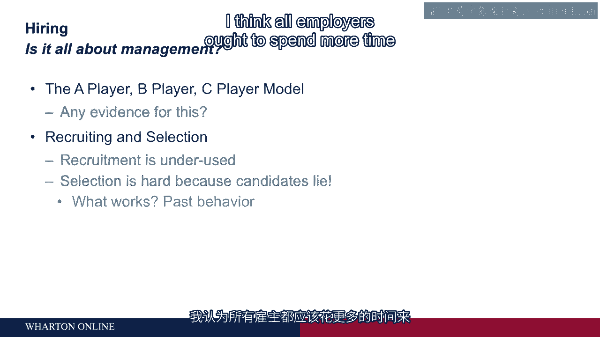
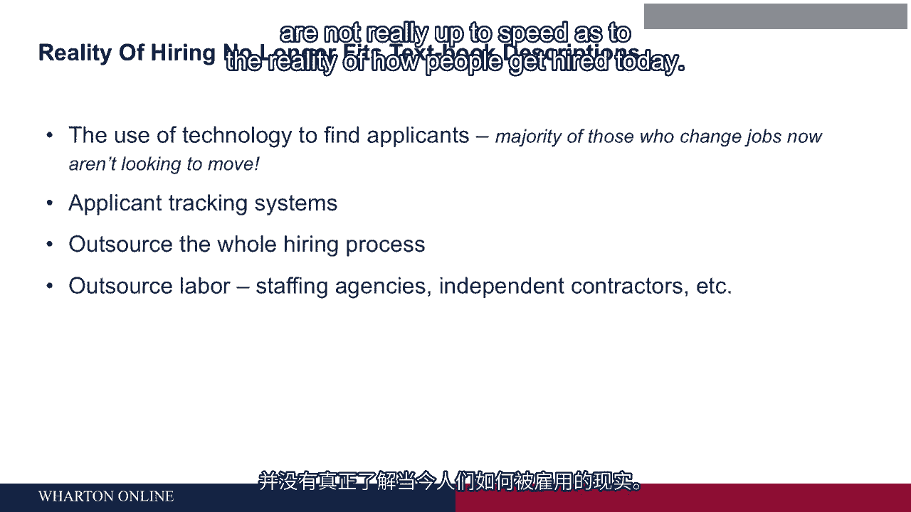

# 沃顿商学院《商务基础》｜Business Foundations Specialization｜（中英字幕） - P83：6_招聘.zh_en - GPT中英字幕课程资源 - BV1R34y1c74c

So let's talk about another issue in managing people and one that gets a lot of attention。

these days。 That's the question of hiring。 One of the reasons it gets so much attention is just a lot more hiring going on。

partly， because there's less internal development， promotion from within， and much more filling。

positions from the outside。 So if you thought that management was really everything。

then it wouldn't matter who you， hired， it's all about how you manage them。

We don't think that's true， but we also don't think it's true， a theory that became popular。

a decade or two ago， that it's really about the quality of the players coming in。

We'll talk more about this a little later， the idea that they're A players and really， good players。

B players average performers and C players， lousy ones。 And it's all about hiring。

That's not true either。 So hiring matters is not the only thing that matters。

Management matters a lot as well。 There are two steps in hiring and the first one is recruiting。

That is the people you get to apply to work for you。 And the second is selection。

When you look at the applicant pool， who you're going to pick， we spend way too much。

time focused on selection， I think。 That gets all the attention。

And the problem with selection is it's， first of all， if you've got the wrong applicant pool。

you can't hire the right people if they're not in your pool to begin with。

And selection is just really hard to do。 And the reason it's hard to do is because candidates lie。

They don't tell you the truth。 And they want a job。 They want you to hire them at that point。

They've applied to work for you。 And if you ask them things like。

does this company look like the kind of place you want， to be， they say， oh， yeah。 If you ask them。

what's your biggest problem or biggest drawback to working with you， they， say things like。

I work too hard， right？ They're trying to spin you a story。

So it's very difficult to get past that at the point of selection。 Let's talk about recruitment。

I think all employers ought to spend more time crafting an accurate description of what。

their job is like。 One of the biggest reasons people quit is they say。

I didn't know what I was getting into。

This is not what I wanted。 That's completely preventable。

And I think frankly the reason it happens is employers are kind of afraid to show people。

what their job is really like。 They want them to only see the good things when they're applying。

But then the problem is they got to live together afterwards and they discover the reality and。

poof they quit。 This is kind of like if you're going to live together with somebody or get married and。

you're hiding a whole bunch of stuff and you're hoping after you're married that they'll all。

be okay with it。 It typically doesn't work very well。 It doesn't work very well in hiring either。

So what you want is a description of what your job is like that is accurate and also one。

that will probably scare away people who don't fit。 Because you don't want those people applying。

Every person applies costs you money and every chance that somebody gets in it really， doesn't fit。

Every time that happens it increases the probability you're going to make a bad hire。

So you want a statement some people call this the employee value proposition about what's。

different working for us than other companies maybe that are in the same industry plus side。

and minus side what's different about working for us。 And you want that to be accurate。

Now one way to do this is with internships。 You might think that the typical reason for internships is the candidate can scope you。

out and decide or you can scope the candidate out rather and decide whether this is the kind。

of person you want。 But a lot of companies have figured out that the more important use of that is the candidate。

can scope you out。 So that if you offer them a job and they say yes they know what they're getting into。

So it's kind of a retention device to make sure you're not going to lose people as soon。

as you hire them。 So remember you know not hiring somebody is a problem if you can't hire that certainly a。

problem but hiring somebody who ends up quitting is arguably a worse problem because you've。

gone through all the costs of bringing them in and if they're unhappy and quit they're。

making the people around them unhappy and then you got to repeat the process anyway。

So if we take that more seriously we spend more time on recruitment。

Now on selection what do we know is a huge literature on this but let me summarize it， briefly。

The things that matter the most are things associated with past behavior tends to be the。

best predictor of future behavior。 If you could actually find out how they performed in a similar job before that would be great。

That would be maybe the best thing you could get。 It's hard to get that in many countries hard to get good references from people。

If you could get that though that would be wonderful。

That's partly why internal moves of people who already work for you are so good。

Much better than hiring from the outside typically because you know a lot about that person already。

and information is pretty accurate。 So that's really good。

Other things that are really good skill tests work。

If it's important to know whether this person has the skills to program。

Give them a programming problem and see if they can solve it。

The problem is you can only do skills tests generally for more of the simpler basic sorts。

of skills。 Conscientiousness out of personality matters that's the only thing that consistently matters。

out of personality。 IQ seems to matter a bit but when we talk about these things mattering it's important to recognize。

how much are we talking about and it turns out not very much。

So for some of these things you might see a correlation between let's say personality。

test conscientiousness and job performance of 0。3。

You might say oh that looks pretty good right but we need to remember from statistics that。

the amount of variation that explains is the square R squared right。

Correlation is R the amount of variation explained is R squared。

So that personality test only explains 9% of the variation in performance 0。3 times 0。3。

And that's only the case if you don't have other things in there already that might be。

correlated or similar to personality。 If you've got past job performance in there the amount that you add by throwing in personality。

or IQ or something else is even smaller than that。

So the punchline there is we're not that great at being able to predict on average how well。

any particular candidate is going to do which is why recruitment is so important。

And the last issue about hiring is the idea about how it drives organizational culture。

This is a theory people call attraction selection attrition and the reason they call it that。

is here's how it works。 If you've got a company with a particular culture candidates come they see the culture。

or they know about what the company is like people start to self select that's what you， want。

So the people who end up applying are already pretty similar to your standard and then your。

company or your organization picks from that applicant pool people it likes things are。

going to succeed they tend to pick people who are like themselves it's not crazy those。

people have succeeded。 And then the people who are the most different feel they don't fit are the ones that leave。

What do you end up with at the end of the day a group of people who are very similar。

in terms of norms and values maybe that's fine。 It also reminds us why we don't get diversity in organizations though because this process。

which happens more or less everywhere tends to replicate the type of organization you've。

already got。 So one of the lessons from this is if you want diversity you got to build it in as a priority。

because the natural process like this which plays out at all hiring tends to work against， that。

Okay。 Now unfortunately the reality of hiring doesn't look much like textbook descriptions there's。

a lot of textbooks that describe complicated models of hiring that begins with filling out。

descriptions of jobs and then how they fit into organizational hierarchies and the competencies。

and all this kind of stuff。 Fencing applications or posting positions posting applications all that stuff。

The reality of technology is changing this a lot。 So this last year in the United States for example a Federal Reserve calculated the majority。

of people who move jobs we're not looking for a job at all。

Somebody came and got them and this is because of technology like LinkedIn and other sources。

where you can look at people where they work their record and go ping them and say I think。

you would be a good fit for us。 The applicant process is now driven by computers technology called applicant tracking systems。

where computers screen resumes so to get through that process your resume has to have。

the right words on it which is another complication。

It's also possible that you can outsource the whole hiring process firms called in an industry。

called recruitment process outsourcing we'll just do the whole thing for you。

And of course it's also possible to not hire anybody at all but to engage labor through。

staffing agencies you lease the employees of a staffing company you're not hiring them。

you're not really managing them directly。 There's all kinds of ways in which you can get labor now that doesn't involve hiring anybody。

at all。 So there's a lot of choices now about how you might manage things and it increases the。

complexity of all this requires a deeper dive into all these things and unfortunately the。

standard sources and the textbooks are not really up to speed as to the reality of how。

people get hired today。 。 [BLANK_AUDIO]。

