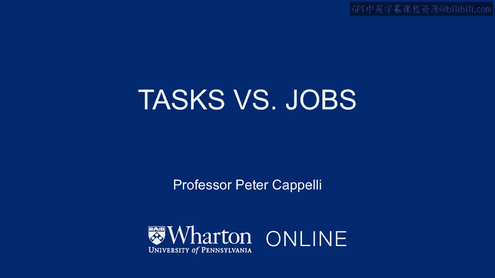
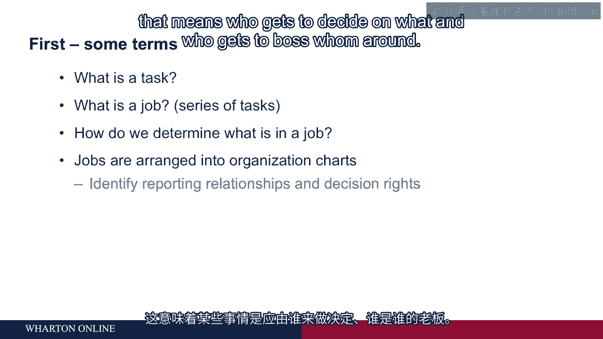

# 沃顿商学院《商务基础》｜Business Foundations Specialization｜（中英字幕） - P85：8_任务与工作.zh_en - GPT中英字幕课程资源 - BV1R34y1c74c

Welcome back。 I'm Peter Capelli， Professor of Management here at the Wharton School and。

Director of our Center for Human Resources。 We're going to talk in this part of the program。

about designing jobs， how we structure them， what we put in them， what it is that we want。

people to do in individual jobs。 And we're going to talk about the logic that drives。

that from the perspective of organizations and from businesses， those who are for profit。

the strategy that drives the business and then drives the way we design jobs。 So we're。

going to talk maybe first about some terms， maybe some definitions to help us understand。

the content that we'll follow。 And it begins with the notion of what is a task。 So people。

are going to talk about tasks pretty often in this literature。 A task means the individual。

thing that you are doing。 So if you are working as a carpenter， a carpenter might be a job。

There are a series of tasks that carpenters perform， framing doors， for example， or putting。

up drywall。 Each of those tasks is independent。 They may require different sets of skills。

And they bundle together into a job。 So if somebody says， what is a job， it is organized。

around a series of separate tasks。 And we hope the tasks have a bunch of things in common。

Often jobs become a little quirky if the tasks are really unrelated to each other。 In which。

case it's difficult to find anybody to do the job。 And it may be difficult for a person。

to actually perform well in it because they require such different things。 So how do we。

determine what goes in a job？ Well， there used to be whole literature around this a topic。

was called job analysis where experts would come in and study your workplace。 I think these。

days for the most part you just ask the people who are doing the work right now。 Somebody who。

is an incumbent in the job in question， you ask them， what do you do？ How do you spend， your time？

Maybe you could follow them around and watch。 But that's pretty much how it's， done today。

It's not so precise。 Maybe it doesn't matter quite so much because the sharp definitions。

that we saw in jobs a few years ago， and we'll talk about in a couple minutes， are largely， gone。

We arrange jobs together to form an organizational chart。 So if you put jobs in their。

relationship to each other， an organizational chart will tell you reporting relationships。

That means who in which job reports to whom to what other job。 So it gives you the hierarchy。

in the organization。 And the hierarchy tells you something about decision rights。 And that。

means who gets to decide on what and who gets to boss whom around。 So that's what an organization。

chart tells you it's made up of jobs， which in turn are made up of tasks。 We're going。

to be talking a lot about the task level， the actual work that gets done， and how we should。

think about that。 [BLANK_AUDIO]。

