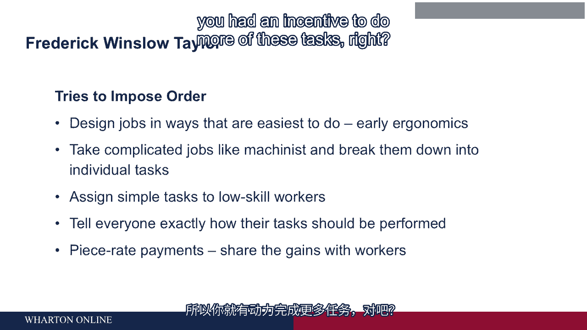

# 沃顿商学院《商务基础》｜Business Foundations Specialization｜（中英字幕） - P86：9_如何设计工作.zh_en - GPT中英字幕课程资源 - BV1R34y1c74c

Now， this question of how to design jobs maybe doesn't matter that much if you're working。

by yourself， right？ So here's a problem over there。 Just go do it。

You figure out how to get it done。 Something has to be put together。 You do it。

But once people start working together with other people， then the definition of jobs。

matters a lot because it affects how those people interact with each other。 Who does what？

Jobs are designed poorly。 There may be tasks that aren't designed either one。

And so you end up with problems。 Things just aren't being done。

You might end up with jobs that are designed in such a way that one is causing problems。

for another。 So it starts to become complicated then。 We got a video I want you to see here。

It's one of the earliest pieces of film available that looks at factory work。

This I think is about from the year 1913。 So take a look at how factory life functioned then。

The late 19th century factory was noisy， cluttered， and chaotic。

A collection of small workshops employing hundreds or even thousands of people under one roof。

Craftsmen like machinists and millurites decided which tools were best for a particular job。

and how they should be used。 So what you saw in that factory is chaos， right？

There's piles of parts all over the place or people having to climb over the parts in。

order to get to different parts of the factory。 There's a lot of people standing around not doing anything in that particular factory。

And there's some things that you couldn't observe but I can tell you about about how， it worked。

One of the reasons why it was so chaotic was because in early factories like that they。

actually outsourced a lot of stuff。 So inside that building there were several work stations and it's quite possible that。

each workstation was run by an independent contractor who hired their own people and did。

their own work and didn't have much of anything to do with the team right next to them。

The turnover of employees in a factory like this one would be enormous。

So there might be turnover rates of two and three hundred percent。

No matter how could they function like that。 Well at the very beginning of the video you saw some people working with their hands。

you， know， sawing stuff and hammering stuff。 People doing some of that kind of work could just come in and out every day。

You could have a different group tomorrow。 It's not going to matter that much。

The work wasn't skilled。 It didn't have to fit together in any way。

It's like working by yourself really。 The big problem though of this place was it was incredibly chaotic。

It took a long time to get stuff done and the ability to plan and even figure out what。

was going on was really difficult。 In fact the earliest engineers trying to figure this stuff out what they would do is just put。

some tags on parts and try to follow them through the plant to see where they were going。

because no one really knew。 You know， didn't even know how things flowed inside these organizations。

So one of the most important developments of the 20th century is an effort to figure this， out。

So the guy who tries to figure this out first， one of the most important developments of。

the 20th century were his efforts。 He's a guy named Frederick Winslow Taylor who was a lecturer at the Wharton School and。

his great patron was the CEO of Bethlehem Steel， a guy named Joseph Wharton。

So Joseph Wharton brought Frederick Taylor to the Wharton School but Frederick Taylor。

was a guy from Philadelphia from son of a rich Quaker family and it's a strange story。

but he was on his way to an Ivy League education and he developed ice strain or so they said。

probably some sort of stress related mental illness and the doctors at the time prescribed。

manual work for him as a solution to this problem。

So you could imagine this rich Ivy League sort of kid ends up in one of these factories。

Well he sides obviously with the owners of the factories and trying to figure out what。

the issues are and for him the big problem was why isn't this place more productive？

Why is it that we can't get more done and when he would ask the workers， particularly。

the lead workers， right？ So there would be a lot of people who were just lifting stuff and a few key workers who。

really knew how things were done。 He'd ask them why can't you move faster and they just blow them off and tell me you can't。

do it faster and he just didn't believe that， right？

So he undertook his life's work which to figure out how to reorganize factories in a way that。

would allow them to be more productive， you know， kind of a noble goal but the way he。

ends up doing it becomes incredibly important for the way work is organized not just in the。

US but then around the world and interestingly one of the biggest proponents of Federal Taylor's。

methods was the Soviet Union where they really thought that he had done some terrific stuff。

This was his idea was to figure out how to design individual jobs and what he really。

was thinking are the tasks that jobs perform， performed in jobs in ways which are the easiest。

to do。 So you might think about this in part as the first maybe the earliest notion of ergonomics。

and that is how do we design something simple like lifting heavy pieces of iron which was。

one of the things that he did first in ways that is easiest for the workers to do or another。

way to say it so they could lift the most， right？ So some of it was that。

Another part of it though was to look at complicated jobs so if you looked at what a machinist。

did for example working on a lay there's something like that， you know it's highly skilled work。

and what he realized was that you could take that highly skilled work and you could break。

it down into a series of individual tasks， some of those tasks actually weren't that。

hard to do and maybe you could give those tasks to lower skilled workers。

Now what does this mean in practice？ Well imagine this you're going to get your haircut and you go to a very small shop and。

there's only one person in there and that person is the stylist， right？

So what happens when you walk in the door？ They greet you， they ask you to sit down。

they get things ready， then they talk to you， about what it is that you want done and then they take you back maybe and wash your hair。

they cut your hair， they blow your hair out and at the end they take your money， maybe。

make another appointment for you and out you go， right？

That stylist is doing a bunch of separate tasks。 Well Frederick Taylor might go into that place and say there's a bunch of things the stylist。

is doing that don't require stylist skills and if you went into a bigger shop， here's。

what you'd find。 You walk in the door the person who meets you is not the stylist。

It is a low skilled， low wage person who meets you at the door， asks you to sit down。

find your name， figures out who's going to cut your hair that day。

And then the stylist maybe meets with you for a couple minutes to find out what you want， say hello。

et cetera。 Somebody else， another person who's kind of low skilled， lower skilled and lower paid。

takes you back and washes your hair and brings you back to the stylist who then cuts your。

hair and maybe somebody else at the end of that blow dries your hair for you and after。

that you go up to the front， you see the receptionist again and they take your money。

make an appointment， again， send you out the door。 So what happens there？

The stylist is only doing the work that requires a stylist skills。

Everything else has been hived off to lower skilled workers。 So for the employer。

why does this help？ Well， let's say stylist get paid more money。

Now you're only paying the stylist for the skills， the tasks that use their skills and。

you got a bunch of other people at lower wages doing the other work。 So per haircut。

now as an employer or as a company， it's costing you way less to do if。

you're the boss here because you're not having to pay as much for as much of the work that。

was done。 So Frederick Taylor's ideas were kind of that。 Some people call this descaling。

You take a job that was done by somebody with high skill and you break it up into a part。

that is high skill but a lot of other parts that are kind of low skill。

Now the second thing about Taylor's approach to this was he's telling everybody exactly。

how their job should be performed。 And typically it was engineers that were doing this。

they would figure out the best way for， you to perform your job and they were telling you here's how you've got to do it。

So you lost all control over this。 So the idea of time and motion studies which were developed in part here at the University。

of Pennsylvania by a guy named Meyerbridge who worked on stop action photography of people。

and how they moved。 You could slow it down and see how people were performing tasks。

how they actually did it。 The idea of time and motion studies was like a stopwatch and a camera to watch how you。

performed your job and to figure out among other things how long it took you to perform。

each task and then they would hold people accountable for how many of those tasks they。

got done per hour because they had a standard now that they were watching people they could。

figure out sort of how much you could do。 Now you can imagine what this does to you if you went back to this factory image we just。

saw earlier a lot of chaos right。 One thing you would see now is a lot of structure。

You wouldn't see people walking around and performing different tasks in different places。

You would be in one place， you weren't spending your time walking around just performing that。

one task。 You'd be doing it in a standard way over and over and over same way every time you got。

consistency and you got efficiency from this。 Now Taylor added one other piece sort of what's in it for the workers and that piece。

was payments that were designed to share the productivity gains with the workers and his。

idea was piece rate right。 Piece rate means every time you perform this task you made so much money so you had an incentive。

to do more of these tasks right。

So that was his system。 It was adopted first in manufacturing but it really hit its stride with the rise of assembly。

lines right and assembly lines use the time and motion studies and Frederick Winslow Taylor's。

idea which was called scientific management to break down jobs into their simplest parts。

You see this all around the world it spreads across the world from US multinational companies。

going abroad。 Ford Motor Company in particular takes these techniques to Europe and to other countries。

and from there they spread。 [BLANK_AUDIO]。

