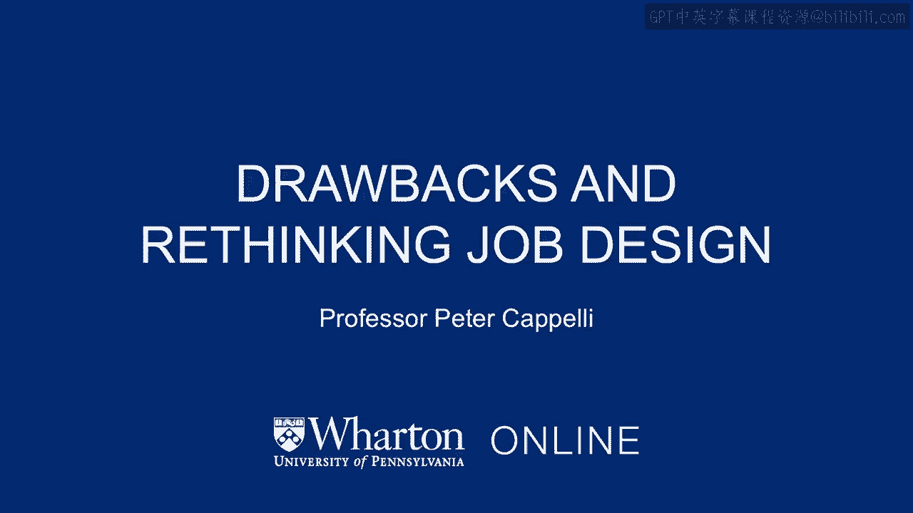
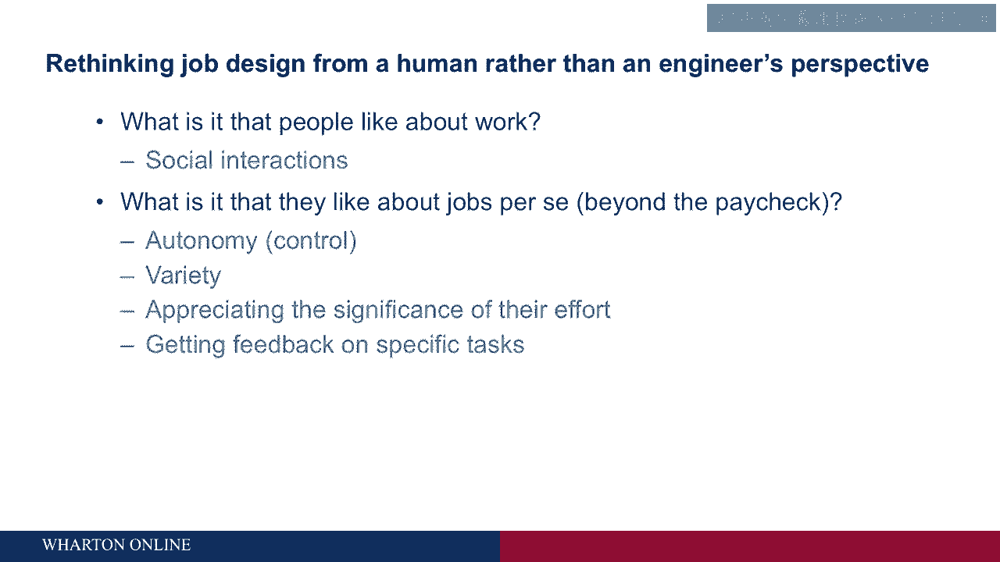

# 沃顿商学院《商务基础》课程｜第10讲：工作设计的缺陷与反思 🧠

在本节课中，我们将探讨传统工作设计方法（特别是科学管理）的缺陷，并了解如何从更人性化的角度重新思考工作设计，以提升员工满意度和组织绩效。

---

## 科学管理方法的弊端

上一节我们介绍了科学管理方法，本节中我们来看看这种方法的缺点。

科学管理方法及其工程化的工作设计方式有一个明显弊端：人们非常讨厌从事这类工作。主要原因在于这些工作极其枯燥。

许多人认为，管理研究的开端发生在西部电气公司。这家公司生产电话和电话设备，员工执行的任务或多或少是按照科学管理方法设计的，并且实行计件工资制，即按完成的任务量支付报酬。

然而，公司发现员工在这里工作并不努力。一批工程师和研究人员介入研究，试图找出原因。关于他们的具体发现存在很多争论，但普遍的结论是：那里的工人关心的不仅仅是计件工资。他们关心的关键事项之一，是彼此之间的社交互动。

他们的部分行为是系统地压制工作努力程度，尽管这让他们个人损失了收入。我认为部分原因在于，他们相信如果自己更努力工作，老板就会降低计件工资率。这样他们最终并不会赚到更多钱。

这回到了我们之前关于动机的讨论，特别是期望理论：你是否相信雇主会真正履行他们的承诺？在这里，工人们认为雇主不会。所以，如果他们更努力工作、开始生产更多产品、赚更多钱，公司只会降低工资率，使他们无法赚得更多，并且还得被迫工作得更快、更辛苦。

---

## 问题的激化：以通用汽车为例

然而，科学管理方法最大的问题在下一代人身上，即20世纪70年代，尤其是在装配作业中显现出来，其中最重要的是汽车行业。问题源于人们憎恨他们的工作。

这个问题的典型代表（虽然它发生在全球而不仅仅是美国）是位于俄亥俄州洛兹敦市的通用汽车工厂。这家工厂生产雪佛兰Vega，这是一款早期为与日本省油汽车竞争而设计的车型。说实话，我拥有过一辆，质量非常差，而且不太安全。

这辆车存在巨大的质量问题。在典型的汽车工厂，有一个被称为“返工区”的区域。汽车下线后，他们会转动钥匙启动。如果无法启动，就会被送到返工区，由一些掌握多种技能的工人深入检查，尝试修复问题。而Vega工厂没有返工区，它有一个返工停车场，因为太多汽车下线后无法正常工作。

当他们打开发动机盖试图检查内部问题时，会发现缺少一堆零件，比如没有化油器，或者看到一些像是蓄意破坏的迹象，比如垫圈被扔进化油器喉管、内饰被划破等等。一次就有大约一千辆汽车无法正常工作。他们试图弄清楚这里发生了什么。

于是他们调查了工厂内部，发现它看起来与其他工厂没有太大不同，只是自动化程度更高。装配线移动得更快，这意味着人们每天必须重复执行更多次那些重复性任务。关键一点是，这里的劳动力相当年轻，实际上有些人上过大学。平均工人受过大约一年左右的大学教育。

问题是工作实在枯燥。随着科学管理的“完善”，工作变得更加无聊，而这一代人将终生从事这些工作。与经历过“大萧条”的父母不同，这对他们来说似乎并不是一笔好交易。

---

## 重新思考工作设计的必要性

这个问题之所以重要，是因为质量问题非常严重，尤其是与日本体系制造的、质量好得多的汽车相比。质量问题会转化为金钱损失。因此，质量问题导致了绩效问题，进而引发了财务问题，并最终将使整个美国汽车行业损失大量市场份额、业务和工作。所以我们必须对此采取措施。

那么，我们做了什么？在20世纪70年代，至少是在70年代末，出现了一种努力：重新思考工作设计，审视我们如何在这些大型装配厂的工人层面组织工作和执行任务。

我们这样做是因为它让公司损失了大量金钱，同时工人们也过得很痛苦。出现了许多因小事引发的罢工、人员流动问题等等。

---

## 人性化的工作设计新视角

因此，新的方法是从一个更人性化的视角，而非工程师的视角，来思考这些工作。工程师的视角是考虑让人适应机器。而更人性化的视角则是说：好吧，人是什么样的？我们如何调整工作以适应人的需求和兴趣，至少在一定程度上。

那么，我们了解了关于人以及他们喜欢和讨厌工作的哪些方面呢？总的来说，人们喜欢工作的一个方面是社交互动。你和他人在一起。通常我们喜欢和我们一起工作的人。如果我们喜欢同事，这就是我们去工作的一个重要原因，也是我们喜欢工作的一个方面。

我们从那些西部电气公司的研究中了解到，这些装配作业中的工人希望彼此交谈，并且非常关注其他人在做什么。

---

## 工作吸引力的关键因素

我们了解到的关于工作以及人们喜欢工作的另一系列因素，涉及任务本身及其执行方式，而不仅仅是最终拿到薪水。以下是现在普遍认同的一些因素列表：

**以下是工作吸引力的几个关键因素：**

1.  **自主性**：你可以将其理解为控制权。我对自己的工作有多少控制权？例如，我能决定何时休息吗？我能决定如何执行这个特定任务吗？在弗雷德里克·泰勒的科学管理方法下，所有这些问题的答案都是“不”。你没有任何控制权。设计你工作的工程师规定了一切，我们已经平均计算出了做每件事的最佳方式，所以不需要你的任何帮助。但事实证明，即使从设计角度看他们的做法并非最优，个人也真的希望拥有控制权。他们拥有的控制权越多，就越快乐，感受到的压力也越少。

2.  **多样性**：人们厌倦了一遍又一遍地做同样的事情。心理学中有一个术语叫“习惯化”，意思是我们会忽略重复且对我们似乎不太重要的刺激。如果你曾搬到一个新地方，尤其是周围可能有很多噪音的地方，你可能对此有体会。头几天你会因为垃圾车来了或者房子前面有个大坑而早早醒来，睡不着觉。但之后你会发现你能睡着了，然后你就适应了。你的大脑只是把它屏蔽了，你甚至不再注意到它，直到有访客来住，他们整晚睡不着，说“我睡不着，你家门前那个该死的坑”，而你会说“你在说什么？”你的大脑已经把它屏蔽了。重复性工作的问题在于，总是做同样的事情一遍又一遍，我们的大脑开始屏蔽这项工作，我们就不再关注它了。对工人来说，这相当危险，尤其是当你操作沉重而强大的机械时，你可能会严重受伤。如果你只关心工作质量，这也不好，因为你不注意事情，很容易开始犯错，或者忽视出现的质量问题。所以，从人性化的角度来看，多样性非常重要。

3.  **工作意义**：我们是否理解并认识到我们所做的事情如何融入公司或我们所服务机构更大的图景中？我的工作有什么意义？例如，在医疗保健领域，一些著名的研究关注医院内感染。这是一个关于住院治疗的严重问题：你在医院生病了，而你本来身体状况就不好（这就是你首先去医院的原因），然后你又感染了在医院滋生并“完善”的病毒，很难摆脱，很多人因此出现严重并发症甚至死亡。那么，医院环境中这些细菌和病毒的根源是什么？你能做些什么来控制？把地方打扫干净，对吧？杀死墙壁、地板、设备等所有地方的细菌。谁负责这个？如果有一个群体，那可能就是保洁人员，他们常常被忽视，在组织架构图中处于最底层。在这些研究中，他们所做的是向保洁人员解释他们工作的意义。这是医院内感染，这是人们生病时的样子，它们导致很多人死亡，是一件可怕的事情。原因是墙壁和设备上的细菌，如果我们清除它们（这是清除的方法），那么这些人就不会生病。一旦他们不仅解释而且向保洁人员展示这意味着什么，保洁人员清洁房间的效率就高得多，医院内感染率下降了。原因是保洁人员更关心他们的工作。你可能会说他们更有动力了，但这实际上源于他们对自己所做工作的价值的认识，这促使他们把工作做得更好。

4.  **反馈**：另一个实际上与工作意义相关的问题是：我能否获得关于我所执行任务的反馈？我能否看到进展如何？再回到保洁人员的例子，当他们能够获得关于清洁房间效果的信息时（比如进来做拭子检查细菌数量），他们就能分辨出自己做得好还是差。他们更关注工作，这使得工作对人们来说更有趣，人员流动率下降，员工满意度提高，对组织的承诺（即关心做好工作）也上升了。

---

## 核心要点总结

这些是四个主要因素，它们都与工作如何执行有关。这些都与金钱无关，也与福利或类似的东西无关。它们完全关乎任务本身的执行方式。

在本节课中，我们一起学习了传统科学管理工作设计的弊端，特别是其导致的员工不满和质量问题。我们探讨了从人性化视角重新设计工作的必要性，并详细介绍了提升工作吸引力和绩效的四个关键因素：**自主性**、**多样性**、**工作意义**和**反馈**。理解并应用这些原则，对于创建更高效、更令人满意的工作环境至关重要。