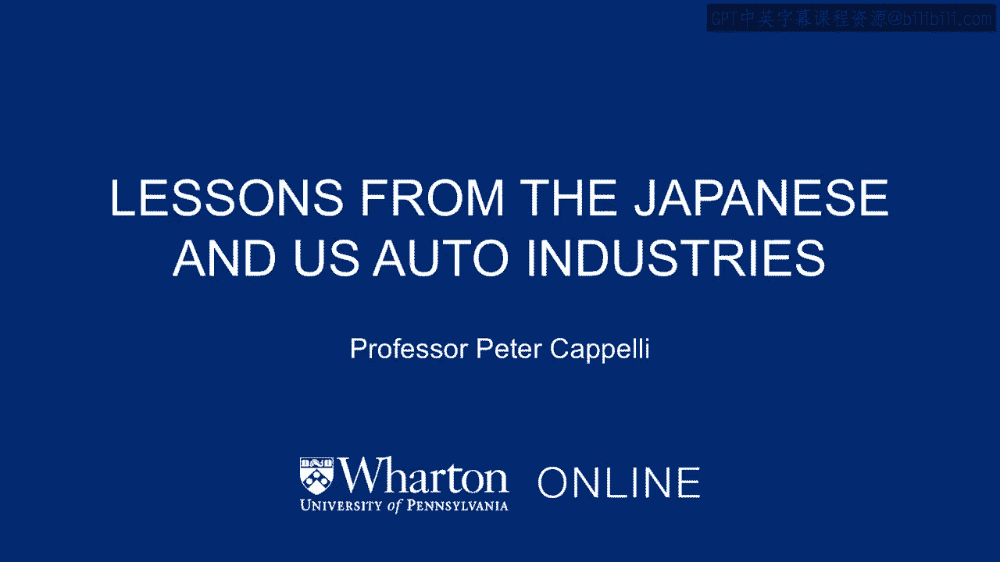
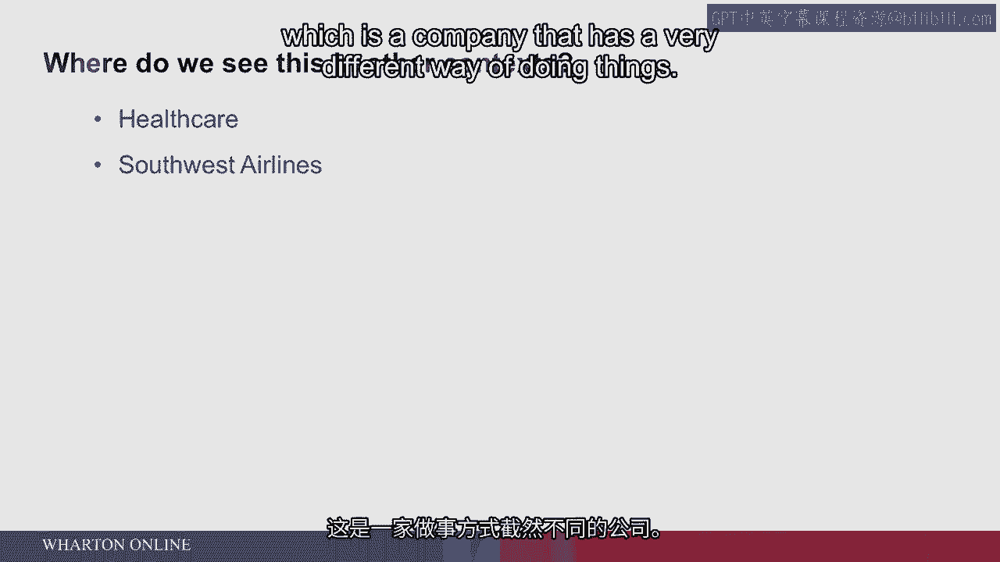

# 沃顿商学院《商务基础》｜Business Foundations Specialization｜（中英字幕） - P89：12_日本和美国汽车行业的教训.zh_en - GPT中英字幕课程资源 - BV1R34y1c74c

So let's find out what they did。

And the lessons begin in the auto industry， and particularly the rise of the Japanese。

auto industry in the US。 It gets going in the 1970s because of the oil price shocks。

OPEC raised oil prices in 1973 and again in 1979 by a lot。

And that meant that if you had a car that used a lot of gas， it suddenly became very。

difficult for you to pay for it。 And more to the point。

some of those periods we actually had rationing in the United States。

If you had a car with an even license plate， you could only buy gas on Tuesday。

Thursday and Saturday。 So suddenly having a car that was fuel efficient really mattered。

The Japanese cars came into the US because they were smaller， much more fuel efficient。

and they started to take market share away from US cars， which were big。

But the other thing that US consumers learned， and eventually US auto companies as well。

was that the Japanese cars were not only more fuel efficient。 The quality of them。

the build quality especially， was way better。 The cars lasted long and they didn't have nearly the problems that US cars had。

It used to be kind of a， it wasn't really a joke， it was true， a practice in the US。

that you could order a car and you could decide what day of the week the car you're ordering should be built。

And you wanted a Wednesday car。 And the reason you wanted a Wednesday car was by Thursday and especially Friday people were starting to party in the plants before the weekend。

And some of them also were just cutting out of work and so they were trying to throw replacement workers in to get that work done。

So quality was lousy on Friday。 And on Monday a lot of people were hung over and would come in in rough shape for the first day or two。

So you didn't want a Monday or Tuesday car either。 You wanted a Wednesday car。

Unless you bought a Japanese car and then it didn't matter because the quality was pretty good for those cars。

So we started to pay some attention to what are the Japanese know that we don't。

And here's one of the most important industrial stories of the 20th century and it happened at General Motors。

In the early 1980s the US auto industry is whacked by Japanese competition。 Ford is struggling。

Chrysler is bankrupt and is bailed out by the government。

General Motors has still got some money and they're trying to figure out what they should do to address the problem of Japanese competition。

So they went to Japan and they toured the plants there and they came back with this profound sense of how engaged the Japanese workers were。

In their view engaged with management to produce high quality cars。 How hard they worked。

how diligent they were and particularly how concerned they were about quality。

And they came back to the US looked at their own workforce and concluded there's no way we're going to compete with the Japanese because their workers are just so much better than ours are。

So we just can't compete with the Japanese car companies on that。

The only way we're going to be able to make it is to automate。

We're going to bring in robots to replace as many workers as possible。

So GM embarked on a huge industrial experiment to put robots in their factories。

They spent a ton of money， as I recall about $43 billion putting robots into their factories。

Now the reason I figured that matters is because it was more than the entire value of Toyota Motor Company at that time。

So General Motors could have bought Toyota for the amount of money they spent putting robots into plants to get rid of workers。

That's the experiment they start down in the early 1980s。 At the same time something quirky happens。

General Motors got an empty plant in Fremont， California。

Toyota needs to start building cars in the US because of protectionist concerns。 Auto workers。

auto companies particularly lobbying Congress to put constraints on the imports of Japanese cars because they're taking all our business。

So Toyota is looking around for place to build cars and General Motors got this empty factory in Fremont。

So they agreed to basically lease the plant to Toyota。

Toyota is going to run it and they're going to produce a car that they will sell through Chevrolet。

And the car is going to be the Nova。 And it's really going to be a Toyota Corolla except it's got a Nova badge stamped on it。

Toyota design， Toyota manufacturer。 Toyota sends over its managers and starts this plant up again。

It uses the equipment of General Motors， so a 1970 style equipment， no robots in this plant。

But what's different is the way they manage the employees。

They hire back most of their workforce from the old GM workforce。 But they hire them in differently。

They bring them in slowly and carefully。 They spend a lot of time training them and persuading them that the plant needs to run in a different way。

It includes sending some of these workers to Japan so they can look around and see how Japanese plants work and persuade them that you really could do things differently。

Well， to cut to the chase of this story， within a short period of time。

the plant in Fremont called the new United Motors Manufacturing Incorporated， or NUMI。

this plant is now the most productive plant in the General Motors chain。

It is also the highest quality plant in the General Motors chain。

So if you're the General Motors treasurer and you're thinking about this and you just put $43 billion into plants to get rid of workers。

and you've got Toyota that has come in and taken your former workers and your former plant and is building cars with higher quality and higher productivity than your robots are。

you've got to recognize that you've made a profound mistake。 And to some extent。

many people in the U。S。 sort of got this。 Not everybody and not everybody in the auto industry got this。

but it was a pretty powerful lesson。 So let's talk about what the Japanese approach looked like from the perspective of just of work。

There are other courses in the program that talk a little bit about what the Japanese Toyota system of lean production meant for inventory issues and organization of the plant。

But from the perspective of work， the big changes were that the individual workers in their teams now controlled the decisions that Frederick Taylor's engineers used to make about how to design their jobs。

They got lots of feedback about quality and productivity of their particular part of the assembly operation。

So not each worker by themselves， maybe five or six of them in one part of the assembly line。

they get to control at least a large part of how their work gets done。

And they see how they're doing in terms of the quality of their inputs and how much they're able to turn out on their part of the assembly line。

So the control they're given is to redesign their jobs in ways that improve quality and improve productivity。

They're in charge。 They kind of own this。 And the interesting thing about this is the tasks that they design are just as boring as the ones that Frederick Taylor would have designed。

but they control them。 They have to do them in exactly the same way every time in order to know when they introduce an innovation。

whether it's an improvement or not。 So they're really standardized， but they control it。

And this and a bunch of other reasons， like the fact that the management team treated them a little more like peers。

common cafeteria， common uniform for everybody， meant that the employees were much more engaged in their work。

Turnover was low， quality in particular was way higher。

and the employees are striving to improve productivity almost all the time。

So this is the lesson of Japanese management that it turned out that Frederick Taylor wasn't right。

that trying to get engineers to design the jobs for people was not optimal。

and that they could probably do a better job themselves。 And if nothing else。

they were at least much more engaged in it。 Now， what's the downside of this Toyota Lean production system？

The downside for management is that the workers are in control now。

You don't have a group of engineers who are part of management designing everything。

The workers in the plant are in charge。 And one of the things that Japanese-style management does very differently and noticeably on assembly lines is it gives the individual worker the power to stop the line。

if there are quality problems， because they want them fixed then。

they don't want more cars coming off with quality problems。

And the idea of letting an individual worker shut down an assembly line to US managers seemed insane。

It costs about $50，000 a minute to shut down an assembly line。

But the idea of giving them the control to do that seemed crazy。 And that's the trade-off。

If you engage workers， you have to give them some control over what they're doing。

And in that sense， it's very much the opposite of the story we told at the beginning of this series about mothers' restaurant in New Orleans。

the one where you had people standing over the shoulder of the cashier trying to make sure nobody's cheating。

In the Toyota system， the Lean production， the supervisors are not there watching people。

The employees are making the decisions themselves。 And if they decided to screw things up。

it would be really hard to stop them。 If they started stopping the assembly line just to irritate the management team。

it would be really difficult。 So some of the resistance that US managers brought to adopting these practices from Japan were partly not invented here。

just common。 But also， we don't trust the workers enough to give them the control that would be necessary to get them to perform in a much more effective way。

So where else do we see organizations adopting models like this， like the Lean production system？

Well， you see it a lot in healthcare now， where there's a recognition that teams of workers are really the important unit。

The nurses and doctors have to work together with technicians。

They've got to be talking to each other。 They ought to be making decisions about the best way to provide care at the patient's bed。

You see it in some notable other examples， one of them is Southwest Airlines。

which is a company that has a very different way of doing things。

Their particular problem， which initiated almost randomly。

was that they were about to go out of business， and they had to sell one of their airplanes the very early days of the airline。

They had four planes and they had to sell one of them。 And they went to the employees and said。

"We've got to figure out a way to operate the same route schedule with three planes rather than four。

"， And the only way you could do that is if you turn the planes around faster at each airport。

So you're not spending as much time at the gate， you're getting in， you're getting out fast。

And if you can do that， it's incredibly cheaper， more productive。 You don't need as many planes。

Plane is a really expensive thing。 So the employees figured out how to do that。

and it's really a way of just cooperating with each other。

Different work groups that under the tailor system would never talk to each other。 Bagged handlers。

gate agents， pilots， each separately， managed and in their own little world。

Now trying to work together in order to solve problems and coordinate。

So one of the things you notice about Southwest， which you don't notice for a lot of other airlines。

is that you rarely pull up to the gate and surprise the crew there。

It's often the case of other airlines you pull in and nobody is there to greet the plane。

Because they're in a separate work group following their own schedule。

Maybe the plane got in a little early。 You would like these people to be able to talk to each other and communicate。

And to do that， you can't have supervisors necessarily standing over them and telling them what to do。

Well that also means， again， if the employees are in charge and they're in control。

that they better be happy and if they get unhappy with you， you got a big problem， right？

Because they could shut the thing down in a heartbeat。

So Southwest in particular spends a lot of time making sure their employees are happy。

and making sure that they're happy with the airline so that they will engage their discretionary effort。

Which is a key phrase in management。 That is the kinds of things they could do if they wanted to do。

but they probably don't have to do， and it's hard to make them do it， right？

And that is solve problems when they see them happening without a supervisor having to come over and tell them what to do。

But for management， this is often pretty scary because you are given up control to the employees。

particularly the employees that you're supposed to be supervising。 Now if you can do it。

you see an enormous productivity improvement like this。

and that productivity improvement is you don't need as many supervisors， right？

And they're pretty expensive。 [ Silence ]。

