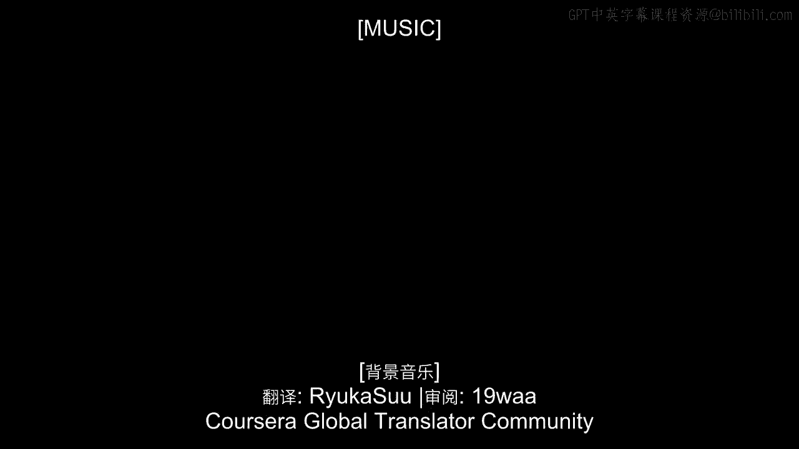
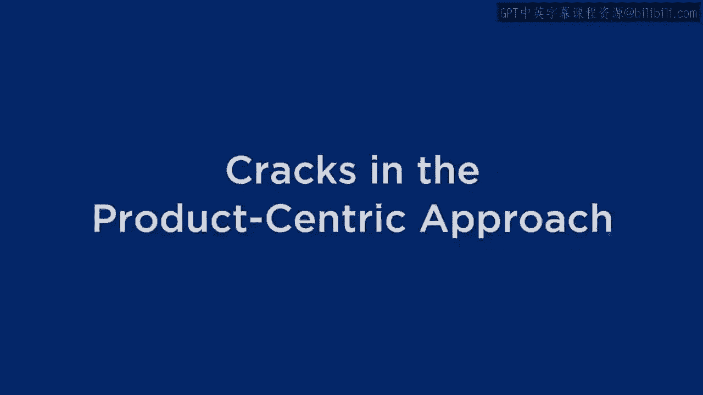
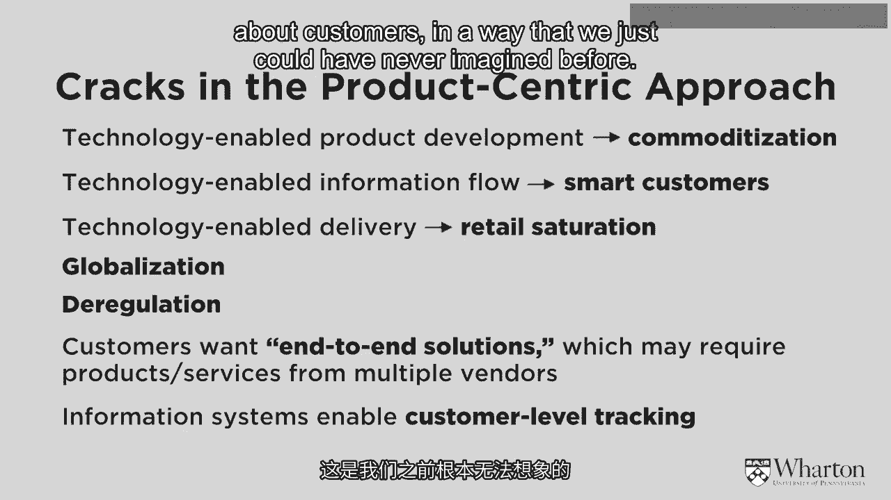
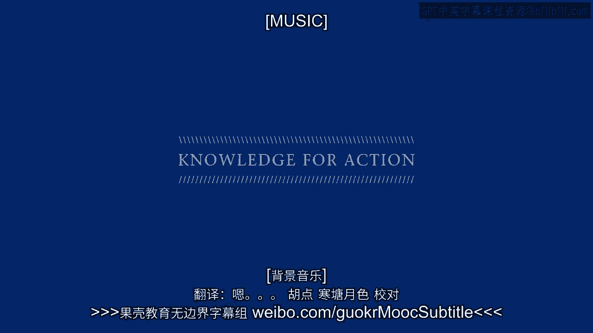

# 沃顿商学院《商务基础》｜第9课：产品中心方法的裂痕 🧱

在本节课中，我们将探讨产品中心方法在当今商业环境中面临的挑战。我们将分析一系列削弱其传统优势的趋势和变化，并理解为何企业需要开始考虑其他战略方向。

---

上一节我们回顾了以产品为中心的商业方法。本节中，我们来看看这种方法为何不再像过去那样总能保证成功。产品中心性本身并非注定失败，但一些新兴趋势使其光环有所褪色。

以下是导致产品中心方法出现“裂痕”的几个关键因素：

**1. 商品化速度加快**
过去，开发和生产新产品或服务非常困难，企业能长时间领先于竞争对手。如今，技术使得商品化进程大大加快，产品生命周期急剧缩短。企业一旦推出新品，就必须立刻着手准备下一代产品。这种快速商品化削弱了产品中心性所依赖的“自然垄断”优势。

**2. 客户变得更聪明、信息更灵通**
得益于互联网和信息技术，今天的客户比以往任何时候都更了解市场、选择更多、要求更高。他们不再被动接受企业提供的产品或服务，而是变得更加挑剔和精明，这使得企业更难从其提供的产品和服务中提取最大价值。

**3. 即时全球分销**
以联邦快递、DHL、UPS为代表的现代物流技术，使得产品几乎可以在一夜之间送达全球任何地方。这打破了企业过去依赖地域限制形成的保护壁垒，让来自其他地区的竞争产品更容易触达客户。

**4. 全球化思维**
人们的思维比以往任何时候都更具全球性。客户更积极地寻找来自其他地区的产品和服务，进一步加剧了市场竞争。

**5. 放松管制与重新管制**
过去，行业管制常常赋予企业垄断权力。但随着一个又一个行业放松管制，或者通过重新管制引入更多竞争，企业必须更具竞争力，保持领先一步也变得更加困难。

**6. 客户要求提供整体解决方案**
如今的客户不仅更聪明，而且要求更高。他们不再满足于购买单个产品或服务后自行组合使用，而是要求企业扮演“可信赖的顾问”角色，提供捆绑式的、完整的解决方案，即使其中某些部分企业本身并不盈利。

> **案例：IBM的转型**
> IBM曾是极致的产品中心型企业。但在20世纪90年代中期，他们意识到，作为解决方案顾问（告诉客户应该购买哪套机器和服务）比单纯销售“商业机器”利润更高，尤其是在IT硬件日益商品化的背景下。因此，IBM逐步剥离了许多硬件业务（如个人电脑），将重心转向成为以客户为中心的解决方案提供商。

**7. 数据利用成为可能**
现代技术使我们能够以前所未有的方式收集、管理和利用客户数据。过去，像亨利·福特这样的产品中心先驱者，可能根本不知道他的客户是谁、购买模式如何。但今天，利用客户数据来理解购买行为、开发以前无法想象的商业模式，变得至关重要，这也为超越单纯的产品中心方法提供了可能。

---

本节课中，我们一起学习了削弱产品中心方法优势的七大趋势：商品化加速、客户信息更灵通、全球即时分销、全球化思维、管制变化、客户要求整体解决方案以及数据利用的兴起。这些“裂痕”表明，虽然产品中心策略依然有效，但企业必须意识到这些挑战，并开始探索更适应新时代的商业方法。