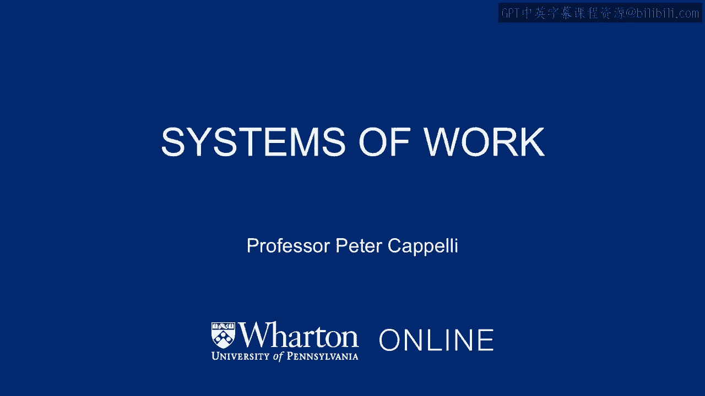

# 沃顿商学院《商务基础》｜Business Foundations Specialization｜（中英字幕） - P90：13_工作系统.zh_en - GPT中英字幕课程资源 - BV1R34y1c74c

So our last big point is to talk about systems of work。 We've been talking about individual。

practices， motivation early on， job design now in this section， how they fit together。

in ways that create synergies that make them even more powerful。 So one simple example。

of this is that we know that profit sharing and stock options for employees at a broad。

base level for the workforce as a whole seem to have very little effect on employee performance。

If you combine profit sharing with employee participation， then you get a much bigger， effect。

And why is that？ Well， profit sharing might give you a motivation or a sense of。

identification with a company that creates some sense of willingness to help the company。

but unless you have involvement in participation so you can make some decisions， autonomy is。

it worth， you got no way to exercise that motivation。 You put these two together and then you start。

seeing some effects。 We teach a couple of cases here at the Wharton School about how。

these practices bundled together can actually drive the competitiveness of the whole firm。

We see this easiest in the for profit area， but you can see it almost anywhere。 We teach。

a case for a company that we've named to hold chemical。 It's not the real name of the company。

And this was a student project of our MBA students many years ago。 What happens in hold。

chemical is this is a company that was in the specialized chemical business competing。

in its bigger companies that had lower costs。 But what hold was able to offer was customer。

service that was really good。 How do they do that？ First of all， they didn't hire professional。

salespeople。 They hired chemical engineers。 And when they hired those chemical engineers。

they put them to work first in the factory， their chemical plants， so that they would。

get some understanding of what the chemicals felt like， looked like， worked like。 And also。

they knew who made the chemicals in the plant and who were the experts in the plant on those。

chemicals。 Only then did they go out in the field and start dealing with customers。 They'd。

stay with customers more or less for life， or at least their life in the company。 They。

were paid a straight salary， no commission。 They had no incentive to push different kinds。

of chemicals on clients， so that clients started to trust them。 And because they were chemical。

engineers， they were already oriented toward solving problems with chemicals， which is。

different than chemists， or interested in chemistry per se， right？ Pretty simple set of， practices。

but it produced something that helped sustain the company in its competitive advantage。 That is。

its customers were willing to pay a premium to buy chemicals from Holt in order。

to get their customer service， which was really just salespeople who were effectively， consultants。

They knew a lot about the chemicals， they knew a lot about their clients， and they。

knew what would work where。 The problem at Holt Chemical is they called in a consulting。

company that was giving them advice on how to improve profitability。 And the advice turned。

on giving these salespeople incentives to sell more chemicals that were more profitable。 As。

soon as they did that， the customers started to notice that you couldn't necessarily trust。

what the salespeople were pushing on you。 And the first thing that happened is some of。

the salespeople themselves noticed this and quit because they didn't like this new arrangement。

they didn't see themselves as salespeople primarily。 The second thing that happened was。

the customers started to bolt because they didn't trust Holt's service so much anymore。

and the products of competitors were cheaper。 So Holt's entire competitive strategy begins。

to unravel because of a change in management practice is actually just one change， which。

then broke up the synergy between their other practices and made them as a company not so。

successful anymore。 Another quick example out of the world of retail is the folks at Nordstrom。

who have for decades now had the most profitable department store， sales per square foot， how do。

they do it？ They sell more or less the same stuff that everybody else does。

They sell their own brands， but they sell fashion。

And the way they do it is their competitive advantage。 And that is。

salespeople who tailor the experience to individual customers， give them whatever they need。

How do they do that？ Partly hiring， they try to hire people who are enthusiastic。

they don't bother training people because there's not much training you need。 You don't need to。

know the polymer count and the sweaters， you just need to be able to tell people， "Oh。

that looks great， on you， and let me let you know when something's on sale and I'll bring this to your house。

" The， other reason they don't train them is they don't want you to have a standard way to deal with。

customers。 They want you to do whatever it takes to make that customer happy。 And they have huge。

commissions in terms of a percentage of their pay。 They wash through a lot of people， people who。

don't fit get pushed out pretty soon。 But because they're not spending a lot of money hiring or。

training people and they lose them， it's not that big a deal。 But the ones they keep figure out how。

to please Nordstrom customers， they maintain their own customer base。 And they got a big financial。

incentive back to motivation to sell well。 So in that case， it's not a series of complicated。

practices and it's not often things that you might call best practice， no training， no careful。

selection。 But it fits together in ways that work for that company given where their business is。

And I think that leads us to a conclusion here from this part of the course。 And the conclusion is。

if you do the management of people correctly， it's not just about being able to keep your cost down。

or able to implement and execute strategy or whatever the processes are the company wants。

It is possible that you can actually create the competencies that drive the strategy of the business。

And this is going to tie our section of course into other sections on strategy you're going to。

hear about in a little bit。 [BLANK_AUDIO]。

