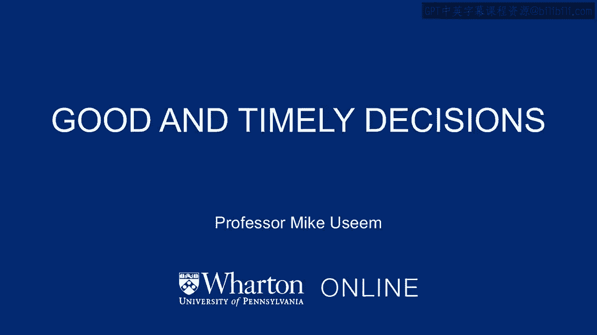
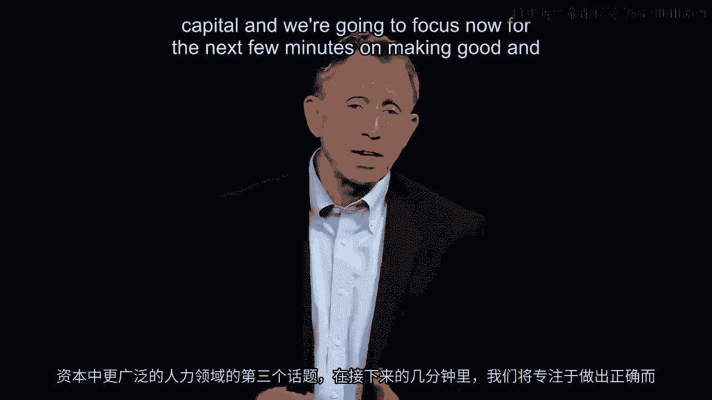
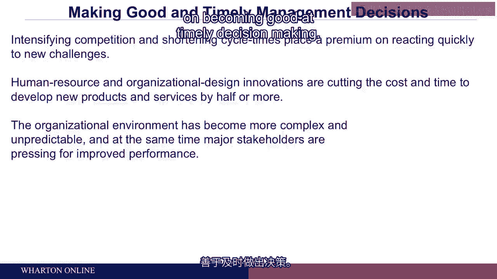
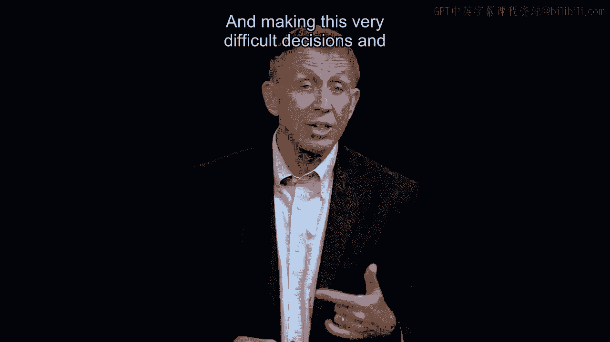
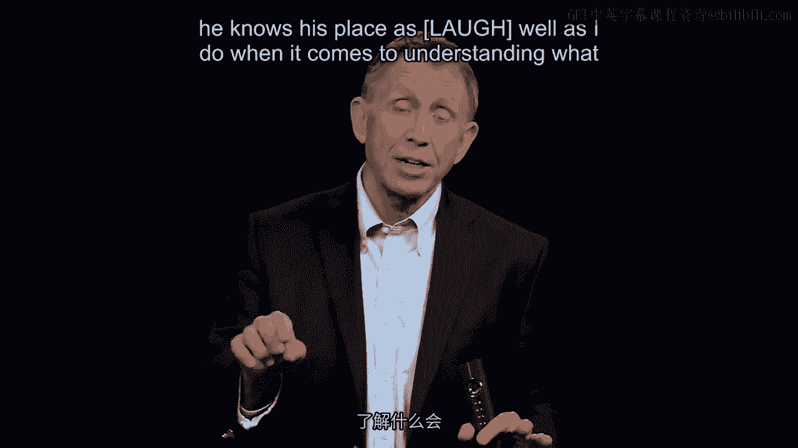
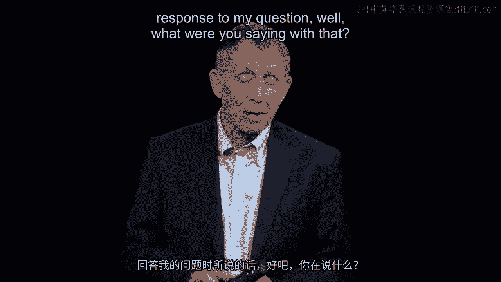
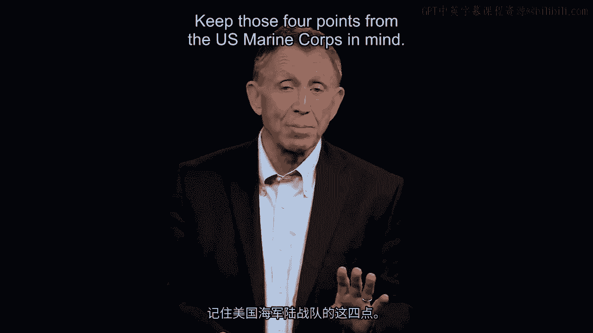
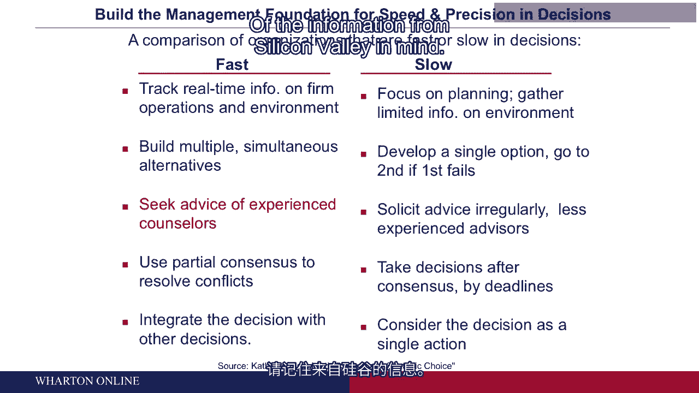

# 沃顿商学院《商务基础》｜Business Foundations Specialization｜（中英字幕） - P91：14_及时而明智的决策.zh_en - GPT中英字幕课程资源 - BV1R34y1c74c

Welcome back to the third topic in this broader terrain of human and social capital。

And we're going to focus now for the next few minutes on making good and timely decisions。

And I just want to stress at the outset that there's an emphasis on and we want good and。

timely decisions。 And here's why two factors in our estimate are making for shorter cycle times and how。

products are developed， how long they last in the market， what kind of a service somebody。

wants and how long that will be in the market in a viable way。

It puts a premium on managers like you making a good and timely decision whether it's for。

a service， a product or maybe just how you get the job done itself。

And the two factors that we think are pushing the need for more good and timely decision-making。

is first of all， so many organizations have themselves innovated and found ways of getting。

products out there more quickly than in the past。 So if your competitors are becoming good at developing a product。

getting it out， getting， it in a store or maybe a hospital service to your patients。

it kind of leaves nobody， a choice but to begin to match that time cycle。

Making it number two though more challenging so to speak is the fact that in many markets。

there's greater complexity， many more different kinds of products for example and greater。

uncertainty。 Partly regulatory， partly customers are more fickle， all that being said。

It does put a premium， this is why it's a third critical topic in managing people at。

work on becoming good at timely decision-making。

I'd like you to think just for 50 seconds or so about a decision you have seen in your。

own organization in the last， let's make it the last two years that took too long for。

it to be made。 You might have been part of it， you might have watched it。

it might have been your own， just， pick a decision that whatever it was took longer than it should have。

It was no better having been delayed and there might have been some costs and ask yourself。

what slowed that decision down？ What were the hidden causes and often anticipating what you're thinking right now？

There might have been too many people that had to sign off。

Some people maybe were fearful of making a decision because they anticipated they'd get。

cut off at the knees if they made it wrong。 All these are part of the human tableau。

These are factors we need as a manager to be cognizant of and then work around。

Maybe to make the point more directly， I have a photograph here of John Chambers who for。

20 years ran Cisco Systems， the maker of the hardware of the internet。

We all have had our digital messages go down something that John Chambers and his large。

company of more than 30，000 people these days have made for wherever we work， the hardware。

the backbone of the internet。 I encountered John Chambers at an event a couple years ago。

He stepped down now but he was chief executive then of the Silicon Valley high tech company。

Cisco Systems。 And I said， "John， all my academic colleagues say you're great at making good and timely。

decisions when it comes to acquisitions。 Cisco has grown to use the parlance here partly inorganically。

That is through acquisitions， partly organically just by adding more customers and more revenue。

to existing products。 On the inorganic side though。

John Chambers has an enviable record of picking winners， and avoiding losers。

Hard to do when it comes to mergers and acquisitions。 His hit rate is way above average。

Back to my question， John， what's the secret of your success in making these very difficult。

decisions in a changing market where cycle time is getting shorter？

And he said， "Well actually one of my secrets was a person's hand。

He right next to me， right next to him at the time， Larry Carter， chief financial officer， of Cisco。

"， And I said， "Oh， that's great。 So tell me why Larry Carter， how is he your secret weapon？"。

John Chambers explained it as follows。 He said， "Larry Carter， chief financial officer。

he knows this place as well as I do when it， comes to understanding what destroys value or what adds value。

But equally， when I turn to him for advice and I do turn to him for informal， offline。

consulting before I make the final judgment call on a tough $3 billion acquisition， I。

know that when he gives me advice it's coming with a certain authenticity， a certain credibility。

because he doesn't want my job。"。

And I actually had to say， "John， I don't understand the point。 I'd like you to work on the point。"。

And here's what John said in response to my question， "Well， what were you saying with。

that？"， He said， "Human nature being human nature。

people are sworn to uphold the purpose or the mission， of the enterprise， of course。

But sometimes hidden agendas， sometimes even unconscious bias can cloud their judgment。

And since he didn't want my job， I knew almost by definition， no chance would he give me。

a answer that maybe was not a great answer， anticipating if I faltered he might get my。

job。 And with that being said， began to look around for evidence that backed that up， came on a。

great study by a faculty member at Stanford University， Kathleen Eisenhart。

And here on the left side of the screen that you can see is what she discovered at a group。

of companies in Silicon Valley that she looked at that were quick to get products out into。

the market。 And then she compared the fast tribe， just to use that phrase， to a slow tribe， other。

companies， very similar in scale， very similar in product that took twice as long typically。

to get a product out。 It was no better。 It just took twice as long。 So fast versus slow。

And then she asked， "Well， what's the difference between the fast movers and the people who。

are relatively slower by comparison？"， All pretty fast， of course， after all， at Silicon Valley。

The fast movers she found， look at the red there that has highlighted one point， are。

the companies that have， like John Chambers， an inside experienced counselor， somebody。

who is able to give unbiased， non-self-serving advice。

Let's make that more affirmative in the form of a management suggestion。

Good to have somebody close to you， maybe a person who used to have your job， who's willing。

to sit with you and just think out loud about a decision you're going to， you're facing and。

you have to make。 And that's a way of saying that as we begin to solve the problem that John Chambers reminded。

us of， that having a counselor inside， maybe outside a good idea， take a look at the first。

bullet at the top of that list。 I'm not going to go through them all。

Just want to get your attention to that。 And that is， "Collect active real-time data。"。

Don't send somebody out to bring data back three weeks from now。 I said， "Look， we need it now。

We want it today。"， That's， again， one of the findings on that particular fast versus low comparison。

Like you had to hang onto those five factors there。 Just take a look at them。

I'm going to ask you to apply them in a minute。

And now I'm going to add information on decision-making or really guidance on decision-making。

from the U。S。 Marine Corps。 U。S。 Marine Corps， I think we all know what his charter is。

is to get in， get the job， done， and get out。 And to appreciate that for more than a decade now。

we take our MBA students down about， 190 total in the course of a year for a day and a half with the U。

S。 Marine Corps on timely， and good decision-making。

We wanted to know how does the Marine Corps think about that， how do they instruct in。

that？ The topic we're focusing on right now。 Four answers emerged as they're conveyed to our students。

You can see the photographs here that have our MBA students looking at in the center photograph。

for example， at a marine instructor。 And the marine instructors are saying the following。

Four key points。 Add these to what we had on that prior slide with five key points。 Number one。

instructors know， sorry， marine officers are instructed to know to make a。

decision in the field with 70% of the information you need， 70% confidence， 70% consensus。

Now it's a metaphor。 Keep that in mind。 But the key point is it's more than 50%。

Ideas don't shoot from the hip。 That's timely but not good。 Conversely。

don't wait for 99% certainty that you have all the data because somebody else。

is going to be on the high ground before you get there physically， literally。

And thinking just now is a metaphor。 70% get analysis done， gather data， build agreement。

but don't wait for perfect agreement， or perfect data。 Number two。

a separate but really important point。 A manager needs to learn or a marine officer needs to learn to convey what a marine would。

call commander's intent， what in business or other organizations we tend to call strategic， intent。

Here's what I want， says you the manager to people around you and then don't try to。

micromanage what they do。 Leave your subordinates to work out the detail。

There's a phrase that captures that point。 I think it's a great phrase。 Eyes on， hands off。

That leads to the third point， again， a kind of formulation for making good and timely。

decisions which is to develop a tolerance， even a round of applause for the people that。

work for you when they make a mistake the first time。

They're going to make mistakes because 70% means they don't have perfect understanding。

of the situation。 And you've told them what your intent is and then you've not told them how to do it。

you're better than they are by definition as their manager。

So they're going to have to learn by making mistakes， by learning， by doing。 And the statement is。

it's a great statement from the Marine Corps and many organizations。

that Peter Capel and I work with is that you have to develop a tolerance for first time。

mistakes and after action review to come back on what happened， how can we make certain。

it does not happen again。 And of course， no tolerance for the same kind of mistake made a second time。

And I love the phrase， indecisiveness is a fatal flaw。

For the US Marine Corps that has a certain literal meaning in combat areas in organizations。

that we're talking about today， take that as a metaphor and maybe just to sum it up。

I'm going to offer up a statement that probably describes a certain number of you listening。

And that is， if you work for a boss who just couldn't get a decision made， couldn't get。

paper off her or his desk， it started going nuts。 You knew decisions had to get made and an indecisive manager can be failed for their。

career， it can be fatal for their career， it can be very detrimental for the organization。

Keep those four points from the US Marine Corps in mind。

Keep the five points on the left hand side of the information from Silicon Valley in mind。

Keep in mind what John Chambers said about having somebody close to you to whom you can。

turn for guidance。 I'm going to ask you to calculate the cost。

the jewelers total lost with the information， in front of you。 Take 60 seconds。

be mindful of those factors。 The whole point of this course is to put some factors in the back of our head we can。

apply。 Take 60 seconds。 I'm going to ask you what your answer is。

write it down on a piece of paper in front of， you。 Thank you。 [BLANK_AUDIO]。
