# 沃顿商学院《商务基础》｜Business Foundations Specialization｜（中英字幕） - P93：16_美国案例.zh_en - GPT中英字幕课程资源 - BV1R34y1c74c

I'm going to have us look now very briefly a kind of an application and then we're going。

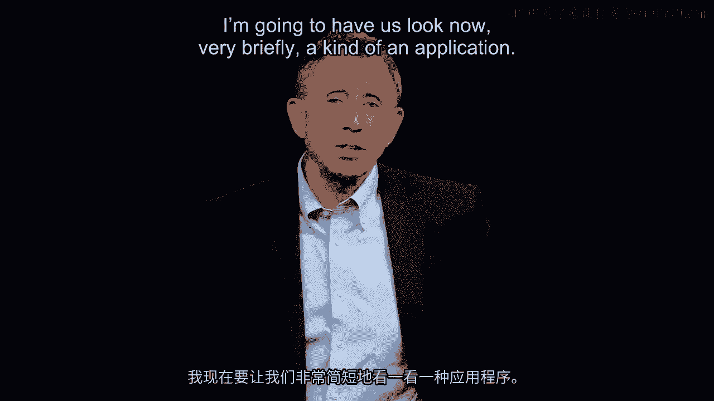

to get into a much deeper dive into some very tough set of decisions。

For the application， I'm going to have us briefly take a look at Charlene Barchevsky。

upper left-hand corner there。 She's with the Zhurangi， the then premier of China。

Charlene Barchevsky is the U。S。 Trade Representative。

She's in the presidential cabinet with that position。

And her job is on behalf of the United States to work out agreements with other countries。

in this case China， and in particular in this case to help bring China into the World Trade。

Organization and conversely at the same time to open up China to U。S。 products， everything。

from Hollywood films to Boeing aircraft。 And she with the Zhurangi negotiated extensively primarily in Beijing a deal。

The two of them， Zhurangi flying from Beijing to Washington， went in to see the then-president。

Bill Clinton and despite a long 14-hour nonstop flight bringing Nezhoo from Beijing to Washington。

by the time he arrived， the administration， Bill Clinton， the president shown here， had。

decided not itself to sign the agreement。 A rather unfortunate moment。

much criticized in the public media。 Somehow the premier of China was allowed to fly to Washington to sign an agreement that。

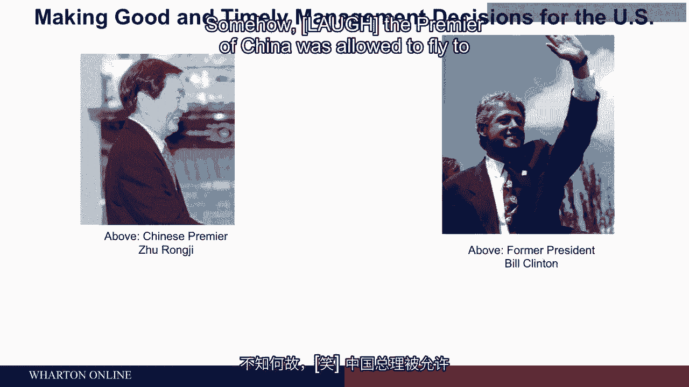

in the end Washington was not ready to sign。

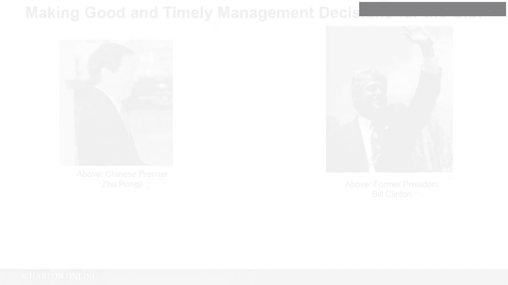

Here's the point I'm going to have us focus on for just a minute。

Charlie Barchevsky publicly criticized and newspapers and beyond for this problem said， to herself。

"Okay， I believe in what we're trying to do， which is to open up more trade。

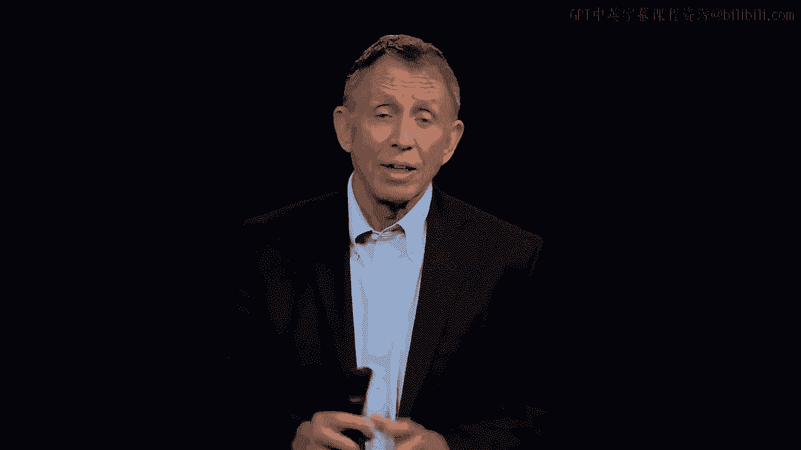

with China。 And now I quickly and in a good sense， good and timely， have got to get myself up， dust。

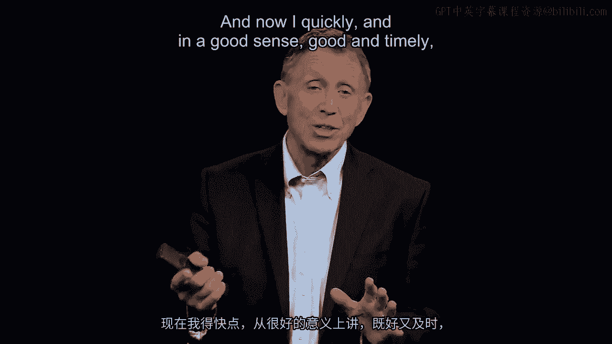

myself off and get right back into the game。"， Part of that day after Bill Clinton said he's not going to honor the deal。

it was not ready， to yet to sign。 She called up Zhur。

got a discussion going and talked in turn with members of both houses， on Capitol Hill。

talked and turned to the AFL-CIO， the big labor organization， talked。

and turned to all kinds of enterprise around the country on why free trade or open trade。

with China with a lot of downsides that are known in advance on balance。

Net net would be a good thing for this country。 Six months later。

now with a signing actually in Beijing， Charlie Barchevsky， there she is， in the bottom photograph。

having made a whole range of good and timely focus here on timely， especially decisions。

brought this debate， this discussion to a close。 That helped bring China into the World Trade Organization。

Of course today we know the consequence， the amount of trade between China and the United， States。

just an enormous flow these days compared to a trickle back then。

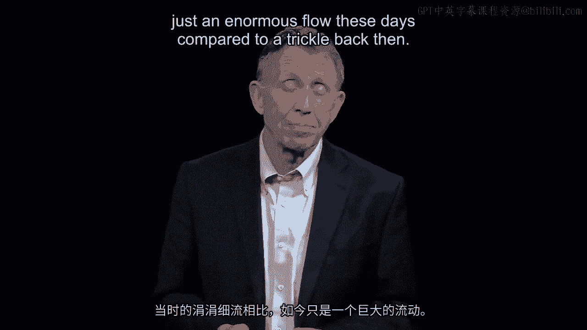

Let me add one more point and I'm going to reference here Ann Livermore at the time when。

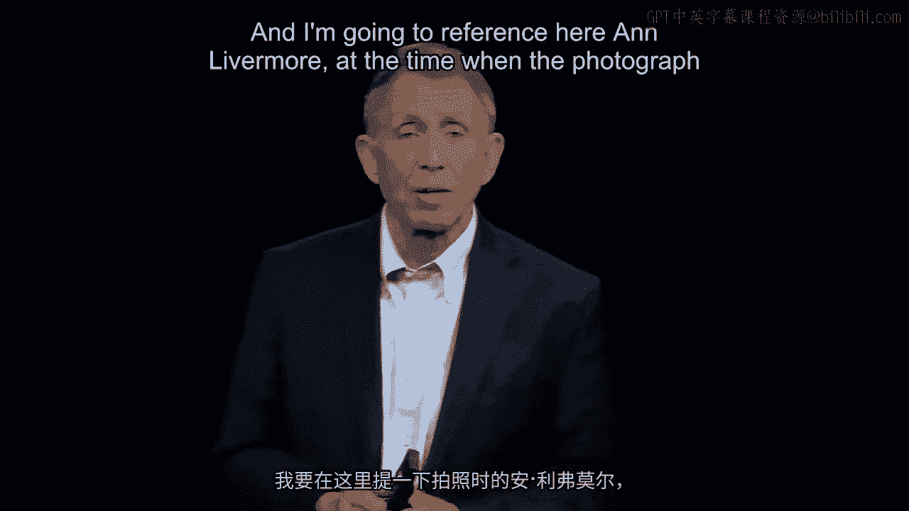

the photograph was taken who was a senior VP or executive VP at Hewlett Packard， the big。

maker of technology products including home computers。 And Charles E。

Latchy who again when the photograph was taken ran what's called jet propulsion。

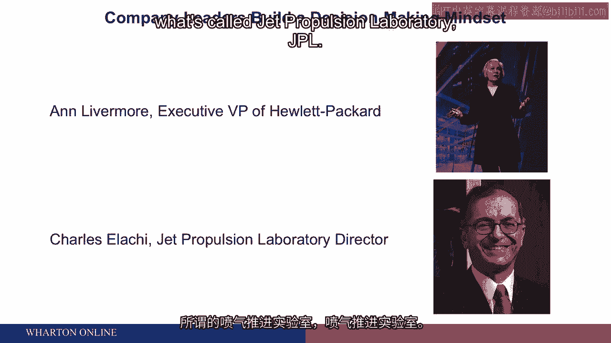

laboratory JPL。 We know less about that， although we know what it does by seeing what some of the consequences。

of what they put into space when missions go to Mars for example or out to find Neptune。

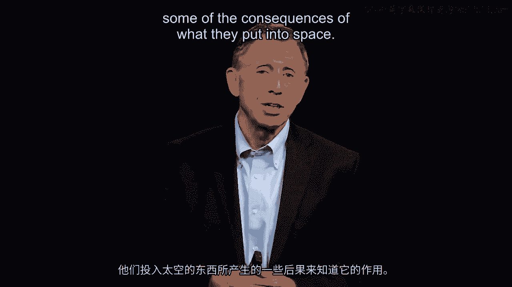

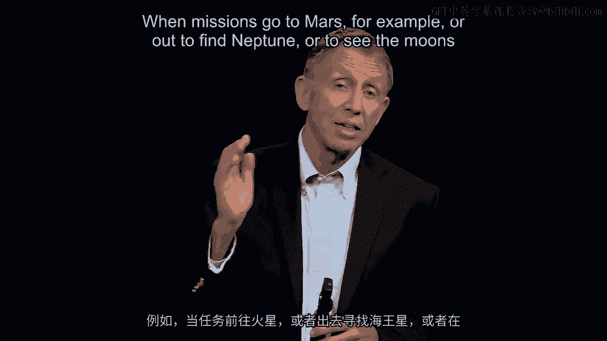

or to see the moons of Jupiter without people on board。

It is the jet propulsion laboratory that puts together the hardware， arranges for the launch。

through Vanessa。 So this is the organization when there's no people on board that sends for example the。

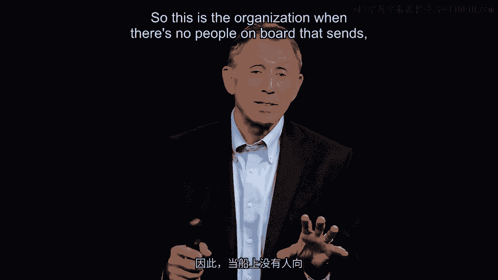

rover mission to Mars。 Charles E。 Latchy， a scientist and engineer or physicist。

worried a lot about a decision。

making mindset that would be good and timely at jet propulsion laboratory。

And in a famous example that he often cited well known to the outside world he had arranged。

he had authorized two of his senior engineers to send two separate missions to Mars。

They were going to land at separate times and both of the missions failed for technical， reasons。

The engineering had some issues in it and the two engineers separately decided。

to walk into Charles E。 Latchy's office to say a big error here and we hear by resign。

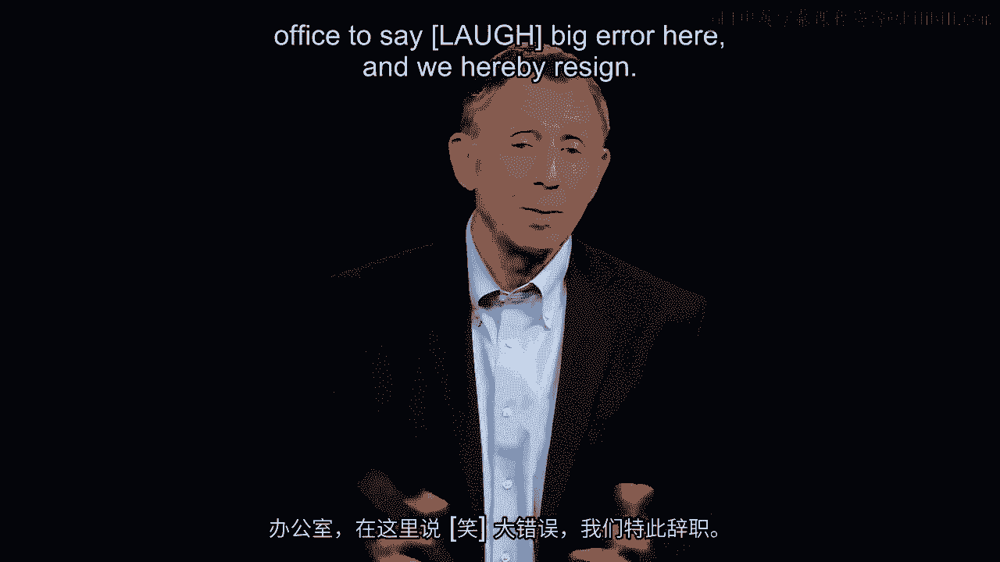

And Charles E。 Latchy told them and he's retold the story many times。

I've seen him tell it directly that we just spent $400 million for you to make that decision。

that didn't work so well。 Go back to the Marine Corps precept there。

You've got to tolerate decisions that aren't so good for the first time。

So now that you've learned from those you're going to not resign you're going to work for。

me and we're going to get two more missions to Mars。

And these are the two engineers that put together what are called as missions spirit。

and separately opportunity。 Two missions that did land on Mars and if you've looked at a。

photo of the surface of Mars or seen an IMAX film in recent years about that these two。

engineers did it。 They solved the problem。 Charles E。 Latchy says to his 4，000 employees。

repeatedly I want you to make exacting decisions。 I want you to make them timely and I'm not。

looking here for perfect。 You're going to learn from mistakes。

So it's an illustration just to anchor that one more time of that again Marine Corps formulation。

of getting to 70% getting out there make a good make the decision make it timely。

And Livermore back here at Tila Packard often said when she was there she's no longer with。

the company that I want decisions to be fast enough。 They don't have to be super fast。

Don't just get into it and make it。 We're going to make mistakes but I don't want them。

to be perfect and taking too long on the flip side of that。 The point I'm going to make。

is that in management we recognize that people are we're all worried about making an error。

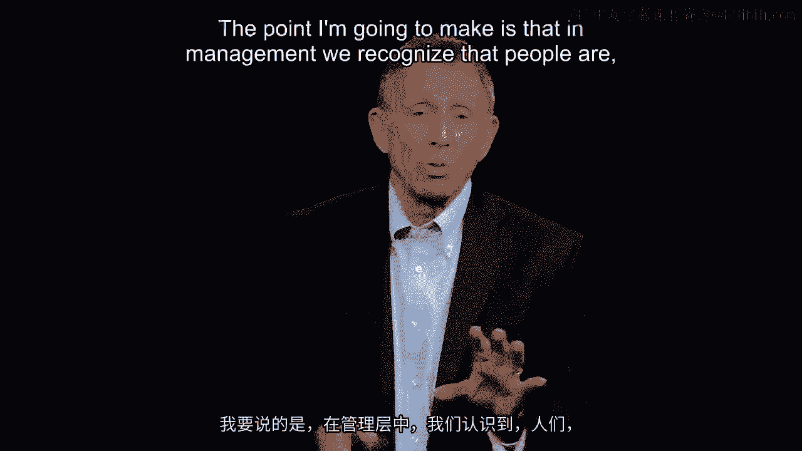

in a fast moving world cycle time shorter and the management challenge is to recognize。

that and to do something about it to manage it so the people around you once you've delegated。

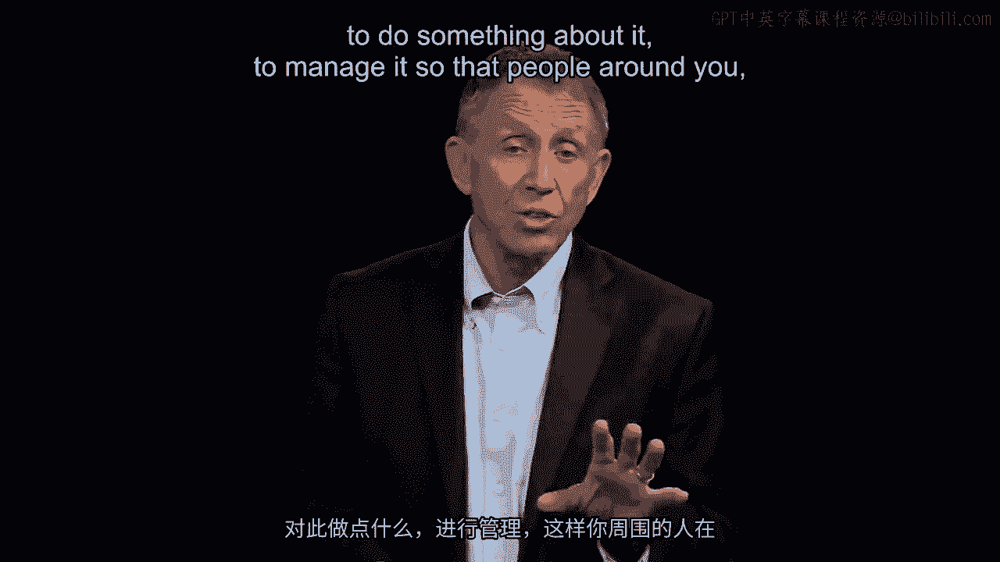

a course can make good and timely decisions。

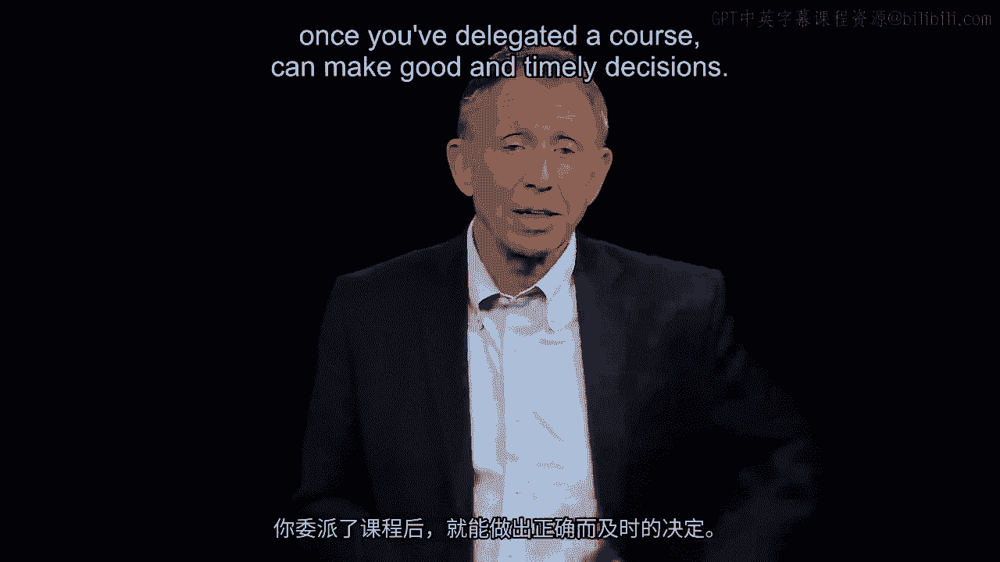

A couple more thoughts before we then take a deeper dive I'd like you to absorb these。

as well on being ready to make good and timely decisions as we're about to see when a lot。

of fate hangs on getting them right and hangs on getting them in a timely fashion。

Lots of research and behavioral psychology behavioral economics well summed up in a book。

called Thinking Fast and Slow。 It's a book that pulls together a lot of research。 It's great。

on the factors that lead people for example take a look at the second bullet here predictably。

lead people to be over confident in judgments when they're kind of new to the area。 They。

start feeling good about themselves even too good about themselves。 Think about a person。

you've hired that six months into the job since we know that there's that tendency for people。

the predictable tendency for people to be over confident this is indeed something we can。

do something about as a manager。 Most worrisome of all by the way of all these behavioral call。

them recognized shortcomings of the human condition we're not computers we're not automatons is。

what I've got captured in the box at the bottom of the screen there almost like a surgeon general's。

warning。 It's a little bit ironic because it says this if you've had a great quarter a terrific。

year watch out because some of these behavioral shortcomings so well summed up in this book。

that I've already referenced thinking fast and slow Daniel Kahneman the author of that book。

and things are going swimmingly well there is a tendency for all these suboptimal problems。

to become more acute people become if it's been a good year a great quarter over confident。

hubris sets in we're doing great we don't have to make any changes when maybe some of。

that greatness is literally the luck of the draw and the last bottom paragraph there in。

that box for me is one of the most profound statements about what we have to do as a manager。

of people in an organization with a good strategy and that is guard against over optimism and。

by the way over pessimism we have to manage that over optimism hubris sets in over optimism。

we don't do anything there's a middle ground and just to make maybe make that tangible by。

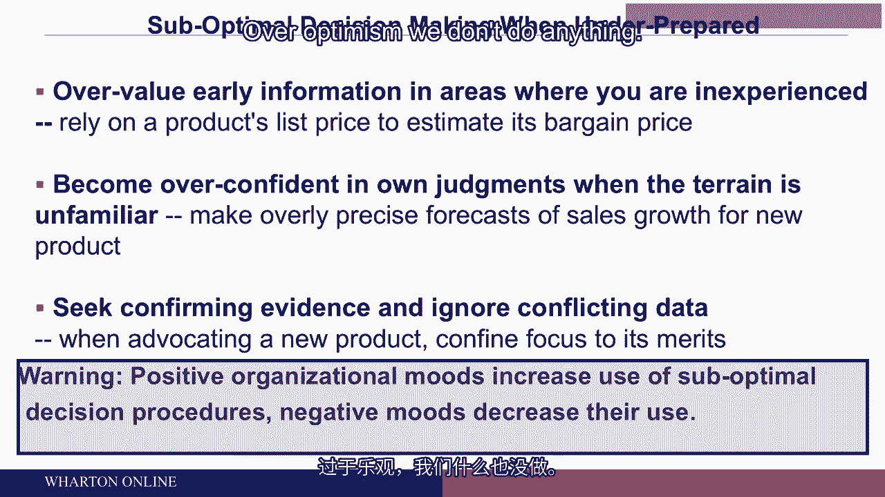

way of illustration the great Japanese automaker Toyota for years has adopted the mantra I think。

we all know it of continuous improvement we've got a great auto they've often dominated the。

world industry in terms of price and quality but don't let that don't rest on your laurels we've。

got to think about what are the four improvements that still need to be made continuous improvement。

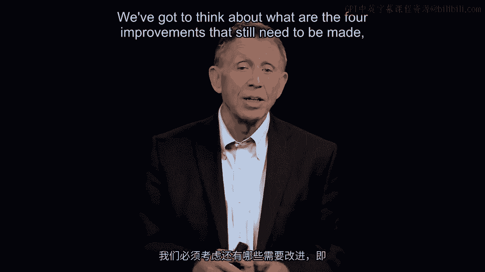

and that's a managed culture I've gone into Toyota talk with the people who I challenged。

them on that and he said of course we had a great year Mike but in fact we're really worried。

about four new problems and that's where we're focused。 [BLANK_AUDIO]。
