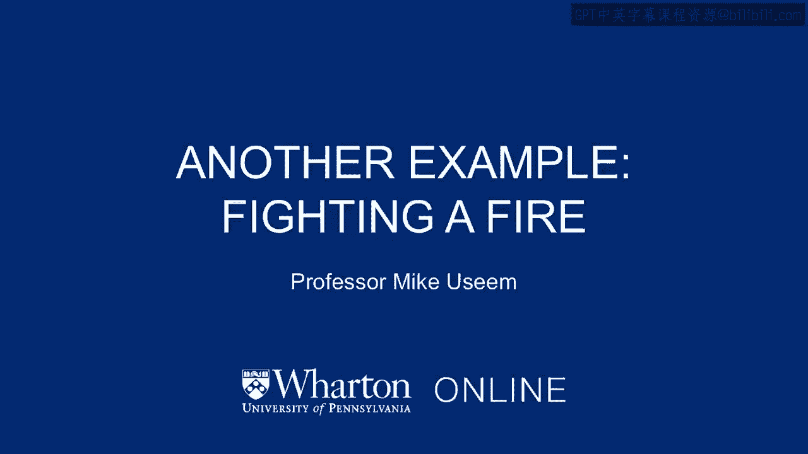

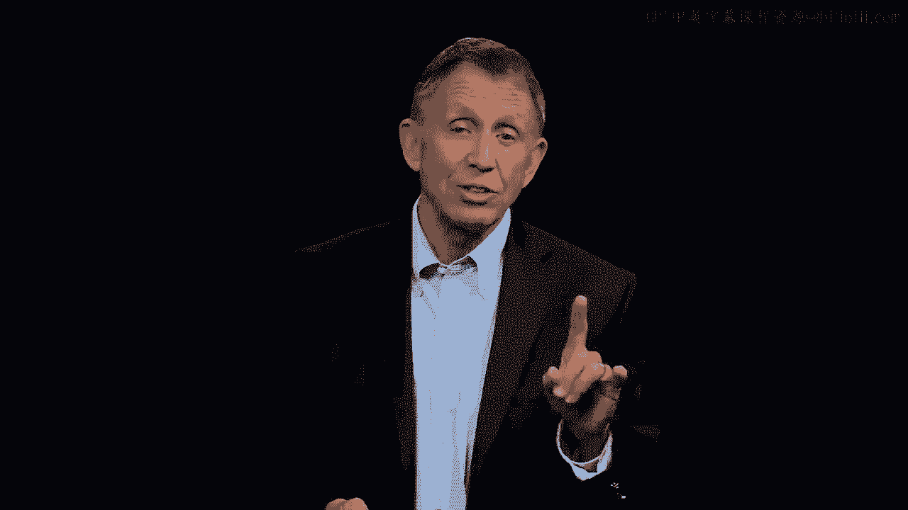

# 沃顿商学院《商务基础》课程｜第94讲：17_灭火 🧯

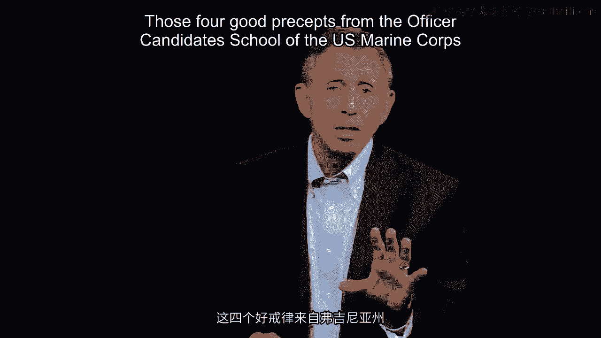

## 概述
在本节课中，我们将深入分析一个发生在真实火灾现场的、关于团队管理与决策的复杂案例。我们将跟随一支消防队的行动，审视其团队领导在极端压力下做出的关键决策，并运用我们之前学过的战略与决策框架来评估这些行动。

---

## 案例背景：曼恩峡谷火灾

让我们回到约翰·钱伯斯和硅谷的例子，回想美国海军陆战队军官候补学校的四条准则，思考夏琳·巴切夫斯基的案例，以及项链交易的问题。现在，我们将更深入地探讨一个非常困难的处境。

这个案例的描述大约需要五分钟。之后，我会向你们提出四到五个问题。请在我讲述时吸收信息，因为我将要求你们运用从硅谷、约翰·钱伯斯、美国海军陆战队、夏琳·巴切夫斯基、安·利弗莫尔、查尔斯·伊奥拉奇等人和案例中学到的一切，来解读团队在行动中即将做出的良好且及时的决策。

图中是空降区。消防队空降后，距离火场大约一英里。按美国西部的标准，这场火势范围很小，大约30英亩。这类火灾通常由雷击引发，这次也是如此。事发区域非常干燥易燃，时间是八月初。

下午四点，总共16名消防员降落在空降区，他们将向一英里外的火场进发。这原本是他们夏季以来执行过数十次的常规行动。当天是8月5日。

---

## 行动开始与首次决策

下午五点，队伍已在地面。33岁的团队领导、团队经理瓦格纳·道奇转身对其他15名队员简单说了三个字：“我们走。”

队伍开始向火场前进。图中箭头指向火场，队伍走了约半英里。

此时，这位团队经理在没有解释的情况下，命令队伍停下。其他消防员背后称他为“寡言之人”——技术精湛，但常常几乎不说话。果然，在空降区和火场中间的这个半英里点，他转身对团队说：“好了，大家留在这里。吃点东西。我马上回来。”

现在，他为所有人的良好及时决策模板增加了一个要点：他独自前往火场进行“尽职调查”。这意味着了解我们的战略（即安全灭火），并检查是否可以从这一侧实施。请注意，他是独自前往的。

当他接近火场时（瓦格纳·道奇，33岁，9年经验），他突然转身回到队伍正在吃完三明治的地方。时间点上，他们五点出发，大约五点二十到达第一个箭头处。他回来后，没有解释他看到的非常糟糕的情况（我稍后会提到），就对团队说：“我要你们直接沿着图上的路线下到峡谷口，到河边。”这条河是密苏里河。

他让15名消防员在没有他带领的情况下前往河边。同时，他自己则返回空降区（即图上方向空降区的波浪形箭头）。他没有解释原因，也没有解释为什么派消防员去峡谷口，这符合瓦格纳·道奇的一贯风格。

---

## 团队的反应与战略思考

现在，如果你是瓦格纳·道奇手下的一名队员，请试着理解他为什么派你们去峡谷口。我们本可以快速讨论一下，但当时没有机会。我现在要提到，因为有一股非常强劲的阵风，从右下角吹向左上角，风速可能达到每小时40英里。这场火非常危险，可能会爆发。

瓦格纳·道奇在进行尽职调查时还发现，地面的材料非常干燥、厚实、易燃，比他从飞机上盘旋空降区时看到的要危险得多。所以，他让16个人处于潜在的巨大危险中。

消防员们正前往峡谷口。回到我的问题，请思考第一个问题（总共五个）：
**为什么派你们去峡谷口？**

你们中的一些人无疑会想到，是为了绕到火场的背风面。火势会吹离你们，虽然更难扑灭，但安全得多。其次，当时的消防员也知道这一点：如果附近有溪流、湖泊、游泳池或海洋，万一火势失控、蔓延、“爆发”（用他们行业的说法），你只需跳进水里就能幸存（讽刺的是，消防员需要通过游泳测试）。

所以，消防员们（希望你们也想到了）认为：我们要去更安全的背风面，这符合“安全第一”的战略。同时，我们也在考虑最坏的情况。管理者决策模板的一部分就是必须考虑最坏情况，防范出错，必须准备好降低过度乐观，保持极度现实。

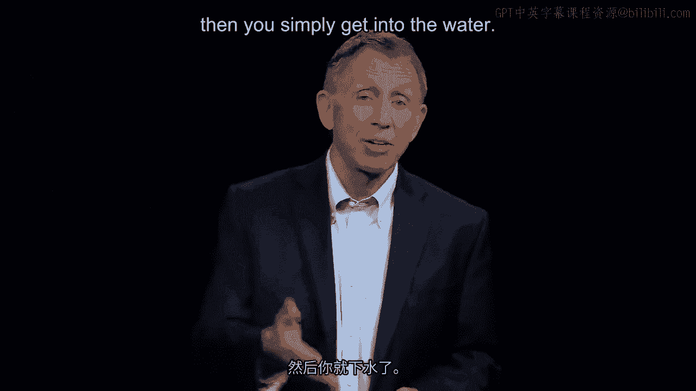

---

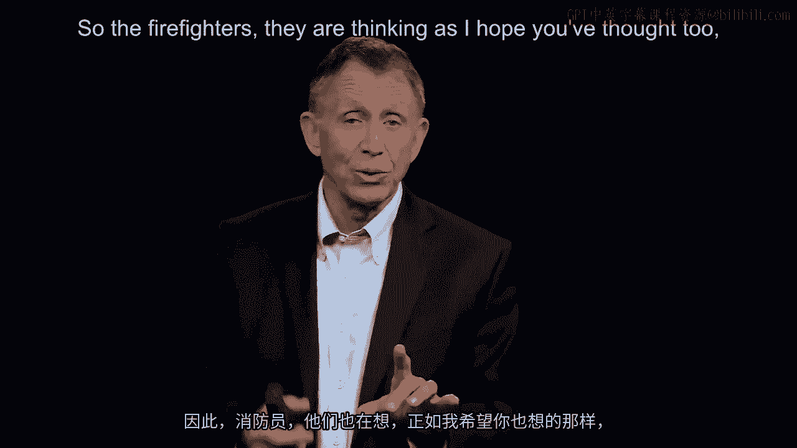

## 形势突变与关键转折

说到这里，我们进入下一个节点。负责的消防员、团队经理瓦格纳·道奇到达空降区后，又疾驰返回，大约在下午5点40分追上了队伍。我在图中画了最后一个箭头（在峡谷中部有点难看清）。他们几乎快到水边了，现在瓦格纳·道奇重新回到了16名消防员队伍的前列。

顺便提一下，在过去的几分钟里，二号人物（名叫鲍勃，罗伯特·萨利，法裔加拿大人名）暂时成为了负责人。这是 protocol。尽管鲍勃只有17岁，但暂时成为前线领导、团队经理，他可能感觉相当不错。但现在时间是下午5点40分。

再次从战略角度思考，战略意图从何而来？我们必须进行战略思考。如果你是团队经理，此刻——在这个命运攸关的8月5日夏季下午5点40分——你在想什么？结合我们目前讨论的内容，甚至回顾本课程关于战略的部分，花几秒钟思考一下你脑海中应该考虑什么。

很好。你肯定在考虑你身后队员的状况。必须担心组织中的人员。他们状态好吗？是否跟得上？必须考虑夜间在哪里扎营（某种前瞻性规划）。必须了解火势动态。我必须评估我们是否有合适的装备？是否需要增援？因为这场伴有每小时40英里大风的大火，有可能演变成更大的地狱。

不幸的是，就在我们暂停片刻进行战略思考、准备做出下一个良好及时决策时，火势“行为不端”了。

就像人类有时难以预测一样，火灾也是不可预测的。

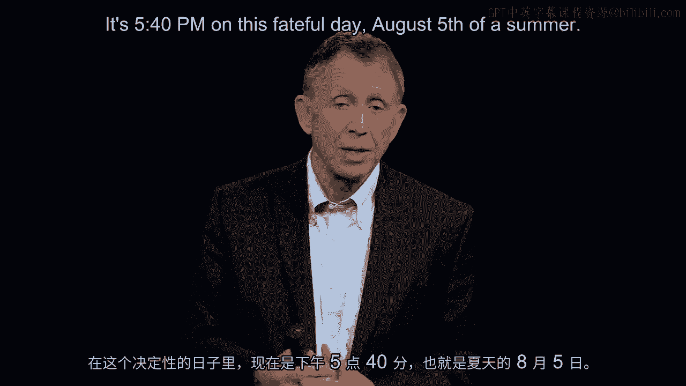

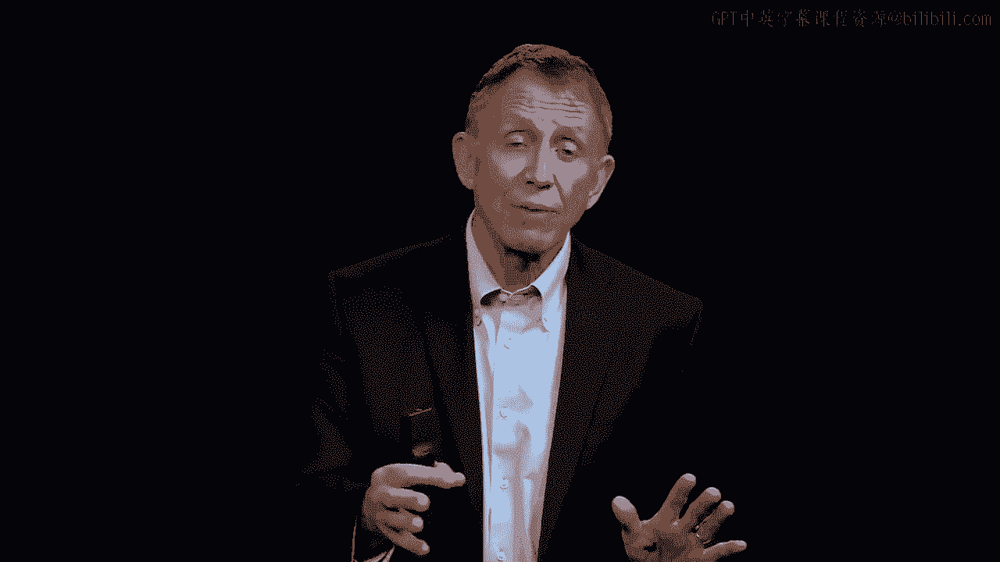

火势没有朝左上角蔓延，而是切断了我们逃往河流的退路。我们到不了水边了。

---

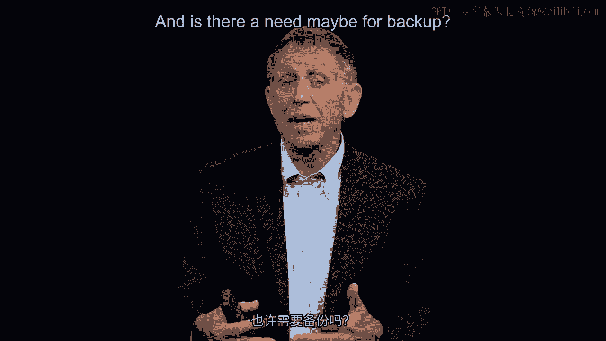

## 生死逃亡与最终决策

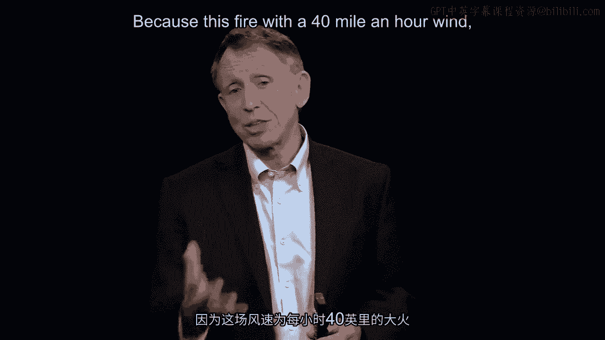

说到良好及时的决策，下午5点40分，瓦格纳·道奇突然转身，开始实际上向空降区方向返回。他脑海中现在严重担忧他们被一道火墙困住了。火墙大约100英尺高，温度约华氏1000度，背后还有强风助推。因此，他毫不犹豫地采取了行动。

他对比尔（二号人物，记得他叫鲍勃）说：“鲍勃，扔掉所有东西。扔掉。现在跟上我。我们要逃命了。明白吗，鲍勃？把话传下去。”你能想象吗？队伍里有些夏季志愿者，虽然都是消防员，但有些人只干了八九个星期。他们从未听过这种命令。命令沿着队伍传下去，他们现在真的在向空降区狂奔。他们还能去哪？

此时，瓦格纳·道奇做出了一个最终可怕的发现。他当然大概知道，但之前没有放在更广泛的背景下考虑：他正从一片森林中出来。到目前为止，从某种意义上说没问题，因为火灾穿过森林、树丛的速度大约是每小时4、5、6英里。大多数人在持续奔跑下可以超过这个速度，即使是上坡（他们当然一直在上坡）。

但现在，瓦格纳·道奇以及身后散开几英尺的每个人都意识到，他正在离开森林，进入一片开阔地，那里长满了厚及肩膀、极其干燥的草原草。凭直觉我们知道问题所在，他从技术上更了解。火灾在草原上的蔓延速度可达每小时15到20英里。感觉就像草在爆炸，其实不是，只是火势蔓延的速度。在这种情况下，没人能跑得过。我们在上坡，穿着厚重的靴子。

如果你能用4分钟跑完一英里，速度是每小时15英里，那么你需要以每小时20英里的速度上坡，穿过厚草，穿着沉重的战斗靴。你做不到。

于是，瓦格纳·道奇此刻（可能是下午5点49分）停了下来，从口袋里掏出一根火柴，就在那里点起了一小堆火。

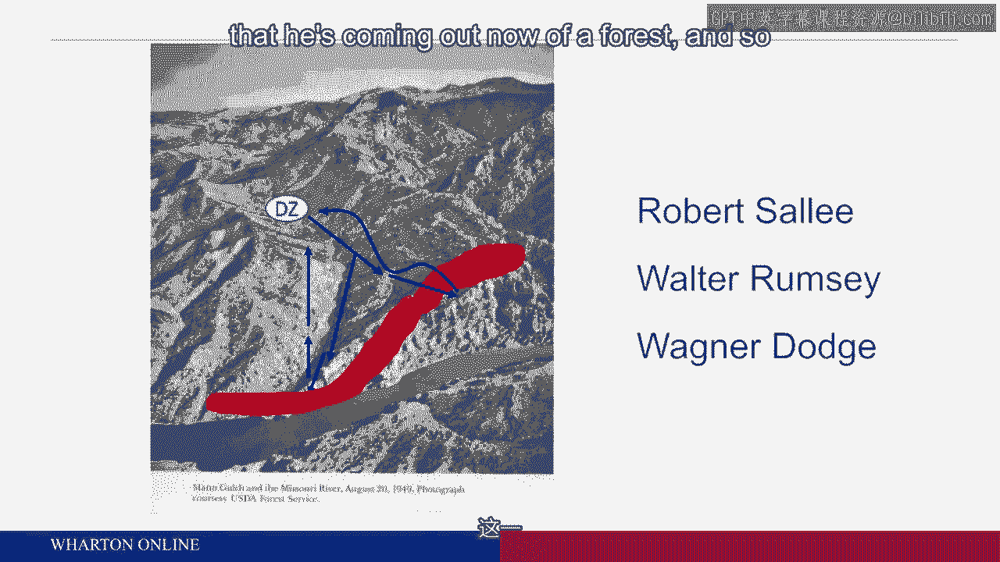

一个小红点，火在草中蔓延开来，形成一个燃烧的草圈。瓦格纳·道奇后退几步，助跑后跃过燃烧的草圈，实际上未被火焰触及。现在他到了圈内中央。他是个寡言的人，所以不会解释他的行动。但二号人物鲍勃能看到老板、团队经理正在点燃面前的草。

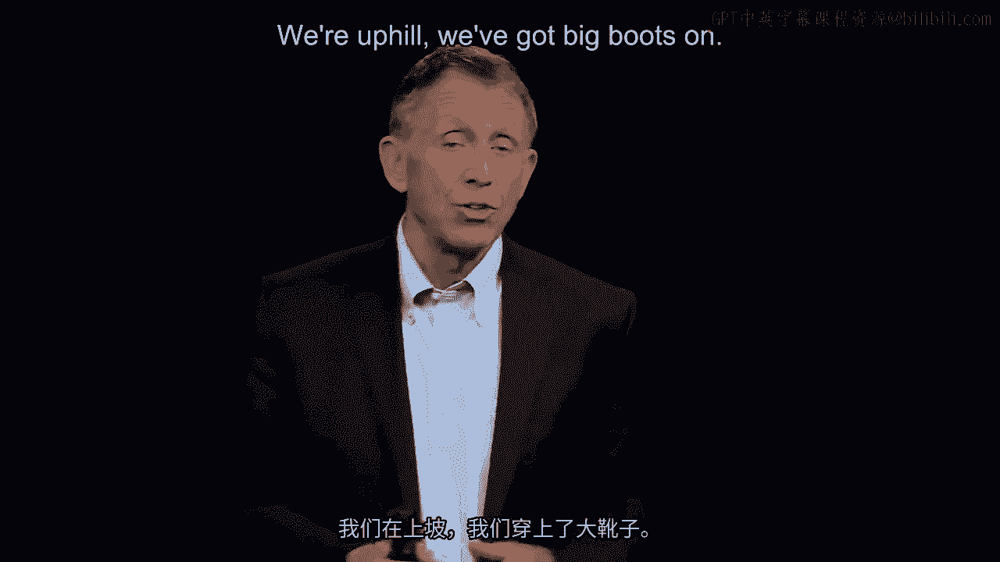

火势蔓延得非常快。老板现在进入了一片烧过的区域。请花点时间思考一下点燃这堆火的目的是什么。没有解释，但你可以想象鲍勃正试图理解老板在做什么。我们身后已经有足够的火追来了，为什么瓦格纳·道奇还要在我们面前的区域点火？

几秒钟过去了，瓦格纳·道奇向鲍勃示意：“鲍勃，现在进来。”而鲍勃，出于某些原因（我现在请你们思考这个决策），决定向左走，他翻过一道悬崖或山脊，坠入屏幕左侧的下一个山谷。

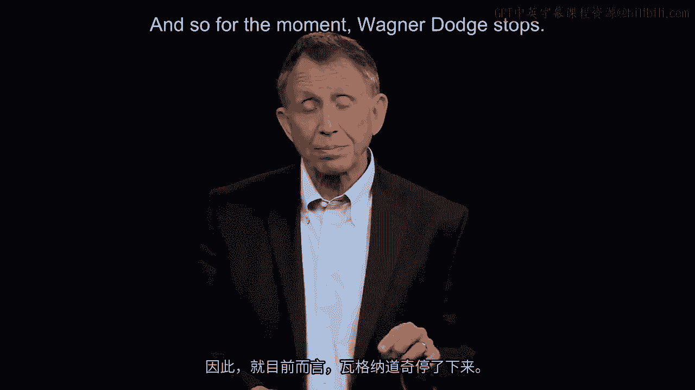

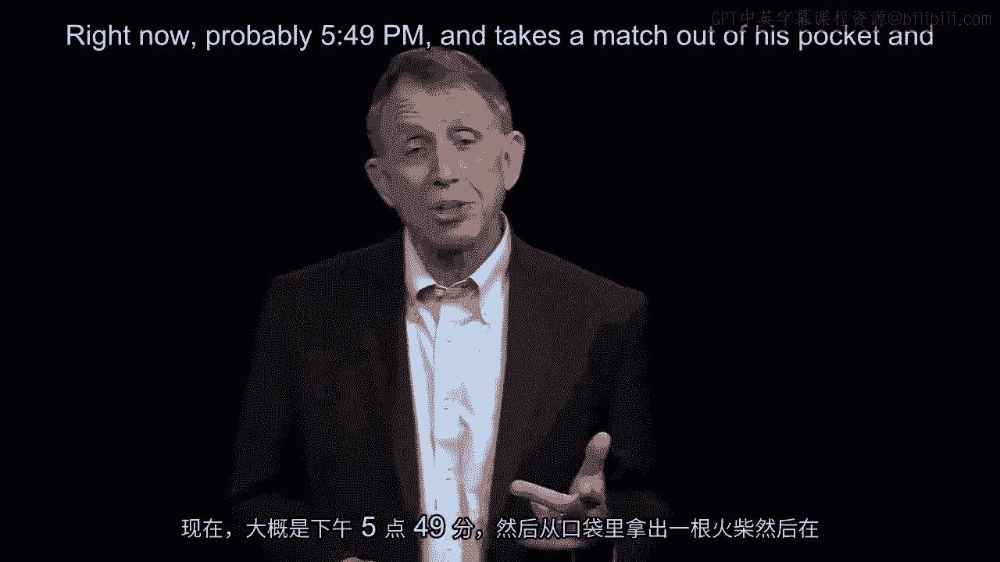

队伍中的第三名消防员（今天的情况，有点像马戏团的大象排队），名叫沃尔特·拉姆齐。沃尔特看了一眼。他是跟着他一直跟随的人（鲍勃）？还是跟着团队经理？他不一定理解那堆火是怎么回事。无论怎么想，沃尔特决定跟着鲍勃走。

所以，从物理位置上看，现在红点处只有一个人——团队经理。两个人脱离了团队经理，现在到了山脊的另一侧。剩下的13个人，身后的火越来越近，他们的衬衫已经开始因辐射热点燃冒烟。

我用这里的三个最终箭头来总结。最后的13个人（仅用三个箭头代表），看了看瓦格纳·道奇和他那一小片烧过的区域。他们大概意识到（我们认为）前面的两个人向左去了。但当大火追上他们时，他们身处茂密的草原草中。

---

## 悲剧总结与复盘思考

因此，总结这场可怕的悲剧：我现在请你们解读发生了什么，进行“事后回顾”，审视决策，以便下次能做得更好。

[空白音频]

---

## 总结
本节课中，我们一起深入分析了曼恩峡谷火灾这一极端案例。我们追踪了团队领导瓦格纳·道奇在信息不全、时间紧迫、压力巨大的环境下做出的一系列决策，包括独自侦察、分派任务、紧急折返以及最终点燃“逃生火”的创举。我们运用了战略思维框架，思考了安全第一、尽职调查、考虑最坏情况以及沟通在团队管理中的关键作用。这个悲剧性的案例深刻地提醒我们，良好的决策不仅需要技术知识，还需要清晰的沟通、对团队心理的把握以及在危机中灵活应用原则的能力。