# 沃顿商学院《商务基础》｜Business Foundations Specialization｜（中英字幕） - P95：18_事后复盘和总结.zh_en - GPT中英字幕课程资源 - BV1R34y1c74c

The after action review as a way of a focal summary finds that at probably 549， 555。51。

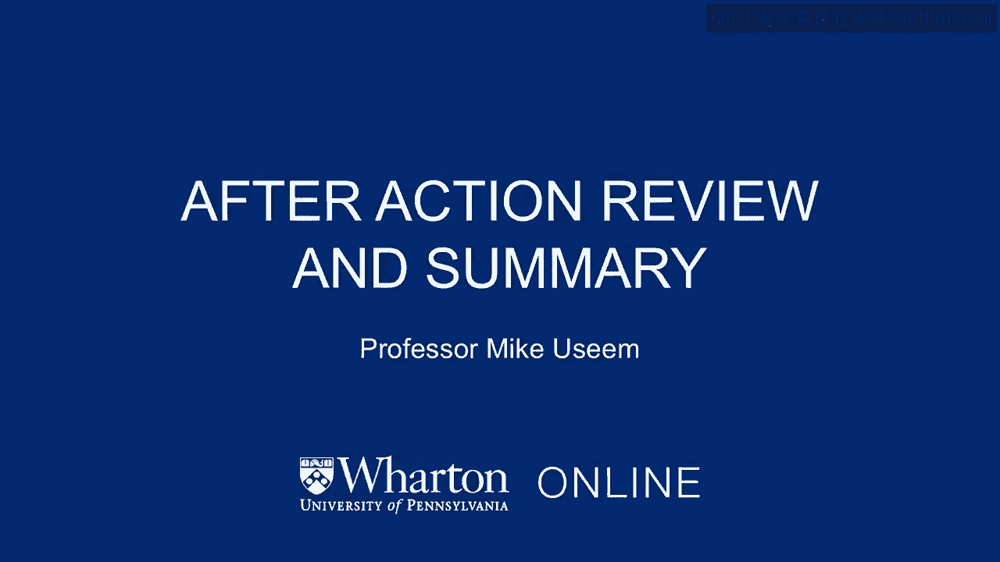

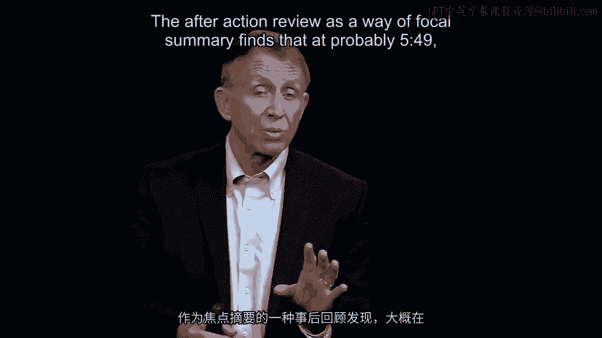

PM， August 5th on this particular day， two firefighters have found a rock slide in the。

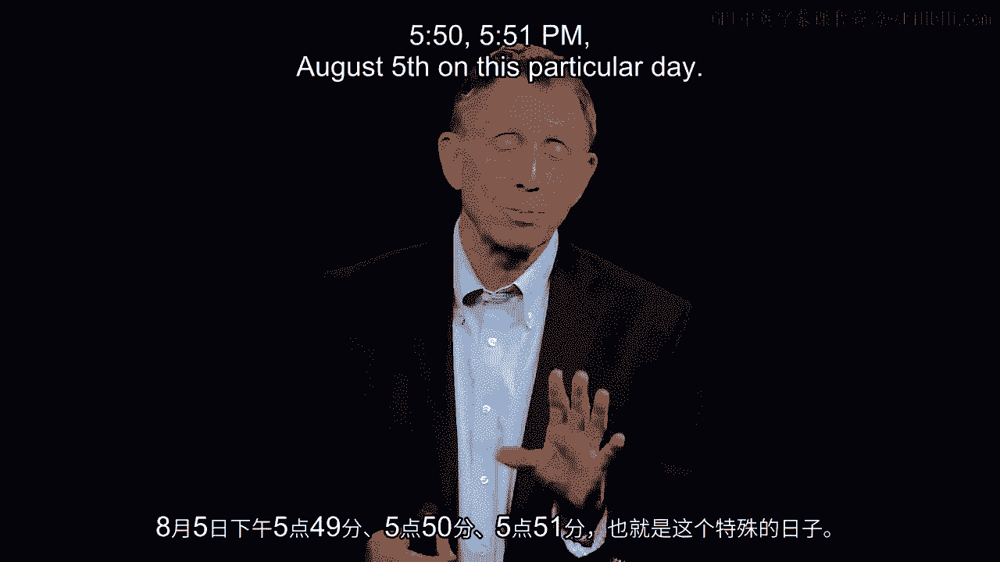

next canyon。 One firefighter has burned out an empty zone， a safe zone for himself， and。

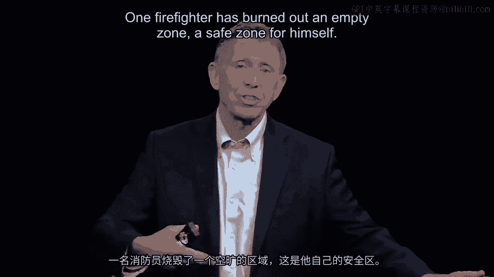

13 others for whatever reason now no longer having confidence in the management of Wagner。

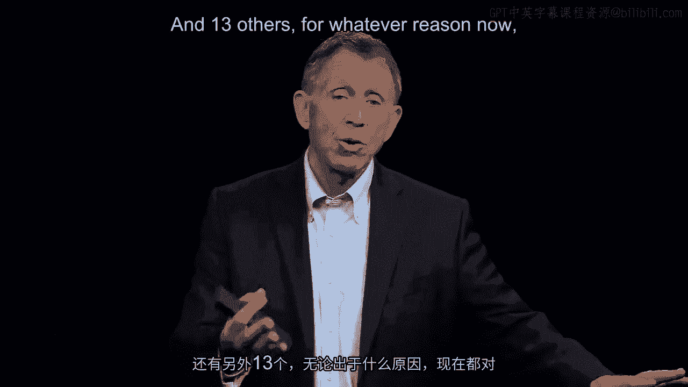

Dodge。 They decide to find their own place of salvation。 They won't find it。 The grass。

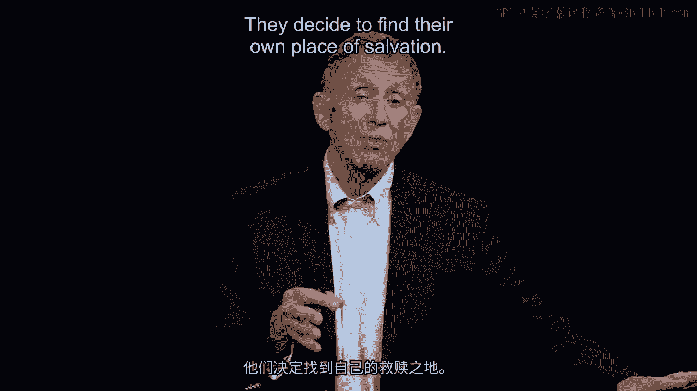

becomes an inferno。 They're overtaken。 That's a terrible tragedy。 One of the worst ever。

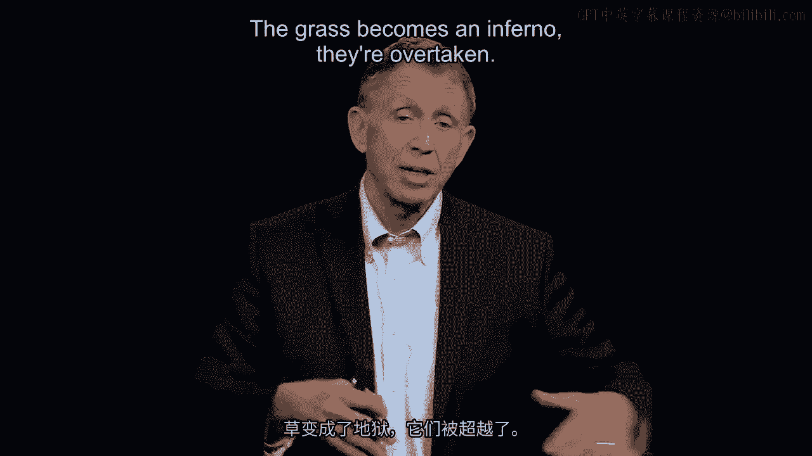

in the history of the U。S。 Forest Service， United States government employees here。 And。

with that， we actually know quite a bit about the details of what happened in the same。

sense that we look back， for example， a challenger in Colombia， the space shuttle disasters。 And。

with that， looking back， our purpose is though to look forward for making good and timely。

decisions。 So think for a minute。 Really my final question here。 And then we're going。

to sum up why when Wagner Dodge opened up that little fire， it created about a 75-yard， open zone。

All the grass is burned。 Totally safe。 Why did Bob not agree to go with the。

manager of his team when it would have made a difference？ Here's why it would have made。

a difference for everybody。 After action review here， looking back on a decision we want to。

make differently the next time back to the Marine Corps。 Look at decisions， learn from， them。

Bob took a look， decided he didn't， he no longer trusted Wagner Dodge。 Since he。

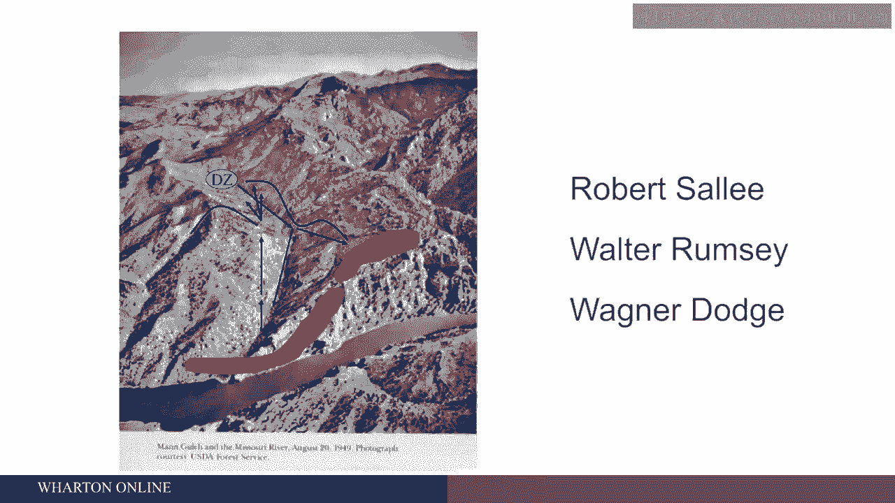

survived， we can ask him directly as the investigators did。 And Bob decided that with。

three or four decisions that weren't so good and three or four decisions that were never。

explained that the intent of my commanding incident commander here， the team manager。

this wasn't clear to me what he wanted or why we should do it。 And thus although Wagner。

Dodge in a moment of total brilliance came up with a lifesaving solution， this is kind。

of a Steve Jobs moment where he had invented literally with the pressure on him around， 549 p。m。

on August 5th invented a tactic that's used now by firefighters all over the world。

ever before known to the US for firefighting services that was going to save the team。 Plenty。

of room， 75 yard diameter。 Big fire was going to sweep around it as it did。 But somehow。

he couldn't manage his team， could not draw them into that zone。 And with that is this。

terrible human disaster that followed。 Here's the last question that we're going to sum， up。

I said I might have one more。 Here it is。 The final question。 Wagner Dodge was sent。

in with a team here， understanding fire behavior。 What might he have done or what might others。

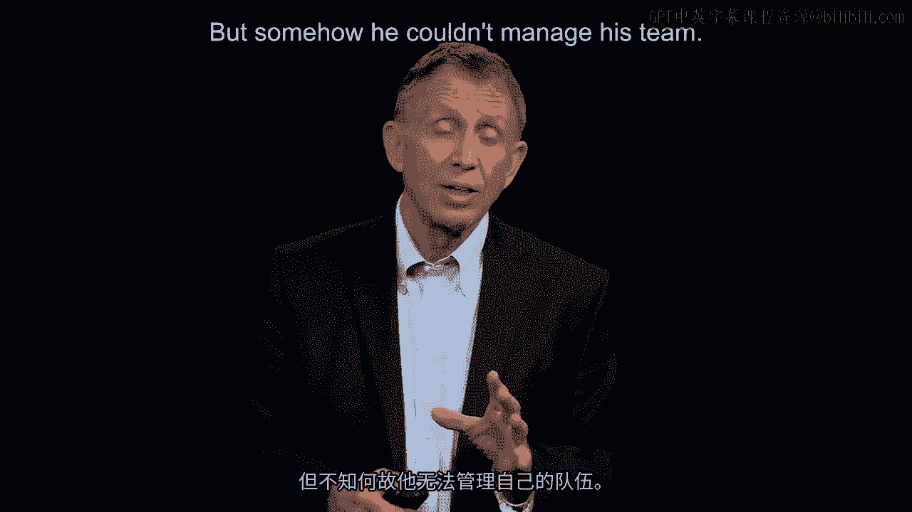

have done to help him also appreciate human behavior in its form。 For example of a team。

manager who's very quiet， introvertish。 A lot of us are introvertish of course。 But when。

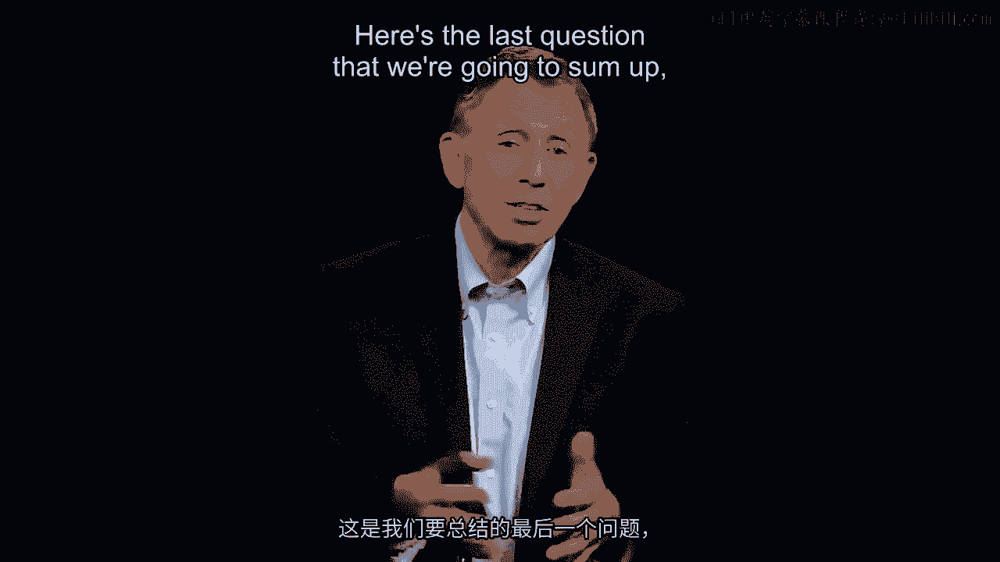

you're responsible for managing other people， the failure to communicate your strategy。

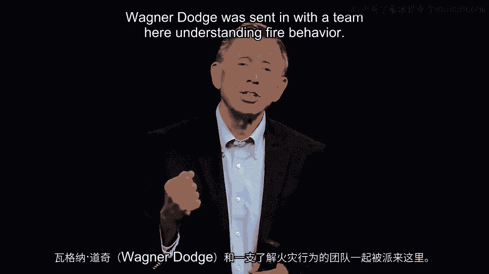

your decisions to explain what you're doing， in this case proved fatal for 13 people。 I don't put。

the blame on Wagner Dodge though for this because you've got to ask then a separate question。

And this is it。 I'll quickly just lay out a final line of argument here that Wagner Dodge。

was given 15 other firefighters on his team， trained in fire behavior。 But there was no training at。

the time in human behavior。 Strategy put out the fire。 Technically note what the heck you're doing。

But coming back to the whole point of this part of our course， we also have to understand the human。

equation， which normally is pretty good。 But there are some days like here when things can go。

pretty badly。 And that's why today people who replace Wagner Dodge before they are sent into。

the wilderness， California， Arizona， Australia for that matter， Western Europe， when fires like。

this break out， team leaders， team managers are trained in fire behavior and also human behavior。

Such that when it comes to making a good and timely decision， they're ready for some of those。

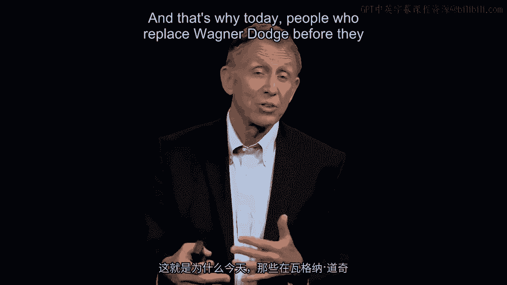

shortcomings that are right there in front of them。 I have a slide here。

I'm going to really bring it， our topic to an end not by going through it。

I really have that for your own future reference， a kind of summary of the main points we've been through。

But all these points sum up in that graph， at the bottom as follows。

We want good and timely decisions because cycle time is getting shorter。

the world's getting more complex and unpredictable。 And thus our competitors are out there becoming。

better at this。 We've really got to move in the same direction of making good and timely decisions。

And what does that take？ Well， think about John Chambers' comment on Larry Carter as CFO。

Think about the research in Silicon Valley。 Think about the four precepts for being an effective。

team leader for combat Marines that we also draw upon now。 Keep those in mind。 Maybe a dozen。

items for your own template。 Back to your thinking。 The graph here， lower right hand corner。

also adds， this point。 If we can pull people into a pretty good team。

a cohesive team as the phrase I use， they know each other， they've worked together before。

they appreciate your strengths and your， shortcomings。

We know from ample research evidence that cohesive teams under the most， trying of circumstances。

the pressure is on。 Time is short。 When the pressure goes up， that's the lower。

the horizontal axis at the bottom， when stress goes up， cohesive teams actually get better。

and not worse。 There is no panic point。 They stay focused， they get the job done。

Good and timely decisions， critical to make it happen on your own part。 And we've identified。

probably close now to at least 10， maybe 12 items for your own personal management template。

for good and timely decision making。

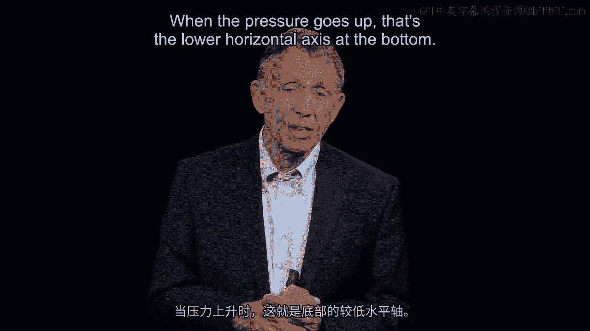

Thank you。 you。

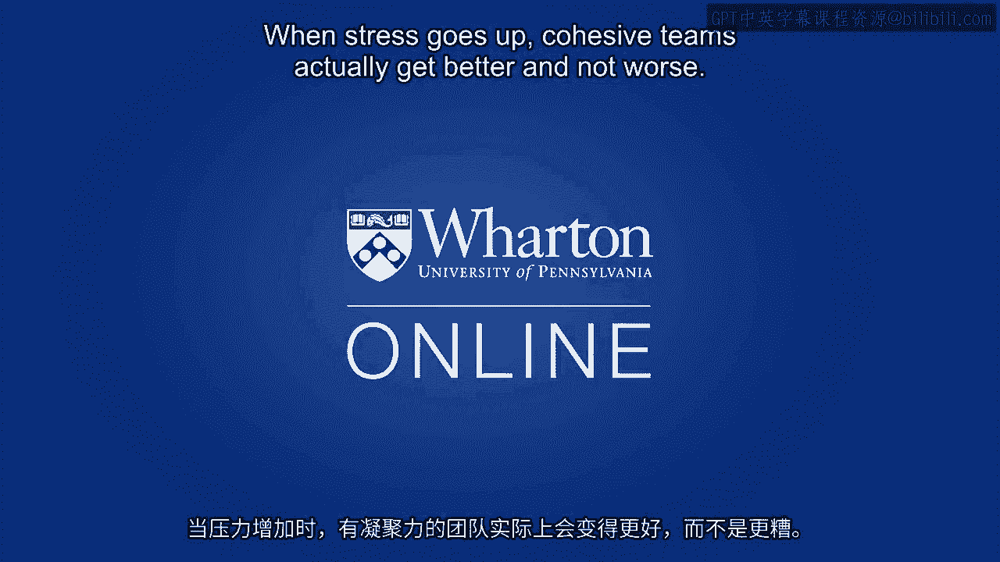
