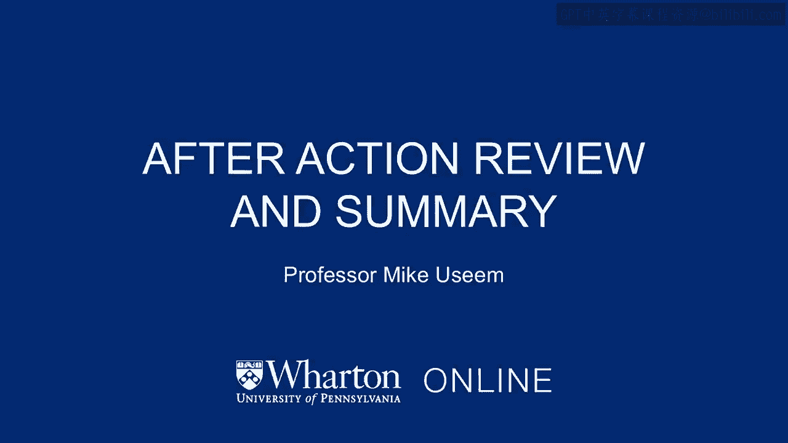
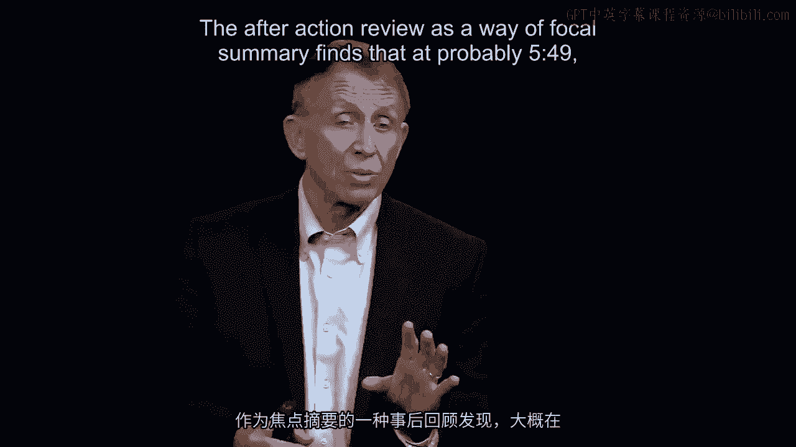
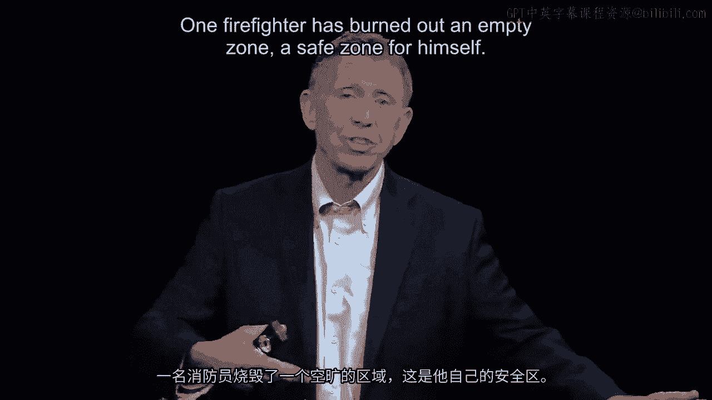
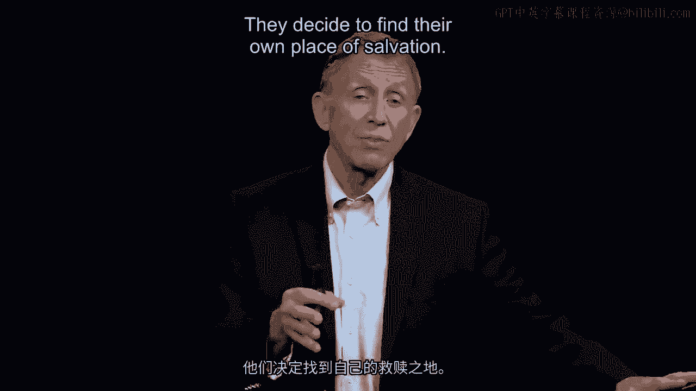
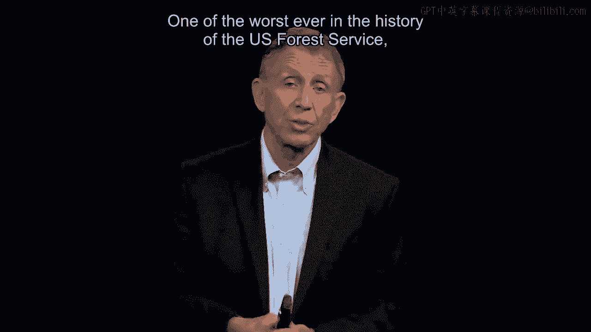
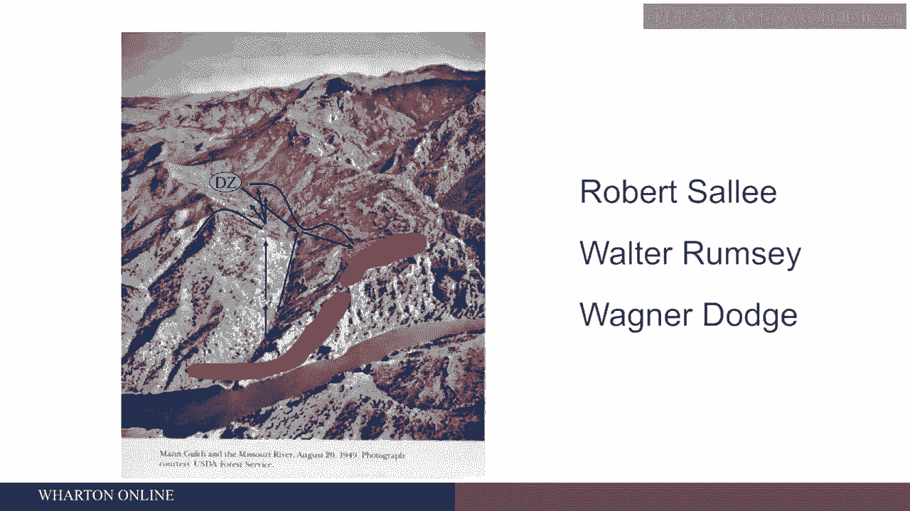
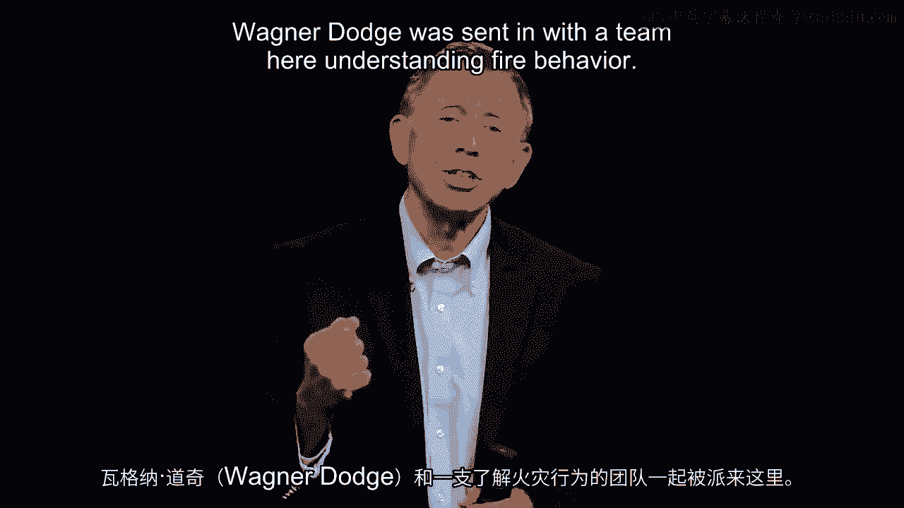

# 沃顿商学院《商务基础》课程｜第95讲：事后复盘与总结 📝

在本节课中，我们将学习如何通过“事后复盘”这一方法，对过去的决策和事件进行系统性回顾与总结。我们将以曼恩峡谷火灾这一悲剧性案例为核心，分析决策失误的原因，并探讨如何将复盘的经验应用于未来，以做出更优、更及时的决策。

---

## 案例回顾：曼恩峡谷火灾的悲剧

上一节我们讨论了决策的重要性，本节中我们来看看一个因决策沟通失败而导致严重后果的真实案例。

1949年8月5日下午约5点49分，曼恩峡谷发生了一场火灾。消防队长瓦格纳·道奇在危急时刻，急中生智点燃了一片草地，为自己创造了一个直径约75码的安全燃烧区。然而，他的队员鲍勃和其他13人，由于一系列原因，对道奇的领导失去了信任，决定自行寻找避难所。他们未能成功，最终被大火吞噬。这是美国林务局历史上最严重的悲剧之一。

## 核心问题：复盘与反思

通过对类似挑战者号航天飞机失事等灾难的回顾，我们进行事后复盘的目的，是为了面向未来，改进决策。那么，关键问题来了：为什么鲍勃没有跟随他的队长进入那个本可以拯救所有人的安全区？

以下是事后调查揭示的原因：

*   **信任破裂**：鲍勃回顾了道奇在之前做出的三四个欠佳且从未得到解释的决策。
*   **意图不明**：作为现场指挥官，道奇的行动意图和决策理由并未清晰地传达给队员。
*   **沟通失效**：尽管道奇在压力下想出了创新的求生方法（即“逃生火”技术，现已被全球消防员采用），但他未能成功地将团队引导至安全区。

## 从技术专家到团队管理者

由此，我们引出了最后一个总结性问题：瓦格纳·道奇作为一名精通火场行为的专家被派往现场，他或其他人本可以做些什么，来帮助他同样理解“团队行为”？

许多管理者，包括性格内向者，在需要管理他人时，如果未能有效沟通战略和决策，就可能造成灾难性后果。这并非将责任完全归咎于道奇，而是引出了一个更深层的问题：

当时，道奇和他的队员们都受过专业的火灾行为训练，但**缺乏团队管理与人类行为方面的训练**。他们接到的核心指令是“扑灭火灾”，却忽略了决策中“人的因素”。

这正是我们这部分课程的核心要点：**我们必须理解“人的等式”**。通常情况下这没问题，但在某些关键时刻，它可能导致严重失误。因此，现在的消防团队领导在被派往火场前，不仅要接受火灾行为训练，还要接受**人类行为训练**，以确保他们在压力下能做出良好且及时的决策。

## 课程核心总结

最后，我将用一张总结性的图表来结束我们的话题。这张图概括了我们讨论的所有要点：

我们追求**良好且及时的决策**，因为世界周期时间变短、更加复杂和不可预测，竞争对手也在不断进步。我们必须朝这个方向努力。

那么，这需要什么？请回想约翰·钱伯斯对CFO拉里·卡特的评价、硅谷的相关研究，以及我们从海军陆战队借鉴的关于有效团队领导的四项原则。这些都可以成为你个人决策模板的组成部分。

图表右下角还强调了一点：如果我们能将人们凝聚成一个有凝聚力的团队，团队成员彼此了解、曾并肩作战、清楚各自的长处与短板。大量研究表明，**在最艰难、压力最大的情况下，有凝聚力的团队表现会更好，而不是更差**。他们不会惊慌，能保持专注并完成任务。

---

本节课中，我们一起学习了“事后复盘”的方法，并通过曼恩峡谷火灾的案例，深刻理解了**清晰沟通、建立信任**以及**兼顾技术能力与团队管理能力**对于做出良好及时决策的至关重要性。我们总结了近10-12个要点，可供你构建个人的管理决策模板。感谢学习。