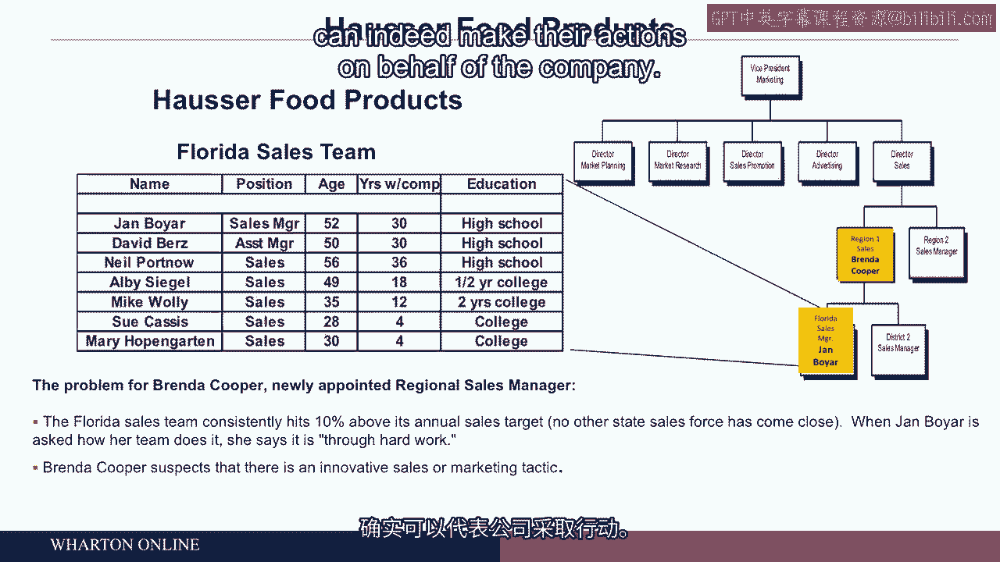

# 沃顿商学院《商务基础》｜Business Foundations Specialization｜（中英字幕） - P96：19_设计和改变架构.zh_en - GPT中英字幕课程资源 - BV1R34y1c74c

Welcome back。 I'm Mike Cusima。 As you know， I'm on the faculty here at the Wharton School。

and our fourth and final module on human and social capital， the managing of people around。

you at work， is designing and changing an organization's architecture， designing and。

changing。 So we want to think about design， and we've got to think about the， in some， sense。

even more difficult problem of changing a design once we have it in place。 So we're。

going to begin with design， and really there's nothing more than thinking about， and I like。

the word architecture for this， how people are organized， divided， how they report up。

to one boss or maybe several bosses。 And we're not going to touch on more than a few concepts。

on the particular slide you see right now。 I have several of those in red that will be。

in our conversation as we go forward， but I put that in front of us， all the concepts。

just as a kind of a reference to issues you're going to want to think about， as you do think。

about organizational architecture or changing the design that you have in place。 And to。

get us going on this， I'm going to have you work here for a company called Rose Company。

It's a manufacturing firm， and it has just to use the nomenclature of the field here。

It has a very functional organization in the sense that there are a number of production。

facilities， and the VP for， let's say， finance in a given facility reports directly up to。

the executive vice president for finance at headquarters。 The plant manager has some。

influence on control over that local VP for finance， but not completely。 And as a result， of that。

in this particular case， some of these production facilities aren't doing too well。

And the company thus decided， looking now， moving from the top diagram to the bottom。

diagram to change the organizational design by grouping all those functions， by which we。

mean these more technical skill areas like accounting and finance and marketing and operations。

to group them together under an umbrella at the top of which is the plant manager。 So。

it's a rather significant and almost radical break from the past。 The plant manager can。

hire and fire his or her own chief financial officer。 The CFO at headquarters is going to。

weigh in on that， of course。 But the plant manager is delegated responsibility for everything。

and they have to think to use a phrase here， like a general manager， they got to manage。

everything about the people in their setting。 And to make it a bit more challenging， they're。

also responsible now for results。 So we're going to pinpoint accountability and responsibility。

in a new plant manager is called the Jackson plant there。 And as we make that move， everything。

else be an equal。 You've got motivated employees， you've got a pay system that makes sense。 You're。

set to make good and timely decisions。 The work is interesting。 How you organize people。

what the reporting relations are separately also has a profound impact on the willingness。

of people to give their all to get the right job done。 With that being said， as a kind of。

a preamble for where we're going， I'm going to take us into a particularly difficult situation。

at a process food maker。 If you've ever bought a bottle for a child of puree carrots or potatoes。

the company here， name change to protect the identity of the company， makes that kind of， product。

The problem that the company is facing at the very top is that the market for this。

form of baby food is quote mature。 Growth is slow。 Investors， especially those that love。

to see companies grow are beginning to get out of the stock because there's companies， doing fine。

but there's not much growth a couple percent per year compared to some companies。

that can grow 5% or 8% or 12% per year。 And thus， now to bring this down to a particular， setting。

there is a lot of pressure on a regional sales manager。 Her name is Brenda Cooper。 She's。

in the tan box on the right hand side of the image there。 As she takes over the job here。

of running the southeast region for housing or food。 She's got a great job。 She's been。

trained in management。 She is new to the company。 But it's a great job because if she does well。

she's on a track to move up， be paid more and take greater responsibility over time。 Within。

her operating area， here's an organizational design statement。 The teams are organized， the。

sales teams are organized state by state。 You see right here the Florida sales team， for， example。

That's the way it works。 It kind of makes sense because we sell geographically， Florida。

South Carolina， Mississippi and so on。 And so each sales team is responsible for the。

sales in a given region。 Brenda's job is to ensure that the nationally set targets for a given year。

maybe a 4% growth are achieved by each of her state sales teams。 So she's at the office。

let's make it to Atlanta， Georgia， headquarters for that region。 And she looks at the sales numbers。

for the various region， sorry， various state sales teams in her region。 And she's startled to learn。

that one in particular Florida is just a wonderful success。 They for the last several years running。

have always had the best sales results， which means they get a free trip。 The whole team。

complements of the company， it's sent to Las Vegas for a week as a reward for setting the best。

growth in sales for that year。 And she also notices something a little bit odd， doesn't really。

in a sense， lead to more than kind of a， well， I wonder what that is。 She notices that this sales。

team always is number one， but a little bit oddly。

they always get to 10% above the nationally set sales， quarter for that year。

10% above what they were expected。 But oddly， they don't get to 11% or 12%。

Her bigger concern though today， your concern is what is it about this team that you might learn。

from how it manages its own work， the job design， the pay for performance。

Everything else that might， be out there that leads some people to perform better than others。

If you can find out the secret， of their success， the Florida sales team， well。

you'll take it to South Carolina and over to。

Louisiana and thus a brand for career， but maybe more importantly for the stockholders and owners。

and really the customers of the company， you have a lot of potential now there。 If you can unlock。

the secret of the human and social talent management that Jan Boyer， take a look at her team there。

has somehow brought to the table， at least we know what the results are。

We don't know the inner secret。 So Jan Boyer calls up， sorry， Brenda Cooper calls up Jan and says。

"Hey Jan， I'm your new boss， nice to meet you by phone。 You guys down there in Florida。

you're an amazing team because you always。

get way above nationally set quotas which go up every year。

You always seem to do at least 10% better。 In fact， you're always right about 10% better。

What's the secret of your success？" So think what。

Brenda， this is you。 I like you to be in Brenda's shoes now， what you're doing。

You're going to look， for some good ideas， call them better human management practices that you might export once。

you can find out what they are。 Unfortunately， Jan who's got a phone next to her ear， eyes kind of。

rolling up， looking at the ceiling then the floor says this， "Brenda， good to meet you by phone。

To be honest， down here in Florida， we get those sales figures by hard work。" Well， everybody works。

hard。 That's told you nothing about a better human and social capital practice。 And so think。

about this。 Many of you have done exactly this。 If people won't tell you on the phone， maybe won't。

even tell you in person， you've got to go down in this case， spend time with them。

look them in the eye， talk with them for a couple obvious reasons。

They may not want to tell you what the secret is。

And of course， a lot of people have no idea what the secret is because they're just doing what they're。

doing without quite appreciating。 They've got a pretty clever set of steps for motivating the。

team and getting the job done。 So Brenda Cooper， just to make this a bit more physical。

gets on a hog。

a big Harley Davidson motorcycle， she's got one， big jacket， tears down to Florida， arrives。

and says to Jan， "Jan， here I am。 I'm the new regional sales manager。 Tell me face-to-face how。

you guys do it。" Well， she gets the same brush off from Jan and thus she takes the next almost。

predictable logical step of saying， "Jan， I'm going to be here for a couple weeks。

Suppose I join you。

and your sales teams when they start making sales calls to wherever you sell the darn stuff。

Jan says， "Fine， that's great。 Come on along。" A couple weeks later， Brenda， that's you。 You found。

nothing when it comes to people practices， some idea of how to get the best behavior。

the best results out of the people that you're responsible for， nothing that's tangible and。

helpful。 And after really three weeks， the end of the third week， everybody's out one evening。

Mary at the very bottom of the chart there， turns to Brenda and says， "Brenda， you know。

you're pretty hopeless down here。 You've got to appreciate， I know what you want to know。

that hard work， of course， is part of it。 But a huge part of it is the following。" Now。

before I give， you what Mary says， I'd like you to think about how Mary is going to explain the exceptional。

the way above average performance of this one of several state sales teams。 Mary says。

"This is Florida。 I think who's in Florida demographically。 Got lots of babies。 Of course。

we have lots of retired people。 And we have discovered。

it's amazing that if we go into a retirement home and assisted living， headquarters and say， "Look。

we got great food for those whose dentures are not great。

we can sell a whole lot not to babies but to the elderly。" We've also discovered that bodybuilders。

like the kind of PURE products that we create， thus we've gone to gyms， homesick college students。

amazingly true， but it is true sometimes by baby food。 I guess that somehow takes them home。

I'm not， quite certain what's the explanation。 Dog owners， sometimes by baby food for their pets。

And it's also a fact that some Gourmet restaurants， five stars。

they occasionally will buy our products， add them to something else that they list on the menu。

That's always worried me about what restaurants， might be serving。

but the point that Mary has made is she and her team led by Jan have discovered。

five markets for baby food that in a sense， largely don't go with the label， baby food。

And Brenda has two conflicting thoughts。 I'd like you to work through your own。

thoughts and conflict and resolve them。 The first thought is fantastic。 I've kind of stumbled over。

now and an innovative team。 They've opened up new markets。 This is great。 I'm going to take their。

ideas。 I might even send Jan to train teams throughout the region。 I've got a best practice。

I don't know how they've become knowledgeable about these other markets。 I'm going to find that out。

because after all in South Carolina， there may be still other customers you wouldn't think of。

But then Brenda Cooper's second thought is this。 Hold on a second。 Jan Boyar has known about these。

markets and has never told my predecessor and has not even told me。 And by the way， who does Jan。

work for？ Well， for me and I work for a VP who ultimately works for the owners and the stockholders。

of the company。 And thus Jan Boyar a little bit problematic because that person's been holding off。

holding out。 And now coming back to that 10%。 We always get to that team。

always gets to 10% above quota， but not more。 Brenda says， well， why do you guys always stop at 10%？

And the answer from Mary is that， well， look， if we get to 12% next year， the big VP for marketing。

and sales is going to require us to do that much better next year。 We're going to work a lot harder。

And we don't get anything more for it。 Right now， if we get to 10%， we know that's going to be best。

region in this， best state in a region。 We're going to get the free trip to Las Vegas。

which by the way， is fantastic。 And thus we hold back。

And so Brenda Cooper to add to the second half of the， thinking here is thinking， whoa。

not only have I got a sales team whose managers somehow。

are working against the company by holding back innovative information， they're actually holding。

back sales。 So let me make that a more sharp edge question to you。 If you're Brenda Cooper。

and think about the theories behind your thinking right now， would you keep Jan Boyar or would you。

fire the second half of the argument I made？ Well， maybe she ought to be pushed out kind of。

unethical behavior。 The first half is an amazing innovator。 And you want to get out， what that is。

Just work on that for a couple of seconds here。 And ask yourself， what are the。

underlying precepts or concepts that lead to one outcome or another？ As you work that through。

I'm going to offer up what I've seen in many， many settings， both classroom and then。

with organizations like your own in a room， let's make it a 50 people， typically about a quarter。

or maybe a third say Jan Boyar is of a temperament that won't work at this company。

unethical behavior。

you have to send a message， she's gone。 The other whatever the remaining fraction might be， two。

thirds， three quarters somewhere in there will say no， there's something about this company。

something about the design， the organizational architecture of this company that led Jan to。

do what she's doing in a logical almost predictable way。 The problem is not Jan。

The problem really is， the company。 Brenda Cooper comes down on the side as a modest majority of most rooms will。

on working with Jan on two premises that are very important for this module， which is number one。

people bring in a host of ideas， they have an ethical compass， they know how to do their job。

but once they are in our architecture， our system， the way we reward， the way we promote。

separately has an independent impact on what they do。 So we are what we are when we arrive。

but the architecture can encourage the right kind of action or discourage it or misalign it in this。

case and thus change the organization， change the design， the architecture， we're going to change。

the people。 Most people， a majority anyway， will come out with a ladder， I'm not going to。

take a strong stand on this myself， but let's just take the implication of what we said for the ladder。

and that is organizational design。 The fourth part of this particular module of this course here。

is about how we can make for better arrangements so that people work hard， bring ideas forward。

don't gold brick， don't hold back and do the best for the company。

With that being said， let's take one more look at this chart and if you look at the education。

background of the salespeople in Florida， here's what's striking， at least to my eye。

I'd like you to reach your own conclusion on this and that is Brenda Cooper has not come up。

through the best sales team。 She actually is a horizontal， a lateral hire。 She came in。

she actually did an MBA degree in a business school at a university brought in， she's actually。

never sold baby food in that particular sense。 That's fine， we often hire people， we see people。

come in above us， happens all the time， it's happened to me many times。 That being said。

what's striking to me is we look at the education column and then the left column just to the left。

of that on the years with the company， Jan Boyar has been there for 30 years and runs the best sales。

team in the company， actually in the whole company， not just the region and yet she's never。

been promoted， maybe she didn't want to go up but on the face of it it looks to me like we may be。

looking at a glass ceiling to use that well-known phrase， people can look up but because they are。

not a college graduate， they're not going up。 Probably not gender in this case but who knows that。

may be a factor， maybe there's other demographic inhibitors in this particular company and thus to。

turn this around， maybe the first statement about organizational architecture we ought to hang onto。

is this， that the way we put incentive systems in place， the first topic of our course。

and then number two， the way we promote people up through the hierarchy， however it's defined。

can have profound independent impact on their actions， their behavior and thus organizational。

designs for better or for worse can indeed make their actions on behalf of the company。

[BLANK_AUDIO]。

