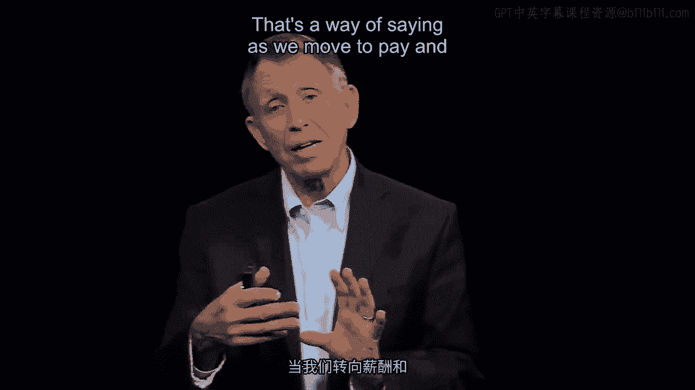

# 沃顿商学院《商务基础》｜Business Foundations Specialization｜（中英字幕） - P97：20_绩效支付与晋升.zh_en - GPT中英字幕课程资源 - BV1R34y1c74c

Organizational design， if we want performance， we want to reward people for performance。

If we want performance in our organizational design， we want promotion， not just pay to。

go with the performance that we're expecting。 And arguably the pay and promotion policies at this company。

glass ceiling， that 10% quota。

were not the kind of design elements that led to optimal action on behalf of this Florida。

sales team for the company as a whole。 With that being said， we now run into a new problem。

something we also have to manage。 And to get to the problem。

I'm going to have you all think for a moment， even if you've。

ever never seen a national basketball association game， I'm going to have you think about what。

happens on a floor of the NBA or maybe a college or high school team that you've seen。

But let's focus on the National Basketball Association and the fact that now focusing。

on pay and not promotion for performance， that NBA players are relatively， we would all say。

well compensated。 In recent years， a floor has been $500，000。 If you're in uniform。

you never see playing time， but you're there at the bench。

Your compensation is half a million dollars a year。

Nobody's going to shed a tear if we say some players are underpaid。

But some players feel underpaid because of a contract they've been locked into or maybe。

an agent that wasn't very good that is now compared to the metrics we would use to appraise。

their performance， the metric an NBA player would use to perform his own performance。

Think about the women's league as well。

The underpaid quote， underpaid players are looking at other players， say on the team， or elsewhere。

and they're paid quite a bit more。 But the key statistics points scored。

Questions taken， assists provided would say just statistically， look at the numbers， I'm。

underpaid compared to Fred Jones over here who had a better agent。

So here's my question with that felt sense of inequity。 And by felt。

I mean we look at others that we respect to maybe compare ourselves to and。

not a whole lot of other possibilities like your average person out there like myself。

when it comes to knowing if you're under or even overpaid for that matter。

Question。 Let's think now about behavior。 The topic here is how organizational architecture can drive behavior or misdirect it。

If you're an underpaid NBA player and you get on the court， what are you going to do。

that's maybe a little bit different from the NBA player whose statistics from the last。

season map pretty well into the pay for this season。 My guess is you're thinking in some cases， oh。

the player who is underpaid is going to。

get out there and want to show certainly the team management， the people upstairs that。

they're actually worth more than they're getting paid。 Others might think。

and it's a completely legitimate argument as well， I kind of drawn， to them both。 Look。

if they're going to underpay me， I'm going to underperform。

So if I'm not getting paid what I'm able to do， I'm going to do less。 Either way that goes。

we got a problem。 The evidence， this one of those nice research questions where the answer is not necessarily。

easy to forecast， the evidence goes this way that， quote， underpaid NBA players on the court。

do tend， statistically speaking， to want to prove to the team management that they are。

worthy of better compensation。 How do they do that？ They take the ball more often。

They shoot more frequently。 Unfortunately， because they've taken the ball more often than statistically might be appropriate。

they shoot more often for the same reason with that same downside， they shave about a point。

off the team score in a given game that costs the team about a point。

That's the way of saying， as we move to pay and promotion as a design feature of the organization。

that we run， we want people， regardless of background， gender， racial identity， anything。

you can think of that doesn't relate directly to performance。 Once we move in that direction。

lots of evidence says it's a great way to go。 Companies all over the world are moving in that direction as well。

We open up a kind of Pandora's box of the demotivation that can come within equity。

Just to now reflect on the fact that this is a two-sided problem in the NBA， it has one， side。

a wonderful study that looked at what happened temporarily when insurance underwriters。

at a specific company had to move out of their offices， which were allocated according to。

their performance and seniority into temporary offices while their original offices were。

being remodeled。 It's that simple as a rationale for what's happening。

Some of those underwriters ended up in a very big office。 They had to go somewhere。

Some ended up in a very small office。 Then the question was， over time。

do the underwriters change their underwriting？ Do they become more or less successful？

An amazing product。 You can see it right in front of you right there of the inequity in the positive sense。

or in a negative sense。 Those who are suddenly over-rewarded start performing better。

Those who are under-rewarded start performing less well。

My guess is most people never thought about that， never said anything about I'm going。

to just hold back or I'm going to be really good because I got a large office。

Going back to behavioral psychology， behavioral economics and Daniel Kahneman and his great。

book that sums a lot of this up， one more example of how we need to be in our organizational。

design mindful of the shortcomings and the assets on the positive side of how people will。

behave according to our pay for performance， promotion for performance， or in this case。

literally the size of the office。 [BLANK_AUDIO]。

