# 沃顿商学院《商务基础》课程 P1：营销101 - 建立强大品牌（一）📚

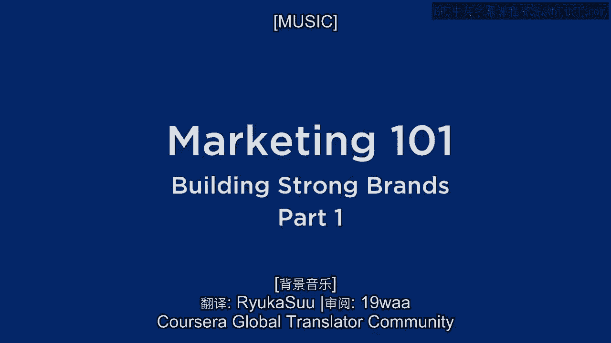

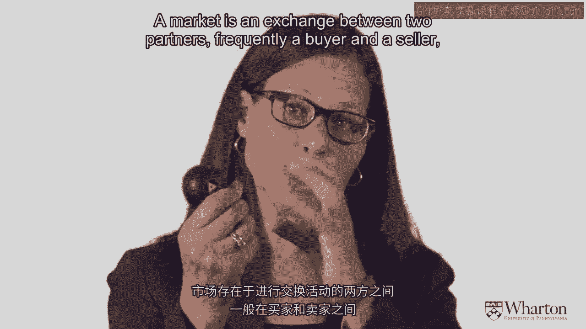

在本节课中，我们将学习市场营销的基础概念，特别是如何建立强大的品牌。我们将从理解“什么是市场营销”这个基本问题开始，并探讨在不同市场环境下营销策略的演变。

---

## 什么是市场营销？🤔

市场营销是对市场的研究。那么，什么是市场？市场是**两个合作伙伴之间的交换**，通常是买方和卖方。但市场营销也适用于非营利组织或不一定涉及金钱交易的场景。市场存在的核心是**交换**。

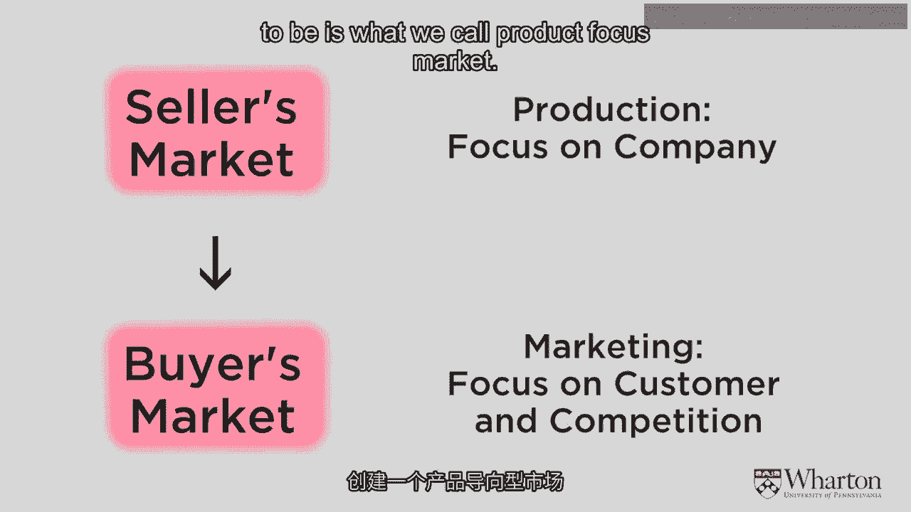

市场营销的含义会随着交换的不同方面而变化。让我们来看一个基本的交换模型：一个买方和一个卖方。为了说明问题，我们将采用一个简化的视角，现实中的市场要复杂得多，但简化有助于我们理解。

---

## 卖方市场 vs. 买方市场 ⚖️

在买方和卖方的交换中，存在两种极端情况，现实市场通常介于两者之间。

### 卖方市场

在**卖方市场**中，卖方拥有产品。如果你想要这个产品，你必须去找卖方。因此，卖方拥有所有权力。

**在卖方市场中，营销往往是产品导向的。** 你拥有产品，如果顾客想要，他们会来找你。在这种情况下，你应该尽最大能力开发产品、进行创新并降低成本。你的商业目标是**尽可能多地销售**。

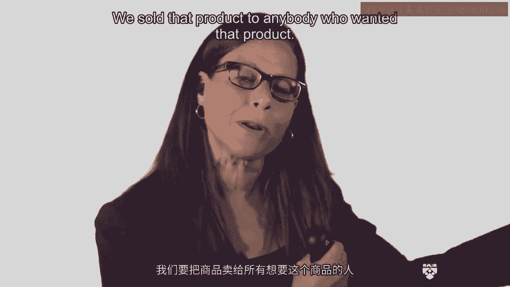

在卖方市场中，盈利能力来自**销量**。研究表明，盈利能力与**市场份额**挂钩。公式可以表示为：

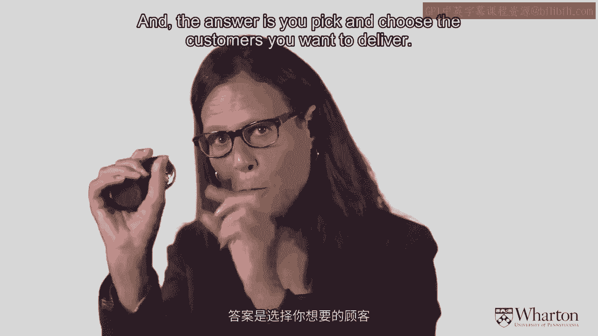

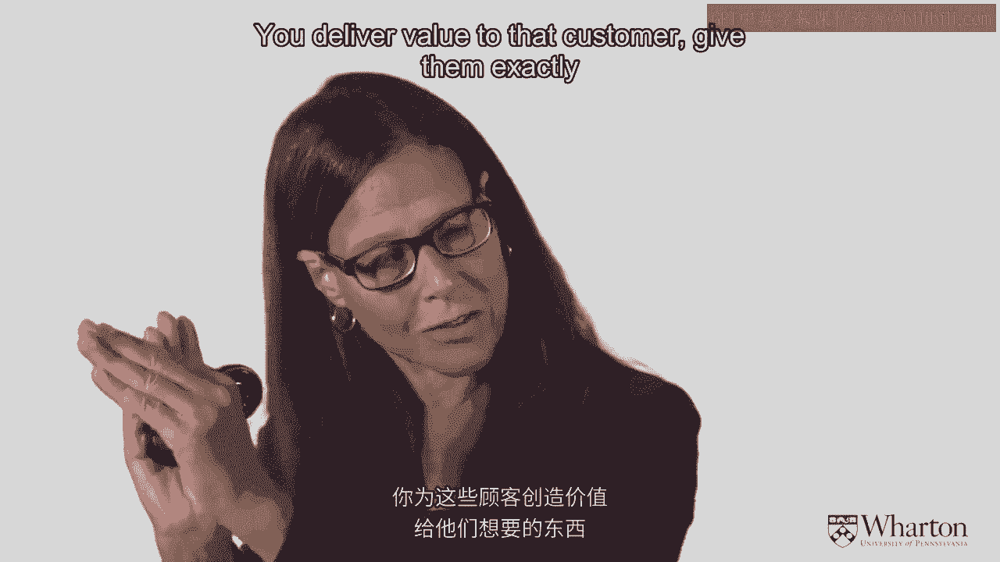

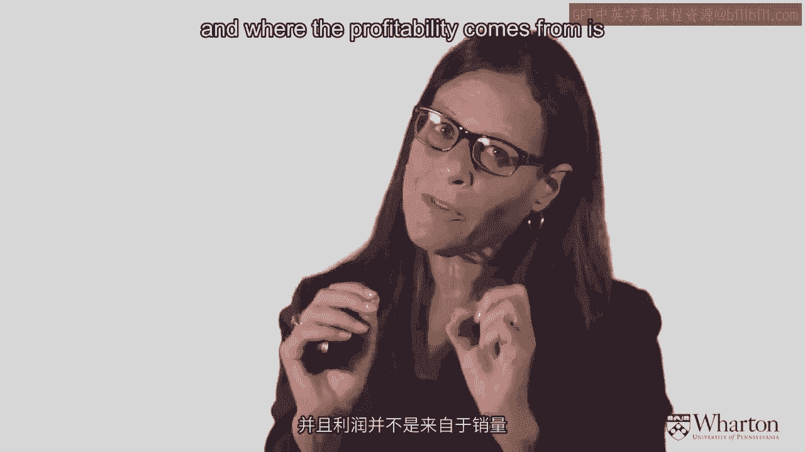

**利润 = (价格 - 成本) × 销量**

市场份额越大，收入越高；销量越大，单位产品成本越低，从而利润越高。产品导向型市场的增长来自基于产品经验开发新产品或进入新市场。

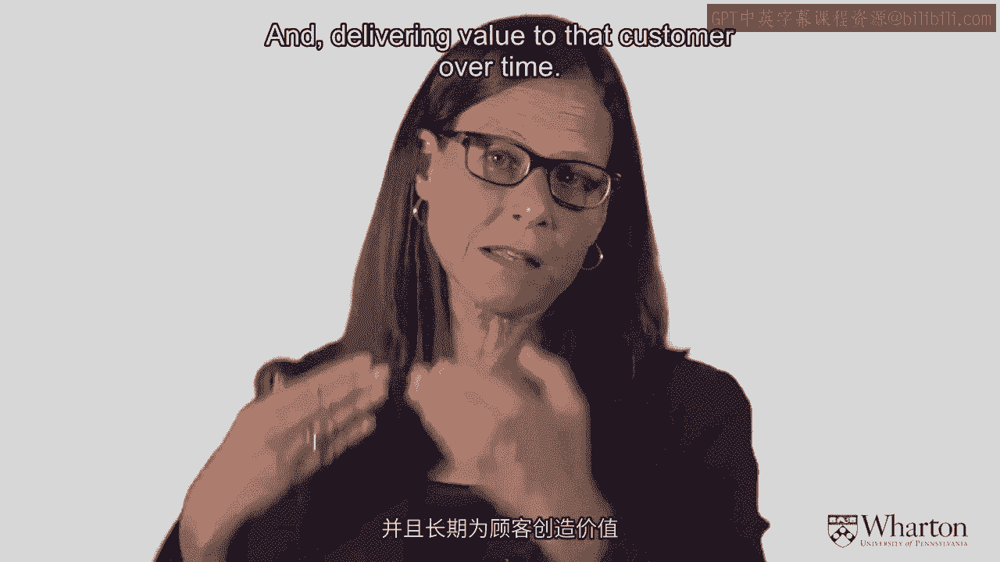

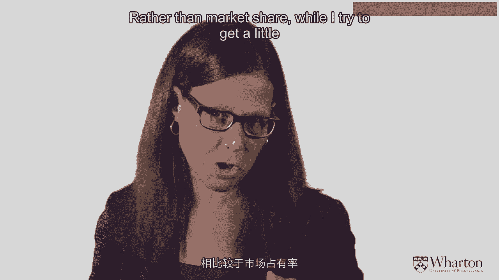

### 买方市场

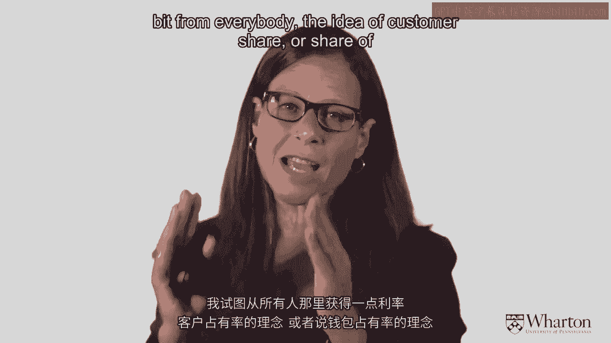

与卖方市场相反的是**买方市场**。这里存在大量竞争和产品，买方拥有权力。

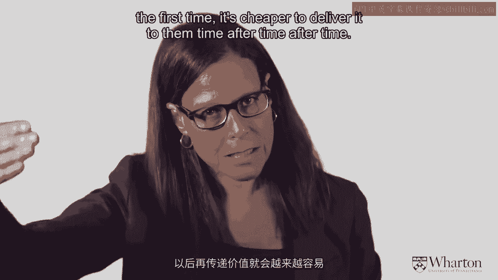

**在买方市场中，营销是客户导向的。** 你需要关注客户，让他们从你这里购买，而不是从竞争对手那里。最好的方法是了解客户想要什么，并提供满足其需求的产品。

这与产品导向的“由内而外”思维不同，客户导向是“由外而内”的思维。然而，你无法满足所有客户的需求。因此，客户导向营销的核心理念是**选择客户**，为一部分客户提供价值，而对另一部分客户说“不”。这个过程就是**市场细分**。

---

## 客户导向营销如何盈利？💰

在客户导向的市场中，我们通过选择目标客户、提供他们想要的价值并让他们愿意为此付费来盈利。盈利来源不是销量，而是**创造价值**。

盈利方式主要有三种：
1.  **溢价**：如果你提供客户真正想要的东西，他们通常愿意支付更高的价格。
2.  **客户忠诚度**：考虑的不是单次交易，而是建立客户忠诚度，长期为客户提供价值。这被称为**客户份额**或**钱包份额**，即从每个客户身上获取更多价值。维护老客户的成本通常低于获取新客户，因此忠诚度能带来利润。
3.  **交叉销售**：不仅向客户销售一种产品，还围绕其需求销售其他相关产品。例如，在服装店买牛仔裤时，店员可能会推荐腰带或袜子。

因此，在客户导向市场中，盈利来自**溢价、客户忠诚度和交叉销售**。

---

## 当今市场的变化 🌐

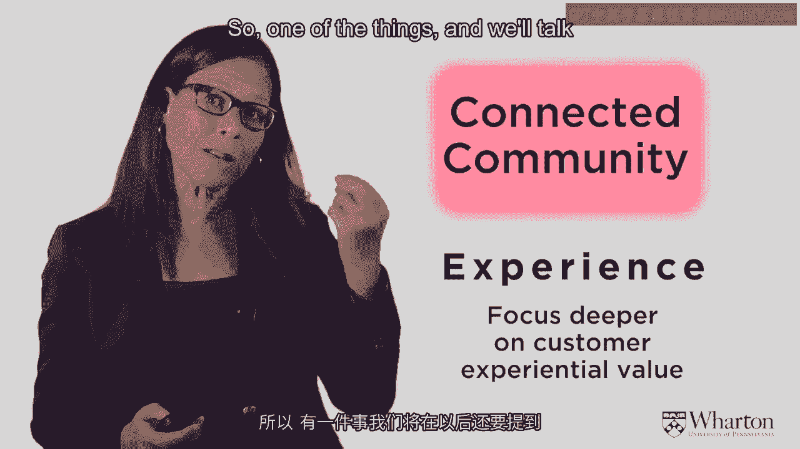

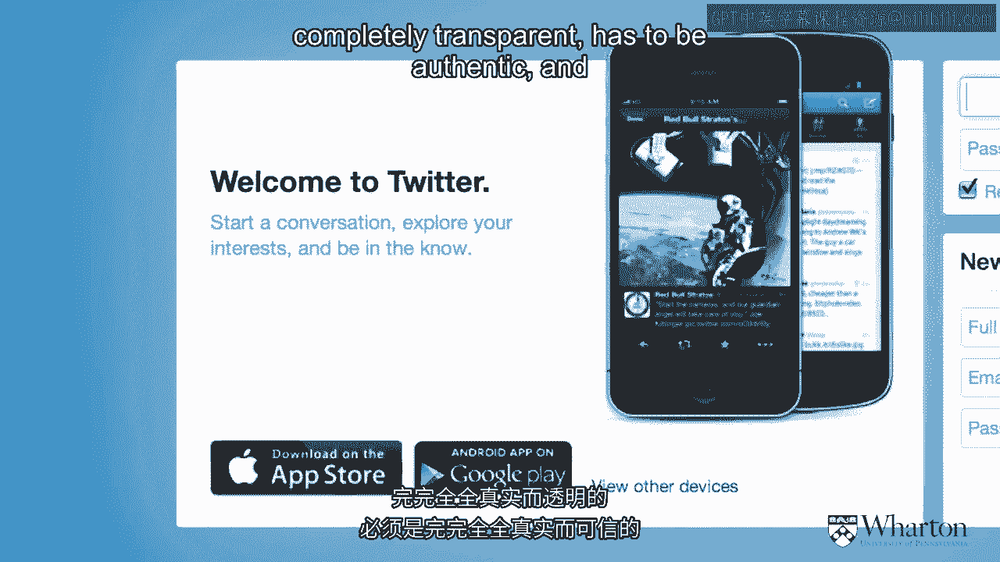

如今，市场环境发生了进一步变化。由于全球化、互联网、技术和社交媒体，交换不再是简单的“一对一”对话。客户之间可以相互交流，这既是好事也是坏事。

*   **正面**：如果你做得好，客户会向朋友推荐，形成口碑。
*   **负面**：如果出现问题，负面消息也会迅速传播。

因此，企业现在不仅需要提供价值，还必须提供**卓越的客户体验**。客户体验涵盖交易前、交易中和交易后的全过程。在互联社区中，营销者必须**完全透明、真实可信，并关注整个客户体验**。

此外，经历了经济衰退和不确定性后，客户对营销的信任度下降。现在的营销必须专注于**真实、真诚的客户价值**，同时以**有纪律且灵活的方式控制成本**，以应对市场变化。

---

## 总结 📝

本节课我们一起学习了市场营销的不同导向：

1.  **产品导向**：专注于产品，说服客户接受公司已有的东西。盈利关键：**市场份额**和**成本控制**。
2.  **营销（客户）导向**：专注于客户，说服公司提供客户想要的东西。盈利关键：**客户份额（钱包份额）**、**忠诚度**和**交叉销售**。
3.  **体验导向**：管理客户与公司的整体体验。衡量关键：**社交网络口碑**和**推荐**。
4.  **信任导向**：在经济不确定时期，建立基于**真实性、信任和纪律**的关系。盈利关键：**成本控制**和**长期信任**。

每种导向都有不同的产品策略、竞争优势和盈利衡量方式。理解这些基础是建立强大品牌的第一步。在接下来的课程中，我们将深入探讨市场细分等具体策略。