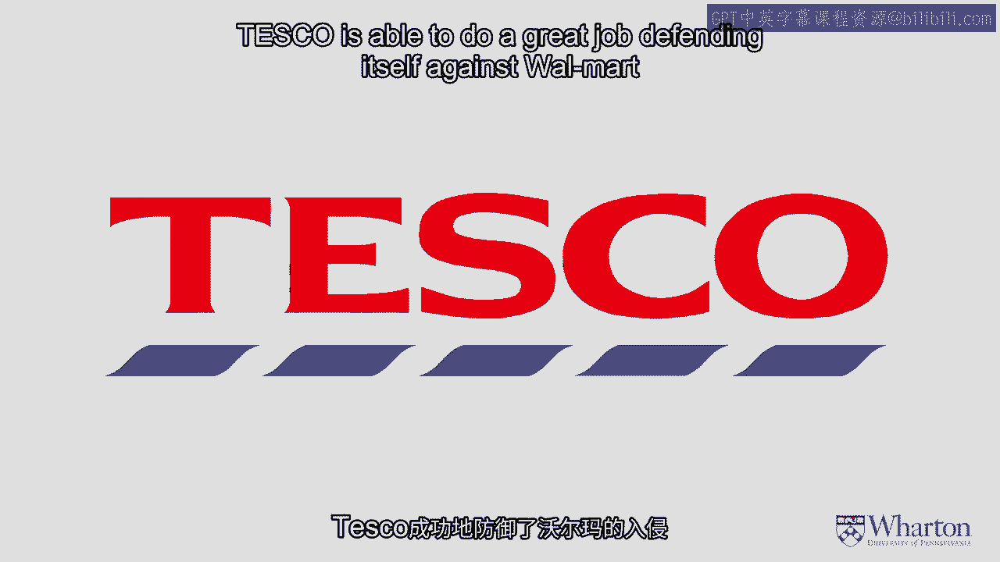
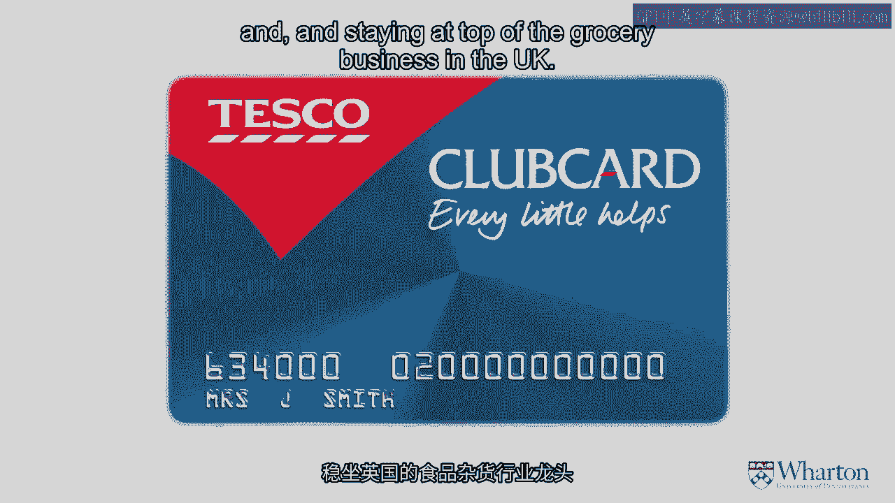

# 📊 沃顿商学院《商务基础》｜第10课：数据驱动的商业模式

在本节课中，我们将学习企业如何利用客户数据来构建独特的商业模式，从而在激烈的市场竞争中脱颖而出。我们将通过两个具体案例——美国的哈拉斯赌场和英国的乐购超市——来深入探讨这一主题。

---

## 🎰 案例一：哈拉斯赌场

上一节我们介绍了数据在商业模式中的重要性，本节中我们来看看哈拉斯赌场是如何运用这一策略的。

哈拉斯是美国的一家赌场连锁企业，曾面临资金更雄厚、资源更丰富的竞争对手的激烈竞争。在传统以产品为中心的竞争方式中，哈拉斯难以直接抗衡。因此，哈拉斯转向了数据，特别是通过开发一个卓越的忠诚度计划来深入理解客户。

以下是哈拉斯数据策略的核心要点：

*   **精细化的客户洞察**：哈拉斯不仅追踪客户玩什么游戏，还记录他们的餐饮偏好、房间选择以及娱乐活动。这使他们能够从微观层面理解每位客户的行为。
*   **行为干预时机**：哈拉斯能够判断客户何时可能改变行为（例如准备离开赌桌），并据此在**恰当时机**通过**合适渠道**提供信息或优惠，以改变客户行为，创造更多价值。
*   **心理账户重置**：例如，当客户输掉约150美元时，哈拉斯会适时提供一顿餐食或其他活动。这不仅提升了客户体验，更重要的是**重置了客户的心理账户**，使其再次坐下时，心理阈值回归零点附近。

通过深刻理解客户数据并采取精准行动，哈拉斯成功提升了客户价值，在行业中脱颖而出。

---

## 🛒 案例二：乐购超市

了解了哈拉斯的案例后，我们再来看看英国零售商乐购是如何运用类似策略的。

乐购在英国市场与森宝利、莫里森等大型连锁超市竞争激烈。与哈拉斯类似，乐购也转向数据，开发了忠诚度计划，并以巧妙的方式理解客户。

以下是乐购数据应用的关键方法：

*   **家庭消费模式分析**：乐购分析哪些家庭大部分购物在乐购完成，哪些不是。更重要的是，他们识别出“轻度消费家庭”具体未在乐购购买哪些产品。
*   **精准营销**：基于以上分析，乐购知道在**何时**向**何种家庭**发送**何种优惠券**，以刺激他们购买更多商品。这不仅能促进业务增长，也提升了竞争力。
*   **防御性竞争策略**：当沃尔玛通过收购进入英国市场时，乐购利用数据识别出哪些客户最有可能转向沃尔玛，以及他们可能购买哪些产品。乐购再次运用精准优惠券策略，成功**留住这些客户**，巩固了自身业务。

通过对客户的深入理解，乐购有效抵御了沃尔玛的竞争，保持了在英国杂货零售市场的领先地位。

---

## 💎 课程总结

本节课中，我们一起学习了数据如何驱动商业模式创新。通过哈拉斯和乐购的案例，我们看到企业除了提供优质产品和服务外，还可以**深度依赖数据**和**对客户的丰富理解**，来调整其商业模式。这种基于数据的策略使企业能够实现仅靠产品和服务无法达成的竞争优势与市场地位。