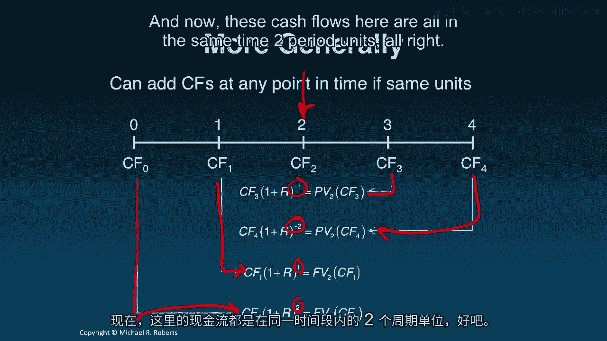

# 沃顿商学院《商务基础》课程｜第103讲：复利 📈

在本节课中，我们将学习如何将现金流**向前推移**至未来，这个过程被称为**复利**。我们将使用时间线和折现因子等工具，并通过具体示例来掌握计算未来价值的方法。

---

上一节我们介绍了货币的时间价值，并学习了如何通过**折现**将未来的现金流移回当前。本节中，我们来看看相反的过程——**复利**，即如何将现金流向前推移至未来。

## 复利的概念与工具

复利是指将现金流向前推移至未来某个时间点的过程。我们继续使用**时间线**作为可视化工具，并借助**折现因子**作为“汇率”来转换货币的时间单位。

要将一个现金流向前移动，我们将其乘以折现因子，并赋予一个**正指数**。指数的大小代表需要向前移动的期数。

**公式**：`FV_t(CF_n) = CF_n × (1 + r)^(t-n)`
其中：
- `FV_t(CF_n)` 表示第 `n` 期的现金流在第 `t` 期的**未来价值**。
- `r` 是每期利率。
- `(t-n)` 是正指数，代表向前移动的期数。

将所有现金流都复利到同一时间点后，它们就具有了相同的时间单位，此时便可以相加。

## 复利计算示例

以下是两个具体的计算示例，帮助理解复利的过程。

### 示例一：单笔投资

**问题**：如果今天将1000美元存入一个年利率为3.5%的储蓄账户，3年后我将拥有多少钱？

**解答**：
1.  建立时间线：今天（第0期）投入1000美元。
2.  目标是将这笔现金流向前复利3年，至第3期。
3.  应用公式：`FV_3 = $1,000 × (1 + 0.035)^3`
4.  计算得出：`$1,000 × 1.108717875 = $1,108.72`

因此，3年后这笔投资的价值为**1,108.72美元**。这也就是第0期1000美元现金流在第3期的未来价值。

### 示例二：系列存款

**问题**：如果我们从今天开始，每年存入100美元，连续存3年，年利率为5%，那么4年后我们总共将拥有多少钱？

**解答**：
1.  建立时间线：在第0、1、2期分别存入100美元。
2.  目标是将这三笔现金流全部复利到第4期。
    - 第0期的100美元需向前移动4期：`$100 × (1.05)^4`
    - 第1期的100美元需向前移动3期：`$100 × (1.05)^3`
    - 第2期的100美元需向前移动2期：`$100 × (1.05)^2`
3.  计算各笔现金流的未来价值：
    - `$100 × 1.21550625 = $121.55`
    - `$100 × 1.157625 = $115.76`
    - `$100 × 1.1025 = $110.25`
    - （注：第3期无新存款，但之前的存款会继续生息）
4.  由于所有价值都已转换到第4期的时间单位，因此可以相加：`$121.55 + $115.76 + $110.25 = $347.56`

因此，4年后总共将拥有**347.56美元**。这个过程模拟了每笔存款在账户中逐年赚取利息并累加的情景。

## 时间点的灵活性

需要强调的是，我们可以将现金流复利到时间线上的**任意一点**，而不仅仅是终点。关键在于将所有现金流都转换到**同一个时间点**，无论是通过折现向后移，还是通过复利向前移。只要时间单位统一，这些现金流就可以进行加总或比较。

---

本节课中我们一起学习了**复利**。我们了解到，复利是使用折现因子并赋予**正指数**，将现金流**向前推移**至未来某个时间点的过程，得到的结果称为**未来价值**。核心在于确保所有现金流在比较或加总前，都处于相同的时间单位下。

在接下来的课程中，我们将探讨一些计算常见现金流序列（如年金）现值和未来价值的实用捷径。