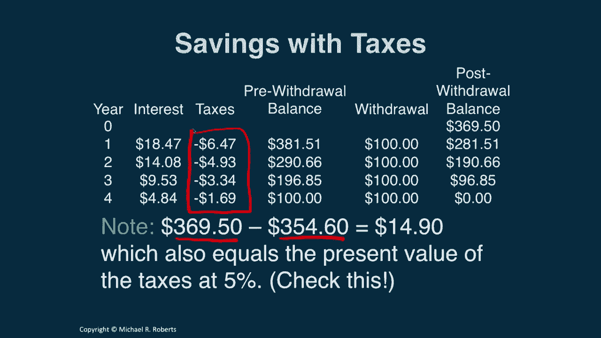

# 沃顿商学院《商务基础》｜第105课：税收的影响 📊

在本节课中，我们将学习税收如何影响我们的投资回报。我们将通过具体例子，理解税前与税后收益率的区别，并学习如何计算税后收益率，以便更准确地评估投资价值。

上一节我们介绍了计算现金流现值的几种快捷方法，例如永续年金和年金。本节中，我们来看看一个影响所有现金流分析的重要因素：税收。

## 税收的重要性 📈

首先，我们需要认识到税收的普遍性和多变性。下图展示了不同收入来源（股息、资本利得、利息收入）的最高法定税率历史变化。

从图中可以看出两个关键点：
1.  税率随时间波动巨大。
2.  历史上税率曾达到非常高的水平。

尽管不清楚90%-95%的极端税率实际适用于多少人，但税收是实质性的，且经常变动。因此，理解税收如何影响我们的投资收入至关重要。

## 一个具体的例子：储蓄与取款 💰

为了说明税收的影响，我们回顾一个在折现课程中讨论过的例子。

**问题**：如果你每年能获得5%的收益，为了在未来四年每年末取出100美元，你今天需要存入多少钱？

**不考虑税收的解法**：
我们首先列出时间线，现金流是未来四年每年末的100美元。我们需要计算这些现金流的现值。

计算过程是将每笔100美元按5%的折现率折现到今天（第0期）：
*   第一年：`100 / (1 + 0.05)^1 ≈ 95.24`
*   第二年：`100 / (1 + 0.05)^2 ≈ 90.70`
*   第三年：`100 / (1 + 0.05)^3 ≈ 86.38`
*   第四年：`100 / (1 + 0.05)^4 ≈ 82.27`

将这些现值相加，我们得到答案：**354.60美元**。这意味着今天存入354.60美元，按5%计息，可以在不动用本金的情况下，每年取出100美元，四年后账户余额为零。

**考虑税收的影响**：
现在，假设我们需要为利息收入缴纳35%的税（接近当前最高法定税率）。如果我们依然只存入354.60美元，流程将发生变化。

以下是第一年的情况：
1.  年初存入：354.60美元
2.  按5%获得利息：`354.60 * 0.05 = 17.73美元`
3.  为利息收入缴税（35%）：`17.73 * 0.35 = 6.21美元`
4.  缴税后，取款前余额：`354.60 + 17.73 - 6.21 = 366.12美元`
5.  取出100美元。
6.  第一年末余额：266.12美元。

继续这个过程，我们会发现，由于税收消耗了部分收益，在第四年我们无法取出完整的100美元，只能取出约83.06美元，总共短缺16.94美元。**税收减少了我们投资的实际美元回报**。

## 税后收益率 🧮

解决这个问题的一种方法是使用**税后收益率**进行折现计算。

税后收益率（`R_t`）的计算公式为：
`R_t = R * (1 - T)`
其中：
*   `R` 是税前收益率（本例中为5%）
*   `T` 是税率（本例中为35%）

代入计算：
`R_t = 0.05 * (1 - 0.35) = 0.0325`，即 **3.25%**。

现在，我们用3.25%的税后折现率重新计算最初的问题：为了每年税后取出100美元，今天需要存多少钱？

计算过程如下：
*   第一年：`100 / (1 + 0.0325)^1 ≈ 96.85`
*   第二年：`100 / (1 + 0.0325)^2 ≈ 93.85`
*   第三年：`100 / (1 + 0.0325)^3 ≈ 90.92`
*   第四年：`100 / (1 + 0.0325)^4 ≈ 88.07`

将这些现值相加，我们得到新的答案：**369.50美元**。这个数字比不考虑税收时的354.60美元要多。

验证这个结果：如果我们今天存入369.50美元，每年按5%获得利息并缴纳35%的税，然后每年取出100美元，四年后账户余额恰好为零。这说明，为了获得相同的税后现金流，我们需要投入更多的初始资金。

此外，初始储蓄的差额（`369.50 - 354.60 = 14.90美元`）正好等于以5%折现的税收支出的现值。

## 总结与展望 📝

本节课中我们一起学习了：
1.  **税收会减少投资的美元回报**。税后回报低于税前回报。
2.  税后回报率可以通过公式 **`R_t = R * (1 - T)`** 计算。
3.  在进行涉及个人税后收入的财务决策（如储蓄计划）时，应使用税后收益率进行折现计算，才能得到准确的结果。
4.  鉴于美国、欧洲等多国税率显著，税收对现金流、储蓄行为和最终决策具有巨大影响。

接下来，我们将探讨另一个影响货币时间价值的关键因素：通货膨胀。我们将研究通货膨胀如何影响我们的现金流和决策过程。

期待在下一节课与你相见。