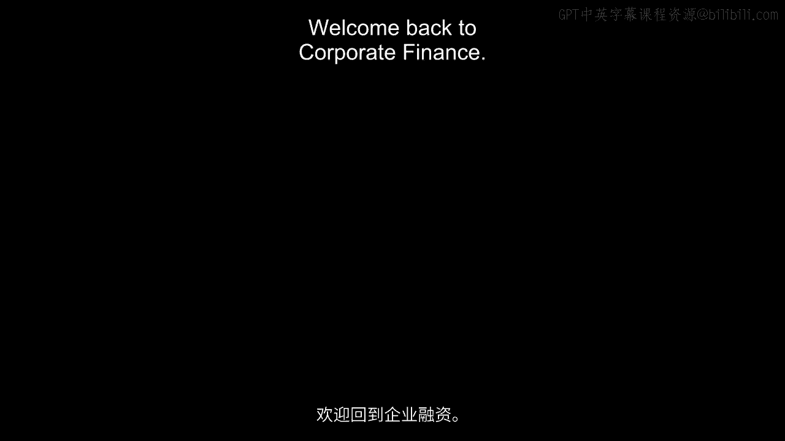
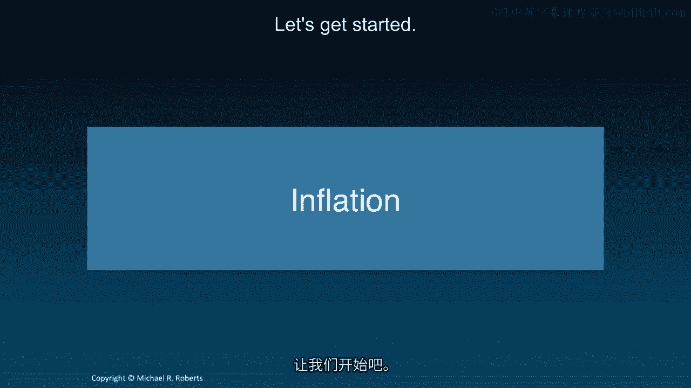
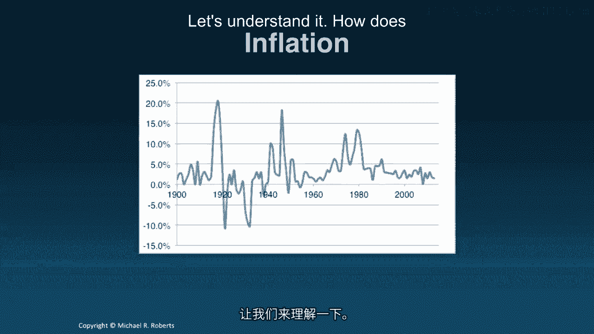
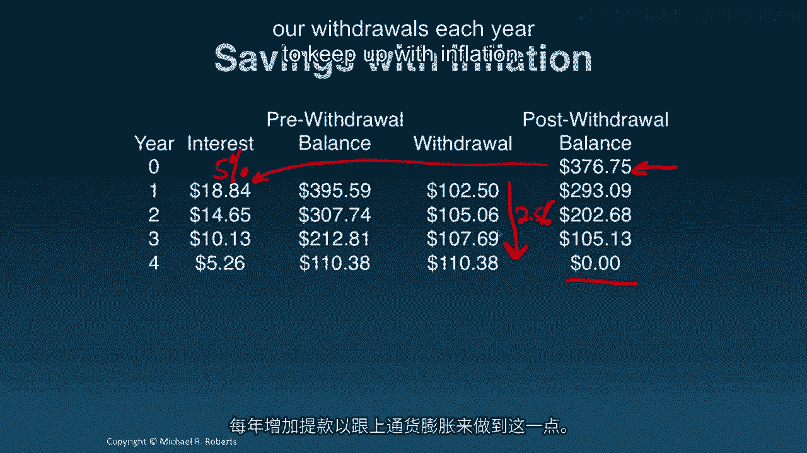
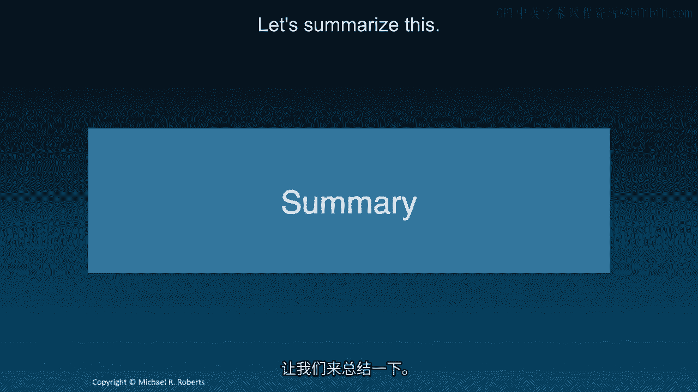

# 沃顿商学院《商务基础》课程 P106：通货膨胀 📈

在本节课中，我们将学习通货膨胀如何影响投资的实际回报和消费能力。我们将介绍名义利率与实际利率的区别，并通过具体示例展示如何计算和调整现金流以应对通货膨胀的影响。

---

上一节我们讨论了税收对资本成本和美元回报的影响。本节中，我们来看看通货膨胀如何影响我们的实际回报或消费能力。

这张图表展示了美国过去约110年的通货膨胀情况。从中可以看出两点：首先，在近期，通货膨胀率相对较低。但回顾过去30年之前，可以看到存在高通胀甚至通货紧缩的时期。因此，虽然目前通货膨胀似乎不那么重要，但它确实可能产生影响。如果我们观察美国和一些西欧国家以外的地区，通货膨胀就变得极其重要。所以，我们需要理解它。

通货膨胀具体如何影响我们的回报呢？

让我们回顾一下前几讲用过的例子。这个例子是：如果我们想在接下来的四年里每年提取100美元，那么我们需要在一个年利率为5%的账户中存入多少钱？答案是354.60美元。我们存入354.60美元，它以5%的利率赚取利息，增加我们的余额。我们提取资金，减少余额，并在接下来的三年里重复这个过程，直到账户余额降为零。

第一个要点是：通货膨胀不会影响我们赚取的钱。它不会影响这里的利息。我们每年仍然会获得5%的名义回报率。通货膨胀影响的是我们用提取出来的钱能买到什么。它会影响这些货币的价值。因此，我们需要一种方法来量化和理解通货膨胀对这种价值的影响。

我将引入**实际贴现率**的概念，用 **R_R** 表示。其计算公式为：

**公式：**
`(1 + R_R) = (1 + R) / (1 + π)`

其中，**R** 是名义贴现率，**π** 是预期通货膨胀率。

一个常用的近似公式是：
**公式：**
`R_R ≈ R - π`

在我们的例子中，贴现率是5%，如果预期通货膨胀率是2.5%（接近美国近期的历史水平），那么我们的投资实际回报率就是2.44%，显著更低。

这一点很重要，因为即使通货膨胀不影响我们的账户余额（即我们有多少美元），它也确实影响着我们用这些钱能做什么、能买什么。而这正是我们最终关心的。

现在，让我们尝试用刚刚计算出的实际回报率 **R_R**（2.44%）来贴现我们的现金流。贴现过程在机械上与之前完全相同，只是现在使用的是实际利率而非名义利率。经过一些算术计算，我们得到所有这些未来现金流的现值，将它们相加，得到的总值是376.75美元。

税收影响美元，但通货膨胀不影响美元，它影响消费。我们赚取的是名义回报，但能用它买到的东西变少了。

让我来说明这一点。让我们将刚刚使用实际贴现率计算出的376.75美元存入我们的储蓄账户，看看每年提取100美元会发生什么。这笔钱每年仍会以5%的利率赚取利息。我们提取100美元后，会发现账户有盈余。这是合理的，因为通货膨胀不影响美元，它影响的是我们用提取出来的钱能做什么。我们这里有额外的钱，所以为了应对通货膨胀，我们真正需要做的是增加每年提取的金额。我不想每年只提取100美元，因为物价在上涨，比如在第二年，100美元能买到的食物、住房、衣服或其他我们需要的东西就变少了。

因此，让我们思考一下，为了应对通货膨胀，我们可能需要什么样的现金流序列。一种方法是，在给定名义贴现率 **R** 为5%的情况下，直接求解我们每年希望提取的现金流 **CF**。我们可以解这个方程，这只是基础代数。这里我们使用名义利率，因为它反映了我们赚取的美元。

求解 **CF**，我们得到106.25美元，这比100美元多。这是合理的，因为我们一开始存入了更多钱。让我们看看现在会发生什么。我们存入376.75美元，现在每年提取106.25美元，我们会看到账户余额正好在四年后归零。

但理想情况下，我们希望每年的提取额都能增加，以适应通货膨胀，对吗？我希望这些提取额每年都增加，以应对我打算用这些钱购买的商品和服务的价格上涨。

让我们思考一下。如果物价每年上涨2.5%，这意味着我今天用100美元能买到的东西，明年就需要102.5美元，因为价格上涨了2.5%。价格会再次上涨2.5%，所以我每年需要的钱会越来越多。

以下是为了维持我们的购买力而设计的提取额序列：

*   第1年：100.00美元
*   第2年：102.50美元
*   第3年：105.06美元
*   第4年：107.69美元

假设所有价格都以2.5%（预期通货膨胀率）的速度上涨，我们将能够购买相同数量的食物、住房，进行相同的度假。这些都是名义值，对应着100美元的实际购买力。

如果我们以名义贴现率对这些名义美元进行现值计算，我们得到376.75美元。**名义现金流按名义贴现率贴现**。请记住这一点，强调这一点很重要。**名义现金流按名义贴现率的现值，等于实际现金流按实际利率的现值**。回想一下，当我们每年提取100美元，但用实际回报率（2.44%）贴现时，我们得到了376.75美元。实际计算中分子和分母的通货膨胀项相互抵消了。

让我们回到储蓄账户。我们存入376.75美元，现在我们将提取每年以2.5%速度增长的资金以跟上通货膨胀。但我们账户中的钱赚取的是5%的名义回报率。结果是，我们在四年结束时正好用尽资金，并且能够通过每年增加提取额来跟上通货膨胀。

让我们总结一下。通货膨胀不影响美元回报。它不影响银行账户里的钱或其增长速率。它影响的是这些货币的购买力。因此，当我取出钱去买东西时，在通货膨胀的情况下，年复一年，用同样的美元能买到的商品或服务会越来越少。我们引入了**实际回报率**的概念来考虑通货膨胀的影响。

---

本节课中，我们一起学习了通货膨胀的核心概念及其对投资决策的影响。我们明确了名义利率与实际利率的区别，掌握了其换算公式 `(1 + R_R) = (1 + R) / (1 + π)`。通过示例，我们了解到为了维持购买力，需要调整现金流（使其增长）或使用正确的利率（名义现金流用名义利率贴现，实际现金流用实际利率贴现）进行估值。下次课，我们将转向新的主题——利率，并基于已学知识，学习如何对非定期、时间不规则的现金流进行贴现和估值，以及如何处理不同于我们一直默认使用的按年复利的不同复利周期。期待下次与您相见。谢谢。