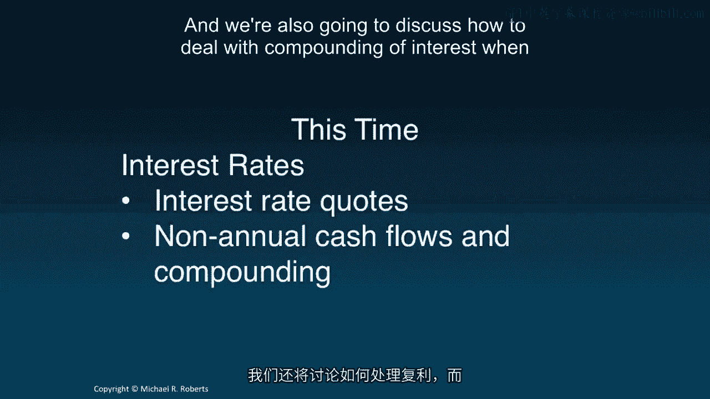
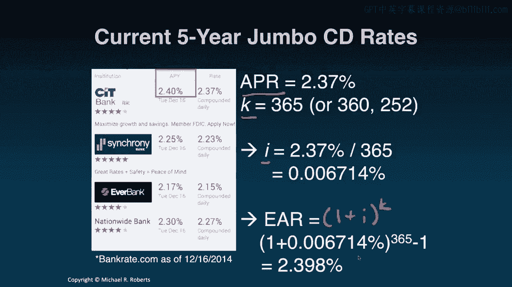

# 沃顿商学院《商务基础》｜Business Foundations Specialization｜ 课程笔记 P107：5_APR 和 EAR 📊

在本节课中，我们将学习利率的报价惯例，特别是年利率（APR）和有效年利率（EAR）的区别与联系。我们将了解如何计算非年度复利情况下的现值和终值，并掌握在不同时间单位下进行计算的技巧。

---

欢迎回到《公司金融》课程。今天我们将转向一个新的话题——利率。但在开始之前，我们先简要回顾一下上一个主题：货币的时间价值。

回顾上一讲，我们首先通过一些直觉引入了货币时间价值的概念。我们指出，在不同时间点收到或支付的现金具有不同的“时间单位”，因此不能直接相加，就像不同货币不能直接相加一样。

接着，我们介绍了与货币时间价值相关的工具：**时间线**（用于可视化现金流发生的时间点）和**贴现因子**（作为跨时间交换现金的“汇率”）。我们利用这些工具，通过**贴现**将现金流向后移动（计算现值），通过**复利**将现金流向前移动（计算终值）。

我们还学习了一些有用的快捷计算公式，例如**年金现值公式**和**永续年金现值公式**，以及增长型年金和永续年金的公式。最后，我们讨论了**税收**和**通货膨胀**如何影响我们的美元回报及其购买力。

现在，让我们转向利率这个话题。这并非一个全新的主题，而是对货币时间价值概念的延伸，旨在纳入更多现实中的制度细节。我们将讨论利率报价，学习如何处理非年度（如月度、半年度）发生的现金流，以及如何处理非年度复利的情况。

那么，让我们开始吧。

---

## 利率报价惯例：APR 与 EAR

首先，我们来看一张2014年12月五年期大额存单（CD）的利率截图。CD是银行提供的一种储蓄工具，“大额”通常指最低存款额为10万美元。

观察这些利率时，你会发现每个产品都有两个不同的利率：一个叫“Rate”（利率），另一个叫“APY”（年收益率）。例如，2.37%和2.4%是不同的。这就引出了几个问题：它们为什么不同？它们之间有何关系？最重要的是，哪个利率能告诉我投资这个产品能赚多少钱？

让我们从“Rate”开始。这个“Rate”指的是**年利率**。它衡量的是**一年内获得的单利**，即**忽略复利**的利息。许多银行使用APR来报价利率。

但问题是，APR通常**不是**我们实际赚取或支付的利率。要了解实际利率，我们需要看**APY**，也就是**有效年利率**。EAR衡量的是**一年内实际赚取或支付的利息总额**，这才是我们真正关心的数字。

简单来说：
*   **EAR** 是**贴现率**，用于计算利息和贴现现金流。
*   **APR** **不是**贴现率，它是一种**报价惯例**。我们需要结合**复利频率**信息，才能从APR推导出EAR或**期间贴现率**。

---

## 从 APR 推导 EAR

那么，如何从APR得到EAR，或者反过来呢？它们之间有一个简单的数学关系。

公式如下：
`EAR = (1 + APR / K)^K - 1`

在这个公式中：
*   **K** 代表**每年复利的次数**。例如，月度复利对应 K=12，半年度复利对应 K=2。
*   **i** 代表**期间利率**（或期间贴现率），其计算公式为：`i = APR / K`

让我们通过一个例子来理解。

---

## 示例计算

假设我们投资100美元于一个提供5% APR、按**半年度复利**的CD。一年后我们将有多少钱？

解决这个问题有两种方法，我们将逐一演示。

**第一步：绘制时间线**
今天（第0期）我们投资100美元。问题是一年后（第1年）我们有多少钱？

**方法一：按“期间”计算**
对于半年度复利，一年有2个期间（每6个月为一个期间）。
*   期间数：2个期间（6个月后为第1期，12个月后为第2期）。
*   期间利率 **i**：`i = APR / K = 5% / 2 = 2.5%`

计算过程：
1.  6个月后（第1期终值）：`$100 * (1 + 2.5%) = $102.50`
2.  12个月后（第2期终值）：`$102.50 * (1 + 2.5%) = $105.0625`

因此，按期间计算的终值公式为：`FV = $100 * (1 + i)^2 = $105.0625`

**方法二：按“年”计算**
我们现在想直接计算一年后的价值，但需要用到年度的贴现率。
*   时间单位：1年。
*   贴现率：我们需要使用**有效年利率**。

根据公式计算 **EAR**：
`EAR = (1 + i)^K - 1 = (1 + 2.5%)^2 - 1 = 5.0625%`

计算终值：
`FV = $100 * (1 + EAR)^1 = $100 * (1 + 5.0625%) = $105.0625`

两种方法得到了完全相同的结果：**105.06美元**。

**核心要点**：
*   如果使用**期间利率**进行贴现或复利，时间必须以**期间**为单位。
*   如果使用**有效年利率**进行贴现或复利，时间必须以**年**为单位。
*   关键在于保持**时间单位**与**贴现率类型**的一致性。

---

## 回到最初的例子

现在，我们可以解答课程开头截图中的问题了。银行A报价：APR = 2.37%，复利频率为每日（假设K=365天）。

计算过程：
1.  计算期间利率 **i**：`i = APR / K = 2.37% / 365 ≈ 0.006493%`
2.  计算有效年利率 **EAR**：`EAR = (1 + i)^K - 1 = (1 + 0.006493%)^365 - 1 ≈ 2.398%`

四舍五入后，EAR约为2.4%，这与截图中的APY（2.40%）基本吻合。

---

## 总结与核心公式

本节课我们一起学习了利率报价的核心知识。

**核心概念总结**：
*   **APR**：报价惯例，表示名义年利率（忽略复利）。公式中作为已知输入。
*   **期间利率**：每个复利期间的实际利率。`i = APR / K`
*   **EAR**：有效年利率，反映资金一年的实际增长。`EAR = (1 + i)^K - 1 = (1 + APR / K)^K - 1`
*   **一致性原则**：使用**期间利率**时，时间单位必须是**期间**；使用**EAR**时，时间单位必须是**年**。

**计算选择**：
你可以根据现金流发生的频率和复利频率，灵活选择在“期间”维度（使用`i`）或在“年”维度（使用`EAR`）进行计算，只要保持单位一致，结果必然相同。

---

接下来，建议你通过一些练习题来巩固对这些概念的理解。完成之后，我们将进入利率主题的第二部分，探讨**利率的期限结构**和**收益率曲线**，了解这些概念的含义。

谢谢学习。