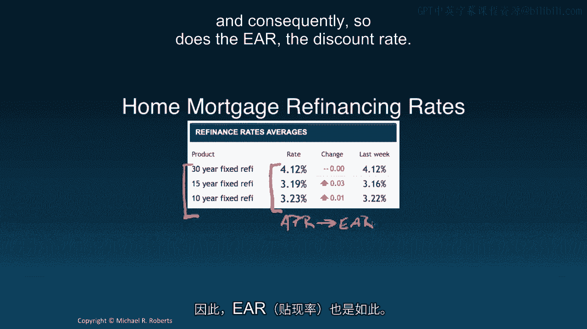
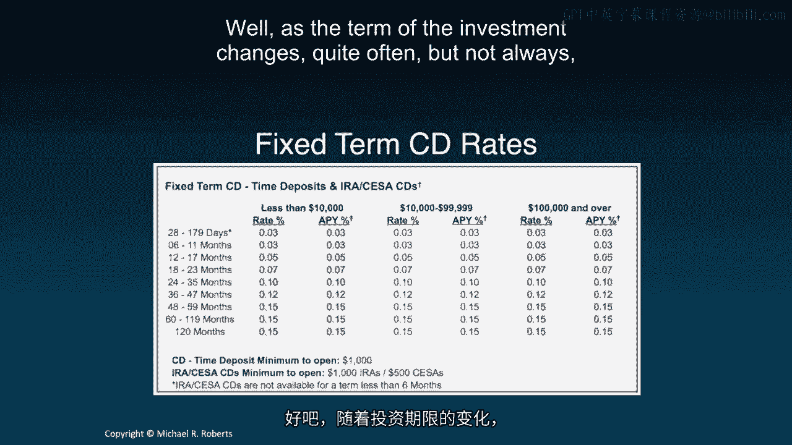
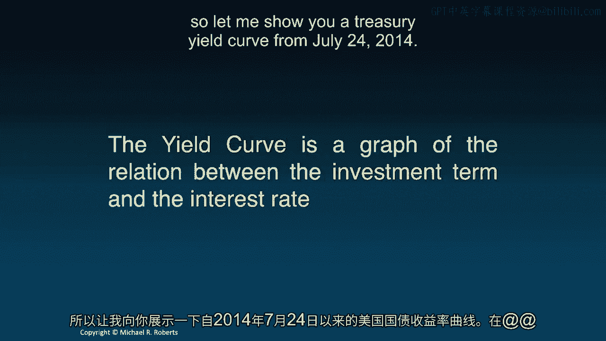
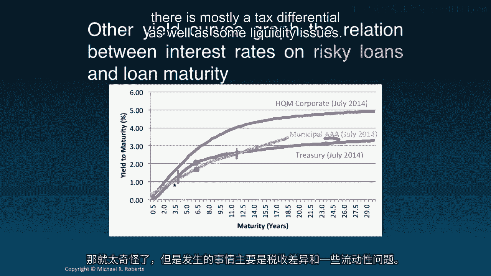
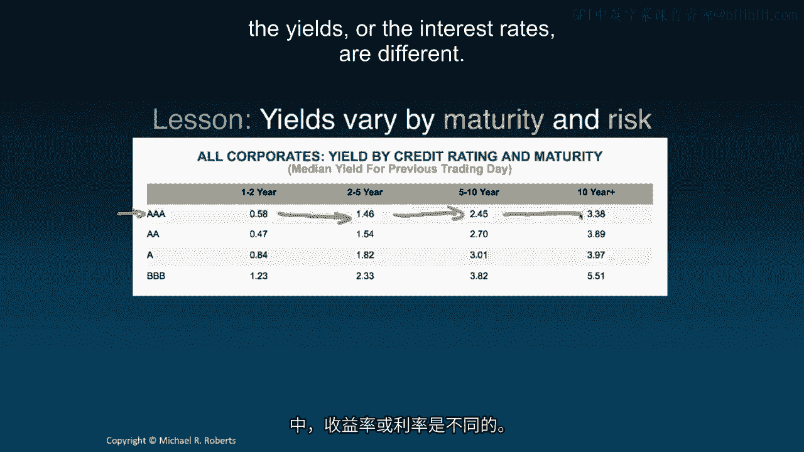
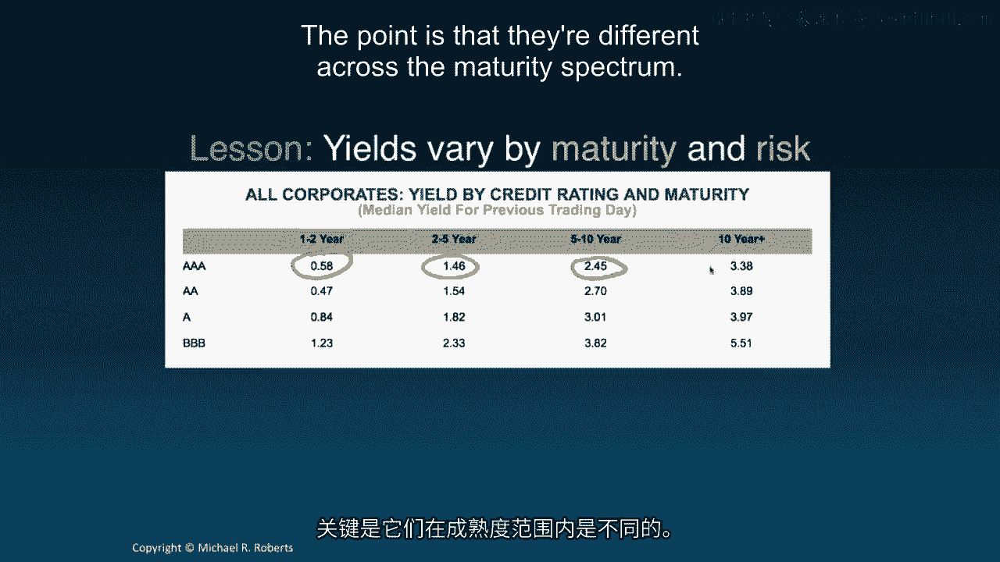
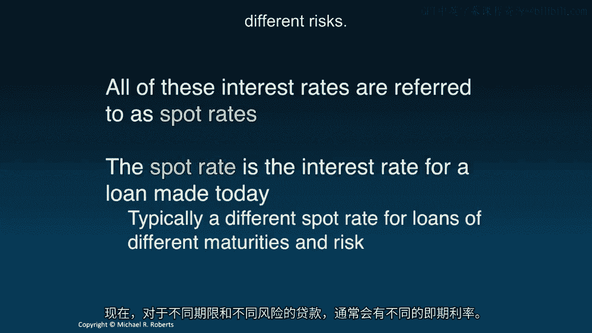
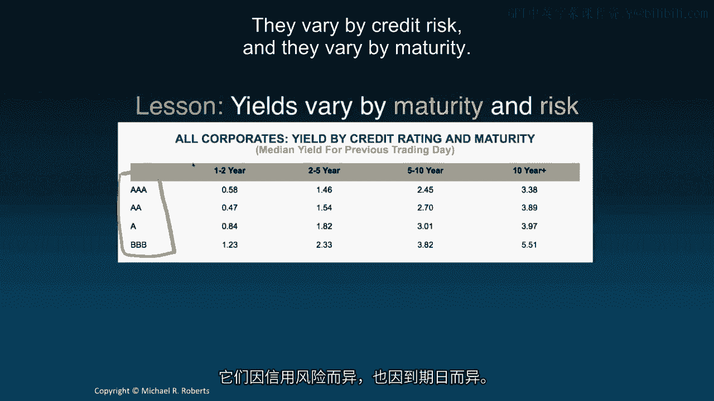
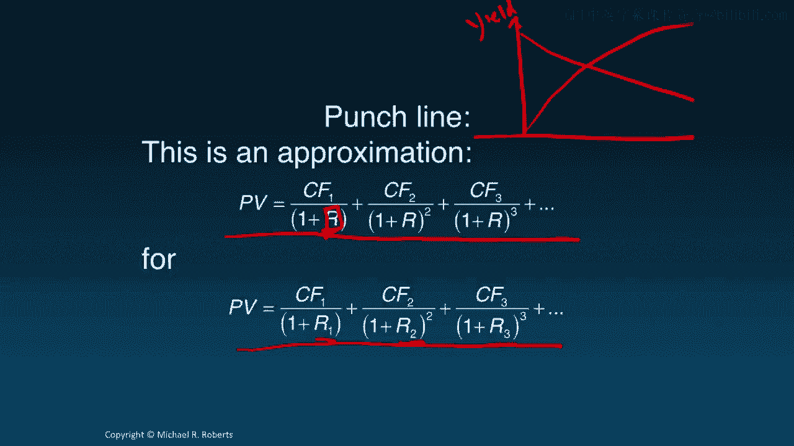

# 沃顿商学院《商务基础》｜第108课：利率期限结构与收益率曲线 📈

在本节课中，我们将学习利率如何随时间变化，以及如何通过**利率期限结构**和**收益率曲线**来描述这种关系。我们将探讨不同期限投资的利率差异，并理解这些概念在企业决策中的重要性。

---

## 回顾：利率报价与折现

上一节我们介绍了利率报价与折现利率的区别，讨论了**年化百分比利率**和**有效年利率**，并学习了如何处理非年度现金流和非年度复利的情况。

本节中，我们将探讨利率或折现率如何随时间变化。

---

## 利率并非恒定不变

此前我们假设折现率是恒定的。在现值公式中，我们使用相同的折现率 `r` 对所有现金流进行折现：

`PV = CF1/(1+r) + CF2/(1+r)^2 + ... + CFn/(1+r)^n`

然而现实中，利率往往随投资期限而变化。

以下是两个例子：
*   **抵押贷款再融资利率**：贷款期限不同，其**年化百分比利率**和**有效年利率**也不同。
*   **定期存单利率**：投资期限不同，利率也不同。

这说明，投资期限的变化通常会导致利率的变化。

---

## 期限结构与收益率曲线

**利率期限结构**描述了投资期限与利率之间的关系。
**收益率曲线**则是这种关系的图形化表示。

以下是一张2014年7月24日的美国国债收益率曲线图：
*   **横轴**：国债到期期限（如1个月期国库券、5年期国债、30年期国债）。
*   **纵轴**：收益率（在此背景下可粗略理解为折现率 `r`）。

图表显示，随着证券到期期限的变化，折现率也随之变化。例如，政府进行30年期借款的利率略高于3%，而进行30天短期借款的利率基本为零。

---

## 理解“收益率”

收益率 `y` 是一个单一的折现率，当用它来折现证券承诺的未来现金流时，结果等于该证券的当前价格。

用公式表示，即求解 `y` 以满足以下等式：
`P = CF1/(1+y) + CF2/(1+y)^2 + ... + CFn/(1+y)^n`

构建收益率曲线，本质上就是计算不同期限证券的收益率。
*   计算1年期收益率 `y1`：`P1 = CF1/(1+y1)`
*   计算2年期收益率 `y2`：`P2 = CF1/(1+y2) + CF2/(1+y2)^2`
*   以此类推，得到一系列收益率 `y1, y2, y3, ... yt`，这些点就构成了收益率曲线。

在国债背景下，收益率与预期回报率相对接近。

---

## 收益率曲线的动态变化

收益率曲线（即利率）会随时间大幅变动。

下图展示了三条不同时期的收益率曲线：
*   **2012年（紫色）**：曲线向上倾斜，表明短期利率低于长期利率。
*   **2000年（蓝色）**：曲线略微向下倾斜。
*   **1981年（红色）**：曲线部分向下倾斜，长期利率低于短期利率。

一种普遍观点认为，收益率曲线的斜率反映了对未来利率的预期：
*   **向上倾斜的曲线**（如2012年）暗示未来利率可能上升。
*   **向下倾斜的曲线**（如1981年）暗示未来利率可能下降。

---

## 不同证券的收益率曲线

国债收益率曲线描绘的是**无风险**贷款利率与期限的关系。但我们也可以为其他证券绘制收益率曲线。

下图展示了2014年7月的三条收益率曲线：
*   **蓝色曲线**：高信用等级（投资级）公司债。
*   **绿色曲线**：AAA级市政债券。
*   **红色曲线**：美国国债。

有趣的是，在某些期限上，联邦政府的借款成本（收益率）似乎高于市政当局。这主要是由于**税收差异**和**流动性问题**所致。

---

## 收益率受期限与风险影响

收益率随**期限**和**风险**而变化。

以公司债券为例：
*   **信用风险**：随着信用评级从BBB提升至AAA（最佳评级），收益率下降。这是因为信用风险降低。
*   **期限风险**：在同一信用评级（如AAA）内，不同期限的收益率也不同。它们可能随期限增加而上升（如图中所示），但也可能下降，关键点在于它们**随期限变化而不同**。

---

## 即期利率与关键启示

我们讨论的这些利率被称为**即期利率**，即**今日发放**的贷款所适用的利率。通常，不同期限和不同风险的贷款有不同的即期利率。

所有这些讨论带来的一个重要启示是：我们一直使用的现值公式在某种程度上只是一个近似。

当收益率曲线**平坦**时（即各期利率 `r1, r2, r3...` 相同），使用单一折现率 `r` 是准确的。但当收益率曲线**显著向上或向下倾斜**时，使用某个平均折现率来替代所有不同的即期利率，会产生较大误差。

正确的现值公式应使用各期对应的即期利率 `rt`：
`PV = CF1/(1+r1) + CF2/(1+r2)^2 + ... + CFn/(1+rn)^n`

---

## 本节总结

本节课我们一起学习了：
*   **利率期限结构**：描述了利率与投资期限之间的关系。
*   **收益率曲线**：将期限结构绘制成图，横轴为到期期限，纵轴为收益率或利率。
*   利率会随投资的**风险**而变化。
*   **即期利率**：指今日发放贷款的利率，随期限和风险不同而变化。
*   认识到使用单一折现率计算现值仅是近似，精确计算需使用各期对应的即期利率。

接下来，我们将开启一个新主题：**折现现金流分析**。期待下节课与你再见。