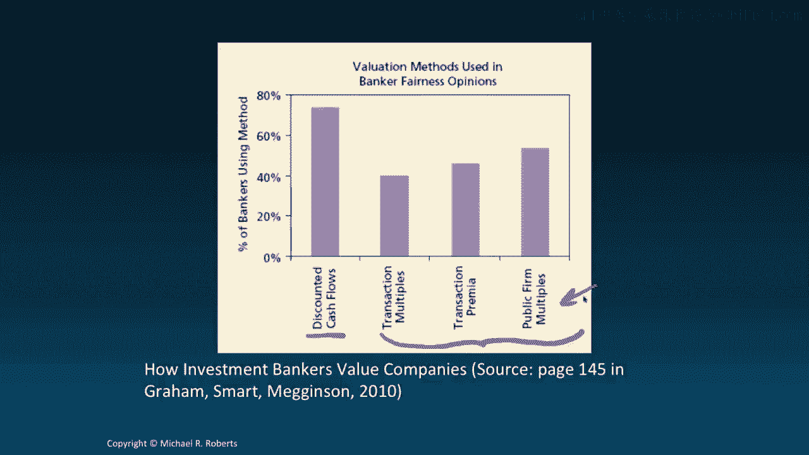
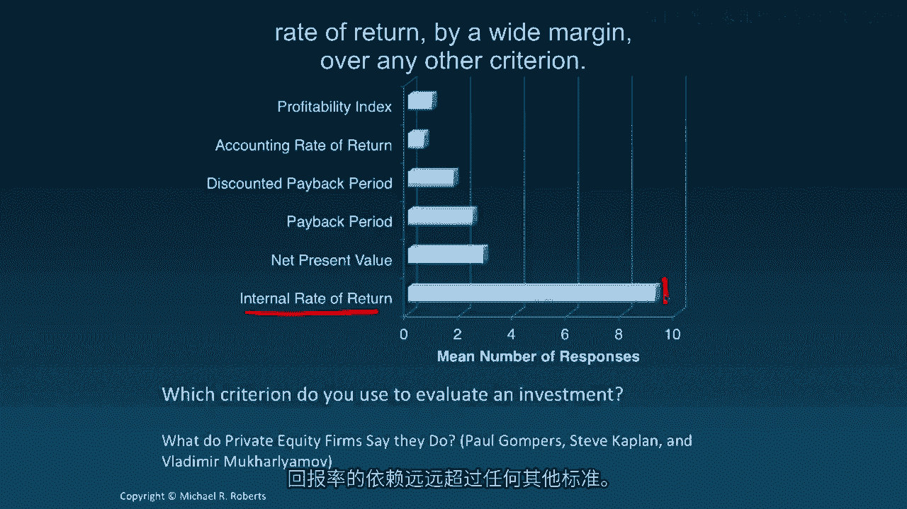

# 沃顿商学院《商务基础》课程笔记｜第109讲：折现现金流决策制定 📊

在本节课中，我们将学习折现现金流分析，并探讨如何利用净现值等决策规则来评估投资项目。我们将从决策制定的基本原则开始，逐步深入到具体的计算方法和实践中常用的评估工具。

---

上一节我们回顾了利率的相关知识，本节中我们来看看如何运用这些知识进行财务决策。

让我们从一个问题开始：应该如何制定财务决策？一个合理的答案是，采取那些能为决策影响方（例如公司所有者）创造价值的行动。那么，哪些行动能创造价值？一个普遍合理的回答是，选择收益超过成本的行为。但这里有一个细节：如果成本和收益发生在不同时间点呢？我们完全有能力处理这个问题，因为我们可以比较收益的现值与成本的现值。通过计算现值，我们知道折现率 **r** 会同时调整现金流的时间和风险。

这引出了我们的第一个要点：净现值决策规则。

**净现值** 的公式为：
`NPV = PV(收益) - PV(成本)`
或者更具体地，对于一系列自由现金流：
`NPV = Σ [FCF_t / (1 + r)^t]`
其中，**FCF** 代表自由现金流，**r** 是折现率，**t** 是时间期数。

NPV决策规则指出：我们应该接受所有净现值为正的项目，拒绝所有净现值为负的项目。换句话说，如果收益的现值大于成本的现值，这个项目就能创造价值，我们应该实施它。

虽然这个公式看起来有些抽象，但它本质上就是我们熟悉的折现现金流计算。这里的“F”仅代表“自由”，即自由现金流，但本质上它们仍然是现金流。我们将在下一讲正式定义和讨论如何计算自由现金流。目前，只需理解我们并没有做任何新的事情，只是在用折现率 **r** 将一系列现金流折现到今天，得到一个净现值。

这个规则看似简单直接，但实际应用起来却微妙得多。随着本专题的深入，我们将讨论这些微妙之处。

在继续探讨DCF分析的具体机制之前，我想简要谈谈实践中的决策制定，这有助于我们理解金融和非金融领域人士的实际做法。

以下是实践中常用的一些资本预算技术调查结果：

*   **净现值** 和 **内部收益率** 是CFO们最常用的决策标准。
*   **投资回收期法** 的使用也相当普遍，其次是 **折现投资回收期法**。

在非金融企业界如此，在投资银行界呢？大多数投资银行家在评估公司价值或出具公允意见时，也主要依赖折现现金流分析（类似于NPV），但同时也会使用一系列可比公司分析法或乘数法。

最后，近期一项针对私募股权公司的调查显示，绝大多数PE投资者在评估投资时，首要依赖的标准是 **内部收益率**，其使用频率远超其他任何标准。

让我们总结一下。在本专题中，我们将重点讨论折现现金流分析和NPV规则，因为从理论上讲，NPV是能始终引导你做出创造价值决策的最优规则。然而，我将从更实用的公司财务决策视角出发，认识到其他规则仍然具有参考价值，仍在被从业者使用——无论是私募股权投资者、投资银行家还是CFO。这些规则仍然能提供信息，但重要的是，我们必须理解这些其他规则存在的某些缺陷，认识到它们的局限性，从而能够综合运用多种规则来做出最佳决策。

接下来，我们将深入探讨如何计算自由现金流，这是理解如何执行DCF分析的第一步。期待在下一讲与你相见。