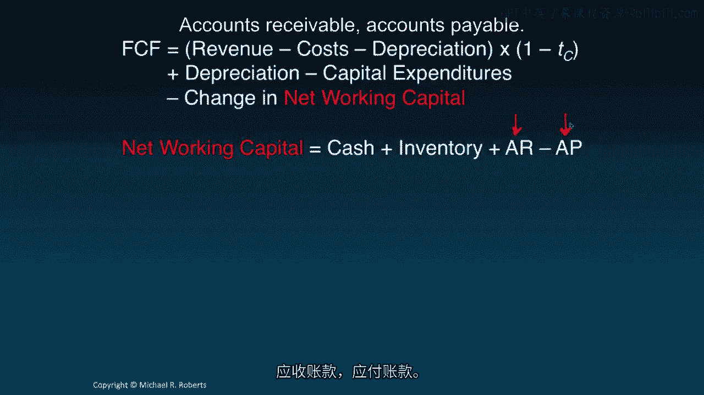
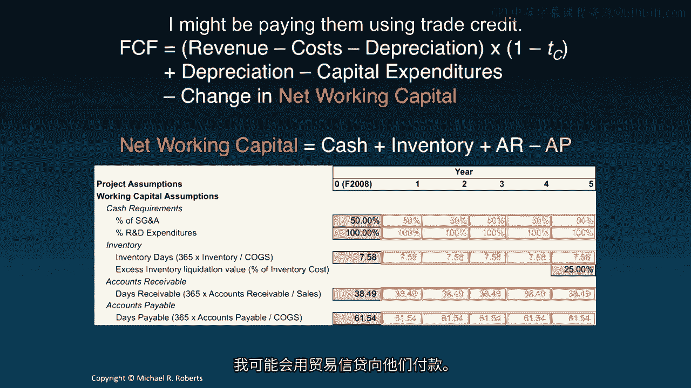
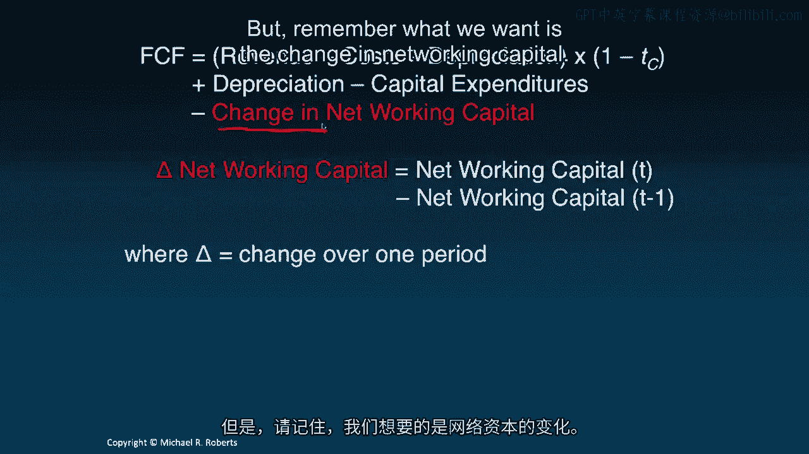
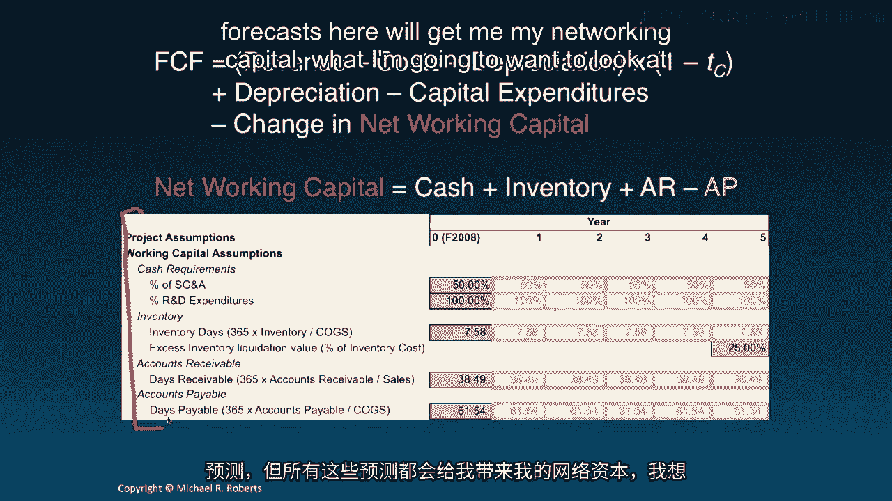
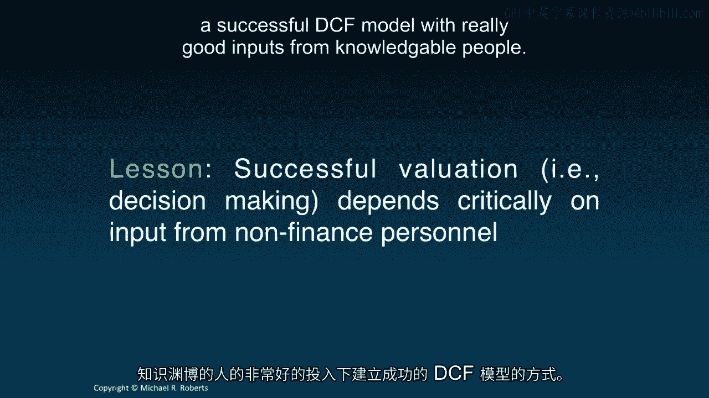

# 沃顿商学院《商务基础》｜Business Foundations Specialization｜（中英字幕） - P111：9_预测驱动因素 📊

在本节课中，我们将学习如何为贴现现金流分析构建预测。我们将通过一个具体的资本预算应用案例，重点介绍预测驱动因素，即预测未来自由现金流所需的各项假设。

---

上一节我们介绍了自由现金流的概念和计算方法。本节中，我们来看看如何通过一系列假设来预测自由现金流的各个组成部分。

我们将以一个在2008年考虑进入平板电脑市场的公司为例。为了决定是否应该生产和销售这款平板电脑，我们需要进行贴现现金流分析，并预测自由现金流公式中的每一项。

自由现金流公式如下：
`自由现金流 = 息税前利润 × (1 - 税率) + 折旧与摊销 - 资本性支出 - 营运资本变动`

以下是预测该公式各组成部分所需的驱动因素和假设。

## 收入预测 💰

收入预测基于三个核心要素：市场规模、市场份额和单位价格。

*   **市场规模**：我们假设第一年（早期采用者市场）的销量为100万台。随后几年，市场将经历高速增长，增长率分别为2500%、128%、9.4%和3.5%。这些数字综合了公司内部营销、战略部门以及行业分析师的意见。
*   **市场份额**：我们假设初始市场渗透率为25%，之后每年增长5%。
*   **单位价格**：初始定价为每台200美元。第二年价格不变，从第三年起，我们计划通过研发推出新版产品（如更轻、性能更强），从而将价格提高近50美元。

## 成本与费用预测 📉

接下来，我们需要预测各项成本和费用。

*   **销售成本**：我们假设销售成本占销售收入的比例为80.66%。这个数字基于公司在计算机行业的经验、运营部门的估算以及其他分析师的意见。
*   **销售、一般及管理费用**：第一年我们假设此项费用为6959万美元。随着市场增长，公司需要更多管理费用来支持运营，因此我们假设此项费用每年增长25%。
*   **研发费用**：项目启动需要前期研发投入2亿美元。此后，为了产品迭代和改进，每年还需投入2500万美元。

## 投资需求预测 🏭

项目的实施需要资本投入。

*   **初始投资**：为建造工厂和购置生产设备，需要前期投资2.277亿美元。
*   **后续投资**：第一年的后续投资额为初始投资的10%，之后几年按5%的年增长率增长，最后一年增长1%。
*   **残值处理**：项目结束时（假设为5年），剩余的厂房和设备不会消失。我们假设可以将其以原值50%的价格出售、出租或转作他用。
*   **折旧**：假设所有资本性支出按直线法在5年内折旧，即每年折旧20%。这是一项非现金费用，但会产生税盾效应。

## 营运资本预测 🔄

营运资本是现金、存货、应收账款减去应付账款。我们需要预测其各组成部分及年度变动。

*   **现金需求**：为支付员工薪酬和日常账单（如水电、IT费用），所需的现金等于50%的销售、一般及管理费用加上100%的预期研发支出。
*   **存货**：基于存货周转天数进行预测。我们假设周转天数为7.58天（类似戴尔公司的快速周转模式）。项目结束时，剩余的陈旧存货预计可以原值25%的价格处理。
*   **应收账款**：基于应收账款天数预测，即销售后需要多少天才能收到货款。
*   **应付账款**：基于应付账款天数预测，即公司向供应商付款的平均周期。

在计算自由现金流时，我们关注的是**营运资本的年度变动值**，即从第t-1年到第t年的变化。

## 税率假设 📝

最后一项关键假设是税率。

*   我们应采用**边际税率**，即对额外一美元利润所征收的税率。本例中假设为25.5%。
*   实践中，精确的边际税率难以获取，因此很多人会使用公司适用的最高法定税率（例如35%-36%）进行估算。

---

我们已经为自由现金流公式的每个组成部分建立了预测假设。这些假设将使我们能够计算出未来的具体金额。

但必须指出，精确预测未来极其困难。贴现现金流分析的目的并非要得出一个“绝对正确”的数字。它的核心价值在于**提供一个严谨的框架**，促使我们围绕价值创造的关键驱动因素进行聚焦、理性的讨论，避免依赖直觉、经验法则或模糊的经验做决策。

此外，成功的估值或DCF分析绝不能仅依赖财务人员的数据。它需要**跨部门协作**，从市场、战略、运营等各个业务环节获取专业见解和输入，才能构建出有意义的预测模型。

---

本节课中，我们一起学习了预测驱动因素。我们通过一个平板电脑项目的例子，详细拆解了预测自由现金流所需的市场、成本、投资、营运资本和税率等各项假设。记住，DCF的目标是提供一个用于理性决策的分析框架，而非追求一个完美的预测数字。

在下一讲中，我们将利用这些预测驱动因素，实际计算出该项目的未来自由现金流具体金额。