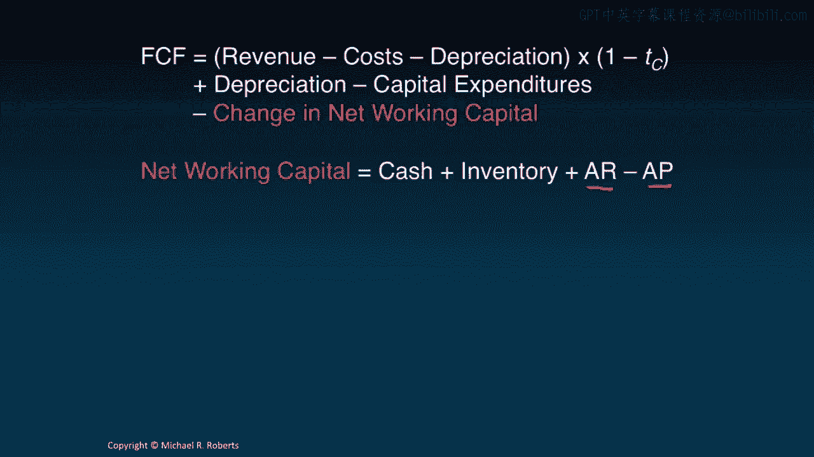

# 沃顿商学院《商务基础》课程 P112：📊 预测自由现金流

在本节课中，我们将学习如何将上一节讨论的预测驱动因素，应用到平板电脑项目的具体案例中，从而预测其未来的自由现金流。我们将一步步地将各项假设转化为具体的美元现金流预测。

---

欢迎回到公司金融课程。上一讲我们讨论了预测驱动因素，即预测未来自由现金流所需的各项假设。

今天，我们将把这些预测驱动因素应用到我们的平板电脑案例中，并结合自由现金流公式，为该项目的未来五年预测自由现金流。

让我们开始吧。

## 📈 回顾：自由现金流公式与预测驱动因素

上一讲我们列出了预测驱动因素，这些是生成自由现金流预测所必需的假设。它们具体对应了自由现金流公式中的各个组成部分。

今天的目标，正是将这些驱动因素转化为具体的美元现金流预测。

以下是我们的自由现金流公式：

**自由现金流 = 税后净营业利润 + 折旧与摊销 - 资本性支出 - 营运资本变动**

为了进行预测，我们需要对公式中的每一项做出假设。

## 💰 第一步：预测销售收入

我们从预测美元收入开始。我们知道，销售收入等于市场规模乘以市场份额再乘以价格。

以下是我们的收入预测驱动因素：
*   **市场规模**：从第一年的100万台开始。
*   **市场份额**：我们预计将获得25%的市场份额。
*   **价格**：每台设备定价为200美元。

根据这些假设，我们可以计算每年的销售收入。

以下是具体计算过程：
*   **第一年**：100万台 × 25% × 200美元/台 = 5000万美元。
*   重复此过程，我们可以得到第二年至第五年的销售收入预测。

## 📉 第二步：预测各项成本

接下来，我们预测各项成本。我们从销售成本开始。

**1. 销售成本**
我们的预测驱动因素是以销售收入的百分比形式给出的。第一年的销售成本假设为销售收入的80.66%。

因此：
*   **第一年销售成本**：5000万美元 × 80.66% = 4033万美元。
*   对后续年份重复此计算，即可得到完整的销售成本预测。

**2. 销售、一般及管理费用**
我们假设第一年的SG&A费用为6959万美元。这个数字是基于公司2008年总SG&A费用的1%估算的，仅为示例目的。

对于第二年至第五年，我们假设SG&A费用每年增长25%。
*   **第二年SG&A**：6959万美元 × (1 + 25%) = 约8700万美元。
*   继续此增长假设，即可得到SG&A费用序列。

**3. 研发费用**
我们假设前期研发和后续版本更新所需的研发费用均为2500万美元。因此，每年的研发费用预测就是2500万美元。

现在，我们可以将这些数据整合到一个类似利润表的格式中：
1.  从顶部的销售收入开始。
2.  减去销售成本，得到毛利润。
3.  再减去SG&A费用和研发费用，得到息税折旧摊销前利润。

## 🏗️ 第三步：预测资本性支出与折旧

**1. 资本性支出**
我们的前期厂房和设备投资为2.27亿美元。随后，我们假设：
*   第一年追加投资为前期投资的10%。
*   后续年份的资本性支出增长率分别为5%、1%、1%、1%。

由此，我们可以计算出每年的资本性支出美元金额。

**2. 折旧**
我们假设对这些资本性支出按五年进行直线折旧，即每年折旧20%。

为了简化计算，我们创建了“累计资本性支出”行。这样，每年的折旧额就是上一年累计资本性支出的五分之一。

**3. 资产残值处理**
项目结束时（第五年末），这些物理资产并不会消失，我们可以将其出售或重新部署。因此，我们需要考虑其残值。
*   首先，计算资产的账面价值（累计资本性支出 - 累计折旧）。
*   然后，假设我们只能以账面价值的50%将其出售，得到清算价值。
*   由于出售价格低于账面价值，会产生账面损失，这部分损失可以带来税盾收益。
*   最终，税后残值收入将高于清算价值。

因此，在第五年，考虑到资产出售带来的现金流入，我们的资本性支出实际上会变为负值，代表一笔现金流入。

## 💼 第四步：预测营运资本及其变动

营运资本等于现金加存货加应收账款，再减去应付账款。我们需要预测其每个组成部分。

以下是各部分的预测驱动因素及计算：
*   **现金需求**：假设需要持有50%的SG&A费用和100%的研发费用作为现金。
*   **存货**：基于“存货周转天数”和销售成本进行预测。公式为：`存货 = (存货周转天数 × 销售成本) / 365`。
*   **应收账款**：基于“应收账款周转天数”和销售收入进行预测。公式为：`应收账款 = (应收账款周转天数 × 销售收入) / 365`。
*   **应付账款**：基于“应付账款周转天数”和销售成本进行预测。公式为：`应付账款 = (应付账款周转天数 × 销售成本) / 365`。

将以上四项代入公式，即可得到每年的营运资本数额。

**项目结束时的营运资本回收**
与固定资产类似，项目结束时大部分营运资本可以回收（例如现金、收回的应收账款），但部分资产（如存货）可能只能按折扣价回收（本例假设为25美分兑1美元）。最终，我们计算出在第五年末可回收5137.5万美元的营运资本。

我们最终需要的是**营运资本的变动**，即本年营运资本减去上年营运资本。在第五年，我们还需要加上回收的营运资本总额。

## ✅ 第五步：整合计算自由现金流

现在，我们拥有了所有必要的部分。让我们将它们组织成一个“准利润表”，并最终计算出自由现金流。

步骤如下：
1.  **准利润表**：
    *   销售收入 - 销售成本 = 毛利润
    *   毛利润 - SG&A - 研发费用 = EBITDA
    *   EBITDA - 折旧 = EBIT
    *   EBIT × 税率 = 税收费用
    *   EBIT - 税收费用 = 税后净营业利润
    *   *注意：此表称为“准”利润表，因为它不包含利息费用（属于融资决策），且税收是基于EBIT而非税前利润计算。*
2.  **计算自由现金流**：
    *   税后净营业利润
    *   + 折旧（非现金支出加回）
    *   - 资本性支出
    *   - 营运资本变动
    *   = **自由现金流**

这样，我们就得到了该项目未来五年的预测自由现金流序列。

## ⚠️ 预测自由现金流时的其他注意事项

在预测自由现金流时，还需牢记以下几点：
*   **机会成本**：资源用于此项目而放弃的其他用途的价值，并非免费。
*   **项目外部性**：项目可能对其他产品线产生正面（溢出效应）或负面（蚕食效应）影响，必须予以考虑。
*   **沉没成本**：过去已经发生且与当前决策无关的成本，不应计入。
*   **其他非现金项目**：如摊销、股权激励等，它们虽不影响现金流但影响税收，需妥善处理。
*   **残值**：项目结束时资产和负债的处理价值，如前所述。
*   **执行风险**：项目特有的风险应通过调整**预期自由现金流**（即考虑不同情景的概率）来捕捉，而非简单地调整折现率。敏感性分析是常用工具。
*   **预测频率**：本例使用年度预测，但根据项目和行业特点，也可采用季度、月度等频率。

---

## 📝 总结

本节课中，我们一起学习了如何将预测驱动因素转化为具体的美元自由现金流预测。我们通过分解自由现金流公式的各个组成部分，并应用相应的假设，一步步构建出了平板电脑项目未来五年的现金流预测图景。

自由现金流预测是贴现现金流分析的两大核心输入之一（另一个是折现率）。现在我们已经得到了现金流预测，接下来的问题就是：如何利用这些现金流进行投资决策？这将是下一讲“投资决策标准”的主题。

感谢聆听，我们下节课再见。