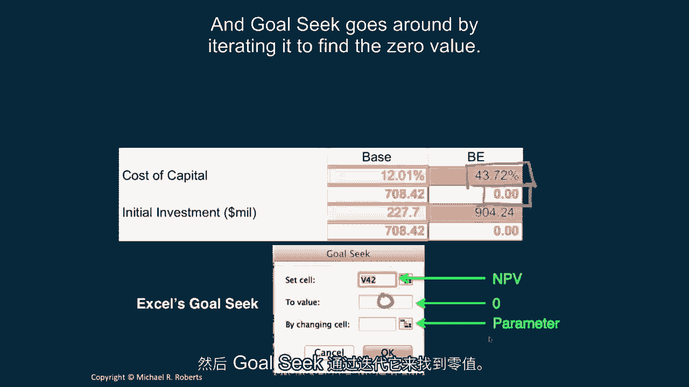
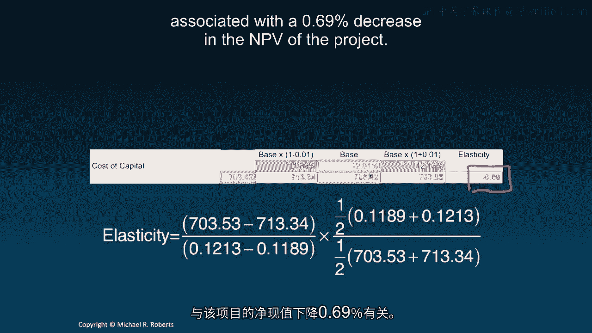
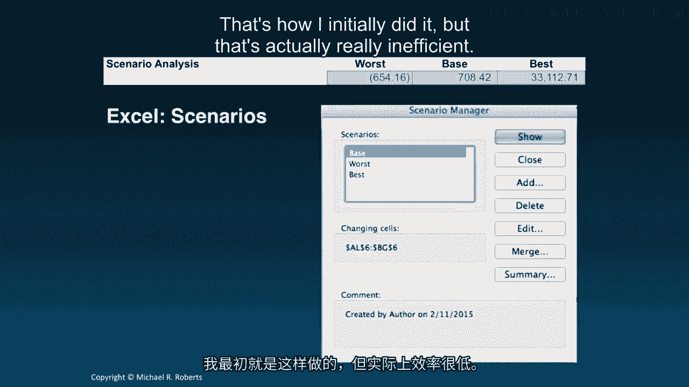
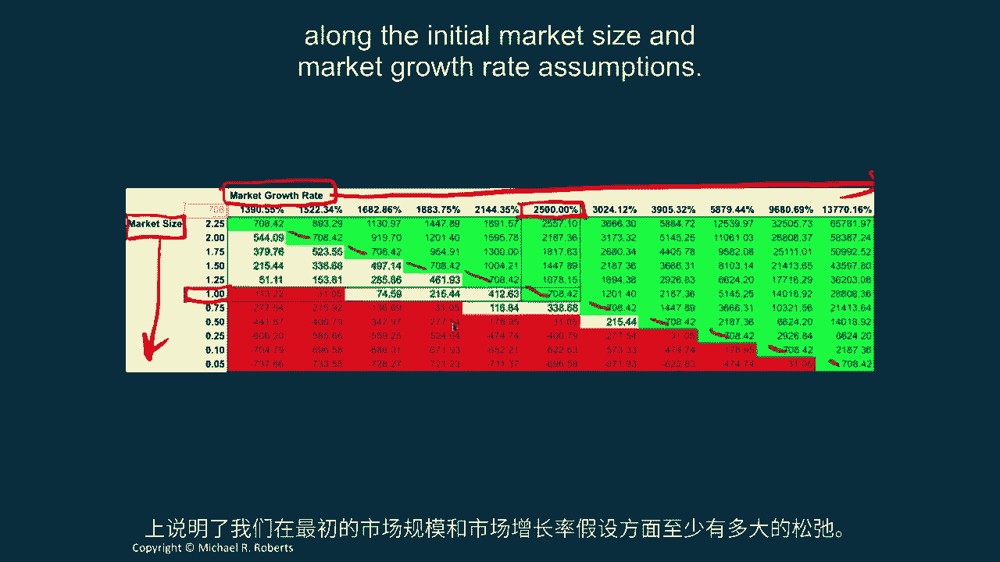
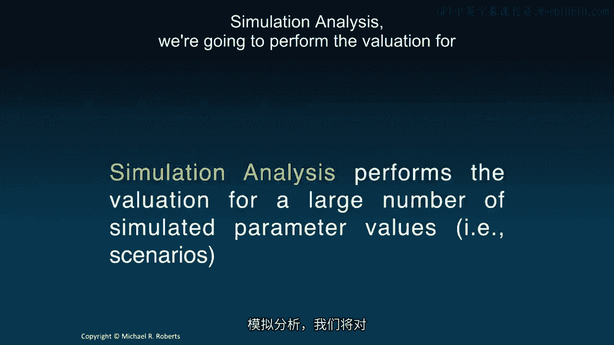

# 沃顿商学院《商务基础》｜第114课：敏感性分析 📊

在本节课中，我们将学习敏感性分析。这是一种通过改变预测假设和关键参数，来检验项目决策稳健性的重要方法。我们将探讨盈亏平衡分析、比较静态分析、情景分析和模拟分析等多种技术。

上一节我们应用了不同的决策标准来评估平板电脑项目。本节中，我们来看看如何通过改变关键假设来测试我们决策的稳健性。

## 盈亏平衡分析

盈亏平衡分析旨在找出使项目净现值为零的参数值，同时保持其他所有参数不变。

以下是我们的资本成本和初始投资预测驱动因素。这里用“基准”代表基准情况。

*   **资本成本**：基准假设为12.13%。对应的净现值为**7.0842亿美元**。
*   **初始投资**：基准假设为**2.277亿美元**。

盈亏平衡值，即使净现值为零的参数值，计算如下：

*   资本成本的盈亏平衡点为 **43.72%**。这实际上就是项目的**内部收益率**。
*   初始投资的盈亏平衡点接近 **10亿美元**。

这些结果表明，在资本成本维度上，项目有较大安全边际；初始投资也需要大幅增加才会使项目净现值转负。

我使用Excel的“单变量求解”功能来计算这些值。具体操作是将净现值单元格设为目标值0，并更改输入参数单元格，让Excel迭代求解。

我对所有输入参数都进行了此分析。以下是一些关键发现：

*   **厂房设备清算价值**：假设5年后清算时能收回原值的50%。其价值需要下降 **-2,253%**（即产生巨大损失）项目净现值才会转负。
*   **初始单价**：除非单价降至 **77美元** 以下，否则项目净现值始终为正。
*   **初始市场规模**：基准为100万台。如果市场规模降至 **53.8万台** 以下，项目净现值将转负。

盈亏平衡分析有助于我们评估，在项目变得损害价值之前，每个参数有多少犯错空间。但需要强调的是，这是一种**局部均衡分析**，它假设参数之间相互独立，每次只改变一个参数，有时这并不合理。

## 比较静态分析

比较静态分析用于量化估值对单个参数变化的敏感度，同时保持其他参数不变。

我将观察每个参数从“最差情况”到“最佳情况”变化时，估值如何变化。以资本成本和初始投资为例：

*   **资本成本**：最佳情况为9.61%，最差情况为15.01%。
*   **初始投资**：最佳情况为1.85亿美元，最差情况为2.84亿美元。

参数估计值下方是对应的净现值：
*   当资本成本升至15.01%时，项目净现值为 **5.94亿美元**。
*   当初始投资增至2.84亿美元时，项目净现值降至 **6.4947亿美元**。

这个表格有两个作用：一是感受估值对特定参数变化的敏感度；二是作为合理性检查，确保估值随参数变化的方向符合逻辑（例如，资本成本上升，估值应下降）。

我使用Excel的**数据表**功能生成此分析。只需突出显示矩阵区域，将净现值单元格作为行输入，参数单元格作为列输入即可。

我对所有参数都进行了此分析。例如，观察初始市场份额：
*   最差情况为15%渗透率，最佳情况为35%渗透率。
*   估值随渗透率上升而显著增加，这表明它是一个重要的价值驱动因素。

## 弹性分析

弹性分析能更结构化地比较估值对不同参数的敏感度。弹性的定义是：

**弹性 = (净现值的百分比变化) / (参数的百分比变化)**

用公式表示为：
`弹性 = (ΔNPV / Δ参数) × (参数平均值 / NPV平均值)`

以资本成本为例：
*   我计算了资本成本增减1%时的净现值。
*   代入公式计算，得到弹性约为 **-0.69**。
*   这意味着资本成本相对增加1%，会导致项目净现值相对减少约0.69%。

我对多个参数进行了弹性计算。结果显示，**初始市场规模、市场增长率、初始市场份额和销售成本**等参数的弹性较高，是关键的**价值驱动因素**，应在项目讨论中重点关注。

与之前的分析一样，弹性分析也隐含了参数独立的假设。

## 情景分析

情景分析用于量化估值对多个参数同时变化的敏感度。

我设定了三种情景：
1.  **最差情景**：所有参数均取最差值。
2.  **基准情景**：所有参数取基准值。
3.  **最佳情景**：所有参数均取最佳值。

分析结果如下：
*   在最差情景下，项目净现值为 **-5.44亿美元**。
*   在最佳情景下，项目净现值高达 **33亿美元**。

需要注意的是，将所有参数独立地设为最差或最佳值可能不切实际。更合理的做法是构建**符合经济逻辑的连贯情景**，例如“经济衰退”情景下，某些参数变差，但另一些（如劳动力成本）可能反而降低。

在Excel中，可以使用“方案管理器”，但更高效的方法是建立一个**查找表和切换开关**，以便快速在不同参数集之间切换。

## 应用敏感性分析回答关键问题

敏感性分析可以帮助回答决策讨论中的重要问题。

**问题一：降价以换取市场份额是否合理？**
*   假设市场部建议将单价降低30美元（从200美元降至170美元），预计可将初始市场份额从25%提升至30%。
*   我建立了一个关于**价格**和**市场份额**的双向数据表。
*   分析显示，在单价170美元、份额30%的情景下，净现值在 **7.768亿至8.519亿美元** 之间，高于基准情况的7.084亿美元。
*   **结论**：该策略能提升项目价值，是合理的。

**问题二：如何理解平板电脑市场的不确定性？**
*   我建立了一个关于**初始市场规模**和**市场增长率**的双向数据表。
*   单元格内为净现值，并用颜色编码：绿色表示等于或优于基准，黄色表示正净现值但低于基准，红色表示负净现值。
*   该图表直观展示了在市场规模和增长率不同组合下项目的价值表现，帮助我们评估风险敞口。

## 模拟分析

模拟分析会对大量随机生成的参数情景进行估值。

我进行了500次模拟：
*   每次模拟都从每个参数的“最差”与“最佳”值构成的范围内随机抽取参数值。
*   计算每次模拟的净现值，并绘制成直方图。

结果显示：
*   **77.8%** 的模拟情景净现值为正。
*   **22.2%** 的模拟情景净现值为负。

**结论**：在给定假设下，该项目是一个“不错的赌注”，大概率能创造价值。

需要强调的是，此模拟中参数是**独立随机抽取**的，这可能导致一些不切实际的结果（例如价格和数量通常负相关）。更理想的方法是进行**多变量联合分布抽样**，但这超出了本课程范围。即便如此，即使是小规模的模拟分析也极具价值。

## 总结

本节课中我们一起学习了敏感性分析。它是任何贴现现金流分析不可或缺的部分，能帮助我们：
1.  **识别价值创造与毁灭的来源**，找出关键价值驱动因素。
2.  **量化和评估风险敞口**，了解潜在损失的大小和可能性。
3.  **理解项目盈利能力的稳健性**。

没有敏感性分析的估值是不完整的。下次课，我们将转向一个新话题：投资回报率，它将与我们的决策标准紧密相关，并深入探讨内部收益率的优缺点。