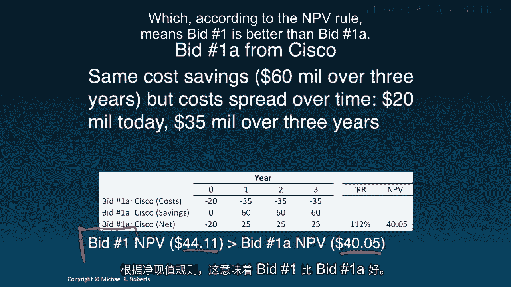
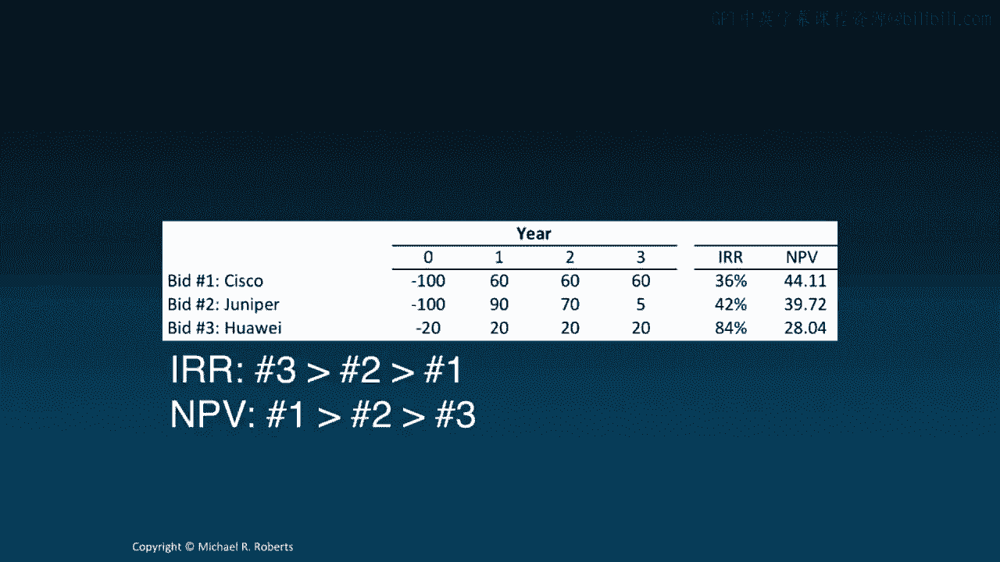

# 沃顿商学院《商务基础》课程 P115：投资回报率 📈

在本节课中，我们将学习投资回报率，特别是内部收益率与净现值规则相比的优势与劣势。我们将通过具体例子，理解为何有时这两种方法会给出不同的决策建议。

---

上一节我们介绍了贴现现金流分析，本节中我们来看看投资回报率。

投资回报率是评估项目吸引力的常用指标。内部收益率是使项目净现值为零的贴现率。其决策规则是：若IRR大于资本成本，则接受项目；若IRR小于资本成本，则拒绝项目。

**公式**：求解使 `NPV = 0` 的贴现率 `r`，即 IRR。

---

## 为何要关注IRR？

IRR在实践中被广泛使用。调查显示，它是CFO和私募股权公司最常用的决策标准之一，因此理解其原理和局限性至关重要。

---

## IRR与NPV的比较

在大多数情况下，如果项目的现金流模式是前期为负（投资），后期为正（收益），那么IRR和NPV规则会得出相同的接受或拒绝决策。

以下是现金流符号模式示例，其中IRR与NPV决策一致：
*   第1-3年：负现金流
*   第4年及以后：正现金流

关键在于：**负现金流必须先于正现金流**。如果这种模式被打破，IRR和NPV可能产生冲突，甚至出现多个IRR或虚数IRR，导致决策困难。

---

## 案例分析：沃顿IT系统升级

让我们通过一个具体例子来比较项目。假设沃顿商学院计划升级IT系统，收到了思科的投标。

**思科投标1：**
*   前期成本：1亿美元
*   未来三年，每年成本节约：6000万美元
*   资本成本：12%

计算可得，该项目的IRR为36%，NPV为4411万美元。由于IRR > 12% 且 NPV > 0，两个指标都表明这是一个好项目。

随后，思科提出了另一个方案。

**思科投标1A：**
*   前期成本：2000万美元
*   未来三年，每年需支付3500万美元，但仍享受6000万美元的成本节约。
*   因此，净现金流为：-2000万， +2500万， +2500万， +2500万。

计算可得，该项目的IRR高达112%，但NPV为4005万美元。

**冲突出现：**
*   **IRR规则**：投标1A（112%）远优于投标1（36%）。
*   **NPV规则**：投标1（4411万美元）优于投标1A（4005万美元）。

我们该如何决策？

---

## 深入分析冲突原因

让我们仔细审视投标1A。与投标1相比，沃顿的前期支付从1亿美元减少到2000万美元，差额为8000万美元。但未来三年，每年需多支付3500万美元。

这实质上相当于**思科向沃顿提供了一笔8000万美元的贷款**，并要求三年内每年偿还3500万美元。我们可以计算这笔隐含贷款的利率。

**代码/公式**：计算现金流（-8000万， +3500万， +3500万， +3500万）的IRR，结果约为15%。

这意味着，思科在交易中嵌入了一笔利率为15%的贷款，高于沃顿12%的资本成本。虽然**IRR因初始投资额大幅减小而急剧升高**（小投资上的回报率显得很高），但**NPV准确地捕捉到了这笔昂贵贷款对价值的损害**，因此数值下降。

**核心结论**：在比较不同规模或现金流模式的项目时，IRR可能会产生误导，而NPV能更可靠地反映价值创造。价值越大，NPV越高。

---

## 更多投标案例

假设我们还收到瞻博网络和华为的投标，其现金流如下表所示：

| 投标方 | 现金流（百万美元） | IRR | NPV（百万美元） |
| :--- | :--- | :--- | :--- |
| 思科 | -100, +60, +60, +60 | 36% | 44.11 |
| 瞻博网络 | -50, +30, +30, +30 | 36% | 22.06 |
| 华为 | -20, +20, +20, +20 | 112% | 34.05 |

以下是基于IRR和NPV的排名对比：

**IRR排名**：华为 > 瞻博网络 > 思科
**NPV排名**：思科 > 华为 > 瞻博网络

两者排名完全相反。下图直观展示了这种冲突：

横轴为贴现率，纵轴为NPV。每条线与横轴的交点即为该项目的IRR。在代表资本成本（12%）的竖线处，各项目NPV的高低顺序（思科>华为>瞻博网络）与IRR的顺序截然不同。

原因在于：
1.  **华为**前期投资很小，显著推高了IRR。
2.  **瞻博网络**的现金流回报更早，其IRR也高于思科。

这再次说明：**IRR不能很好地处理项目规模差异**。一个极端的例子是，你宁愿获得1美元投资100%的回报，还是100万美元投资10%的回报？显然是后者，因为它创造了更多的绝对价值。

进一步看，华为的投标也类似于思科投标中嵌入了贷款。这笔贷款的利率经计算高达23%，远高于资本成本，这解释了为何其NPV低于思科投标。

---

## 总结 📝

本节课我们一起学习了投资回报率，重点是IRR与NPV的比较。

*   **IRR的优势**：它以收益率的形式直观表达了项目的吸引力，易于理解和沟通。
*   **IRR的局限性**：其决策规则仅在特定条件下与NPV一致（不进行项目比较，且现金流符号为“先负后正”）。在比较不同规模或现金流模式的项目时，IRR可能产生误导。
*   **核心建议**：可以在项目评估中使用IRR，但必须清楚认识其局限。**知道何时使用、何时不使用IRR至关重要**。NPV在价值比较上始终是更可靠的指标。

感谢聆听，下一讲我们将讨论“资本成本”。再见。