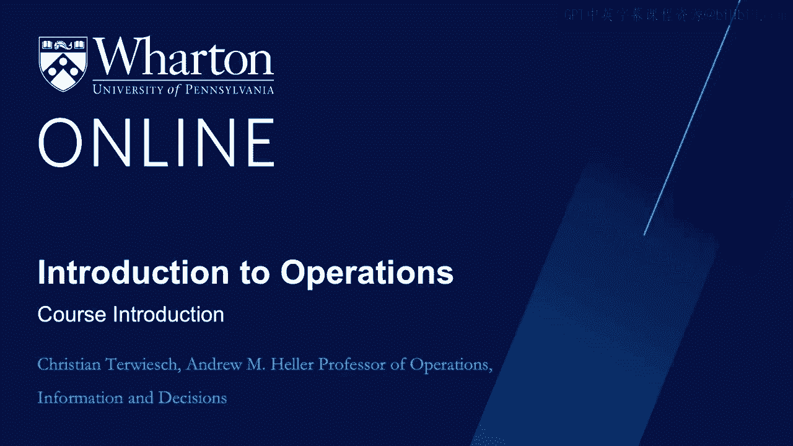
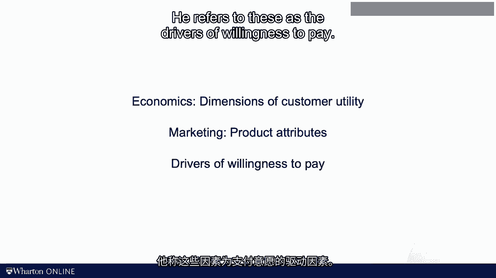

# 沃顿商学院《商务基础》课程｜第116讲：运营管理概论 🏭

在本节课中，我们将学习运营管理的基本概念。运营管理是一门关于分析和改进工作方式的学科。通过学习，你将掌握如何利用工具优化流程、提升效率，并理解如何平衡客户价值与运营成本。

---

大家好，我是克里斯蒂安·特维奇。

我在沃顿商学院教授运营管理课程已超过20年。同时，我也在佩尔曼医学院讲授运营与创新相关课程。

欢迎来到我的运营管理课程。在深入学术细节之前，请允许我先简要介绍一下自己。从我的口音中你可能已经听出，我来自德国。有时我可能表现得有点像控制狂，这确实是我的特点之一。你可能会想：太好了，我现在要跟着一个德国控制狂学习运营管理了。是的，正是如此。

本课程的目标是帮助你分析和改进你或他人的工作方式。你的职业背景可能来自大公司或小公司，你可能想成为管理顾问，或者梦想创办自己的公司。无论如何，我都希望帮助你重新构想工作的完成方式。

你可能会问：等等，这个视频里的人怎么能帮我改进工作呢？我比任何人都更了解自己的工作。这是我常从学员和咨询客户那里听到的担忧。你知道吗？我同意你的观点。因此，让我明确本课程能做什么和不能做什么。

**我不能告诉你具体如何工作**，因为没有人比你更了解自己的工作。但我可以教你一些工具，用于分析你的工作并加以改进。这门分析和改进工作的学科就叫做**运营管理**。

“运营”（Operations）一词源于拉丁语“opus”，意为“工作”。因此，运营管理就是帮助人们分析和改进工作方式。在本课程中，我的职责是为你提供运营管理中最核心的工具。我们将讨论**流程图**、**流程**与**瓶颈**，探讨**浪费**、**可变性**与**不灵活性**，并学习**精益生产**、**六西格玛**、流程改进以及其他许多有趣的内容。

你可能还想知道：“改进我的工作”具体指什么？每当咨询顾问出现时，他们的主要目标似乎总是削减成本。让我明确一点：**这不是一门关于削减成本的课程**。为了说明“改进”的含义，我们来看一个例子。

假设你我打算出去喝杯咖啡。你喜欢拿铁，我喜欢热巧克力，于是我们约定在星巴克见面。星巴克需要做到哪些事才能让我们成为满意的顾客呢？要让我们满意，必须满足几个条件。

首先，我们需要能方便地找到一家星巴克。无论好坏，美国有11000家星巴克，因此位置应该不是问题。其次，我们希望点单后无需等待太久。今天暂且不谈价格（我来请客），但显然价格对消费者很重要。拿到咖啡后，我们希望享受饮用过程。星巴克提供无数种定制选择，我相信总能找到符合你喜好的那一款。但即使你点了中杯脱脂拿铁加巧克力粉，我们也需要一杯好咖啡作为基础。好咖啡意味着好的配方，并且星巴克员工需要正确执行配方和处理订单，以免你最终拿到一杯绿茶。

现在，让我分享一个有点个人经历的故事。我在费城生活期间，多年来一直骑自行车通勤。我也有20年的自行车比赛和铁人三项系列赛经验。2005年，我外出训练骑行。由于至今不明的原因，刹车线松动并卡在了车轮和前叉之间。前叉变成了这样。我头朝前摔在了路面上。头盔保护了我的头骨，但我的脸在路面上滑行。显然，那一刻我需要医疗护理。

但什么是“良好的护理”呢？我们看看咖啡的例子是否能为我们提供一些启示，帮助我们理解如何将“良好护理”这一概念操作化。请你暂停视频一分钟，思考一下我当时在温德伍德大道上流血时需要什么。什么构成了良好的护理？好的，请暂停。

好了，我们继续。根据我事后的思考，结合我没有流血、嘴里装着假牙的现状，我是这样理解我的客户需求的：首先，在这种事故中，时间至关重要。救护车几分钟内到达，并将我送往宾夕法尼亚医学创伤中心。创伤中心距离救护车接我的地点大约15分钟车程。到达创伤中心后，我没有排队，而是在醒来前就躺在了创伤床上。其次，医生和护理团队正是我需要的专家。那时我需要的是创伤外科医生，而不是泌尿科医生或精神科医生。第三，护理团队非常出色。他们知道该做什么，并且做得很好。当然，那天没人问我午餐想吃什么，但相信我，那是我最不担心的事。后来我得知他们甚至提供免费Wi-Fi。最后，尽管我的保险支付了大部分账单，但这一天的“冒险”比在五星级酒店住一周还要昂贵。

因此，当我们思考“良好护理”的含义时，我们可以沿着与提供“好咖啡”完全相同的维度进行思考。事实上，我认为任何涉及交付产品或服务的工作都适用于这个框架。换句话说，我们管理运营的目的，是为了向客户提供他们想要的产品或服务。

在沃顿商学院，不同学科对这个框架有不同的称呼。在经济学中，人们称之为**效用函数的维度**。在市场营销学中，学者们考虑的是产品或服务的**产品属性**，这些属性驱动着效用。在战略学中，我喜欢我的合著者尼古拉斯·伊戈尔·科尔使用的术语，他称之为**支付意愿的驱动因素**。

你可能会说，提高客户效用、客户满意度或支付意愿很容易。我们只需为飞机乘客提供一杯香槟和更大的腿部空间，为电动汽车安装更大的电池，或者为餐厅客人提供免费甜点。正如我们将在下一个视频中讨论的，**挑战在于如何在提高支付意愿的同时，不增加履约成本**。

所以，当我之前说我们要改进人们的工作方式时，我们现在对“改进”有了更清晰的认识。我们可以在保持成本不变的情况下提高支付意愿，或者以更低的履约成本提供相同的支付意愿。目前请记住：**目标是让事情变得更好，而不一定是更便宜**。

---

本节课中，我们一起学习了运营管理的核心目标：分析和改进工作流程以创造更大价值。我们通过咖啡和医疗护理的例子，理解了客户价值的多维度构成，并初步探讨了提升支付意愿与控制成本之间的平衡关系。下一节，我们将深入探讨如何在不显著增加成本的前提下提升这些价值驱动因素。