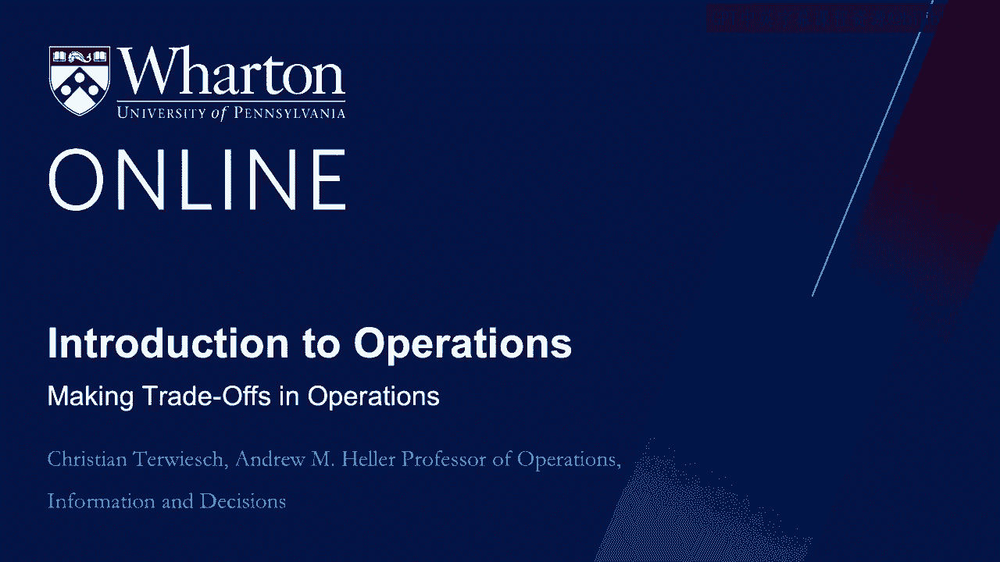
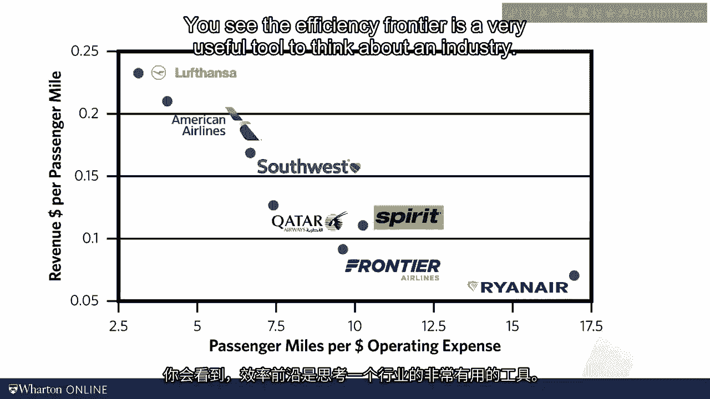

# 沃顿商学院《商务基础》课程｜第117讲：运营中的权衡利弊 📊

在本节课中，我们将探讨如何在运营管理中平衡成本与质量，理解效率边界的概念，并学习如何通过消除低效来提升客户支付意愿同时控制成本。

---

在上一节视频中，我们讨论了如何取悦客户，分析了由等待时间和不便地点带来的不便，以及由个人偏好匹配和质量相关元素驱动的消费效用。

本节中，我们来看看运营中的成本与质量权衡。

---

去年，我与中东的一位客户合作。这是我首次前往中东，行程仅三天。由于时间紧迫，我尝试白天工作，晚上稍作观光。加上时差影响，当我登上从多哈返回纽约的航班时，已筋疲力尽。幸运的是，客户慷慨地为我购买了卡塔尔航空的商务舱机票。我享用了丰盛的早餐，连续睡了十小时，床铺几乎如家中般舒适，又用了一餐，查看了电子邮件，然后抵达纽约。这是一次非凡的体验。

相比之下，乘坐易捷航空或瑞安航空的体验则截然不同。乘客挤在机舱内，行李无处安放，机组人员的服务态度也与豪华航空公司不同。但值得一提的是，从英国飞往西班牙的航班票价可能比在费城一家高级餐厅用餐更便宜。

从运营角度看，哪家航空公司更优？是高支付意愿的航空公司如卡塔尔航空，还是提供廉价服务的瑞安航空？

在本幻灯片中，我汇总了一些全球大型航空公司的数据。美国航空公司受监管，因此可以获取相当详细的运营数据。为简化起见，此处我仅关注每家航空公司的两个变量：

*   **航空公司收益**：由航空公司总收入除以提供的总客运里程数得出。
*   **运营费用**：指与客运相关的所有运营费用，同样除以总客运里程数。

请暂时忘记“收益”一词在其他领域的含义，在此上下文中，它主要体现客户为每英里旅行愿意支付的金额。

现在，请暂停视频一分钟，思考一下：这些数据点分别对应哪家航空公司？

---

好了，欢迎回来。以下是答案，看看你是否答对。

我们稍后再详细讨论这些航空数据。现在，先观察以下结论：

一家航空公司可以提供优质服务，通过质量竞争来获取高支付意愿。如果做得好，即使成本稍高也能盈利。反之，航空公司也可以专注于效率。如果管理得当，即使提供极具竞争力的低价，也能实现盈利。

如果你学习战略或营销课程，会学到许多帮助你在成本与质量间进行权衡的工具。在本课程中，我想采取一个略有不同的视角。

---

每个企业都面临着成本与支付意愿之间的权衡，这被称为**成本-质量权衡**。

考虑以下例子：德国铁路系统正在进行运营转型。他们正在改进其成本中心（如呼叫中心）的运营。在成本中心，等待时间是影响支付意愿的一个重要子维度。谁喜欢听着单调的音乐等待呢？

假设他们当前的表现位于下图中的位置（横轴代表每次通话的完成成本，纵轴代表响应速度/等待时间短）。

运营一个等待时间短的呼叫中心其实很容易：只需额外雇佣一百名客服代表，等待时间就会下降。但不幸的是，等待时间下降的同时，每次通话的完成成本将会上升。

反之，削减呼叫中心成本也很容易：减少员工数量，让更少的客服在岗。这会降低每次通话的成本，但显然会导致服务恶化，因为客户等待时间将变长。这同样是一种权衡。

---

一种看待运营管理的方式是将其视为**战略执行工具**：你告诉我你希望在这条曲线上处于什么位置，我就能为你构建实现该目标的运营体系。

但还有另一种思考方式：设想我们进行一些基准测试。我们遍历行业，收集每个呼叫中心关于效率和等待时间的信息。我们自身的位置在这里。

我们首先对标呼叫中心A。A的响应时间比我们短，但成本效率比我们差。这可以理解，他们在成本-质量权衡上与我们选择不同，雇佣了更多客服。

接着我们看呼叫中心B。他们的等待时间更长，响应速度更低，但成本也更低。他们并非无能，而是通过压缩成本实现了更高效率的运营。

然后我们看竞争对手C。这时我们感到困惑：这个呼叫中心提供的服务比我们好，同时效率也比我们高。也许他们的响应时间不如A短，成本不如B低，但与我们相比，他们更快、更高效。

学术上称这种情况为：竞争对手C**帕累托占优**于我们。

进一步用学术术语定义：将所有不被其他任何运营实体帕累托占优的运营实体连接起来，这条线被称为**效率边界**。是的，成本与质量之间存在权衡，但效率边界上的企业是精英集合，没有其他企业能以更低的成本提供更好的服务。

遗憾的是，我们自己的呼叫中心不在效率边界上。我们可以将自身的低效可视化为我们与边界之间的距离。

低效对我们有两方面影响：
1.  好消息是：我们有理由相信，我们可以在提升服务质量的同时降低成本。我们可以成为更好的运营体系和成本中心。这将是一个双赢局面。
2.  挑战在于：要向右上方（更高效、更优质）移动，我们必须克服部分或全部低效。这需要我们付出努力，提升自身能力，改进工作方式。

---

现在，让我们回到航空公司的数据。下图展示了美国主要航空公司及部分全球航空公司的数据。请注意，这并非严谨的科学研究，仅作示例说明。

你如何看待这张图？如果你在求职、进行股权投资或担任管理顾问，审视这张图时会思考什么？

效率边界对于思考一个行业的结构非常有帮助。

---

好了，本节内容到此为止。在本视频中，我们超越了仅仅取悦客户的层面。是的，我们希望提高支付意愿，但必须在实现合理完成成本的前提下做到这一点。为此，我们必须消除运营中的低效。

在下一个视频中，我们将讨论这些低效的具体表现。本课程的整个目的就在于对抗这些低效。正如之前所说，我们希望让事情变得更好，这意味着**以更低的完成成本获得更高的支付意愿**。

下次见。