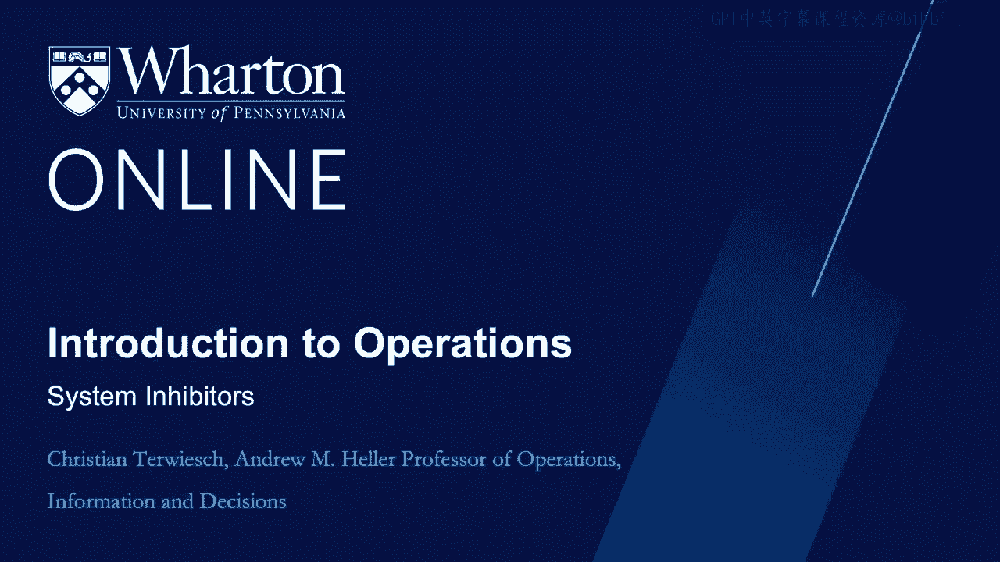
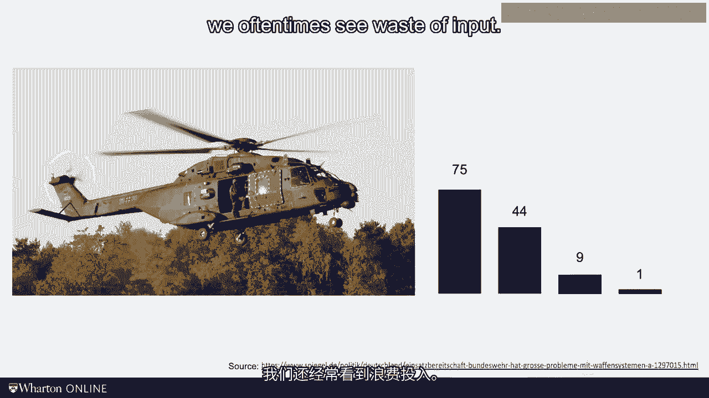

# 沃顿商学院《商务基础》课程笔记｜第118讲：三大系统抑制因素 🚫

在上一节视频中，我们介绍了效率边界、帕累托优势以及低效率的概念。我必须承认，将低效率定义为公司当前表现与效率边界之间的差距，这种说法相当学术和抽象。在本节视频中，我们将进行更具体的探讨。

具体来说，我将以三种系统抑制因素的形式来定义低效率，它们分别是：**浪费**、**可变性**和**不灵活性**。这三种系统抑制因素将使低效率的概念变得更具体、更可感知。这就像从三万英尺高空的战略和经济视角，降落到具体运营的层面。

作为企业主或管理顾问，了解自己相对于效率边界的位置固然重要。但为了做出改进，你必须更具体。你必须卷起袖子，直接解决低效率问题。为此，你需要知道这些低效率具体是什么样子。

---

## 1. 浪费 🗑️

浪费指的是所有消耗了投入和资源，但**并未为客户增加价值**的活动。由于浪费消耗了投入和资源，因此它是有成本的。但由于它没有为客户增加价值，客户不愿意为此付费。

我们将在本课程后续部分详细讨论浪费，但让我们从一个具体例子开始。你是否知道德国军方的大多数直升机都不在飞行状态？德国拥有75架NH90型直升机。猜猜现在有多少架正在飞行？

实际上，75架中只有44架可用，其余的在制造商处进行维修或保养。在这44架由德国联邦国防军持有的直升机中，只有9架目前获得了飞行认证。由于直升机每天只飞行几个小时，很可能现在没有一架在空中飞行。这些直升机每架成本为7000万欧元，这无疑是一种资源浪费。

除了浪费资源的时间和可用性，我们也经常看到投入的浪费。美国食品药品监督管理局估计，大约30%到40%的美国食品供应在供应链中被浪费。这相当于1600亿美元，更不用说那些无法获得健康食品的人们。

更糟糕的是，据估计，这个国家使用的能源中，超过一半被浪费了。你可以从劳伦斯利弗莫尔国家实验室研究人员的这个学校可视化中看到这一点。我们谈论的浪费价值数千亿美元，并对环境产生巨大影响。

正如我们将在本课程中看到的，仅仅是测量和量化这种浪费，就已经是减少它的第一步。现在，请记住：**浪费是消耗了投入和资源但未为客户增加价值的活动**。

---

## 2. 可变性 📊

上一节我们介绍了浪费，本节中我们来看看可变性。可变性对应于需求或供应随时间发生的变化。

首先考虑与客户需求相关的可变性。这里你看到的是从2019年春季开始的美国航空旅行需求。由于新冠疫情，航空旅行需求暴跌。即使没有疫情，消费者需求也变化迅速。时尚趋势、新技术、消费者信心，甚至天气，都会导致产品或服务的需求不断起伏。

以我们费城本地为例，考虑我们城市枪击事件的频率。不幸的是，这转化为对我们急诊室和创伤中心的需求。你可以在这里看到每月的变化。我在宾大急诊室工作的朋友们对此有一个非常愤世嫉俗的看法：当天气变好时，人们走上街头，更多的人被枪击。此外，摩托车事故带来的额外需求也会增加。当创伤床位满员时，如果天气好，情况会更糟。

可变性也体现在供应方面。看看这张急诊医生的图表。他们都在同一个急诊室工作，处理的都是非常相似类型的病人。然而，正如我的同事在一项研究中所示，这些医生处理病人的方式彼此差异很大。在这项研究中，他们观察了病人被留在急诊室的时间，这个数字被称为“停留时长”。你可以看到，有些医生让病人停留的时间明显长于其他医生。我不是在评判他们的行为，我只是观察到不同提供者之间存在可变性。

此外，医生或任何资源可能会疲劳，机器可能会故障，这都带来了比我们期望更多的供应侧可变性。

因此，可变性来自需求和供应两方面。无论哪种方式，可变性通常都是一件坏事。正如我们所见，需求可以快速变化。不幸的是，供应却不能。供应——即工厂、律师、建筑、核磁共振机和其他资源——这些资源不能快速增加，然后又很快撤走。

---

## 3. 不灵活性 🔒

上一节我们讨论了可变性，本节我们探讨不灵活性。可变性之所以成为问题，一个关键原因在于供应往往无法灵活调整。这就引出了我们的第三个系统抑制因素：不灵活性。

网约车公司Uber之所以如此成功，其中一个原因就是能够根据客户需求的变化调整其运力。如果需求高，价格上涨，更多司机会加入市场。Uber称之为“峰时定价”。如果需求低，价格下降。与出租车不同，Uber司机不需要支付昂贵的牌照费，因此他们可以转而做其他事情，而不是在市场上争夺少数几个客户。

你可以在下图中看到结果。Uber和其他网约车公司能够灵活调整他们提供的乘车服务数量，以应对一周内可预测的乘车需求变化。越早预测到这种额外的乘车需求，就越能更好地召集所需的司机来应对。一个下雨的周六晚上比一个周二的午间需要更多的司机。无论你是否喜欢Uber和Lyft，它们利用虚拟车队在需要时提供运力方面做得不错。这被称为**数量灵活性**。

灵活性的另一种形式涉及让运营能够用同一流程服务不同类型的客户。正如你将在本课程中看到的，我对电动汽车很感兴趣。特斯拉当然是在只生产电动汽车的工厂制造的。但是那些同时销售内燃机汽车和电动汽车的汽车公司呢？

例如，大众汽车决定让工厂专注于一种发动机类型。德国的茨维考工厂完全专注于电动出行。相比之下，大众的大多数工厂都专注于内燃机。至于梅赛德斯-奔驰，他们最初决定将电动汽车生产与内燃机汽车混合进行，无论好坏。同一条装配线，在同一天，甚至在同一个时间，混合生产电动和非电动汽车。能够将机器或工人用于不同目的提供了第二种形式的灵活性，我称之为**混合灵活性**。

因此，不灵活性阻碍了我们的运营有效应对可变性，因此我们称其为第三个系统抑制因素。

---

## 总结与学习目标 🎯

以上就是三大系统抑制因素：**浪费**、**可变性**和**不灵活性**。这些力量造成的成本超乎你我的想象。在大型全球性行业中，我们谈论的是数十亿美元。但你知道吗？我个人根本不在乎那些钱。对社会的真正成本比这大得多。

通常报告的财务数字不包括无法获得护理的病人的焦虑、因无法获得高质量教育而错失机会的儿童，或者由于我们在食品和能源供应链中浪费资源而对地球造成的损害。

冒着有点说教的危险，我想说：运营管理的承诺在于此。我们可以通过对抗浪费、可变性和不灵活性的负面影响，来改善人们的工作方式。这永远是一件好事。

在本模块结束前，我想养成一个习惯，为每个模块定义学习目标。这样你可以在模块结束时测试自己是否完成了我希望你掌握的内容。

**在本模块中，我们讨论了：**
*   支付意愿的驱动因素。
*   效率边界。
*   三大系统抑制因素（浪费、可变性、不灵活性）。

我们介绍了一些关键定义，但还没有涉及公式。不过别习惯这一点，很快就会改变的。

我们下个模块见。