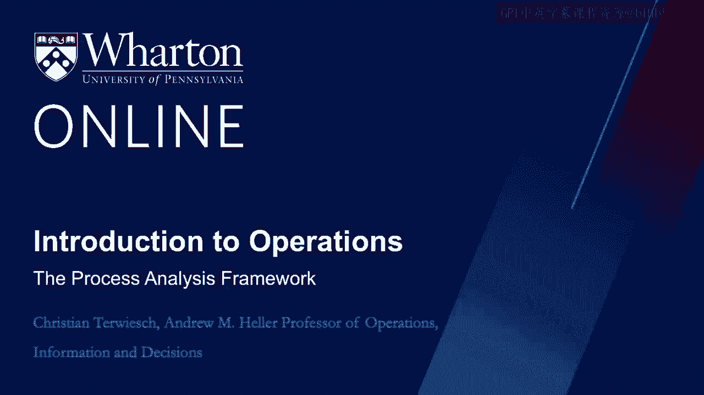
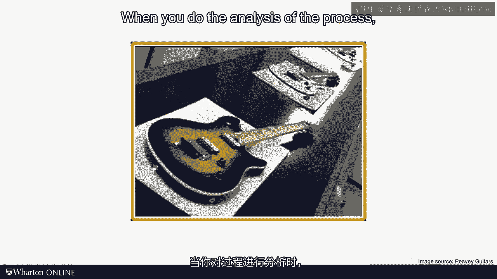
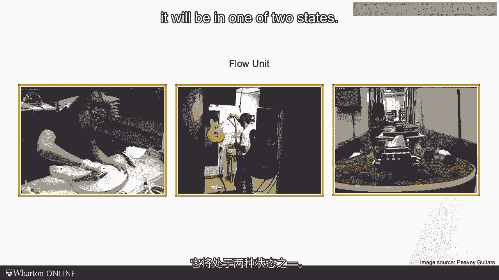
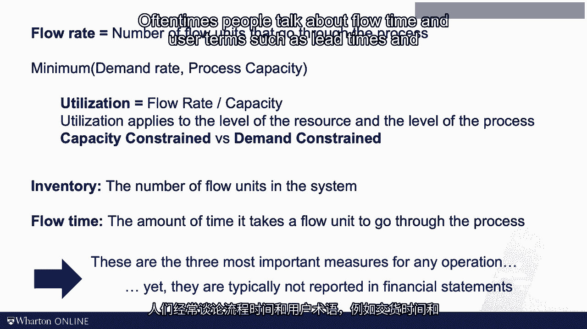

# 沃顿商学院《商务基础》课程笔记｜第119讲：过程分析框架 🧭

在本节课中，我们将学习运营管理的核心分析工具——过程分析框架。我们将了解如何将一个复杂的运营系统分解为可分析的组成部分，并定义一系列关键指标来评估和改进其绩效。

---

运营管理关注的是人与机器协同工作的方式。

“现场现物”（Genchi Genbutsu）是著名的丰田生产体系中的一个概念。它的意思是“亲自去现场查看”。其传达的信息是，为了真正理解问题，你必须到工作发生的现场去观察，而不是坐在办公室或会议室里空想。

从三万英尺的高空俯瞰，所有公司看起来都大同小异：它们创造产品或服务，并希望以高于成本的价格将其售出。然而，在地面层面，即零英尺的视角，每一项运营都是独特的。本课程的目的不是学习某个特定运营的独特性，而是为你提供**可推广的工具和框架**，让你能将其应用于职业生涯中遇到的多种场景。

因此，本课程采取的视角，是介于三万英尺的战略高度和具体岗位的前线视角之间的一种折中，或许可以称之为**五千英尺的视角**。在这个层面上，我希望你思考**工作得以完成的过程**。

**过程分析**正是本课程中我将用来分析和改进运营的一个框架。

---

## 过程的核心构成

每一个运营都可以被看作一个**过程**。一个过程有**输入**和**输出**。下图展示了一个吉他工厂的流程，你可以看到木材流入，吉他流出。

### 流动单元

在进行过程分析时，你必须选择一个**流动单元**。

流动单元是你追踪其在过程中旅程的**基本分析单位**。

在吉他工厂，流动单元是一把吉他；在医院，流动单元是一位病人；在大型精炼厂，流动单元可能是一吨矿石或一吨钢材。

### 资源与等待

当流动单元从输入向输出移动时，它会处于两种状态之一。

1.  **与资源在一起**：资源在过程流程图中用一个方框表示。资源（如机器或人员）为流动单元增加价值，帮助其完成从输入到输出的旅程。
2.  **等待**：大多数时候，流动单元只是闲置着，什么也不做。我们用三角形符号来可视化这种状态，就像一堆东西堆在那里。

箭头则用来捕捉流动的方向。因此，一个**过程流程图**其实就是一张地图，它描绘了流动单元从输入到输出的旅程。

---

## 关键绩效指标：时间与产能

在每一个资源处，流动单元都需要花费一些时间，我们称之为**处理时间**。例如，医生进行一次初级诊疗可能需要20分钟。

我们不只看处理时间，还可以看其倒数，我称之为**产能**。

**产能 = 1 / 处理时间**

例如，一位医生20分钟看一位病人，其产能就是 **1/20 位病人每分钟**。产能告诉我们一个资源单位时间内能处理多少个流动单元。

假设你只有一个医生或一台机器。这可以推广到多个（M个）相同资源的情况，此时该资源池的总产能计算公式为：

**资源池产能 = M / 处理时间**

---

## 瓶颈：过程的制约点

一条链的强度取决于其最薄弱的一环。在过程的旅程中，总会有一个资源拥有**最低的产能**，我们称这个资源为**瓶颈**。

整个过程的流量无法超过瓶颈的产能。因此，**过程产能 = 瓶颈的产能**。

---

## 三大核心绩效指标

以此为基础，我们现在可以定义任何过程中最重要的三个衡量指标：**流动率、库存和流动时间**。

### 1. 流动率

流动率常被称为**吞吐量**，两者可互换使用。它衡量的是单位时间内有多少流动单元通过整个过程。

*   例如：急诊室每天处理100位病人；汽车厂每班次生产1000辆汽车；钢厂每月产出5万吨钢材。

流动率取决于两个因素：**过程产能**（由瓶颈决定）和**需求率**。实际流动率是这两者中较小的那个。

**实际流动率 = min(过程产能， 需求率)**

根据制约因素的不同，我们说一个过程是**产能制约型**（受限于瓶颈）或**需求制约型**（受限于市场需求）。

### 2. 利用率

一旦知道了流动率，你就可以计算**利用率**。

**利用率 = 流动率 / 产能**

它衡量的是实际产出（流动率）占最大可能产出（产能）的比例。利用率可以针对单个资源，也可以针对整个过程。根据定义，利用率永远不会超过100%。

### 3. 库存

库存是**系统中流动单元的数量**。请注意，这与会计学中的“库存”概念不同。例如在医院，流动单元是病人，那么系统中所有在候诊室和检查室的病人数量就是运营视角下的库存。

### 4. 流动时间

流动时间衡量的是**一个流动单元从过程开始到结束所需的总时间**。它不仅包括在资源处接受处理的工作时间，还包括**所有在库存中闲置等待的时间**。在许多过程中（如医院就诊、申请抵押贷款），流动单元大部分时间其实是在等待，而非被处理。

---

## 指标间的关系与重要性

流动率、库存和流动时间是我认为任何过程中最重要的指标。虽然它们不直接出现在财务报表上，但显而易见：
*   **流动率 × 价格 = 收入**
*   **库存**对营运资本和生产率有巨大影响。
*   **流动时间**直接关系到我们在导论模块中讨论过的“延迟”带来的不便。

关于流动时间，人们常用“前置时间”或“周期时间”等术语，但这些术语在不同行业用法差异很大，且与“流动时间”概念不同，因此我们目前暂不引入，先坚持使用“流动时间”。

---

## 总结与下节预告

本节课我们学习了许多定义：
*   我们讨论了**流动单元、资源和过程流程图**。
*   我们定义了**库存、流动率和流动时间**这三大核心指标。
*   我们引入了**产能、利用率**的概念，以及最重要的**瓶颈**思想。

如果让我从中选一个最喜爱的概念，那就是**瓶颈**。每一个过程的好坏都取决于其瓶颈。这有点像自行车队的团队计时赛，车队的成绩不取决于第一个过线的车手，而取决于较弱的车手。因此，当你想要改进一个受产能制约的运营时，你的首要任务就是**找到瓶颈**。

在下一讲中，我们将通过具体的计算练习来巩固这些定义。

---

**本节课中，我们一起学习了过程分析的基本框架，理解了如何将运营分解为输入、输出、资源和流动单元，并掌握了评估过程绩效的三个核心指标（流动率、库存、流动时间）以及识别过程制约点（瓶颈）的关键方法。**