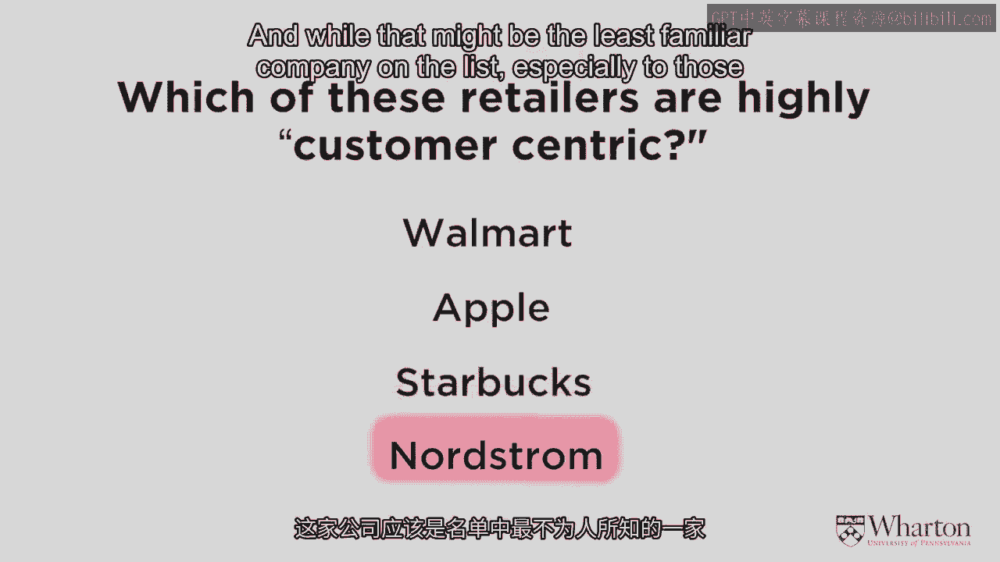
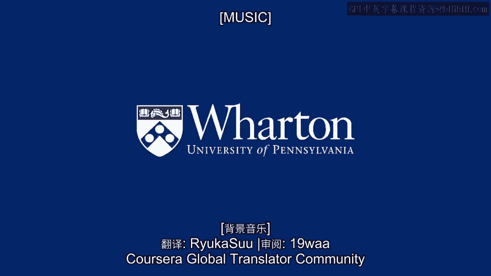

# 沃顿商学院《商务基础》课程 P12：哪些公司以客户为中心？ 🏢➡️👥

在本节课中，我们将探讨“以客户为中心”的真正含义。我们将通过分析沃尔玛、苹果、星巴克和诺德斯特龙这四家知名公司的案例，来理解它们是否以及如何实践以客户为中心的理念。上一节我们讨论了产品中心化的局限，本节我们将转向其对立面。

---

## 概述

以客户为中心是一种商业策略，其核心是将客户的需求、偏好和长期价值置于企业决策的中心。这与之前讨论的、以产品性能和运营效率为核心的产品中心化模式形成对比。我们将通过具体案例来辨析这两种模式。

---

## 案例分析：四家知名零售商

以下是四家全球知名的零售商。请根据我们目前的讨论，思考“以客户为中心”的含义，并判断哪些公司符合这一标准。

*   **沃尔玛**
*   **苹果**
*   **星巴克**
*   **诺德斯特龙**

根据我的分析，**这四家公司都不是真正意义上的、完全以客户为中心的企业**。我钦佩所有这些公司，也是它们的顾客，但它们各自因不同的原因未能达到这一标准。让我们逐一分析。

### 1. 沃尔玛：卓越运营的典范

沃尔玛是一家出色的公司，但它对**单个客户**的了解 surprisingly 很少。与哈拉斯娱乐公司或乐购等零售商不同，沃尔玛没有忠诚度计划，也几乎不致力于追踪和影响个体客户行为。

然而，沃尔玛非常擅长从整体上理解客户。它能把握区域差异，预测如飓风来袭等事件下的需求变化。其商业模式的核心是**大批量销售和降低成本**。

**公式：沃尔玛模式 ≈ 高销量 × 低成本**

因此，沃尔玛是典型且非常成功的**产品中心化**公司。它专注于提供能大量销售、从而降低成本的商品。不过，沃尔玛也开始尝试一些边际创新，例如“Scan and Go”手机应用，在提升运营效率的同时，也开始收集个体客户数据。

**过渡**：与沃尔玛类似，苹果也是产品中心化的佼佼者，但它的路径是追求性能卓越。

### 2. 苹果：性能至上的领导者

苹果是经典的**性能优越型**公司。它不花费大量时间做市场调研来精确了解客户需求，也不专注于细分的、颗粒化的客户分析。

苹果的核心是**利用其产品专业知识**，基于现有产品思考下一代产品的开发。这同样是产品中心化的体现，并且苹果在这方面做得比地球上大多数公司都好。

当然，苹果也开始通过iTunes追踪音乐偏好、在零售店收集数据等方式，逐步更细致地了解客户。如果未来竞争加剧，苹果或许能转型为优秀的以客户为中心的公司，但目前这并非其业务的核心关键。

**过渡**：星巴克的情况则呈现出一种有趣的矛盾，它在不同层面表现出不同的特性。

### 3. 星巴克：本地与全球的悖论

在**本地层面**，星巴克（或任何咖啡店）可以非常以客户为中心。熟悉的咖啡师了解你的饮品偏好，甚至通过闲聊知道你的喜好，并可能给出与你生活相关的建议——即使星巴克从中赚不到一分钱。这就是以客户为中心：成为值得信赖的顾问，锁定重要客户。

但在**全国或全球层面**，星巴克则并非如此。你的星享卡在另一家店可能毫无意义，店员无法识别你的身份和历史，因此难以提供个性化服务或建议。

**核心概念**：真正的以客户为中心，要求公司能够**跨渠道、跨触点**识别客户、评估其价值并提供建议。星巴克已认识到这一点，正在开发技术以整合客户在不同门店和触点的数据。

**过渡**：最后，我们来看诺德斯特龙，它的案例能帮助我们更深刻地理解以客户为中心的本质。

### 4. 诺德斯特龙：卓越服务与价值判断

诺德斯特龙是美国高端百货商店。有一个广为流传的故事：一位顾客走进阿拉斯加的诺德斯特龙店，要求退一套显然不可能在该店购买的轮胎。而诺德斯特龙“极其以客户为中心地”为他办理了退款。

这真的是以客户为中心吗？还是有点愚蠢？在大多数情况下，这可能是个坏主意。那么，在什么情况下这样做是合理的呢？

答案是：**当这位客户的未来价值（终身价值）极高时**。如果我们预期这位客户未来会带来巨大价值，而今天不退款就会失去他，那么退款就是合理的。

**公式：决策依据 = 客户终身价值 > 退款成本**

诺德斯特龙的问题在于，它提供了**无差别的卓越服务**，对每位顾客都极好，而**没有着力去区分和判断每位顾客的未来价值**。在以前这难以做到，但如今，诺德斯特龙和其他零售商一样，有能力通过数据和技术进行更精准的筛选，判断谁值得获得特殊待遇。

---

## 总结

本节课我们一起分析了四家知名公司：
*   **沃尔玛**和**苹果**是成功的产品中心化公司，分别专注于**运营卓越**和**性能优越**，仅边际性地涉足客户中心化。
*   **星巴克**在本地层面体现客户中心化，但在全球整合客户数据方面仍有挑战。
*   **诺德斯特龙**提供了无差别的卓越服务，但缺乏基于**客户终身价值**的精准区分，这体现了产品（服务）导向与客户价值导向的碰撞。

通过这些案例，我们初步看到，真正的以客户为中心，要求企业能够**跨触点识别客户**，并基于对客户**长期价值**的判断来差异化地配置资源和服务。下一节，我们将正式定义并深入探讨以客户为中心的内涵。