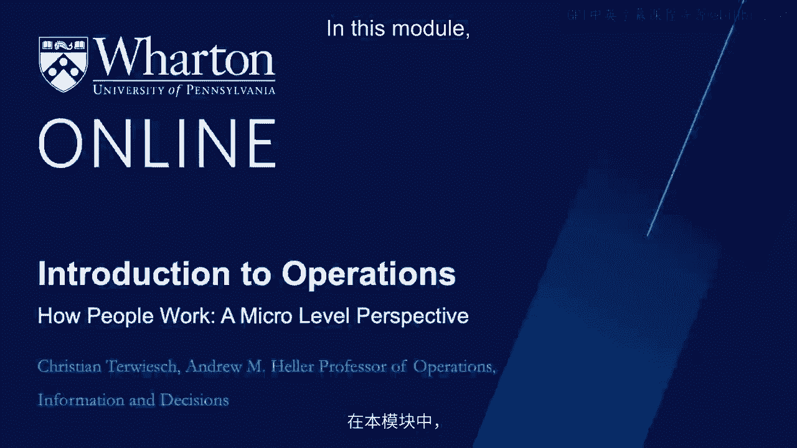
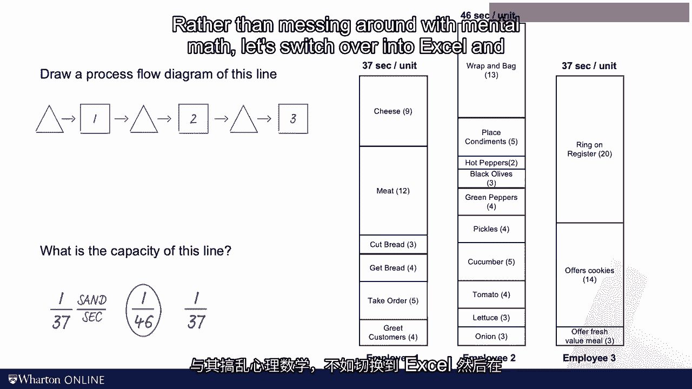
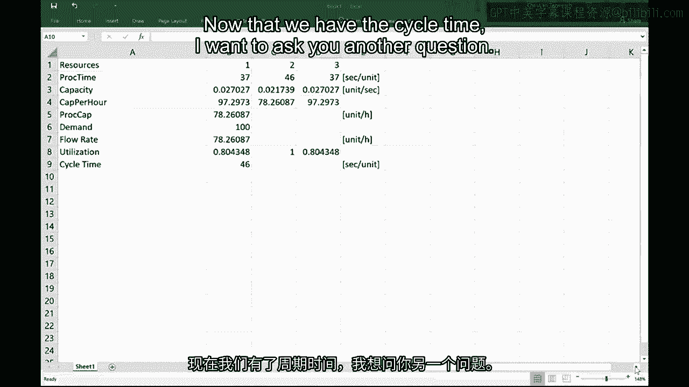
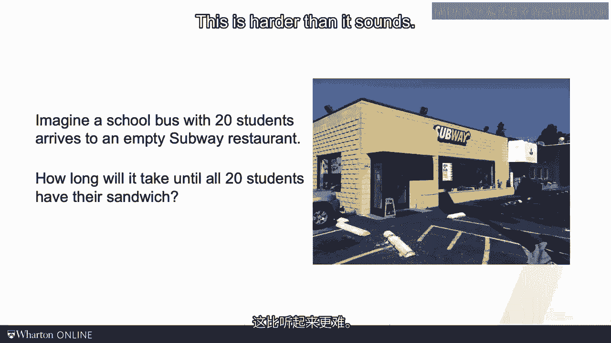
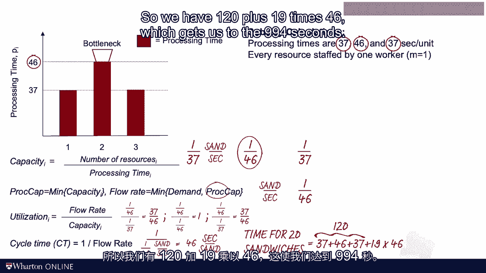

# 沃顿商学院《商务基础》课程 P122：6. 如何以微观角度看待工作 🧐

在本节课中，我们将从非常微观的层面来审视一个流程的运作。我们会拿起秒表，逐秒观察人们如何工作。为了便于理解，我们选择了赛百味餐厅作为本模块的案例研究。

## 案例研究：赛百味餐厅 🥪

我假设大家都曾在赛百味或类似的餐厅用餐，因此这应该是一个很好的案例。同时，我也假设我们每个人都为自己做过三明治。

除非你是专业厨师或有一个大家庭，否则你的经验通常是一次只做一个三明治。那么，你需要多长时间？你的加工时间是多少？切面包需要多久？

以下是赛百味官方提供的制作一个三明治所需的时间信息。这个时间会因三明治种类和员工的不同而略有差异，但我们现在暂且接受这些数字。

我们看到，每个三明治总共需要 **120秒** 的工作时间，也就是两分钟。换句话说，一名员工可以每两分钟制作一个三明治，即每小时 **30个**。这就是该员工的生产能力。

但是，当需求高于这个水平时，比如在繁忙的午餐时段，每小时可能需要 **80个** 甚至 **100个** 三明治，赛百味会怎么做呢？他们当然需要更多员工，但我们应该如何组织工作流程呢？

假设他们增加了两名员工，现在总共有三名员工。他们可以采取的一种方式是，让这三名员工中的每一位都从头到尾服务一位顾客，从问候顾客一直到结账。这样，每位员工服务一位顾客需要120秒。

然而，有趣的是，他们实际使用的流程并非如此。我们稍后会理解这背后的逻辑。

## 赛百味的实际流程：微型装配线 🏗️

现在，我们来看看他们实际在做什么。赛百味的做法是，不让一个人完成整个三明治的制作，而是让三个人参与这项工作。他们实际上建立了一个由员工一、二、三组成的微型三明治装配线。

以下是具体分工：
*   第一位员工负责问候顾客，然后完成从放奶酪开始的所有步骤。
*   第二位员工接手，从放洋葱开始，一直到包装和装袋三明治。
*   第三位员工则负责推荐超值套餐，然后操作收银机结账。

这样就完成了一位顾客的服务。现在，让我们看看具体的数字。我知道这是一种非常机械化的世界观，但正如你将看到的，这是一个很好的起点。

以下是每位员工处理一个三明治（单位）所需的确切时间（加工时间）：
*   员工一：**37秒/单位**
*   员工二：**46秒/单位**
*   员工三：**37秒/单位**

## 绘制流程图并计算产能 📊

接下来，我希望你绘制这个三明治微型装配线的流程图，然后思考这个流程的生产能力。请暂停视频，尝试自己完成。

好的，让我们一起来看。首先绘制流程图。

对于流程图，我们从一个代表等待顾客的三角形开始。然后是第一个方框，代表第一个资源，即员工一。之后可能有一个缓冲区。接着是员工二，即第二个资源方框。之后是另一个缓冲区，然后是员工三。这样就完成了流程图。我们共有三个资源。

接下来，思考这个流程的生产能力。要计算流程的生产能力，我必须找到瓶颈。瓶颈将出现在这三名员工中的一位身上。我们通过计算 **1 / 加工时间** 来找到每位员工的生产能力（单位/秒）。

*   员工一的生产能力：**1 / 37** 个三明治/秒
*   员工二的生产能力：**1 / 46** 个三明治/秒
*   员工三的生产能力：**1 / 37** 个三明治/秒

我们可以看到，最小的数字是 **1 / 46**。根据定义，这就是我们的瓶颈。

与其在脑海中计算，不如切换到Excel表格中进行。我们有三位员工，即三个资源。每位都有其加工时间：37、46、37秒/单位。请确保我们跟踪单位，这些都是“秒/单位”。

生产能力简单地是加工时间的倒数，即 **1 / 加工时间**。例如，1/37 ≈ 0.027。这个数字（单位/秒）很难解读，我建议将其转换为更易理解的“单位/小时”，只需乘以3600（一小时的秒数）。这样，员工一的生产能力约为97个三明治/小时。

流程的生产能力就是这些个体生产能力水平中的最小值，这就是瓶颈的概念。不出所料，瓶颈在工位二。流程生产能力是 **78单位/小时**。

## 计算流速、利用率和周期时间 ⏱️

从那里开始，我们接下来要考虑的是流速。流速是需求和能力之间的最小值。我们需要对需求率做一个假设。假设目前需求是每小时100个三明治，那么我们的流速就是这两个数字中较小的那个，即 **78单位/小时**。

我们还讨论了利用率的概念。利用率 = 流速 / 生产能力。因此，对于第一个资源，利用率约为80%。而其他资源的利用率分别为100%和80%。

为了建立直觉，想象一下如果我的需求率下降，比如每小时只有50位顾客，那么即使在瓶颈处，利用率也会下降到小于1，实际上会降到约63%。但现在，让我们回到需求为100的基础情况。所以，瓶颈处的利用率为100%，其他两个资源约为80%。

接下来，我想定义一个新的度量标准：**周期时间**。让我将周期时间定义为 **1 / 流速**。要非常小心单位。流速以“单位/小时”衡量，所以周期时间（1/流速）就是“小时/单位”。0.012778小时/单位很难解读，我建议将其转换回秒，即用一小时的3600秒除以78个三明治。

现在我们看到一些我希望是直观的东西：我们又回到了“秒/单位”，我们的周期时间是 **46秒/单位**。这意味着我们每46秒制作一个三明治。工作每46秒重复一次，我们循环制作新的三明治。

## 应用周期时间：服务一群顾客 🚌

现在我们有了周期时间，我想问你另一个问题。想象一下，一辆载有20个饥饿孩子的校车到达一家赛百味餐厅。每个孩子都想要一个三明治，而目前餐厅还很空。从空流程开始，制作20个三明治需要多长时间来满足这群人？这比听起来要难。

让我们系统地思考一下。服务第一个孩子需要多长时间？第一位顾客需要经过所有三个步骤：工位一37秒，工位二46秒，工位三37秒，总共 **120秒**。

那么第二位顾客会在多久之后被服务呢？想一想。第二位顾客将在 **46秒后** 出来。再过46秒，第三位顾客出来。从那时起，我们每46秒完成一个顾客订单。这正是周期时间的概念。

因此，要满足20位顾客，我们需要服务第一位顾客（120秒），然后还需要再经历19个周期时间来完成总共20个单位。总时间将是 **120秒 + 19 * 46秒 = 994秒**。

## 回顾与总结 📝

在继续前进之前，我想回顾一下我们刚才在Excel中所做的计算。记住，我们有这三个资源，加工时间为37、46和37秒/单位。

为了找到一个资源的生产能力，我们看该资源的并行服务器数量M除以加工时间。这里每个工位由一名员工负责，所以我的生产能力水平是1/37、1/46和1/37（三明治/秒）。这使得第二步的数字最小，因此员工二是瓶颈。

我的流程生产能力是1/46（三明治/秒）。我们假设有充足的需求，所以我的流速通常是需求和流程生产能力之间的最小值，这将由瓶颈的生产能力决定。

接下来，我查看利用率，利用率 = 流速（1/46） / 生产能力水平。所以对于第一个资源，是（1/46）/（1/37）= 37/46 ≈ 80%。对于第二个资源，是（1/46）/（1/46）= 100%。对于第三个员工，再次是（1/46）/（1/37）= 37/46 ≈ 80%。

然后，我们看了周期时间，即1/流速。流速是1/46，所以周期时间就是46秒/三明治。每46秒，流程重复一次。

最后，从空流程开始制作20个单位，我们必须先生产第一个三明治，这需要37+46+37=120秒。之后，我们需要额外制作19个三明治，每个周期46秒。所以总时间是120 + 19*46 = 994秒。

## 核心概念：周期时间 🔄

到目前为止，通过赛百味的案例，我们复习了产能计算，并引入了**周期时间**的概念。请注意“周期时间”这个词，我见过它在不同行业中被非常不同地使用。最重要的是，我遇到过一些公司用“周期时间”来表示我们所说的“流程时间”。毫不奇怪，我认为我的定义是正确的。

在我看来，“周期时间”这个词抓住了“循环”的概念。在我们的赛百味案例中，每46秒，流程重复一次；每46秒，一个新的周期开始。周期时间对于具有离散流动单位的流程特别有用。我不会在炼油厂或啤酒厂使用这个概念，它在处理顾客、小部件或三明治时效果更好。

周期时间帮助我们找出从空系统开始，生产一定数量单位需要多长时间。正如我们将要看到的，周期时间也将成为一些进一步生产力计算的核心。

说到进一步的计算，在下一个视频中，我们将更多地讨论劳动生产率的重要性。我将引入两个新的度量标准，然后将它们与财务绩效联系起来。下次见。