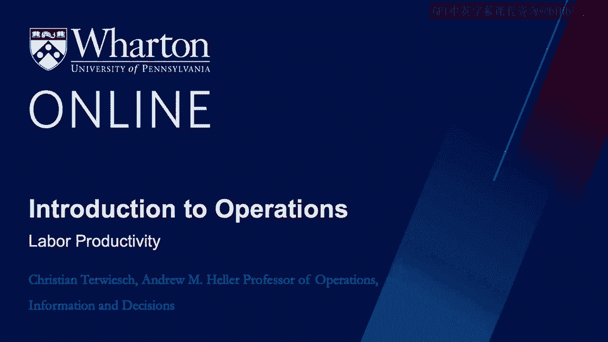
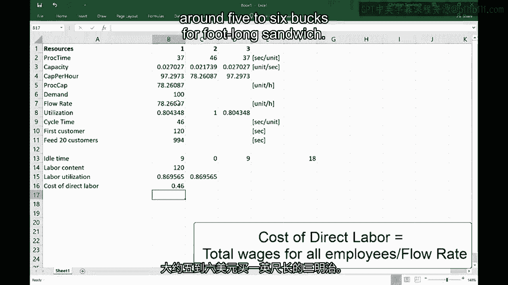

# 沃顿商学院《商务基础》课程｜第123讲：劳动生产率 📊

在本节课中，我们将学习劳动生产率的概念及其两种衡量方法：平均劳动力利用率和直接劳动力成本。我们将通过一个三明治店的运营模型，理解这些指标如何计算，并探讨提高劳动生产率为何对企业利润至关重要。

---

## 平均劳动力利用率 ⚖️

上一节我们介绍了流程中的瓶颈和闲置时间。本节中，我们来看看如何衡量劳动力的平衡利用情况。

平均劳动力利用率衡量的是流程中劳动力投入的有效程度，它关注的是**平衡性**。以下是计算步骤：

1.  **计算总闲置时间**：找出每个工作站因等待而产生的闲置时间，然后求和。
    *   公式：`总闲置时间 = Σ(周期时间 - 该工作站处理时间)`
    *   在我们的例子中，三个工作站的处理时间分别为37秒、46秒和37秒，周期时间由瓶颈（第二个工作站）决定，为46秒。
    *   因此，工作站1和3各有 `46 - 37 = 9` 秒闲置时间。
    *   总闲置时间为 `9 + 0 + 9 = 18` 秒。

2.  **计算劳动力含量**：这是生产一个单位产品所需的总劳动时间。
    *   公式：`劳动力含量 = Σ(各工作站处理时间)`
    *   在我们的例子中，`劳动力含量 = 37 + 46 + 37 = 120` 秒/三明治。

3.  **计算平均劳动力利用率**：将有效劳动时间（劳动力含量）与总支付劳动时间（劳动力含量 + 总闲置时间）进行比较。
    *   公式：`平均劳动力利用率 = 劳动力含量 / (劳动力含量 + 总闲置时间)`
    *   代入数据：`120 / (120 + 18) ≈ 86.9%`
    *   另一种等效算法是：`平均劳动力利用率 = 劳动力含量 / (工人数量 × 周期时间)`，即 `120 / (3 × 46) ≈ 86.9%`。

**注意**：高劳动力利用率仅代表流程平衡良好，并不意味着效率最高。如果所有工人都故意放慢速度以达到平衡，利用率可达100%，但产出会下降。

---

## 直接劳动力成本 💰

理解了劳动力利用的平衡性后，我们还需要一个衡量绝对效率的指标：直接劳动力成本。

直接劳动力成本衡量的是生产每单位产品所支付的工资成本。以下是计算方法：

1.  **确定总工资成本**：计算所有参与生产的工人在单位时间内的总工资。
    *   假设我们有3名工人，每小时工资均为12美元。
    *   总小时工资成本为 `3 × $12 = $36/小时`。

2.  **确定单位时间产出（流速）**：流速由瓶颈的处理时间决定。
    *   周期时间为46秒/三明治，因此每小时可生产 `3600秒 / 46秒 ≈ 78.26` 个三明治。

3.  **计算单位直接劳动力成本**：用总工资成本除以流速。
    *   公式：`单位直接劳动力成本 = 总工资成本 / 流速`
    *   代入数据：`$36/小时 / 78.26个/小时 ≈ $0.46/个`。

这意味着，每个售价约5-6美元的三明治中，直接劳动力成本约为46美分。

---

## 劳动生产率为何重要？ 🤔

你可能会问，在许多行业（如汽车制造业）的财务报表中，直接劳动力成本占比并不高，为什么我们还要如此关注劳动生产率？以下是两个关键原因：

1.  **成本在供应链中累积**：虽然像戴姆勒这样的整车厂，其报表上的直接劳动力成本可能只占总成本的一小部分（例如不到10%），但大部分成本（约70%）流向了供应商。这些供应商及其上游的二级、三级供应商，同样会产生大量的劳动力成本。当我们审视整个价值链时，劳动力相关的总成本占比会变得非常可观。因此，提高劳动生产率的影响会沿着供应链放大。

2.  **劳动生产率影响营收能力**：更重要的是，劳动生产率直接决定了流程的**产能**。在需求旺盛的情况下，瓶颈工位的速度限制了整体产出。

让我们回到三明治店的利润模型来具体说明：

*   **收入**：`流速 × 单价 = 78.26个/小时 × $6/个 ≈ $469.56/小时`
*   **成本**：
    *   食材成本：`78.26个/小时 × $2/个 = $156.52/小时`
    *   劳动力成本：`$36/小时`（已计算）
    *   固定成本（租金、保险等分摊）：`$250/小时`
*   **利润**：`$469.56 - $156.52 - $36 - $250 = $27.04/小时`

现在，假设我们通过培训或流程优化，将瓶颈工位的处理时间从46秒减少到43秒（仅提升约7%）。这将使流速提高到约 `3600/43 ≈ 83.72个/小时`。

重新计算利润：
*   新收入：`83.72 × $6 = $502.32`
*   新食材成本：`83.72 × $2 = $167.44`
*   劳动力成本不变（仍为$36），固定成本不变（$250）。
*   **新利润**：`$502.32 - $167.44 - $36 - $250 = $48.88/小时`

**利润从约27美元/小时提升至约49美元/小时，几乎翻倍！** 这巨大的提升并非来自削减工资，而是来自**因产能增加而带来的额外收入**。这揭示了提高劳动生产率的真正价值：它解除了瓶颈对营收的限制。

---

## 总结 📝

本节课中我们一起学习了：

1.  **平均劳动力利用率**：衡量流程中劳动力使用的平衡程度，计算公式为 `劳动力含量 / (工人数 × 周期时间)`。高利用率意味着闲置时间少，流程平衡。
2.  **直接劳动力成本**：衡量生产每单位产品所耗费的工资成本，计算公式为 `总工资成本 / 流速`。
3.  **劳动生产率的重要性**：
    *   **微观层面**：劳动力成本在整条价值链中累积，影响深远。
    *   **宏观层面**：在产能受限时，提高劳动生产率（尤其是瓶颈环节）能直接增加产出和营收，对利润的提升效果远超单纯节省的劳动力成本本身。

核心在于，提高劳动生产率不仅是为了降低成本，更是为了**释放产能、增加收入**。在接下来的视频中，我们将探讨具体的流程改进策略。在此之前，不妨观察一下你身边的流程，试着找出它的瓶颈所在。