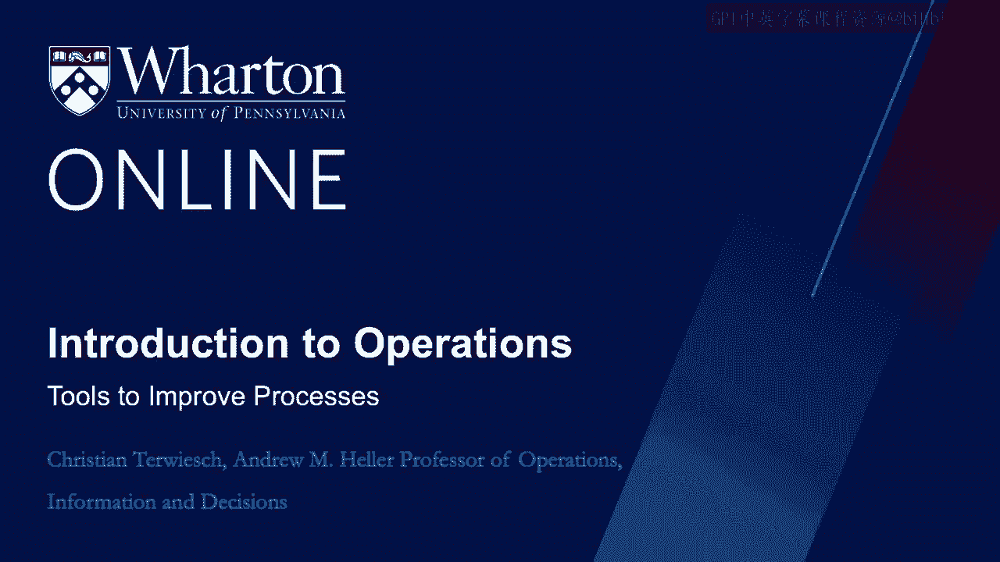
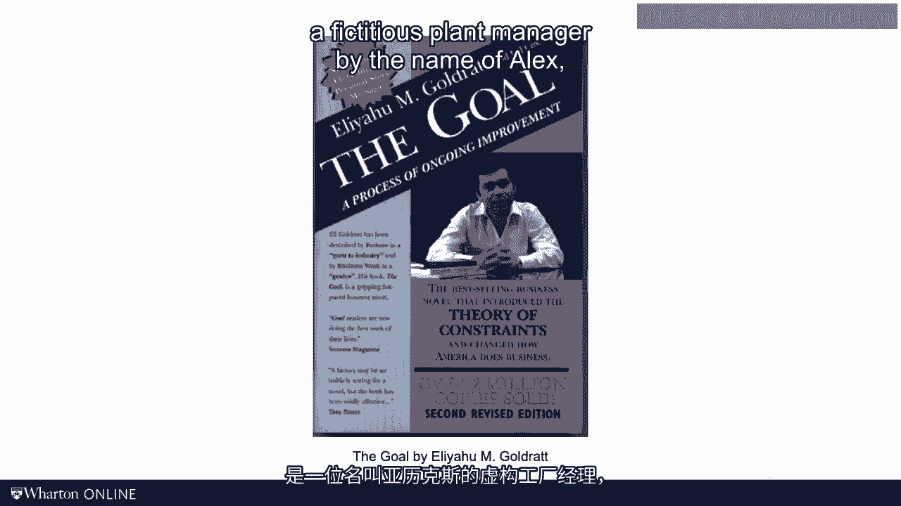
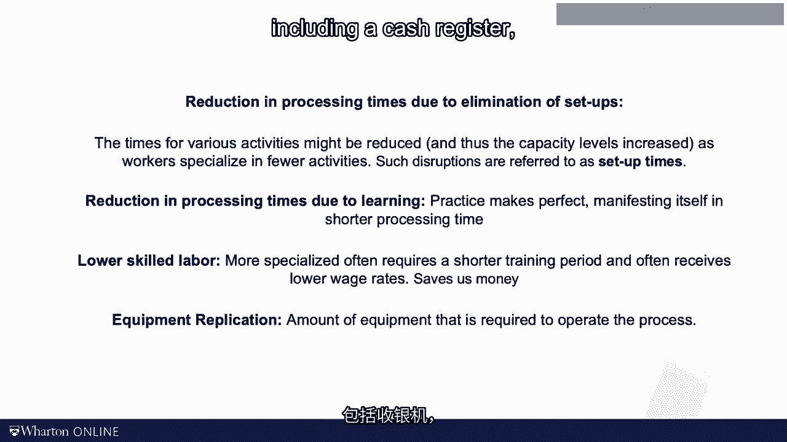

# 沃顿商学院《商务基础》课程｜第124讲：改进流程的三大工具 🛠️

在本节课中，我们将学习如何改进业务流程。我们将介绍三种核心工具：**瓶颈卸载**、**基于节拍时间的产线平衡**以及**专业化分工**。这些工具能帮助我们提升流程效率、降低成本并更好地满足需求。

---

## 瓶颈卸载：识别并解放最慢的环节

上一节我们学习了如何分析流程并计算闲置时间与劳动力利用率。本节中，我们来看看如何通过改进流程来提升效率。首先介绍的工具是**瓶颈卸载**。

1984年，艾利·高德拉特出版了一本非常成功的书，名为《目标》。这本书以小说的形式讲述了运营管理，其主人公是一位名叫亚历克斯的工厂经理。亚历克斯在带领一群童子军徒步时领悟了流程分析的原则。

童子军排成一列在狭窄的小径上行进。走得快的孩子走在前面，队伍逐渐拉长。一个名叫赫比的孩子拖慢了整个队伍的速度。亚历克斯发现，整个队伍的行进速度无法超过最慢的赫比，这就像工厂的产出无法超过瓶颈环节一样。

亚历克斯发现赫比走得慢不仅因为体力，还因为他背着一个装满零食的沉重背包。为了提升整体速度，亚历克斯将赫比背包里的东西分给其他走得快的孩子。虽然其他孩子速度也略有下降，但赫比能走得更快了，从而提升了整体速度。

这种将工作从瓶颈环节转移走的改进策略，就称为**瓶颈卸载**。瓶颈卸载可以通过多种方式实现：

以下是三种主要的瓶颈卸载方法：
1.  **重新分配活动**：将瓶颈环节的部分活动重新分配给其他有更多产能的资源。这也就是我们稍后会讲到的“产线平衡”。
2.  **自动化**：利用技术自动化瓶颈环节耗时的活动。例如，自动化包装纸的发放有可能减少第二名员工的加工时间。麦当劳在成为快餐帝国的过程中，其关键创新之一就是发明了调味品自动分配器，按一下按钮就能提供精确份量的番茄酱或蛋黄酱。
3.  **外包**：将瓶颈环节耗时的活动外包出去。想象一下，可以在轮班开始时预先在面包上涂抹好酱料，甚至直接购买已涂抹好酱料的面包。这将减少第二名员工的时间，鉴于该员工是瓶颈，从而能提升整个流程的产能。

---

## 产线平衡与节拍时间：让流程与需求同步

接下来，我们转向**产线平衡**和**节拍时间**的概念。在我们之前的计算中，三人生产线的产能约为每小时78个三明治。当需求更高时该怎么办？午餐时段繁忙的门店需求可能高达每小时160个三明治。显然，我们需要更多劳动力。

请思考两个问题：
1.  要满足每小时160个的需求，需要达到多长的**周期时间**？
2.  需要多少名员工？

我们来一起计算。要满足每小时160个三明治的需求，需要多长的周期时间？一小时有3600秒，需要在这段时间内制作160个三明治。

**公式：周期时间 = 可用时间 / 需求率**

计算如下：
`3600 秒/小时 ÷ 160 个/小时 = 22.5 秒/个`

这就是我们需要达到的周期时间。我们称这个数字为**节拍时间**。节拍时间反映了我们必须以多快的速度运行，以及必须以何种节奏操作才能与需求同步。这就是节拍的全部理念。

节拍时间还能帮助我们找出最低限度需要雇佣多少人。这个数字可能不精确，但能提供一个下限。逻辑如下：我们知道每个三明治包含120秒的劳动量，即我们的**劳动含量**。用它除以节拍时间。

**公式：目标人力 = 劳动含量 / 节拍时间**

计算如下：
`120 秒/个 ÷ 22.5 秒/个 = 5.33 人`

由于不能雇佣0.33个人，我们将其向上取整为6人。但正如我们稍后将看到的，即使6人可能也不够。原因是工作不能轻易被分割成更小的块。例如，收银操作需要20秒，这是一个无法轻易拆分或打包的块。

因此，当你将活动分配给各个资源时，即使瓶颈环节相对于节拍时间也会有一些闲置时间。**产线平衡**意味着你以节拍时间（本例中为22.5秒）为目标，将活动从迎接顾客到收银操作进行分配，并遵守一个约束：任何个人的加工时间都不能超过节拍时间。如果你发现超过了节拍时间，就把部分工作移给下一个资源，直到分配完毕。在这个例子中，我们实际上需要7名员工。

这里有一个微妙且可能违反直觉的地方：由于需求率，我们说即使瓶颈也会有一些闲置时间。但如果我们忽略这点，假设我们以瓶颈的速率运行（即每21秒生产一个单位），我们可以计算每个工人的闲置时间。随着专业化程度提高，闲置时间总量可能会增加。工人越多，越难达到完美的平衡。这确实有些反直觉。

---

## 专业化分工：权衡利弊

最后，我们来探讨**专业化分工**。著名的哲学家和经济学家亚当·斯密在18世纪就已经论述了专业化的好处。他观察了一家别针工厂，并精妙地捕捉了专业化的概念。

从别针工厂延伸到赛百味餐厅，专业化可能为我们带来至少四个方面的好处：

以下是专业化的四个主要优势：
1.  **减少切换时间，从而降低加工时间**：由于消除了作业切换，各项活动的时间可能减少，从而随着工人专注于更少的活动而提高产能水平。例如，一名从事所有活动的员工在切换接触三明治和操作收银机时可能需要脱下手套，这会增加其加工时间。而只操作收银机的员工则不会面临这种不便。这类中断通常被称为**准备时间**。
2.  **因学习效应而减少加工时间**：如果你每天切一千个西红柿，你很可能会变得非常熟练。简而言之，熟能生巧，这种熟练也体现在更短的加工时间上。
3.  **可能使用技能要求较低的劳动力**：更专业化的劳动力往往需要更短的培训时间，并且通常薪酬较低。教一名员工如何组装后视镜比教她如何组装整辆车所需时间更少。因此，即使专业化没有减少加工时间，它仍然可以为我们节省资金。
4.  **减少设备复制的需求**：专业化流程的另一个好处与运营流程所需的设备数量有关。如果采用完全并行化，即每个员工执行所有活动，将需要为每个员工配备自己的设备，包括相当昂贵的收银机。

当然，所有这些好处都必须与专业化的成本进行权衡。随着专业化，闲置时间会增加，这至少对我来说有些反直觉。此外，工人之间的协调需求和相互依赖性也在增加。如果只有一个员工会切西红柿，而这个人没来上班，就会出问题。相反，如果每个员工都能从头到尾制作整个三明治，我的流程会稳健得多。这对于三明治生产来说可能不是大事，但在当今全球化和相互依赖的供应链中生产汽车和手机时，这是一个超级热门的话题。

---

## 总结

本节课中，我们一起学习了三种改进业务流程的核心工具：
1.  **瓶颈卸载**：通过重新分配工作、自动化或外包来减轻瓶颈环节的负担，从而提升整体流程产能。
2.  **产线平衡与节拍时间**：根据需求设定目标节拍时间，并以此为依据分配工作，使流程与需求同步，同时计算出所需的最低人力目标。
3.  **专业化分工**：通过让员工专注于特定任务，可以获得减少切换与学习时间、降低劳动力技能要求和设备成本等好处，但需要权衡可能增加的闲置时间和协调复杂度。

掌握这些工具，将帮助你系统地分析和优化各类业务流程。