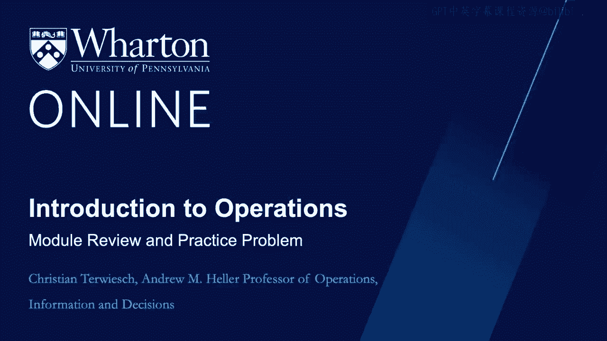
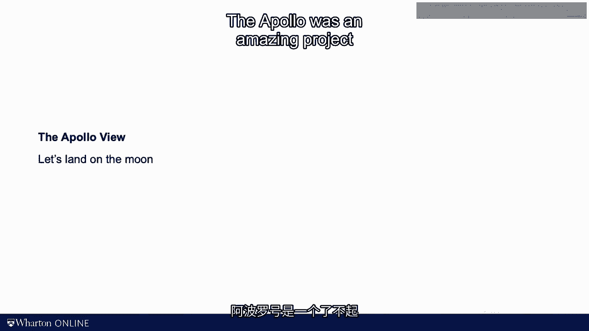
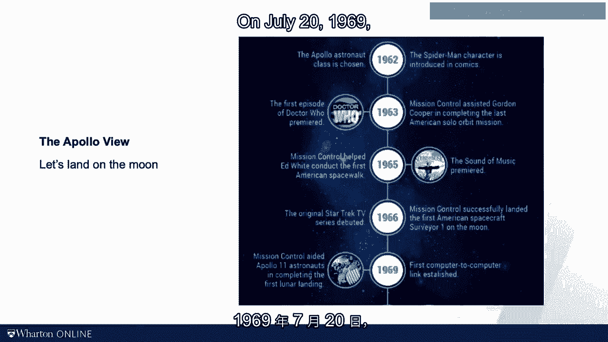
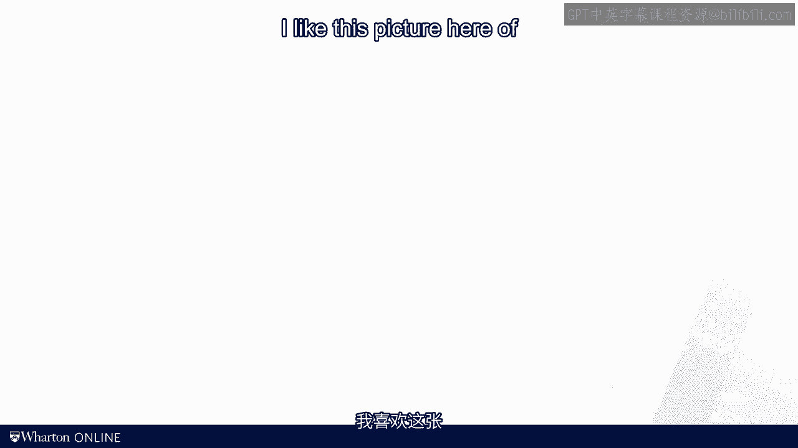

# 沃顿商学院《商务基础》课程｜第125讲：学习回顾与实践问题 🚀

在本节课中，我们将回顾本模块的核心概念，并通过一个实践问题来巩固所学知识。我们将重点关注流程分析中的关键指标，包括瓶颈、劳动力利用率、直接劳动力成本等，并探讨流程改进的策略。

---

## 回顾核心概念

上一节视频中，我们介绍了本模块涵盖的几个核心定义与公式。本节中，我们将通过一个具体问题来应用这些知识。

以下是本模块需要掌握的关键公式：

*   **劳动力含量** = 所有工作站处理时间之和。
*   **周期时间** = 瓶颈工作站的处理时间。
*   **劳动力利用率** = **劳动力含量** / (**工人数量** × **周期时间**)。
*   **直接劳动力成本** = (**工人数量** × **小时工资**) / **产出率**。

---

## 实践问题：K先生理发店

现在，我们来看一个与“潜水艇工作”案例类似的问题。这里有**五项活动**，但只有**三名工人**。活动分配情况如下：

*   **工人1**：迎宾与洗发（10分钟）。
*   **工人2**：理发（20分钟）。
*   **工人3**：造型（25分钟）与结账（5分钟）。

以下是需要解答的问题列表：

1.  流程的瓶颈在哪里？
2.  平均劳动力利用率是多少？
3.  如果小时工资为20美元，每位顾客的直接劳动力成本是多少？
4.  从系统空闲开始，服务10位顾客需要多长时间？
5.  如何通过转移瓶颈工作来改进流程？
6.  若想每天服务40位顾客，节拍时间是多少？
7.  目标人力是多少？

请先暂停视频，尝试自行解答。

---

### 问题解答与分析

**1. 确定瓶颈**

首先，我们绘制简单的流程图：工人1 -> 工人2 -> 工人3。

计算各工作站产能（顾客/分钟）：
*   工人1：1 / 10 = 0.1
*   工人2：1 / 20 = 0.05
*   工人3：1 / 30 ≈ 0.033

因此，**工人3（处理时间30分钟）是瓶颈**，周期时间为30分钟。

**2. 计算平均劳动力利用率**

方法一：使用公式 **劳动力含量 / (工人数 × 周期时间)**。
*   劳动力含量 = 10 + 20 + 30 = 60分钟。
*   分母 = 3 × 30 = 90分钟。
*   利用率 = 60 / 90 = **66.7%**。

方法二：计算总空闲时间。
*   工人1空闲：30 - 10 = 20分钟。
*   工人2空闲：30 - 20 = 10分钟。
*   工人3空闲：30 - 30 = 0分钟。
*   总空闲时间 = 30分钟。
*   利用率 = 60 / (60 + 30) = **66.7%**。

两种方法结果一致。

**3. 计算直接劳动力成本**

总小时工资成本 = 3人 × $20/小时 = $60/小时。
产出率（基于瓶颈）= 1位顾客 / 30分钟 = 2位顾客 / 小时。
直接劳动力成本 = $60/小时 ÷ 2位顾客/小时 = **$30/顾客**。

**4. 计算生产10位顾客的总时间**

生产第一位顾客的时间等于流程总处理时间：10 + 20 + 30 = 60分钟。
后续9位顾客以周期时间（30分钟）产出。
总时间 = 60分钟 + (9 × 30分钟) = **330分钟**。

**5. 流程改进策略**

问题提示通过“转移瓶颈工作”来改进。瓶颈是工人3。观察发现，工人3负责“造型”（25分钟）和“结账”（5分钟）。可以将“结账”（5分钟）活动转移给空闲时间较多的工人1。这能减少瓶颈的处理时间，从而缩短周期时间，提高产能。但需注意活动间的先后顺序约束。

**6. 计算节拍时间**

可用时间 = 10小时/天 = 600分钟/天。
目标需求 = 40位顾客/天。
节拍时间 = 可用时间 / 需求率 = 600分钟 / 40位顾客 = **15分钟/顾客**。

**7. 计算目标人力**

目标人力 = 劳动力含量 / 节拍时间 = 60分钟/顾客 ÷ 15分钟/顾客 = **4人**。
这是在理想无空闲情况下的最低人员配置。

---

## 项目管理与流程管理的区别 🚀🌕

今天的最后一个观察点，关于**项目管理**与**流程管理**的区别。

许多人可能有过管理项目的经验：定义活动、设定最终目标、寻找关键路径。埃隆·马斯克曾说过一个有趣的比喻：“飞往火星更像是一次‘诺曼底登陆’行动，而不是一次‘阿波罗’任务。”

*   **阿波罗登月**是一个惊人的**项目**，具有单一使命并取得了历史性成功。其管理重点是“让一个人登上月球”。
*   **诺曼底登陆**则不同，它不是关于登陆一艘船。其管理重点是持续、重复地运送大量士兵和装备上岸。

**流程管理**只有在重复做某事时才有意义。马斯克不想造一枚火箭飞往火星，他的梦想是在火星建立殖民地，这意味着要建造许多星舰。对于大多数只做一次的事情（如策划自己的婚礼），应使用项目管理。而需要多次重复的事情（如婚庆公司策划婚礼），则必须考虑流程。

例如：
*   戈特利布·戴姆勒制造第一辆汽车时，思考的是**项目**（造一辆好车）。
*   几十年后，亨利·福特大规模生产汽车时，思考的完全是**流程**（每分钟造一辆车）。
*   大型急诊室每天接待100-200名病人，这是一个**流程**。
*   丹尼尔·威廉姆斯博士进行第一例心脏手术时，很可能将其视为一个**项目**。

因此，当工作被重复时，当我们的焦点从第一个单元转向后续单元时，我们需要将管理重点从项目管理转向流程管理。这正是本课程的核心所在。

---

## 总结

本节课中，我们一起回顾了流程分析的核心概念，并通过K先生理发店的案例实践了如何计算瓶颈、劳动力利用率、直接劳动力成本、总生产时间等关键指标。我们还探讨了通过重新分配活动来改进流程的策略，并计算了给定需求下的节拍时间和目标人力。最后，我们深入探讨了项目管理与流程管理的根本区别，理解了流程思维在重复性业务中的重要性。