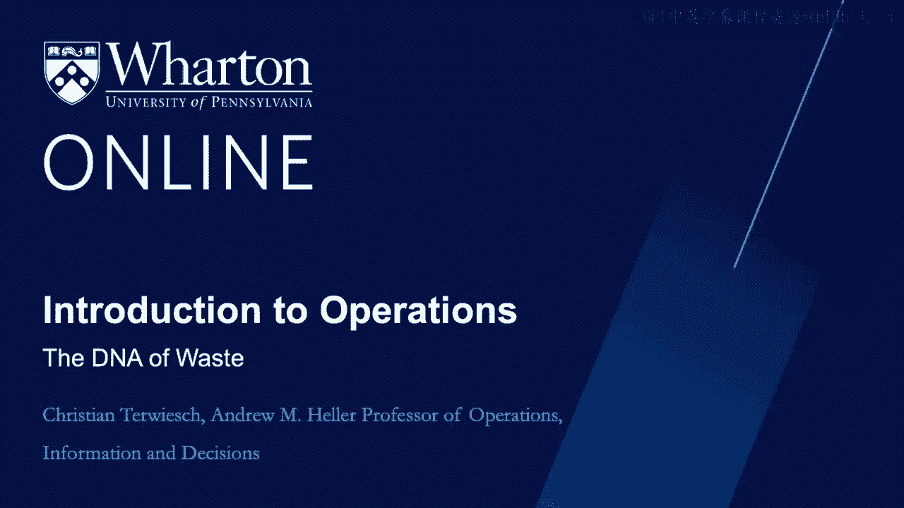

# 沃顿商学院《商务基础》课程｜第126讲：识别流程中的浪费 🧬

在本节课中，我们将学习精益运营的核心概念，目标是帮助你识别和分析流程中的浪费。尽管每个流程都有其独特性，但我们将发现寻找低效环节时存在一些共同模式。本模块的重点是让你学会识别浪费的“DNA”。课程中数学内容较少，但请勿因此低估精益思想的重要性。同时请注意，精益运营的理念贯穿本课程的所有模块，而不仅限于本节内容。

## 从个人经历谈起 🏥

和往常一样，让我用一个个人故事开始本模块。不久前，我需要接受一次使用造影剂的核磁共振检查，这是一个相对简单的放射科程序。我在宾夕法尼亚大学医学院放射科预约了上午10点的检查。

我于9点45分到达医院，在放射科报到并确认了预约时间。令我惊喜的是，医院像一些餐厅等位一样，给了我一个呼叫器。我当时想：“这挺酷的。”他们确实考虑了候诊体验。于是我拿着呼叫器坐下等待。

更让我高兴的是，大约15分钟后，在10点05分，呼叫器响了。我想，真快。但不幸的是，这并不是轮到我按预约时间进行检查，而是允许我正式办理登记手续。于是我在10点10分到不同的登记台办理了手续，然后回去继续等待。

10点20分，情况还不算太糟，护士最终叫到了我。我被指引到医院这边的更衣室。我换好衣服后继续等待，被困在一个无法关闭电视的房间里。最后，在11点钟，护士叫了我，并指引我前往影像室。我在影像室又等了大约20分钟，直到放射科医生出现。

他花了几分钟向我解释即将进行的操作。检查过程本身大约持续了10分钟。之后我被指引回更衣室，并被告知需要等待以确保影像结果合格。然后我终于可以换回便服，大约两小时后，在12点钟，我离开了医院。

现在让我问你：在我上午穿梭于医院的过程中，你在哪里看到了低效之处？我们将在本模块后续内容中回顾这个故事中的一些低效环节。

## 运营管理的两位大师 👨‍🏫

现在，我想介绍两位运营管理领域的大师。首先从弗雷德里克·温斯洛·泰勒开始。泰勒撰写了一本著名的著作《科学管理原理》，这本书写于一百多年前。

在对工人的研究中，泰勒相信细致和系统的观察。通常，他能够实现生产率的显著提升，这通常是通过减少浪费、为工作选择合适的人员和工具，以及设定正确的激励措施来实现的。

无论好坏，今天“泰勒主义”这个词不幸地更多地被用作一个贬义词。泰勒受欢迎程度下降的原因之一在于，他在涉及人类时关系处理得相当困难。他感兴趣的是工人的肌肉，而不是他们的大脑。

但请允许我与你分享《科学管理原理》中的两段引文。首先，泰勒写道：“我们能看到并感觉到材料的浪费。然而，人类笨拙、低效或方向错误的动作，却不会留下任何可见或可触摸的东西。”

我想分享的另一段引文有点奇怪，但我真的很喜欢。泰勒写道：“雇主关于某类工作一天能做多少的了解，要么来自他们自己随着岁月流逝而变得模糊的经验，要么来自对工人随意且非系统的观察，或者最多来自记录。”

我真的很喜欢这些引文。我认为它们现在和一百年前一样重要。本模块的核心思想是，我们需要衡量资源完成的工作量，而这种衡量是困难的，非常困难。数据不易获得，但困难不应阻止我们去做这件事。

我想引用的第二位大师是大野耐一。大野耐一被公认为丰田生产体系之父。以下是他的两段引文。第一段写道：“移动不是工作。丰田的方式不是通过努力工作来创造结果。”第二段引文是：“我们所做的一切，就是审视从客户下订单到我们收到现金的时间线。”

## 回顾与分析：时间线与资源利用 ⏳

回想我的放射科经历，并从大野耐一的第二段引文开始。这是我从进入医院到离开医院的时间线。你可以看到，只有一小部分时间真正与医学影像有关。那天我大约需要20分钟的护理，但我却在医院度过了2小时15分钟。这确实是对我时间的浪费。

也许医院的设计或流程旨在最大化医院效率，而不是优化患者体验。毕竟，医院面临着巨大的成本压力。所以，也许他们在效率方面做得很好，但没考虑我的支付意愿。

那么，让我们思考一下医院的效率。给我呼叫器的那个人在增加价值吗？大厅里巨大的候诊区是为了改善我的患者体验所必需的吗？为我办理登记并确认文件的那个人在增加价值吗？你应该明白我的思路了。

作为医院资源的一个例子，让我们看看空间。空间对医院运营来说非常昂贵。医院空间确实紧张，并且需要支付昂贵的房地产费用。由于我之前曾为这家医院提供过咨询，我请管理层与我分享了放射科的楼层平面图。

现在让我问你：这个平面图上的哪些空间增加了价值？没错，归根结底，价值是在影像室产生的。考虑到我在影像室等待了20分钟，那个房间以及里面昂贵的设备显然没有以高利用率运行。

既然患者不是在科室里待20分钟，而是超过两个小时，我们就必须把这些患者安置在某个地方。患者坐着等待是什么？没错，他们是库存。而患者的库存需要空间。当你让像我这样的老年人坐着等上一个小时，尤其是附近还有饮水机时，你需要考虑什么？我们就不深入讨论了。

从这个例子中你可以看到，医院空间确实紧张，但它们主要由大厅、候诊室、洗手间、杂物间等组成。所有这些空间的存在都有充分的理由，请不要误解。但其中大部分空间并没有为患者增加价值。

这让我回到了流程分析模块。还记得我如何介绍运营中流程的两种视角吗？我们可以采取流程单元（在这个案例中是患者）的视角，寻找患者浪费时间的地方。这确实是大野耐一谈论时间线的理念。

我们也可以采取资源的视角，即员工、房地产、影像机器。这是一个更偏向泰勒主义的视角。我的时间浪费或这里资源的时间浪费，请注意，这些都没有留下任何记录。这就是为什么我如此喜欢泰勒的引文：笨拙、低效或间接的人类动作不会留下任何可见或可触摸的东西。

因此，本模块我们需要做的一件关键事情，就是学习如何仔细观察工作是如何完成的。

## 本节总结 📝

本节课我们一起学习了精益运营的核心理念。我们通过一个医院就诊的真实案例，直观地认识了流程中可能存在的各种浪费，包括时间浪费和资源浪费。我们回顾了泰勒和大野耐一两位运营管理大师的思想，理解了从流程单元（客户）和资源两个不同视角识别浪费的重要性。关键在于，许多浪费是“无形”的，需要通过细致观察和系统分析才能发现。下一节我们将深入探讨识别浪费的具体方法和工具。