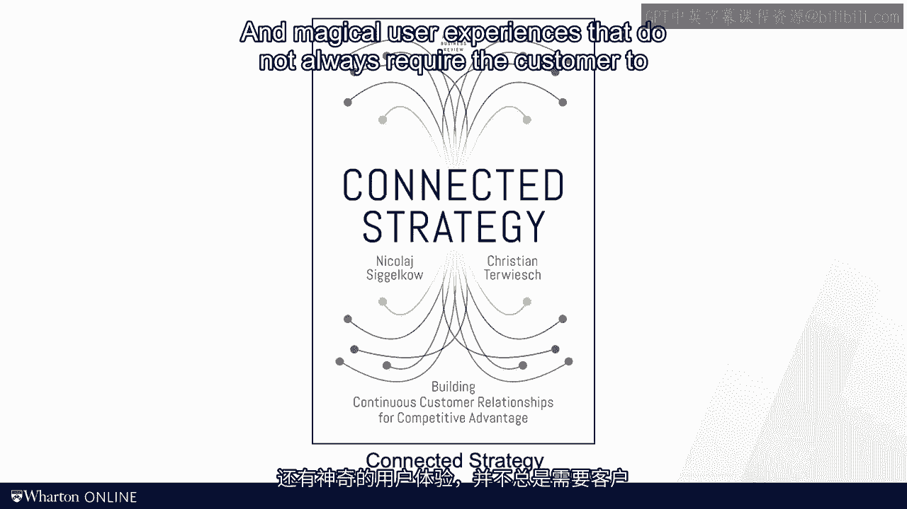

# 沃顿商学院《商务基础》课程｜第129讲：流失的流动时间 🕒

在本节课中，我们将学习如何从“流动单元”（如客户或产品）的视角，而非仅仅从资源效率的视角，来分析和优化运营流程。我们将重点探讨流动时间效率的概念，并介绍服务蓝图这一工具，以识别和减少客户体验中的浪费。

---

上一节我们讨论了整体设备效率（OEE）指标，但许多专家仅关注于此。对他们而言，精益运营就是让资源更具生产力。

如何让像医生这样的资源更高效？既然等待时间是七种浪费形式之一，那么让候诊室挤满足够多的病人，使医生一整天都忙碌，似乎是个好主意。

我们在课程的其他模块讨论过客户等待时间。现在需要指出，这完全不是精益。请记住，库存也是一种浪费，而等待的客户就是库存。

正如在本模块开头提到的放射科经历，精益同样关乎客户。客户等待和客户四处奔波也是浪费的形式。

因此，在本节中，我们引入一些工具和指标来捕捉这一点。我们将视角从资源转向流动单元。

---

当观察制造流程时，我们假设产品必须像水一样流动。那么，是什么阻碍了产品在生产过程中顺畅流动？

请看这个三步生产流程。零件从库存中取出，然后在铸造操作中生产。一旦所有零件完成铸造，运输工具将它们移至机加工操作区。它们必须再次等待，直到前一个生产周期的机加工完成。完成后，再被移至装配站。当然，批次中的其他零件尚未准备就绪，因此它们必须等待。装配只有在所有零件都到位后才开始，导致零件花费更多时间等待。最后，组装好的零件被运出。

我们可以定义**流动时间效率**（也称为价值时间百分比），其公式为：

**流动时间效率 = 价值增加时间 / 总流动时间**

在这个三步流程中，你会发现只有一小部分流动时间真正增加了价值。在大部分流动时间里，流动单元只是闲置等待，无法推进其旅程。

在我放射科的例子中，这个比例是20分钟的护理分散在超过2小时的流动时间里。

---

但关于客户体验，还有另一个观察。我个人认为，这不仅关乎客户投入的时间，还关乎客户摩擦、客户努力和痛点。

我宁愿花10小时在家等待医生花5分钟写的邮件，也不愿在候诊室等1小时只为进行10分钟的讨论。你会看到第二种场景的流动时间效率更高，但我更喜欢第一种。

这一观察背后是一个名为**服务蓝图**的工具。服务蓝图将所有与一个或多个客户接触点相关的活动，沿两个维度重新组织：

*   **水平维度（从左到右）是时间**。我们从左侧的早期活动开始，逐步推进到右侧的后期活动，就像之前的生产时间线。
*   **垂直维度则区分客户服务的交付地点**。

---

以下是服务蓝图垂直维度的关键层次：

**顶层是发生在客户家中的活动**。从客户视角看，这类工作更可取。从公司视角看，在“台上”进行的工作往往成本更高，涉及场地成本和即时资源准备。

因此，只要可能，我们都希望将工作移出“台上”。就像在家办理航班值机，而不是在登机口办理。

再回想一下我的放射科例子。核实我的保险状态这项工作，本可以在我到达医院之前完成。这对我来说更方便，对医院来说也更便宜。

---

除了将工作转移到家中，我们还可以考虑另一种将其移出“台上”的方式：想象公司可以为客户完成工作。

例如，在亚马逊购物时，你不再需要每次输入账单或送货信息。亚马逊存储并记住了这些信息，减少了您下次购物时的工作量。

为什么我的医院不能这样做？为什么我每次看医生都必须在候诊室填写一份四页的调查问卷，然后在与医生面谈时又被问到完全相同的问题？公平地说，近年来这种情况已大有改善，但你应该明白我的意思。

因此，改善客户体验的另一种方式是通过**自动化**。我们通过自动化部分活动，将努力从客户身上转移开。

在我的新书《互联战略》中，我与同事尼古拉·西格洛讨论了现代技术如何创造无缝且神奇的用户体验，这些体验并不总是要求客户采取行动。

---

流动单元缺乏耐心，因此我们应尽快让它们通过流程。这对于汽车厂的曲轴来说是正确的，它不应在库存中存放一周，而应在每周甚至每天周转多次以减少库存成本。这对于服务组织同样正确，其库存由等待的客户构成。显然，客户也希望快速移动，而不是坐着干等。

在任何一种情境下，我们都可以计算用于增值活动的流动时间百分比，将其作为一个很好的诊断工具，来发现流程中哪些地方浪费了流动时间。

---

本节课中，我们一起学习了如何通过**流动时间效率**指标和服务蓝图工具，从流动单元的视角识别流程中的浪费。我们明白了精益运营不仅要关注资源效率，更要关注客户体验，减少等待和摩擦，并通过将工作移出“台上”和利用自动化来创造更顺畅的流程。