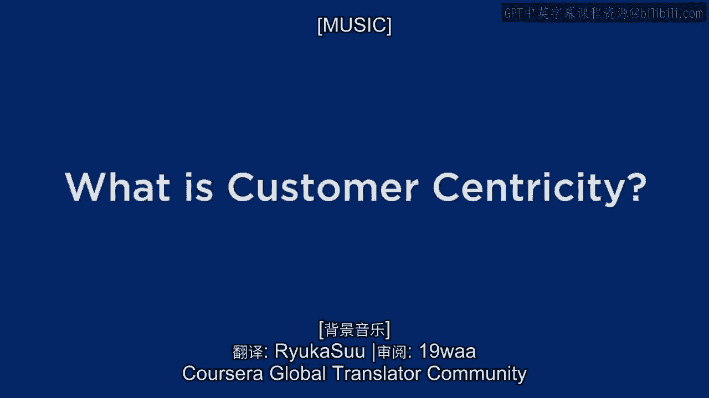
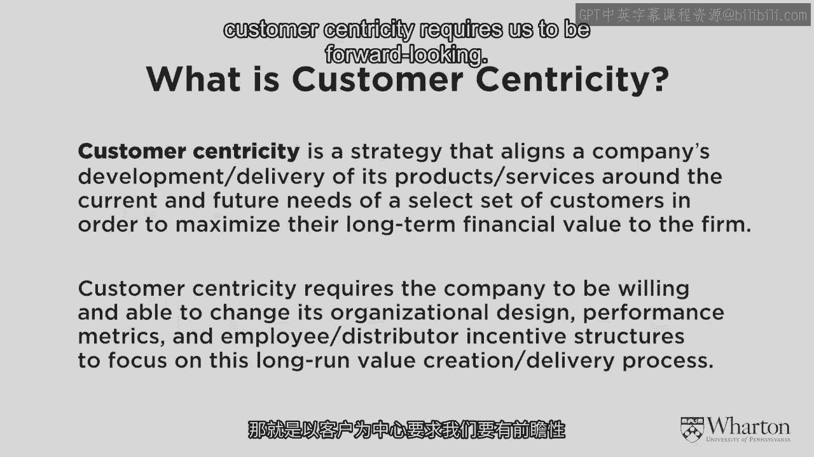
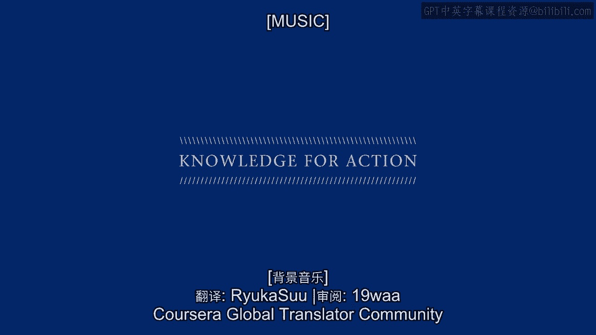

# 沃顿商学院《商务基础》课程｜第13课：什么是客户本位 🎯

在本节课中，我们将深入探讨“客户本位”这一核心商业理念。我们将明确其定义，分析它与传统产品本位模式的根本区别，并探讨如何在实践中真正贯彻这一理念。

欢迎回到模块二的学习。在模块一中，我们回顾了传统的商业运营方式，特别是与绩效卓越或运营卓越相关的战略。我们分析了采用此类战略的企业的不同特征，并将其统称为**产品本位**。

我们讨论了为何产品本位模式已不如过去那样有效，并开始触及那些转向不同方向的企业，即**客户本位**模式。但到目前为止，我们尚未对其给出明确定义。

---

## 定义客户本位

我们列举了许多被认为是高度客户本位的公司案例，例如IBM、哈里斯（Harris）、乐购（Tesco）。同时也提到了一些非常优秀、正大步迈向客户本位但未必完全达标的企业，如沃尔玛、苹果、星巴克和诺德斯特龙（Nordstrom）。

那么，如何判断一个企业是否真正做到了客户本位？换句话说，客户本位的定义究竟是什么？

基于我们目前的讨论和案例，请花一分钟时间，写下你对客户本位的定义，可以是一个完整的句子，也可以是几个关键词。

以下是我对客户本位的定义：

> **客户本位**是一种商业战略，它围绕一组**精选的客户**，调整公司的产品开发、服务交付和营销沟通活动，旨在最大化这些客户群体的**长期财务价值**。

---

## 客户本位与产品本位的根本差异

在深入探讨之前，请仔细审视这个定义，并思考它与传统产品本位商业实践有多么根本的不同。事实上，如果一家公司开始采用定义中的这些策略和视角，某些行为在传统观念下甚至是“足以被解雇的过错”。

以下是几个关键差异点：

**1. 服务“精选客户” vs. 追求广泛客户**
在**产品本位**的世界里，企业极度依赖尽可能多地销售产品以产生规模效应，因此很难承受对客户进行筛选。强调服务一组“精选客户”的理念，与许多企业的传统做法背道而驰。

**2. 关注长期价值 vs. 追逐短期业绩**
**客户本位**的核心是最大化客户的长期财务价值。然而，在华尔街压力和传统商业思维下，大多数公司都**短期导向**，必须完成季度业绩指标。客户本位则意味着愿意为正确的客户进行投资，有时甚至会推荐自己无法立即盈利的产品或服务，以建立长期信任关系，从而在未来获得更大回报。

**3. 研发围绕客户 vs. 研发驱动客户**
传统上，企业会要求研发部门：“研发出下一个爆款产品。”而在客户本位模式下，指令变为：“研发部门的同事们，这里有一批对我们极具价值的客户，请为他们开发能加深其忠诚度、创造更大长期价值、并帮助我们吸引更多类似客户的产品。”这彻底改变了企业的思维和运营方式。

当然，有人可能会说，有价值的客户之所以有价值，正是因为他们喜欢公司已有的产品，所以研发部门无论推出什么，他们可能都会喜欢。但关键在于**思维方式**的转变——将高价值客户置于研发活动的中心，这会改变组织内部的对话乃至产品设计的方向。

---

## 实践客户本位的挑战与机遇

仅仅将定义贴在墙上宣称“我们现在是客户本位了”是远远不够的。将这种思维模式付诸实践面临诸多挑战，同时也蕴藏着巨大机遇。

客户本位要求我们具备**前瞻性**。我们关注的不是哪些客户过去有价值，而是哪些客户**未来将会有价值**，并利用我们掌握的数据、模型和技术来做到这一点。

以下是几个具体示例，说明这种前瞻性思维如何应用：

### 示例一：改革销售激励制度

许多公司设有“月度销售之星”这类奖励，但通常是**后视的**，即根据销售员上个月或上个季度卖出了多少东西来奖励。

**客户本位的前瞻性做法**应是：
1.  在月初计算每位客户的**客户终身价值（CLV）**。
2.  在月末再次计算。
3.  奖励销售员的依据，不应仅仅是他们卖出了多少产品，而应是他们**在多大程度上提升了客户的终身价值**。

这意味着，销售员不应只盯着那些本来就要购买的客户，而应努力与客户建立关系。也许客户当月并未购买，但关系得到了加强，为未来的销售埋下了种子。这种奖励未来价值创造潜力的方式，鼓励销售员建立长期关系而非仅仅完成交易。

**公式示意：**
`销售员奖励 ∝ ΔCLV（客户终身价值变化量）`

这种做法有风险，需要信念、数据和模型的支持。但已有许多公司成功实施。从销售员的角度看，这让他们能专注于自己擅长的事情——建立并巩固关系，最终实现公司、股东和销售员的多赢。

### 示例二：航空公司的前瞻性客户管理

以MBA学生为例。他们在入学前可能因工作经常飞行，但就读的两年间飞行频率会大幅下降，导致其在航空公司的会员等级滑落。毕业后开始新工作，飞行需求可能远超以往，却又得从头积累里程。

如果航空公司具备**前瞻性**，它们会识别出这类客户群体。基于数据模型，它们可以预测这些学生毕业后将成为高价值客户。

**客户本位的做法**可以是：在学生被录取时，航空公司就主动联系并提供特殊待遇，例如：“我们注意到您的潜力，将在未来五年为您提供顶级会员资格。”这是一种基于未来价值的投资，旨在提前锁定高价值客户，并传递出“我们关心您的长期利益”的信号。

---

## 总结

本节课中，我们一起学习了**客户本位**的核心理念。

我们首先明确了其定义：围绕**精选客户**，调整企业活动以最大化其**长期财务价值**。接着，我们深入剖析了它与传统**产品本位**模式在客户选择、时间视野和研发导向上的根本区别。最后，我们通过销售激励改革和航空公司客户管理两个案例，探讨了如何以**前瞻性**思维在实践中贯彻客户本位，即识别并投资于未来有价值的客户，建立长期共赢的关系。

理解这些原则，是迈向真正以客户为中心的商业实践的第一步。