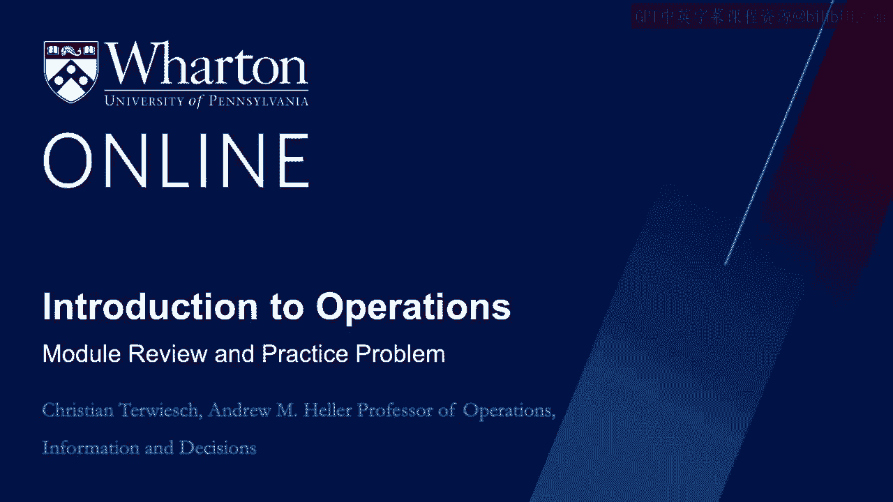
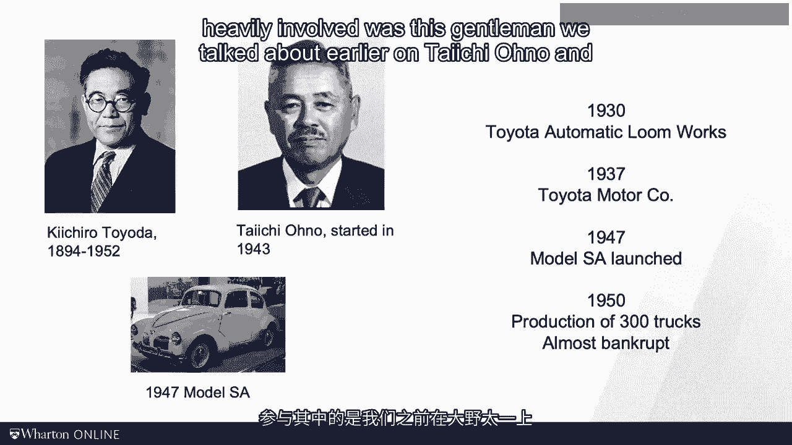
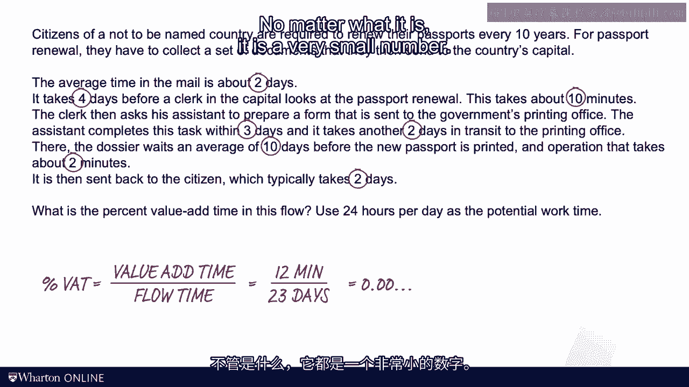

# 沃顿商学院《商务基础》｜第15课：丰田生产系统回顾与实践 🏭

在本节课中，我们将回顾丰田生产系统的历史背景与核心概念，并通过两个实践问题来巩固对设备综合效率（OEE）和流程时间效率的理解。

---

## 历史背景：从卡尔·奔驰到丰田

上一节我们介绍了流程效率的基本概念，本节中我们来看看现代生产管理的重要基石——丰田生产系统的起源。

汽车工业始于德国。1886年，卡尔·奔驰制造了第一辆汽车——奔驰专利机动车。作为一位专注产品的工程师，他当时可能并不关心周期时间、闲置时间或生产线平衡，其核心目标是制造一辆精美的汽车。

关于卡尔·奔驰的故事离不开他的妻子贝尔塔。贝尔塔是第一位汽车驾驶员，她完成了从曼海姆到普福尔茨海姆的往返旅程。途中燃油耗尽时，她机智地在当地药店购买了燃料，得以返回曼海姆。

汽车故事的第二个篇章属于亨利·福特。如果说卡尔·奔驰是产品大师，那么亨利·福特则是流程大师。他参观屠宰场后获得灵感，将传送带和移动流水线引入汽车装配作业。福特以高度泰勒主义的思想完善了汽车生产，将每辆车的制造时间从12小时降至2.5小时。

福特高度依赖专业化分工，每个工人只执行一项约60秒或更短的微小作业。这使得他能雇佣廉价的移民劳动力，迅速扩大产能。早在一百年前，福特年产量已超过一百万辆，其中最著名的T型车到1924年产量达一千万辆。福特通过规模经济、学习曲线效应和消除系统浪费，降低了成本，使汽车成为美国中产阶级负担得起的商品，进而带来了一个繁荣时期和汽车的广泛普及。

丰田的故事则截然不同。丰田最初是一家制造自动织机的公司，二战前夕才进入汽车行业，于1937年成立丰田汽车公司。战后世界满目疮痍，美国试图通过援助在日本建立汽车产业，将工具和专家从底特律转移到日本，包括丰田。但这并不顺利。

二战后日本国内购买力低下，缺乏美国市场那样的规模需求。例如，1950年丰田仅生产了300辆汽车，公司濒临破产，面临巨大价格压力和工人罢工。正是在这段困难时期，以大野耐一为代表的团队开始构建我们现在所称的“丰田生产系统”。

---

## 丰田生产系统的巨大影响

为了理解丰田生产系统对工业的影响，让我们看一组关键数据。1986年，麻省理工学院国际汽车计划发布了一份重要报告，研究人员在全球范围内对标汽车工厂的生产率水平。

以下是报告中使用的指标示例：
*   **每车总装配工时**（可视为劳动含量）：通用汽车工厂为40小时，丰田工厂为18小时。
*   **缺陷数量**：通用为130，丰田为45。
*   **库存**：通用工厂拥有两周的零件库存，丰田工厂仅有两小时库存。这意味着丰田每天可实现多次库存周转。

正是此时，世界意识到存在一种更智能的造车方式。该研究报告的主要作者吉姆·沃麦克提出了“精益运营”这一术语。从此，“精益”与“丰田”成为了同义词。

---

## 丰田生产系统详解：精益之屋 🏠

丰田生产系统有多种可视化方式，但最常见的是以“房屋”形状来总结和整合其理念。

**屋顶**代表最高目标：**零浪费**。浪费在日语中称为“**muda**”。人们常说的其他“四个零”包括：零缺陷、零故障、零库存和零准备时间。这非常符合我们在本模块早先讨论的七种浪费来源的精神。

**房屋主体**包含两大支柱：
1.  **流动支柱**：核心是**供需匹配**，通过**准时制（JIT）** 交付来避免库存。这包括混流生产、按需求节拍生产、单件流、推拉系统以及均衡生产等概念。这些都是本课程反复出现的内容，核心思想是“流动”。
2.  **质量支柱**：质量管理包含许多要素。一个重要理念是确保**尽快发现缺陷**。在本课程的质量模块中，我们将回到这个理念。我们将看到，丰田授权工人在发现问题时通过拉动“**安东绳**”来停止生产线。

**房屋基础**根据不同的书籍或专家可能略有不同，但通常包括：
*   **灵活性**：快速切换设备生产不同车型的能力，或培养工人掌握多种技能。
*   **工作标准化**：确保以“最佳方式”工作，避免不必要的动作（七种浪费之一）。
*   **员工参与**：包括著名的“**改善**”理念。我们在本模块中提到过第八种浪费——未被利用的员工智慧。改善就是让员工参与质量改进圈和持续改进活动。

---

## 核心概念与公式回顾 📊

上一节我们介绍了丰田生产系统的框架，本节中我们通过两个核心公式来回顾和巩固关键绩效指标。

本模块涉及两个核心公式：
1.  **设备综合效率**
2.  **流程时间效率**

以下是每个公式对应的一个实践问题。

---

### 实践问题一：计算设备综合效率（OEE）

请看这个关于自行车手和风洞的第一个实践问题。

**问题描述**：假设我们观察一个资源（如风洞）10天。在这10天中，实际工作时间为9天。每天工作2小时（120分钟），其中进行7次测试程序。然而，每天只有5次测试是增值的，另外2次是返工（不增值）。每次增值测试的程序时长为100分钟。请计算该资源的OEE。

**解答**：
首先，写出OEE的定义公式：
`OEE = 增值时间 / 总付费时间`

我们使用10天作为观察窗口。
*   **总付费时间（分母）**：10天 × 24小时/天 × 60分钟/小时 = 14400分钟。
*   **增值时间（分子）**：
    *   实际工作天数：9天。
    *   每天增值测试次数：5次。
    *   每次增值测试时长：100分钟。
    *   因此，总增值时间 = 9天 × 5次/天 × 100分钟/次 = 4500分钟。
*   **计算OEE**：`OEE = 4500 / 14400 = 0.3125`

---

### 实践问题二：计算流程时间效率（增值时间百分比）

现在，让我们从流程单元（如护照）的视角来看第二个问题。

**问题描述**：计算护照更新流程的增值时间百分比。流程各步骤时间如下：提交申请（2天）、初步审核（4天）、文件核查（3天）、费用处理（2天）、打印护照（10天）、等待领取（2天）。其中，只有职员处理申请的10分钟和打印护照的2分钟是增值工作。

**解答**：
流程时间效率是增值时间与流程总时间的比率。
`流程时间效率 = 增值时间 / 流程时间`

*   **流程时间（护照在系统中的总时间）**：2天 + 4天 + 3天 + 2天 + 10天 + 2天 = **23天**。
    将天数转换为分钟以便计算：23天 × 24小时/天 × 60分钟/小时 = 33120分钟。
*   **增值时间**：职员处理（10分钟）+ 打印（2分钟）= **12分钟**。
*   **计算流程时间效率**：`效率 = 12 / 33120 ≈ 0.000362`（这是一个非常小的数值，表明大量时间是等待和非增值活动）。

---

## 总结

本节课中，我们一起学习了丰田生产系统的历史演变、其“精益之屋”的核心架构，并通过实践问题演练了设备综合效率（OEE）和流程时间效率这两个关键指标的计算。丰田生产系统强调消除浪费、持续改进和尊重员工，其理念和方法已深远影响了全球制造业乃至其他行业的管理实践。

感谢您参与本模块的学习。我们下次再见。