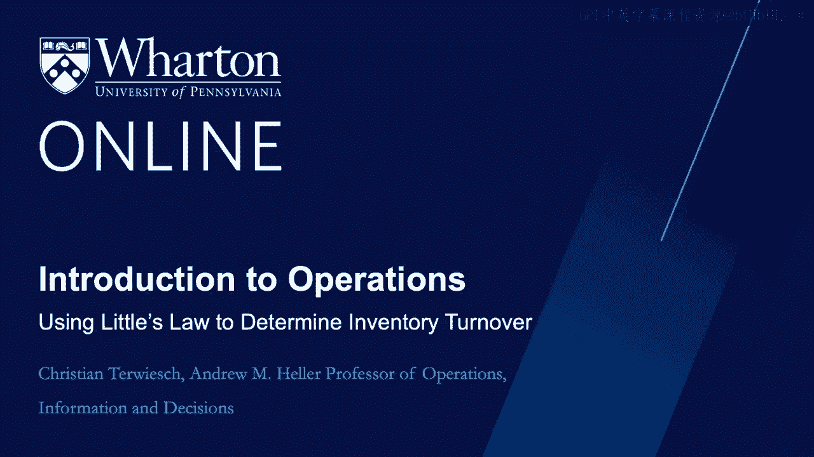
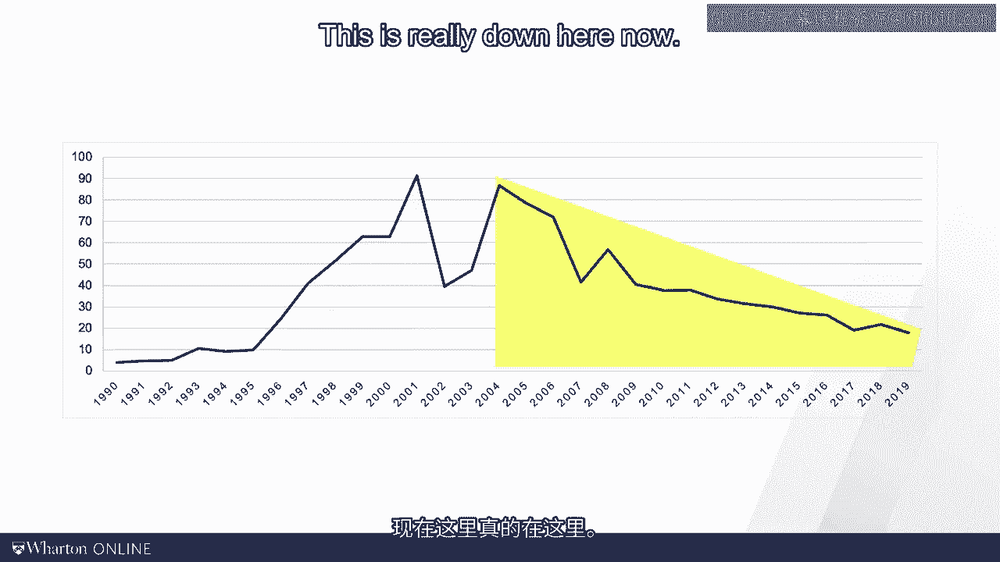
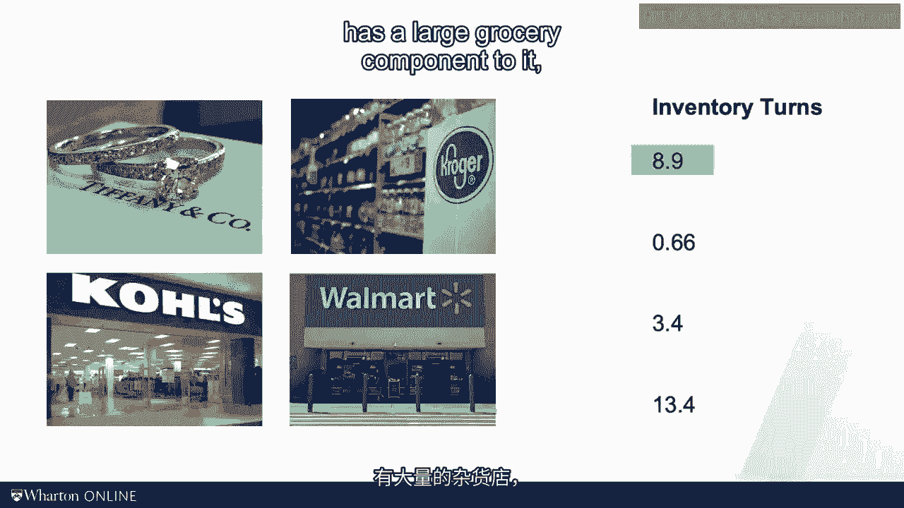
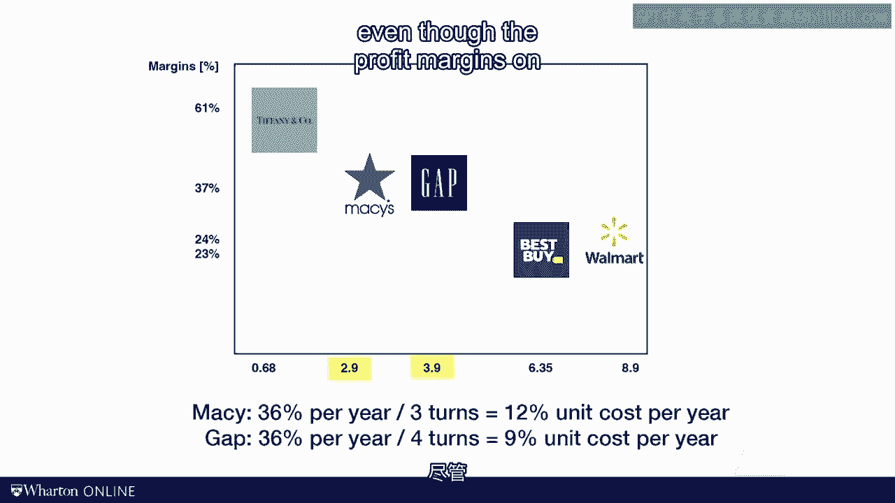

# 课程名称：沃顿商学院《商务基础》｜Business Foundations Specialization｜（中英字幕） - P133：17_使用小法则确定库存周转率 📊

## 概述
在本节课中，我们将学习如何运用“小法则”来分析企业的库存周转率。我们将通过一个独特的视角——追踪“一美元”在企业内部的流动——来理解库存管理的核心概念，并比较不同公司的库存效率。

---

## 回顾小法则
上一节我们介绍了本课程的第一个核心公式——**小法则**。该法则指出，在任何流程中，平均库存量等于平均流速乘以平均流动时间。

其公式为：
**I = R × T**
其中：
*   **I** 代表平均库存量
*   **R** 代表平均流速
*   **T** 代表平均流动时间

## 将小法则应用于实物库存
本节中，我们将小法则应用于实物库存管理。为此，我们将采用一种新颖的分析方法。

我们将选择**一美元钞票**作为我们的“流动单元”。我们可以将公司想象成一个巨大的黑箱：美元从一侧流入，从另一侧流出。随之而来的一个核心问题是：平均每张美元钞票在公司内部停留多长时间？

我们无法直接询问美元钞票，但可以利用小法则来找到答案。具体来说：
*   流经组织的美元数量，就是**销售成本**。
*   组织内部的美元数量，就是**库存**。
*   我们想知道的美元停留时间，就是**流动时间**。

销售成本和库存数据可以从财务报表中获得。根据小法则 **I = R × T**，我们可以解出流动时间 **T**，从而得知美元在组织内的停留时长。

## 案例分析：戴尔 vs. 康柏
这听起来有些抽象？让我们通过一个具体案例来理解。我们将比较两家传奇电脑制造商——康柏和戴尔（如今仅存其一），并探究为何你可能不再使用康柏电脑。

我们将使用小法则来计算美元在各自公司内的停留时间。公式依然是 **I = R × T**，我们需要解出 **T**。

以下是计算步骤：

**戴尔的数据（2000年）**
*   库存 **I**：约 3.91 亿美元
*   销售成本 **R**：约 200 亿美元/年
*   计算流动时间 **T**：T = I / R = 3.91 / 20000 ≈ 0.0001955 年
*   转换为天数：0.0001955 年 × 365 天/年 ≈ 7 天

因此，戴尔平均持有库存约 **7 天**。这个数字被称为**供应天数**。

**康柏的数据（同年）**
*   库存 **I**：约 20.03 亿美元
*   销售成本 **R**：约 252.63 亿美元/年
*   计算流动时间 **T**：T = I / R = 20.03 / 252.63 ≈ 0.0793 年
*   转换为天数：0.0793 年 × 365 天/年 ≈ 29 天

因此，康柏平均持有库存约 **29 天**。这与戴尔的7天形成了鲜明对比。

我们也可以换一种说法：戴尔大约每7天“周转”一次其库存。由此可以引出另一个关键指标——**库存周转率**。

库存周转率的计算公式为：
**库存周转率 = R / I**
它表示一年内库存被完全卖出并补充的次数，实际上是流动时间 **T** 的倒数。以戴尔为例，其库存周转率约为 52 次/年（365天 / 7天）。

## 库存周转率小测验
现在，我们来玩一个“库存周转率匹配”小游戏。以下是四家零售商：
1.  珠宝商蒂芙尼
2.  超市克罗格
3.  服装店科尔士
4.  零售商沃尔玛

以及四个库存周转率水平，请尝试将它们匹配起来。

以下是匹配结果：
*   **蒂芙尼**的周转率**最低**。因其产品种类极其繁多，每件商品（如婚戒、项链）都需要等待很长时间才能找到买家。
*   **克罗格**的周转率**最高**。超市商品，尤其是生鲜食品，必须快速周转，几乎需要每日更新。
*   **科尔士**作为服装零售商，也需要较快周转，但速度不及生鲜食品。
*   **沃尔玛**作为管理卓越的大型零售商，拥有相当不错的周转率，介于中间水平。

## 为何库存周转率至关重要？
我们为何要如此关注库存周转率？因为它直接关系到**库存持有成本**。

让我们做一个思想实验：假设你有一台价值1000美元的电脑，并持有它一整年。这会带来哪些成本？
1.  **价值折旧**：电脑会过时，假设年贬值300美元。
2.  **仓储成本**：安全存储它可能需要100美元。
3.  **资金成本**：占用资金的機會成本（以加权平均资本成本WACC计算），假设为价值的10%，即100美元。

这些成本加起来相当可观。当然，你通常不会持有一件商品整整一年。正如戴尔的例子，库存会被多次周转。

假设年库存持有成本率为30%。如果年周转6次，那么每销售一件商品所分摊的库存成本就是 30% / 6 = **5%**。这意味着，对于一件采购成本为60美元的商品，其单位库存成本就是3美元。

## 利润率与周转率的关系
下图展示了利润率与库存周转率之间的关系。你可能会发现一个看似矛盾的现象：周转率低（如蒂芙尼）往往利润率很高，而周转率高（如百思买、沃尔玛）利润率却较低。

但这并非重点。蒂芙尼提供极其广泛的产品选择，这意味着每件商品都需要等待更长时间才能售出（低周转率），但一旦售出，利润丰厚。百思买和沃尔玛则提供较少选择，追求快速周转。

关键在于比较同类竞争者。例如，梅西百货和盖璞公司都经营服装。假设持有服装一年的总成本（仓储、资金、过时）为36%。
*   梅西年周转3次，单位库存成本为 36% / 3 = **12%**。
*   盖璞年周转4次，单位库存成本为 36% / 4 = **9%**。

这**3个百分点**的库存成本差异，就能转化为显著的财务优势。因此，即使账面利润率看起来略低，更快周转的盖璞实际上拥有更强的成本竞争力。

---

## 总结
本节课我们一起学习了**库存周转率**这一库存规划、采购和供应链管理中的核心概念。它有效地衡量了库存持有成本，这些成本包括资金占用成本、仓储成本、损耗与盗窃成本，以及因价值折旧产生的降价成本。

小法则提醒我们，要高效地支持大规模的产品流动（即高销售额），唯一途径就是**快速周转库存**。有些供应链管理者称之为“周转即盈利”——库存周转得越快，供应链的运行效率就越高。

本节课到此结束，下节课再见。