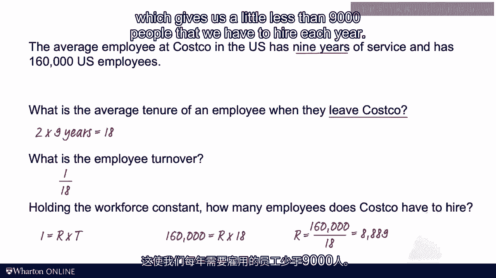

# 沃顿商学院《商务基础》课程｜第134讲：使用小法则确定员工周转率 👥

在本节课中，我们将学习如何运用“小法则”来分析员工在组织内的流动情况。我们将把员工视为“流动单元”，计算他们的平均在职时间、离职时的任期以及组织需要招聘的新员工数量。

---

在上一节视频中，我们讨论了库存周转率，并将“流动单元”设定为流经组织的**一美元**。

本节我们将选择一个不同的流动单元：**员工**。我们将追踪员工从入职到离职，在组织内的整个流动过程。与库存分析类似，我们可以问：典型员工会在组织内停留多久？这将帮助我们计算员工的平均任期，并确定组织每年需要招聘多少新员工。

让我们开始分析。幻灯片左侧重复了上一讲的计算，其中流动单元是美元，库存是组织内的美元数量。小法则将三个变量联系在一起。

我们可以对员工流动进行完全相同的分析：新员工入职是**流入**，员工离职是**流出**。我们可以据此计算组织“持有”一名员工的平均时长，即员工离职时的平均任期。

其逻辑是完全一致的。以下是具体步骤：

**以下是核心概念与公式：**

*   **员工周转率**：计算公式为 `员工周转率 = 每年离职员工数 / 平均员工数`。
*   **离职时的平均任期**：即员工的流动时间。在离职当天，其任期等于 `1 / 员工周转率`。
*   **平均在职任期**：需要注意的是，全体员工的**平均在职任期**，大约是离职员工**平均任期**的一半。因为在任何时间点，有些员工刚入职，有些则即将离职。假设其他条件不变，平均来看，在职员工正好处于这个时间段的中间点。

---

让我们看一个具体例子。假设某公司员工的平均在职任期是 **9 年**。问题是：员工**离职时**的平均任期是多少？

根据我们刚才的结论，离职时的平均任期大约是平均在职任期的两倍。因此，计算如下：

`离职时平均任期 = 2 × 平均在职任期 = 2 × 9年 = 18年`

这意味着员工在这家公司会工作相当长的时间。那么，员工周转率就是 `1 / 18`。

接下来，如果我们想知道公司每年需要招聘多少新员工（假设员工总数保持不变），我们可以再次使用小法则：`I = R × T`。

*   `I` (库存) = 组织希望保持的**员工总数**，假设为 160,000 人。
*   `T` (流动时间) = 员工离职时的平均任期，即 **18 年**。
*   `R` (流速) = 我们需要求解的**每年需招聘人数**。

根据公式 `R = I / T`，计算如下：

`R = 160,000 人 / 18 年 ≈ 8,889 人/年`

因此，该公司每年需要招聘略少于 9,000 名新员工，以维持 160,000 人的员工规模。

---

员工周转率是一个重要概念。例如，一些大型咨询公司顾问**离职时的平均任期**约为 **4 年**。这意味着：

*   顾问的**平均在职任期**约为 **2 年**。
*   其员工周转率为 `1 / 4 = 0.25` 或 25%。
*   因此，为了维持（而非增长）每 100 名顾问的规模，公司每年需要招聘 **25 名**新顾问。

如前所述，小法则始终成立，即使公司处于快速扩张、持续增加员工的情况下。但在这种增长情境下，需要更谨慎地确定“平均员工数”，因为这个数字可能随时间变化。同样，如果公司历史较短，可能还没有太多员工离职，此时“离职时的平均任期”也需要非常仔细地测算。

无论如何，小法则的基本逻辑在它被首次证明的 **50 多年后**依然适用。你可以用它：
*   在已知库存和流速时计算流动时间。
*   计算库存周转率和库存成本。
*   或者，如本节所示，分析**员工周转率**。

在下一讲视频中，我们将练习这些计算。到时见。

[空白音频]