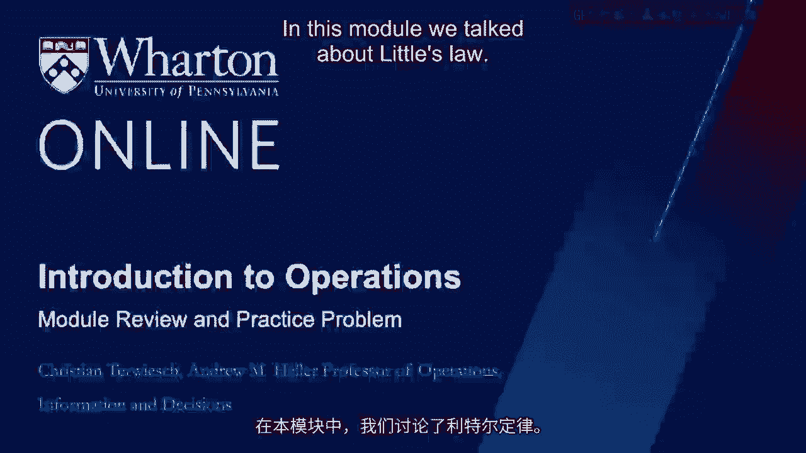

# 沃顿商学院《商务基础》课程｜第135讲：学习回顾与实践问题 📚

在本节课中，我们将回顾模块的核心概念，并通过具体问题来巩固对利特尔法则、库存周转率和员工流动率的理解。我们将逐一解析关键公式，并应用它们解决实际问题。

---

## 模块回顾 📝

上一节我们介绍了利特尔法则及其在运营管理中的应用。本节中，我们来回顾本模块的学习目标、关键定义与核心公式。

### 学习目标

完成本模块后，你应该能够：
*   运用**利特尔法则**，在已知三个绩效指标（库存、流速、流时）中的任意两个时，计算出第三个。
*   进行**库存周转率**的计算。
*   进行**员工流动率**的计算。

### 关键定义与公式

我们引入了几个重要的概念和计算公式。

以下是核心公式列表：

*   **利特尔法则**：`I = R × T`
    *   `I` 代表平均库存
    *   `R` 代表平均流速
    *   `T` 代表平均流时
*   **库存周转率**：`库存周转率 = 销售成本 / 平均库存`
*   **库存持有成本（单位）**：`单位库存成本 = (年库存持有成本率 / 库存周转率) × 单位产品成本`
*   **员工流动率**：`员工流动率 = 年度离职员工数 / 平均员工总数`
*   **平均在职时间（基于离职）**：`平均在职时间 = 1 / 员工流动率`
*   **平均在职时间（总体）**：`总体平均在职时间 ≈ (基于离职的平均在职时间) / 2`

---

## 实践问题解析 🔍

现在，让我们通过三个具体问题来应用这些知识。

### 问题一：应用利特尔法则

这是一个关于利特尔法则的问题。已知呼叫中心每分钟平均有25个来电，来电者平均等待1分钟，并与客服代表通话3.5分钟。请问，平均有多少来电者正处于呼叫中心系统内（包括等待和通话）？

请暂停视频，自己尝试解答，然后我们一起分析。

**解析如下：**

平均每分钟有25个来电，这是我们的流速 `R`。
每个来电者平均花费1分钟等待和3.5分钟通话，总流时 `T` 为4.5分钟。
根据利特尔法则 `I = R × T`：
`I = 25 个/分钟 × 4.5 分钟 = 112.5 个`
因此，系统中平均有112.5个来电者。

---

### 问题二：计算库存周转与成本

根据以下财务信息，请计算该公司的库存周转率。

| 项目 | 金额（美元） |
| :--- | :--- |
| 年收入 | 2，501 |
| 销售成本 | 1，501 |
| 平均库存 | 590 |

再次暂停，尝试独立计算。

**解析如下：**

忽略收入数据，它在此处是为了干扰判断。库存周转率的计算公式是销售成本除以平均库存。
因此：`库存周转率 = 1501 美元/年 / 590 美元 = 2.54 次/年`
单位是“次/年”，即每年周转2.54次。

接下来，计算单位产品的库存持有成本。已知年库存持有成本率为15.25%，但库存并非持有一整年，而是每年周转2.54次。
所以，实际成本率为：`15.25% / 2.54 ≈ 6.0%`
假设某产品成本为85美元，则其单位库存持有成本为：`85 美元 × 6.0% ≈ 5.1 美元`

---

### 问题三：计算员工流动率与平均在职时间

最后，我们来看一个关于员工流动率的问题。某公司平均有1500名员工，每年招聘500名新员工（假设补充离职人员）。请计算员工流动率和员工的平均在职时间。

请暂停思考。

**解析如下：**

公司平均有1500名员工，每年有500名员工离职。
员工流动率 = `500 人/年 / 1500 人 = 1/3 次/年`
单位同样是“次/年”，即每年有三分之一的员工发生流动。

这暗示了员工离职前的平均在职时间：`1 / (1/3) = 3 年`。
但问题要求的是全体员工的平均在职时间。考虑到有些员工刚入职，有些即将离职，总体平均在职时间大约为离职前平均在职时间的一半。
因此，`总体平均在职时间 ≈ 3 年 / 2 = 1.5 年`。

---

## 一个关于利特尔法则的故事 🛫

几年前，我在费城机场。那时还没有TSA预检通道，所有乘客都必须排同一条长队。有一天，当我抵达B航站楼准备飞往旧金山时，一位TSA官员站在长队的末尾，友好而专业地递给我一张卡片。

卡片上写着：“您好！我是运输安全管理局的代表……请拿好这张计时卡，帮助我们计算您通过安检线需要多长时间。”原来，我被选中是因为我排在队伍的最后。卡片指示我将它交给队伍起点的另一名官员，以便他们记录时间差，从而测量我的流时。

我当时想：“嘿，官员，你为什么不直接数一下队伍里有多少乘客呢？那就是库存 `I`。你知道今天的航班旅客数量，那就是流速 `R`。然后你用利特尔法则 `T = I / R` 不就能算出流时了吗？”我觉得这主意很棒，至于那位官员是否认同，我就不得而知了。

---

## 总结 📋

本节课中，我们一起回顾并实践了本模块的核心内容：
1.  我们重温了**利特尔法则** `I = R × T`，并用它解决了呼叫中心的库存问题。
2.  我们练习了**库存周转率**和**单位库存成本**的计算。
3.  我们掌握了**员工流动率**和**平均在职时间**的计算方法。

希望这些练习能帮助你巩固对这些重要运营指标的理解。我们下一个模块再见。