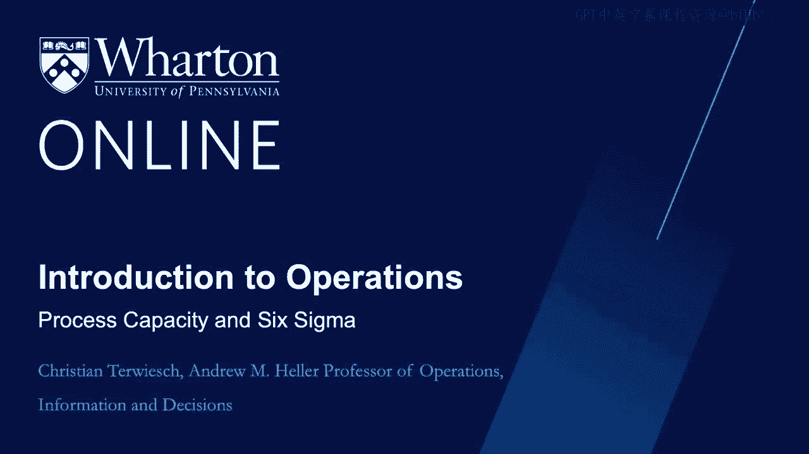
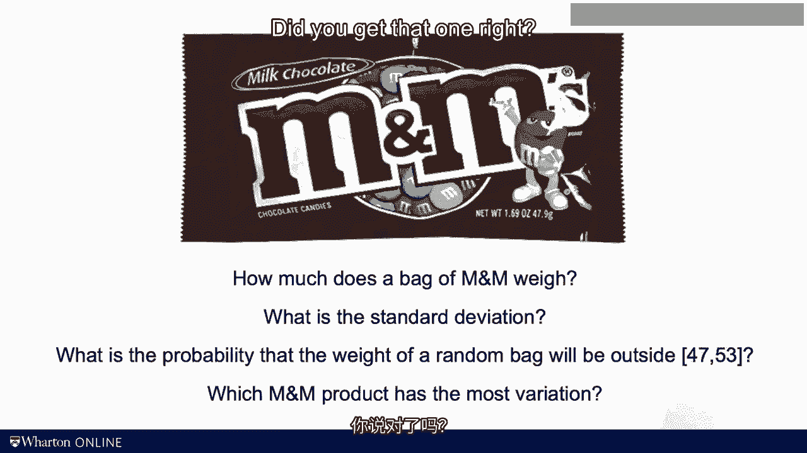
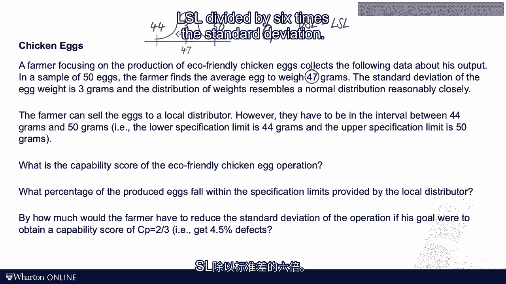

# 沃顿商学院《商务基础》课程｜第21讲：过程能力与六西格玛 🎯

在本节课中，我们将学习质量管理中的核心概念：过程能力与六西格玛。我们将探讨如何通过量化指标来评估一个生产过程的稳定性和一致性，并理解其与产品质量缺陷之间的关系。

---

我不喜欢在课堂上谈论政治，但今天我将破例一次。

欧盟委员会第1677-88号条例规定，黄瓜每10厘米长度允许弯曲10毫米。弯曲程度超过此标准的黄瓜，不能归类为一级或特级黄瓜。二级黄瓜允许的弯曲程度是此标准的两倍。

如果你是一个愤世嫉俗的人，你可能会说，正是这类决议促使我们的英国朋友离开了欧盟。但请允许我稍微收回一点。

首先，据我所知，欧盟后来修改了这项决议。其次，也许更重要的是，这项决议触及了质量管理中的一个根本问题。

如果你想将产品单位分为合格品和次品，你必须定义什么是“好”，什么是“坏”。这个决定基于我们所谓的**规格**。

委员会承认，黄瓜有不同的形状和大小，这反映了任何过程（尤其是涉及自然的过程）固有的**变异**。在欧盟官员看来，理想的黄瓜形状是一条直线。他们认为，黄瓜弯曲得越多，就越不理想。但多大的弯曲是可以容忍的？界限在哪里？

当你处理这类质量管理问题时，你会发现，尽管这条规则看起来可能有些奇怪，但实际上它相当巧妙。你有一个规格，然后根据这个规格来衡量产出。

在测量了几年黄瓜的弯曲度后，我需要一个更“甜美”的研究课题，于是我对M&M巧克力的生产过程产生了兴趣。

在M&M的包装标签上写着，每袋含有47.9克巧克力。我有几个问题要问你。请思考：你认为一袋M&M的实际重量是多少？此外，这个重量的**标准差**是多少？如果我取一千袋，有多少袋会低于47克或高于53克？最后一个问题：你能想到M&M的哪种产品在重量上具有相对较高的变异程度吗？

可以说，这些都是值得仔细学术分析的关键问题。请暂停视频，思考一下这些问题。

好的，我们先看最后一个问题。哪种M&M产品的变异最大？你答对了吗？是花生M&M。为什么？因为花生是生物性产品，其生产过程相比普通M&M有更多的环境变异。

为了找到其他三个问题的答案，我做了以下事情：我去商店买了所有我能找到的M&M。然后，我使用了一台高精度秤，以下是我的发现。

我为自己创建了一个包含125袋的样本。在样本中，我发现平均重量为50.0克。样本的标准差为1.03。我认为，在所有可食用的东西中，M&M的标准差非常低。生产M&M，尤其是那些不含花生的，是高度工业化的，这可能是你能见到变异最小的过程之一。

现在你在这里看到一个直方图，并在Excel电子表格中看到样本的原始数据。请问自己：你愿意用生命打赌，没有一袋M&M的重量低于47克或高于53克吗？我查看了样本数据，没有发现这样的异常值，但我不能断言它们绝对不存在。

如你所见，结果——M&M袋的重量——确实遵循某种**正态分布**。如果我们同意低于47克是缺陷（因为巧克力含量不足，顾客可能会不满），高于53克也是缺陷（因为顾客可能会因发胖而起诉我们），那么我们可以画出这样一幅图：你看到正态分布，而缺陷就在分布的尾部。

当然，如果我们能采取措施减少标准差，降低结果的变异，那将是好事，因为尾部的概率会降低。在这张图中，你可以看到，在上方的分布中，我可以从均值出发移动三个标准差才会碰到规格限（即袋子变成缺陷品）。而在下方的分布中，我可以移动六个标准差才会出问题。

为了捕捉这个想法，我们将引入一个新概念：**过程能力**。

我们定义 **Cp 分数**（C代表过程能力），它是**上规格限**与**下规格限**之差，除以过程标准差的六倍。

**公式：Cp = (USL - LSL) / (6σ)**

在我们的M&M例子中，计算如下：Cp = (53 - 47) / (6 * 1.03) ≈ 1。这个能力分数告诉你出现缺陷的可能性有多大。如果均值与规格限之间有许多个标准差，缺陷就不太可能发生。

对于一个**六西格玛过程**，Cp 将等于2。在这种情况下，缺陷极不可能发生，我们谈论的是十亿分之二的缺陷率。

对于一个**三西格玛过程**，从均值到缺陷水平有三个标准差，缺陷有可能但非常不可能发生。

如果Cp分数只有0.333，那么你将有31%的时间出现缺陷。因此，Cp分数是衡量过程变异相对于规格区间宽度的绝佳方式。

除了分析巧克力，能力分析在处理制造公差时也非常有用。这是大部分质量管控工具发展的背景。例如，我的朋友兼同事卡尔·奥里克有一家滑板车公司。他的产品“Zooter”出现在世界各地的许多城市中心。这是一张图片。

卡尔面临的一个长期挑战是转向支撑柱。如果部件尺寸太小（低于79.9毫米），滑板车就会发出嘎嘎声，尤其是在颠簸路面上。如果部件尺寸大于80毫米，则制造困难，需要用力挤压进去。

我们所做的是从他的生产过程中收集了一些数据，并计算了能力分数。同样是USL减去LSL，即80毫米减去79.9毫米，然后除以我们在工厂中发现的6倍经验标准差。

令我非常惊讶的是，统计方法奏效了。这些测量值呈正态分布，结果发现他工厂的这个Cp分数，其过程能力几乎与M&M的完全相同——真是个疯狂的世界。

好了，是时候做练习题了。这里有一个关于鸡蛋生产过程的非常有创意的问题，包含三个子问题。和往常一样，请暂停视频，看看你自己能解决多少。

好的，我们继续。鸡蛋的重量遵循看起来像正态分布的形状，平均重量为47克，标准差为3克。然后有规格限：下规格限是44克，上规格限是50克。

我们定义的Cp分数是USL减去LSL，除以6倍标准差。在我们的问题中，就是 (50 - 44) / (6 * 3) = 6 / 18 = 1/3 ≈ 0.33。

有了这个Cp分数，我们可以查看上一张幻灯片中的表格。Cp分数为1/3意味着缺陷概率（即超出规格限的概率）为0.317。但问题问的是在规格限内的概率。在规格限内的概率就是1减去缺陷概率，即 1 - 0.317 ≈ 0.683 或 68.3%。

接下来，这位农民（或他的鸡）希望变得更稳定。为了找到所需的标准差，我们必须将Cp分数设定为2/3。现在这是一个含有一个未知数的方程。未知数就是所需的标准差σ。方程是：6 / (6σ) = 2/3。这是一个线性方程，求解σ并不难，我们得到 σ = 1.5 克。

---

**质量问题的根源在于变异**。如果你总是出错，你的生意不会长久。如果你总是做对，我们就不需要质量管理的课程了。这有点像我的网球发球：我的第一次发球太短，会下网；第二次发球太长，会出界；但平均来看，我的发球“正好”。所以，我们又一次回到了讨论变异的话题上。

在下一个视频中，我将介绍一些关于变异的定义，这些定义有助于我们监控过程随时间的变化，以便快速检测到结果何时发生了变化。我们下节课见。