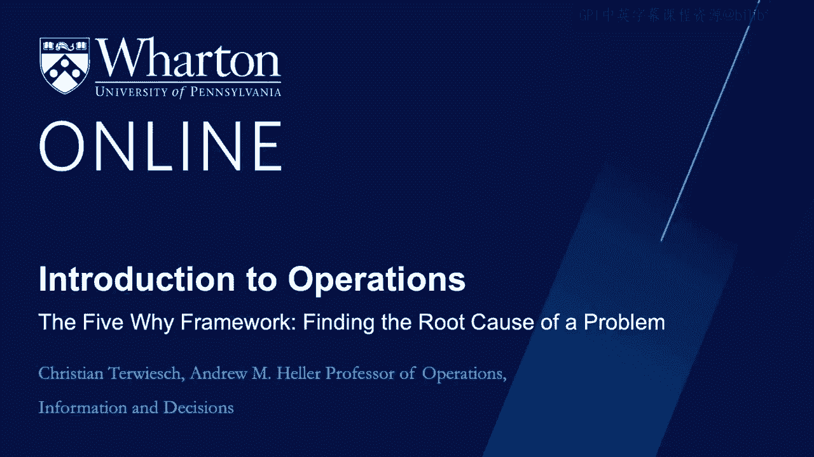
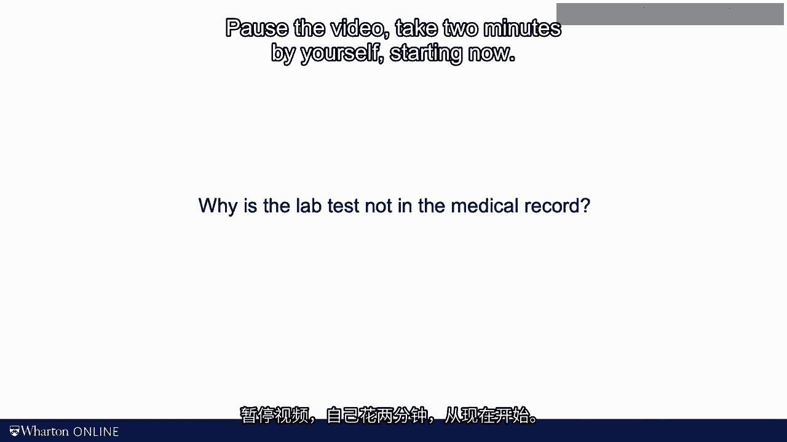

# 沃顿商学院《商务基础》课程｜第139讲：5次为什么框架与根本原因分析 🎯

在本节课中，我们将学习如何系统地寻找流程问题的根本原因。我们将介绍两种核心工具：鱼骨图（又称石川图）和帕累托图，并探讨著名的“5次为什么”分析框架。这些方法能帮助我们从表面问题深入挖掘，找到导致缺陷的深层根源，为后续的流程改进奠定坚实基础。

---

## 发现问题后的关键步骤 🚨

上一节我们讨论了如何检测并叫停流程中的问题。一旦发现问题并通知了操作人员，下一步就是寻找问题的根本原因。

医疗保健领域的一个例子可以帮助我们理解。假设你收到这样一个警报：一位医生为病人申请了实验室检查，但检查报告却没有出现在病人的医疗记录中。

请你花两分钟思考一下，为什么医生申请了某项实验室检查，却无法在病人的医疗记录中看到结果？现在可以暂停视频，独自思考两分钟。

---

## 构建问题全景：鱼骨图分析法 🐟

你思考出了哪些可能的原因？我想换一个角度提问：你是如何着手分析这个任务的？

以下是我的分析思路。我尝试在脑海中勾勒出从医生申请检查到医生在病历中看到结果的完整流程。这个过程大致如下：
1.  医生提交检查申请。
2.  病人前往实验室。
3.  实验室进行检测并上传结果。
4.  办公室将结果更新到病历中。

显然，这个流程中的许多环节都可能出错。我们可以用一张图来可视化所有这些可能性。

这张图被称为**鱼骨图**。观察其形状，这个名字的由来不言自明。它还有一个不那么直观的名字——**石川图**。石川馨（Kaoru Ishikawa）是一位日本质量大师，以他命名图表，大概是成名后的“待遇”之一。

将鱼骨图摆在桌面上后，你可以召集一个团队，共同头脑风暴，找出实验室报告经常缺失的原因。鱼骨图为这种头脑风暴提供了清晰的结构，这远比一份冗长的清单要有效。

一些专家建议使用以下标签作为鱼骨图的主干（即“鱼骨”）：
*   **机器**（Machines）
*   **方法**（Methods）
*   **材料**（Materials）
*   **人力**（Manpower）
*   **测量**（Measurement）

这构成了“5M”分析法。就我个人而言，我并不太在意你如何标注这些“鱼骨”，只要对你有用即可。关键在于，通过这个工具，我们能清晰地看到存在多个潜在的根本原因。

---

## 深入挖掘：5次为什么框架 ❓

接下来，我们不谈“5M”，而是谈谈“5次为什么”。我知道这听起来学术性不那么强，但它确实非常实用。

“5次为什么”是一个著名的质量工具，同样可以追溯到丰田生产方式。它的核心思想是：不要仅仅接受已发现的缺陷，而应该不断追问“**为什么这个缺陷会发生？**”

例如，我们可以问：
1.  **为什么**实验室没收到申请？可能是因为申请仍通过传真发送，而如今90%的申请都是电子化的。
2.  **为什么**他们还在用传真？可能是因为某个诊所没有资源将所有数据迁移到电子传输系统。
3.  **为什么**他们没有资源？……

通过这样层层递进地提问，我们可以逐步扩展图表，识别出更多潜在的根本原因。

必须明确的是，鱼骨图完全是对问题可能原因的**思维构想**，它并非基于数据。这就是我们今天的第二个工具——帕累托图——发挥作用的地方。

---

## 用数据说话：帕累托图与80/20法则 📊

鱼骨图列出了问题的潜在根本原因，而帕累托图则负责列出这些潜在原因，并统计它们发生的**频率**。即，每个根本原因导致结果变量（如报告缺失）失败的次数是多少？

具体操作如下：
*   调查最近约100份缺失实验室报告的病例，找出报告缺失的原因。
*   统计各个根本原因出现的频率。
*   帕累托图会将这些根本原因按频率从高到低（即从最常见到最不常见）进行排序。

接下来，你可以添加一条累积百分比曲线，它显示了所有原因累计的百分比。一个常见的经验规律是：**绝大多数问题（约80%）是由极少数（约20%）的根本原因引起的**。这个规律通常被称为**帕累托原则**或**80/20法则**。

这个洞见对于后续改进流程至关重要。从这个意义上说，它有点类似于价值驱动树和KPI树的分析逻辑。

我喜欢帕累托分析的一点在于，它将问题解决变成了一项**实证研究**。我相信我们都曾花费大量时间在会议室里讨论问题及其解决方案。鱼骨图为这类讨论提供了有益的结构，但真正迫使我们**收集数据**的，是帕累托图。

我也很欣赏“5次为什么”框架的哲学。很多时候，根本原因并不在操作员层面，甚至不在流程层面。你会发现，随着我们不断追问“为什么”，我们对问题根本原因的认识也在不断深化。最初，我们可能想责怪护士；但追问到最后，我们可能发现根源在于医院管理层没有更新IT系统。

尽管我非常推崇这个框架，但在下一个视频中，我将讨论它的一些局限性。

---

## 本节总结 📝

本节课中，我们一起学习了如何系统性地寻找流程问题的根本原因。我们介绍了**鱼骨图**（石川图）来可视化所有潜在原因，探讨了**5次为什么**框架来深入挖掘问题链，并引入了**帕累托图**和**80/20法则**，用数据来识别最关键、最常发生的根本原因。这些工具将帮助我们从感性的讨论转向基于数据的分析，为有效的问题解决和流程改进打下坚实基础。