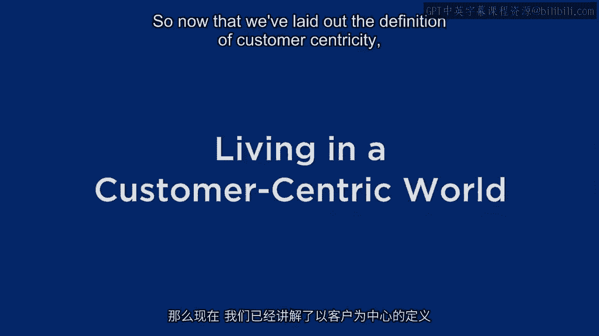
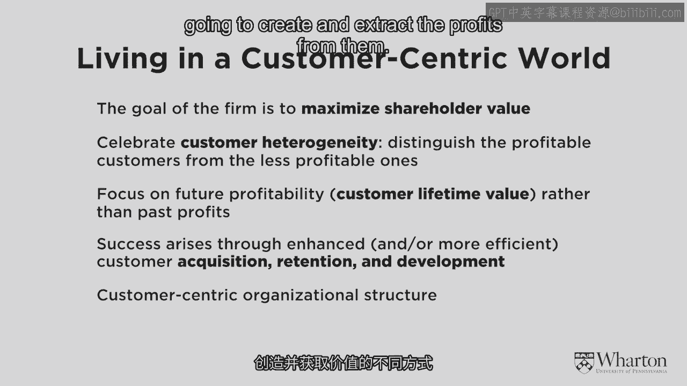
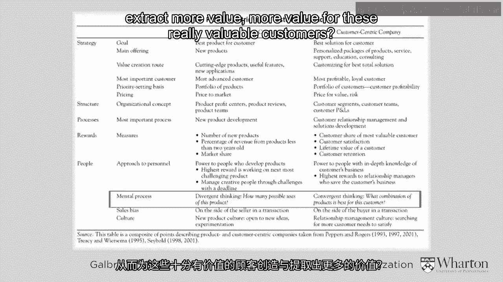
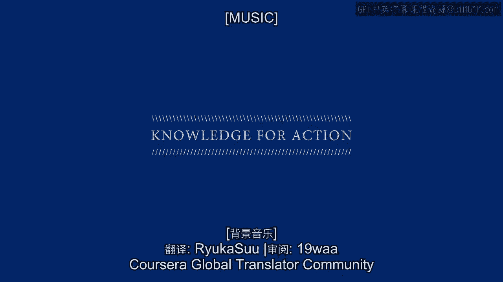

# 沃顿商学院《商务基础》课程 P14：生活在以客户为中心的世界 🎯

在本节课中，我们将深入探讨“以客户为中心”这一商业理念的核心内涵、实施策略及其与产品中心模式的对比。我们将学习如何通过关注客户异质性、客户终身价值以及三大核心战术，来构建一个真正以客户为中心的组织。

---

## 以客户为中心的核心目标

上一节我们定义了以客户为中心。本节中，我们来看看其核心商业目标是什么。

许多人认为以客户为中心的目标是建立客户忠诚度、创造满意度或促进购买。这些固然重要，但并非最根本的目标。**任何商业企业的首要目标，与产品中心模式一样，依然是最大化股东价值，即实现公司短期和长期的利润最大化**。

关键在于，实现这一目标的路径可以不同。以客户为中心提供了一条与产品中心模式截然不同、但可能更高效、更持久的盈利路径。

---

## 庆祝客户异质性

在以产品为中心的世界里，企业庆祝的是“爆款产品”。那么，在以客户为中心的世界里，我们庆祝什么呢？

答案是：**客户异质性**。这意味着我们承认并非所有客户生而平等，有些客户天生就比其他客户更有价值、更有利可图。

过去，公司不了解客户的盈利能力，也不关心客户间的差异，只专注于将产品推向市场。如今，认识到客户差异是第一步。起初这可能被视为一种负担，因为它增加了成本和复杂性。但我们必须接受并庆祝这种差异。

我们需要认识到，客户间的差异不仅存在，而且是一件好事。我们的任务是：
*   找到对我们极具价值的客户类型。
*   让他们变得更有价值，并寻找更多类似的客户。
*   同时，以合理盈利的方式处理其他客户。

**一个关键点**：当我们关注客户异质性和盈利能力时，我们指的是**未来的盈利能力**。过去的数据是重要参考，但并非完美的一对一映射。我们需要利用数据、模型和技术来预测客户的未来价值。这正是**客户终身价值**这一概念的核心作用。

---

## 三大核心战术

既然我们要衡量和管理客户终身价值，具体该如何操作呢？当公司从产品中心转向客户中心时，哪些战术会发生变化？

以下是构成以客户为中心战略核心的三大战术，它们使公司有可能比产品中心模式赚取更多利润：

1.  **客户获取**：我们应该获取哪种类型的客户？我们愿意为此花费多少？
2.  **客户保留**：我们应该尝试留住所有人吗？还是应该更有选择性？
3.  **客户发展**：我们能否将某些客户培养成更优质的客户？如何将这些战术与获取和保留相结合？

这些概念本身并不新鲜，但在许多产品中心的企业中，它们通常被置于营销组织的较低层级。在以客户为中心的模式下，**这三大战术需要被提升到战略高度**，负责这些工作的人员应在组织中拥有更高的地位。

---

## 组织结构的挑战

从产品中心转向客户中心，也意味着组织结构的根本性变革。

理想情况下，整个组织架构应围绕我们所拥有的不同类型的客户来构建，然后在其下设置我们为这些客户创造和获取利润的不同方式。

**宝洁公司的案例**：
宝洁公司传统上专注于开发和分销“爆款”产品，其客户是沃尔玛等零售商。但随着向以客户为中心和直接营销的转变，宝洁认识到其最终客户将是像你我这样的个体消费者。

宝洁推出的“My Black is Beautiful”项目就是一个很好的尝试。该项目针对非裔美国女性这一高价值客户群体。其特点包括：
*   **跨品牌联合推广**：在广告底部同时展示多个宝洁品牌，这在包装消费品公司中并不常见。
*   **超越产品的内容**：提供食谱、音乐等与宝洁产品无直接关联的内容，旨在将宝洁定位为“可信赖的顾问”。
*   **针对性产品开发**：例如，专门为这一群体开发了与女星Queen Latifah合作的Covergirl Queen化妆品系列。

这正体现了以客户为中心的定义：**围绕一个核心客户群体，利用研发资源开发他们认为极具价值的产品或服务**。在宝洁的组织架构中，很可能有专门团队负责“My Black is Beautiful”项目，他们调动内外部资源，致力于最大化这一客户群体的价值。

---

## 关系专长：可持续的优势

以产品为中心的关键在于**产品专长**——擅长开发和交付某类产品，并始终保持领先。但随着竞争加剧，维持产品专长的领先优势变得越来越难。

而以客户为中心的核心在于**关系专长**。这不仅仅是泛泛地“了解客户”，而是基于**数据、模型和预测**，真正理解你的客户，庆祝他们的异质性。这种基于深度客户知识的专长一旦建立，就很难被竞争对手复制或商品化，从而形成**可持续的长期竞争优势**。

---

## 思维模式的转变：从发散到收敛

最后，我们通过一个对比图表来总结产品中心与客户中心模式的关键差异。

以下是两种思维模式的核心对比：

*   **产品中心思维**：**发散性思维**。我们有了这个好产品，能用它做什么？（例如，卖给不同渠道、开发不同市场）。
*   **客户中心思维**：**收敛性思维**。我们如何为这个（高价值）客户带来更多价值？我们可以开发什么产品和服务？提供什么信息？如何在关系中为这些客户创造和提取更多价值？

从产品中心世界转向客户中心世界非常困难，从发散性思维转变为收敛性思维也非一日之功。这需要不同的激励机制、不同类型的人才以及全新的思维模式，这也是实施以客户为中心战略所面临的主要挑战之一。

---

## 总结

本节课中，我们一起学习了“以客户为中心”商业模式的完整图景。我们明确了其根本目标依然是利润最大化，但实现路径是通过**庆祝客户异质性**、聚焦**客户终身价值**、并围绕**客户获取、保留和发展**三大核心战术构建组织。这种模式依赖于**关系专长**和**收敛性思维**，旨在为客户创造更多价值，从而为公司建立可持续的竞争优势。尽管实施起来挑战重重，但它代表了一种更具前瞻性和盈利潜力的商业方向。