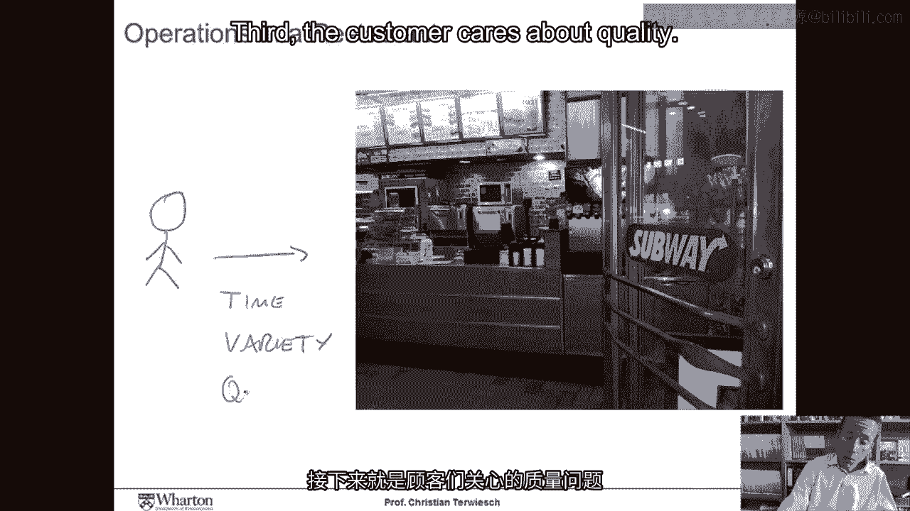
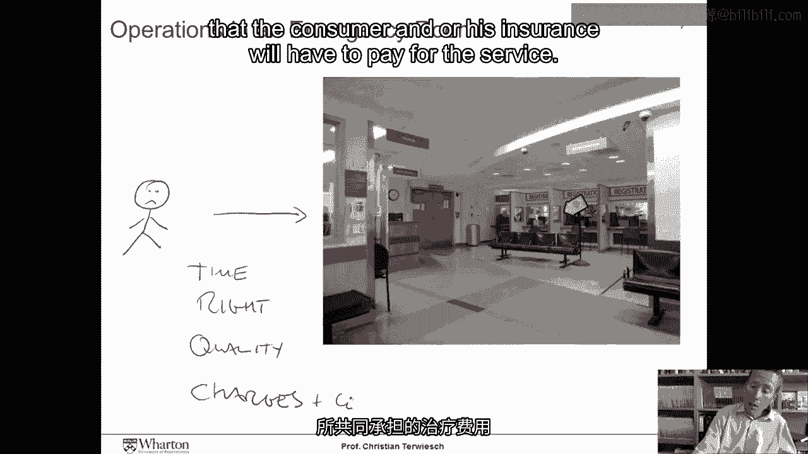
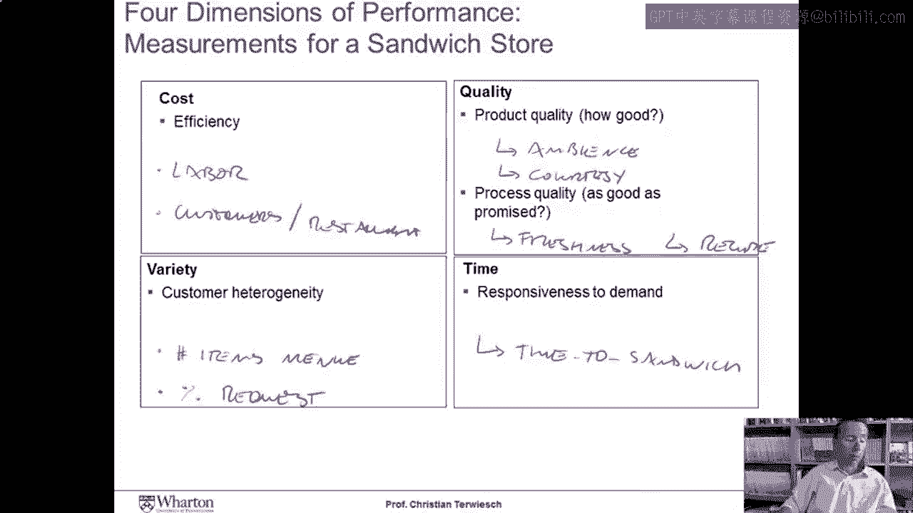

# 沃顿商学院《商务基础》课程笔记｜第143讲：运营管理简介 🏭

在本节课中，我们将学习运营管理的基础概念。我们将探讨运营管理的核心目标，以及它如何与企业的整体战略相联系。课程将通过简单的例子，帮助你理解运营的四个关键维度，并介绍如何为这些维度设定衡量指标。

---

## 什么是运营管理？🤔

欢迎来到我的Coursera“运营管理导论”课程。

这是一个为期六周的课程，今天是第一讲。在第一讲中，我们不会一开始就介绍课程的后勤细节，如作业、课程形式、考试和教材等。我保证稍后会补充这些信息。现在，让我们直接开始。

那么，运营管理是关于什么的呢？本讲的目的，是思考运营管理的作用，以及它如何与公司的商业战略相关联。这也有助于我们思考管理层可能为运营设定哪些目标，而这些目标将指导我们追踪哪些绩效指标。

---

## 从两个例子开始 🍔🏥

让我们从两个具体的例子开始。快到午餐时间了，消费者正在考虑今天去哪里吃午餐。

我们这里有一位消费者正前往一家餐厅。现在问问自己，消费者希望这家餐厅的运营提供什么？

首先，他们希望快速拿到食物。午休时间短，人们饿了，所以等待三明治的时间对消费者来说是一个非常重要的变量。

其次，消费者喜欢的三明治类型各不相同。因此，餐厅能否制作出吸引顾客的三明治很重要。他们必须能够提供多种三明治，这意味着要么有一个大菜单，要么能够根据顾客的具体要求制作。

第三，顾客关心质量。

质量，可以是餐厅的氛围、员工的友好程度、场所的卫生情况，也可以是确保奶酪的重量与食谱上标明的完全一致。质量包含多个维度，我们将在本课程后续探讨。

最后，价格当然也很重要，消费者不希望为午餐花费太多钱。

现在，让我们看看医院的运营。同样，我们有一位消费者来到医院，例如急诊室。

我们这位不太开心的消费者来到医院，我们问自己：消费者希望医院的运营做什么？同样，时间至关重要。在这个国家，急诊室的等待时间通常长达五个小时，所以人们希望尽快得到诊治。他们希望确保得到适合自己的治疗，而不是适合隔壁床位的人的治疗。他们希望以高质量的方式接受治疗，确保符合最新的循证医学标准，医生和护士洗了手，场所干净等等。最后，还有消费者和/或其保险公司必须为服务支付的费用和共付额。

---

## 运营的四个核心维度 📊

无论是三明治店还是急诊室，我们看到一个运营必须在四个维度上表现良好。

第一个是**成本维度**。这可能是我们大多数人联想到运营管理的地方，即提供高效的运营。

第二个维度是**多样性**。公平地说，消费者本身并不关心多样性，他们只是想要自己喜欢的东西。因此，多样性实际上衡量的是运营为异质客户群提供商品和服务的灵活性。

第三个维度是**质量**。质量维度分为两个子维度。第一个称为**性能质量**，第二个称为**符合性质量**。性能质量衡量我们提供的产品或服务有多好。我们大多数人会同意宝马是一辆高性能的汽车，不是因为它的制造方式，而主要是因为它的设计方式。第二个维度是符合性质量，它真正体现了我们在多大程度上能够兑现对客户的承诺。

最后是**及时性**，即我们对需求做出快速响应的能力。

这四个维度之所以重要，有两个原因。首先，它们是我们在运营中追求的目标，因此将指导我们追踪哪些类型的绩效指标。其次，它们也确实是设计商业战略的核心。这四个维度为我们提供了使自身运营区别于他人的机会，从而可能为我们提供竞争优势。

---

## 如何衡量这些维度？📈

想象一下，你被聘为赛百味的顾问，要求你设计一个绩效衡量系统，来追踪我们刚刚讨论的这四个维度。你会衡量什么？

在**成本方面**，你可能会开始考察劳动生产率。你可以设想一些指标，例如**每个员工制作的三明治数量**、**每个员工服务的顾客数量**，或者制作一个三明治所需的分钟数等。你也可以查看每家餐厅的顾客数量，以衡量你通过租赁餐厅所进行的房地产投资的使用效率。

在**多样性方面**，我们的想法同样是考察我们能否满足异质的客户偏好。一个简单的衡量标准就是查看菜单上的商品数量。除此之外，如果我们按订单制作三明治，我们可以考虑查看我们能够满足的客户请求的百分比。例如，顾客进来，想要额外的生菜、额外的西红柿，我们满足的客户请求百分比将是衡量多样性的另一个好指标。

在**质量方面**，请记住我们有两个维度：符合性质量和性能质量。对于性能质量，我们可能需要进行一些客户调研，通过调查了解他们喜欢餐厅氛围的程度，以及他们认为员工的礼貌是否符合期望等。在符合性方面，我们可能会考察我们是否真的兑现了承诺。这意味着我们可以查看三明治食材的新鲜度。在极端情况下，我们甚至可以将这些三明治放在秤上，测量赛百味火腿奶酪三明治上的奶酪克数是否精确符合标准。这将为我们提供符合性质量的良好衡量标准。

**及时性**则相对容易衡量。顾客关心的是拿到三明治所需的时间。因此，我们可以去测量顾客从进入商店到拿着三明治离开商店之间需要等待的分钟数。

---

## 运营与战略的联系 🎯

最后，让我们谈谈战略。战略大师迈克尔·波特提出，组织可以通过两种方式获得竞争优势：要么通过成本领先，要么通过差异化。我们讨论的维度——多样性、质量和及时性，是你的运营可以区别于他人的三种方式。因此，通过建立一个出色的运营，我们实际上是在创造竞争优势。

---

## 总结 ✨

本节课中，我们一起学习了运营管理的基础。我们通过餐厅和医院的例子，理解了运营的四个核心维度：**成本**、**多样性**、**质量**和**及时性**。这些维度不仅是运营绩效的衡量目标，也是企业构建差异化战略、获取竞争优势的关键。我们还初步探讨了如何为这些维度设定具体的衡量指标。在接下来的课程中，我们将深入探讨如何管理和优化这些维度。