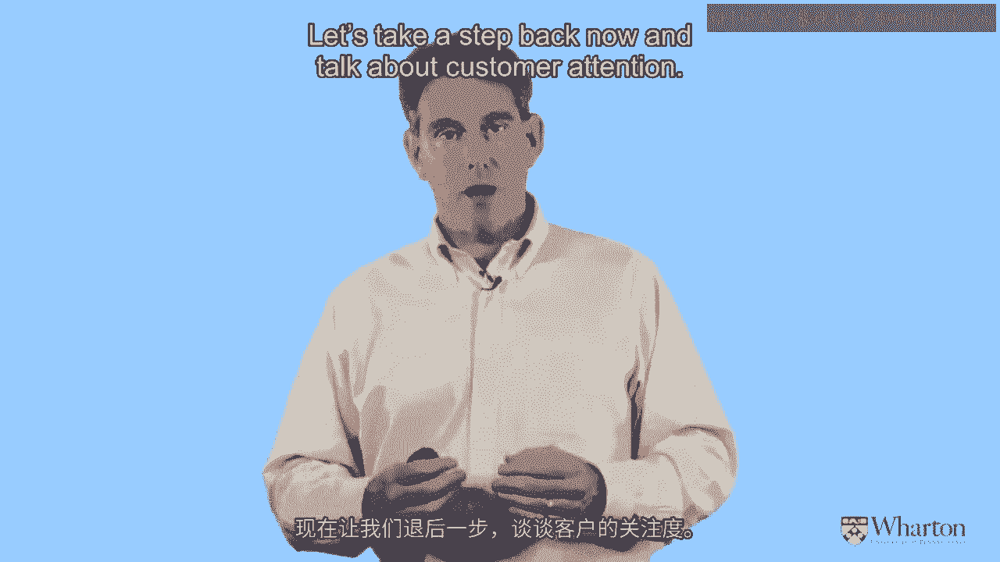

# 沃顿商学院《商务基础》课程｜第146讲：客户本位如何获利 🎯

在本节课中，我们将深入探讨客户本位战略下的核心运营策略：客户获取、客户保留与客户价值提升。我们将学习如何通过客户终身价值（CLV）这一前瞻性视角，重新评估和优化这些传统策略，从而为企业创造并获取更大价值。

---

## 回顾与引入 📝

上一节我们探讨了客户本位战略的核心是**庆祝客户异质性**，并引入了**客户终身价值（CLV）** 这一关键概念。本节中，我们将具体看看如何运用CLV来指导三大核心战术：获取、保留与发展客户。

我们将逐一分析每个战术，并理解在客户异质性的视角下，应如何改变传统的衡量与管理方式。

---

## 客户获取：从成本思维到价值思维 💰

首先，我们来探讨客户获取。企业通常如何衡量和指导其客户获取活动？

以下是企业常用的一个指标：
*   **CPA（单次获取成本）**：许多公司，尤其是在数字营销领域，依赖这个指标来评估获取客户的效率，并不断尝试降低它。

然而，**过度依赖CPA来指导客户获取活动是一个重大误区**。它不仅是片面的，更可能严重误导决策。原因在于，它将我们的思维限制在了“成本下限”上——我们总在问“最少花多少钱能获得一个客户？”

### 思维转变：从CPA到VPA/CLV

我们应该将客户视为最重要的资产。试想，在雇佣员工或律师时，我们会只追求“最便宜”的吗？显然不是。我们追求的是“最好”的。对待客户资产也应如此。

因此，企业应关注的不是获取成本（CPA），而是：
*   **VPA（单次获取价值）**，其核心就是**客户终身价值（CLV）**。

我们需要关注客户能带来的上行潜力，然后用这个数字来指导我们的花费。**CLV应被视为我们愿意为获取一个客户而支付的“成本上限”**。我们不是要花光每一分钱，但思维应从“如何压低成本”转变为“如何提高价值上限”。

### 实践案例：超越关键词竞价

例如，在谷歌关键词广告中，企业常为几分钱的出价争论不休。但一些聪明的公司开始分析：通过不同营销渠道获取的客户，其CLV有何不同？

一项研究发现，通过谷歌搜索广告获取的客户，其平均CLV约为1000美元，而通过其他渠道获取的客户则要低约200美元。当我们还在为几美元的成本纠结时，不同客户群体间的价值差异可能高达数百美元。

**CLV揭示了潜藏在客户中的巨大价值，而成本导向的思维不仅让我们忽视它，更无法实现它。**

### 行动指南：标记、追踪与分析

企业应系统性地标记客户，记录其获取来源（如时间、渠道、首次购买产品、营销活动等）。经过一段时间的耐心观察和数据积累后，将这些信息与客户的实际价值（CLV）进行匹配分析。

通过运行CLV模型，我们可以识别出哪些客户群体最具价值，从而明确下一步营销预算的最佳投向。

### 本节小结

关于客户获取，核心要点如下：
1.  **摒弃CPA思维**：不要只盯着成本下限，要关注价值上限（CLV）。
2.  **利用异质性指导投资**：通过分析不同客户群体的CLV差异，明确高价值客户的来源，并加大在这些渠道或活动上的投入。
3.  **保持耐心**：客户价值需要时间显现，评估获取活动时应有长远眼光。
4.  **结论**：当前许多公司因过度追求“最低成本”而在客户获取上投入不足，这成了一个自我实现的预言——低成本只能带来低价值客户。通过关注CLV，企业可能增加获取投入，但将获得巨大的规模回报。

---

## 过渡 🎵

以上我们重新审视了客户获取策略。接下来，让我们将目光转向客户保留。

（音乐过渡）

---

## 总结 📚

本节课我们一起深入学习了在客户本位战略下，如何革新对“客户获取”这一战术的理解与管理。

我们认识到，必须从传统的**成本导向（CPA）** 转向**价值导向（CLV）**。通过庆祝客户异质性，分析高价值客户的来源特征，并以此指导营销资源的分配，企业能够像更聪明的渔夫一样，在正确的海域撒网，从而持续获取更优质的用户组合，释放巨大的客户资产价值。

在接下来的课程中，我们将继续用同样的CLV视角，来剖析客户保留与客户发展策略。