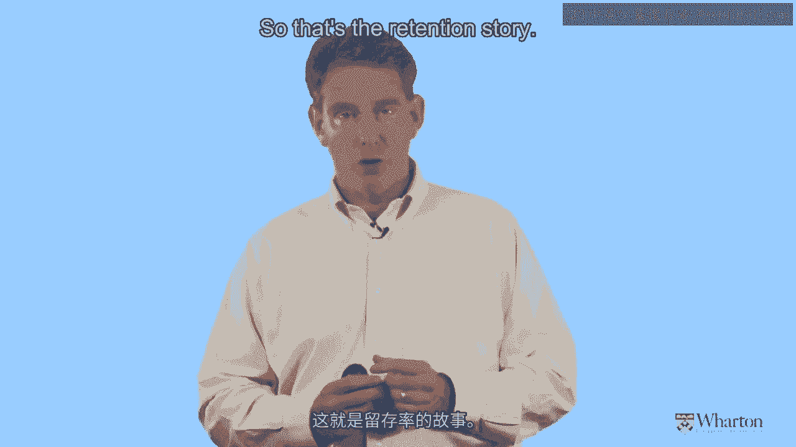

# 沃顿商学院《商务基础》课程笔记｜第4讲：客户保留 📊

在本节课中，我们将要学习客户保留的核心概念、关键指标，以及如何通过理解客户异质性来更准确地评估客户基础的价值。我们将通过沃顿商学院课程中的一个实际案例——沃达丰（Vodafone）的客户流失分析，来深入探讨这些主题。

---

## 客户保留的核心指标 📈

上一节我们介绍了客户获取，本节中我们来看看客户保留。我们首先需要回答与客户获取相同的问题：我们使用什么指标来衡量和指导我们的保留活动？

一个非常常见的指标是**保留率**或**流失率**（也称为损耗率）。其计算逻辑如下：
*   我们观察在某个时期初拥有的所有客户。
*   我们问自己，其中有多少客户留了下来。
*   留下来的客户占原始客户群的比例就是保留率。
*   反之，离开的客户比例就是流失率。

无论你关注的是“杯子半满”（保留率）还是“杯子半空”（流失率），企业都使用这类指标来衡量他们在留住现有客户方面做得如何。

与我认为很差的指标“每次获取成本”不同，我认为保留率或流失率是一个相当好的指标。但在使用它以及基于它做决策时，必须谨慎。

---

## 从公开数据看客户保留：沃达丰案例 📱

我喜欢研究上市公司公布的关于其保留率或流失率的信息。这不仅仅是了解“有多少客户留下”的数字，更重要的是理解如何利用这些信息，甚至计算出整个客户基础的财务价值。

我们以大型手机运营商沃达丰为例。他们向投资者公布声明，展示其流失率及其随时间的变化。从图表上看，其年化流失率大约在20%左右。

这意味着什么？如果我们大约有20%的客户在任何给定时间离开，我们预计客户平均会与我们相处多久？这是一个简单的数学问题。

如果流失率是50%（即每期失去一半客户），那么典型客户的生命周期大约是2年。因此，如果流失率约为20%，典型生命周期约为5年。如果略低于20%，则生命周期略高于5年。

我们可以据此进行一个粗略的估算：将平均客户生命周期乘以每位客户的收入，再乘以客户基础规模，就能得出我们的**客户资产**，即公司价值的一个初步近似值。许多公司正是通过这种计算来估算其客户的价值。

---

## 关键问题：平均值的陷阱 ❓

那么，这个计算有什么问题？它听起来很不错，但缺失了什么？我们真正想看到的是什么？

我认为，仅仅看到整个客户基础的平均流失率是不够的。在以客户为中心的世界里，我们推崇什么？答案是：**异质性**。我们不想只看一个单一的数字，不想问“平均客户”的流失率是多少，因为根本不存在“平均客户”。我们想知道流失倾向如何在不同客户之间变化。

这是一个非常重要的问题：流失倾向在客户中如何分布？如果我们能洞察每个客户的想法，了解他们离开的可能性，这个分布会是什么样子？

---

## 揭示异质性：沃达丰的客户分组 📊

以下是沃达丰客户异质性的具体体现。需要强调的是，你即将看到的图形非常典型，几乎是所有基于合同或订阅业务公司的基本形态，而不仅限于电信行业。

沃达丰将其客户基础分为三组，发现他们的流失率存在显著差异：
*   一个非常小的群体具有**非常高的流失率**（极易离开）。
*   一个中等规模的群体具有**中等流失率**。
*   一个最大的群体（左侧）具有**相当低的流失率**。

这对沃达丰和大多数公司来说是好消息吗？是的，这表明他们的大多数客户倾向于留下来，没有立即离开的倾向。

但为什么会出现这种情况？描述那些流失率低的客户，我们可能会用“忠诚”这个词。他们可能真的热爱我们。但也可能用“懒惰”、“惯性”、“漠不关心”来形容。也许他们只是不太在乎这项产品或服务，觉得是否更换供应商无关紧要。

我们不知道这个低流失率群体中“忠诚”和“懒惰”客户的具体比例。但重要的是要认识到，低流失率并不完全是我们出色营销或强大品牌的反映，也可能只是因为很多客户不在乎。

---

## 计算客户价值：正确与错误的方法 🧮

现在，我们既然推崇异质性，它会产生什么影响？我们如何利用图表中的信息来对客户基础价值做出更明智的评估？

除了图表，我们还可以查看具体数据表格，它显示了三个群体的规模（占客户基础的百分比）及其对应的流失率。

以下是计算步骤：

**第一步：常见的错误计算（忽略异质性）**
大多数人会计算一个加权平均流失率：
`整体平均流失率 = (70% * 6%) + (20% * 25%) + (10% * 40%) = 17.7%`
然后，基于这个平均流失率计算平均客户生命周期：`1 / 17.7% ≈ 5.6年`。
这个结果与我们最初未考虑异质性时得到的数字相似。那么，考虑异质性有什么意义呢？

问题在于，我们计算了一个不存在的“平均客户”的预期生命周期和财务价值。我们实际上**消除**了异质性，将其全部压缩在一起，因此得到了与一开始就忽略异质性相同的结果。

**第二步：正确的计算（拥抱异质性）**
正如客户忠诚度领域的领先思想家弗雷德里克·莱希赫尔德在其著作《忠诚效应》中所言：“**平均值毫无意义。我们需要分组单独进行计算。**”

正确的做法是先分别计算每个组的客户生命周期，然后再进行加权平均。
1.  **低风险组生命周期**：`1 / 6% ≈ 16.7年`
2.  **中风险组生命周期**：`1 / 25% = 4年`
3.  **高风险组生命周期**：`1 / 40% = 2.5年`

现在，我们看到了异质性带来的巨大差异：最好和最差客户的生命周期存在数量级上的差别。我们不应该忽略或平均掉这种差异，而应该正视它。

然后，我们再对这三个生命周期进行加权平均，得到整体客户基础的预期生命周期：
`整体预期生命周期 = (70% * 16.7年) + (20% * 4年) + (10% * 2.5年) = 12.4年`

这是一个巨大的差异！通过正确计算并明确考虑异质性，我们将客户基础的价值评估**提高了一倍多**。这就是拥抱异质性的力量。

---

## 核心结论与管理启示 💡

让我们总结一下关于客户保留的思考，有两个非常重要的结论：

1.  **不存在“平均客户”**：基于“平均客户”进行计算是错误且方便的。忽略异质性将始终**低估**你客户基础的价值，而且这种低估的幅度可能非常巨大。

2.  **保留活动的弹性被高估**：如果我们想计算弹性，例如了解流失率降低1%能带来多少增量收益，那么忽略异质性与考虑异质性会得出非常不同的结论。研究表明，**当考虑异质性时，保留弹性（即通过降低流失率获得的收益）要比你想象的小得多**。这意味着，提升保留率或降低流失率的效果，在明确考虑客户差异后，比通常认为的要更为有限。

需要明确的是，我并不是说应该停止在客户保留上投入。保留是以客户为中心的三大支柱之一，非常重要。我们必须找出优质客户，并尽一切努力长期留住他们。

但问题在于，许多公司似乎倾向于在保留上投入越来越多。我认为，一些公司可能实际上在保留上**过度支出**了，特别是将资源分配给那些流失率本来就很高、即使通过激励多留一两年也终将离开的客户。我们最好将部分资金重新分配到**客户获取**上，去寻找那些可能成为优质客户的新客户。

这就开始揭示了当我们明确关注异质性时，客户获取与保留之间所产生的权衡与联动关系。

---

本节课中我们一起学习了客户保留的关键指标，通过沃达丰的案例深入理解了客户异质性的重要性，并掌握了正确评估客户基础价值的方法。核心在于，必须放弃“平均客户”的思维，通过分组分析来揭示不同客户群体的真实价值，从而更有效地在获取与保留活动之间分配资源。