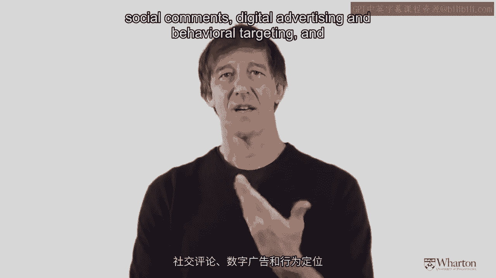
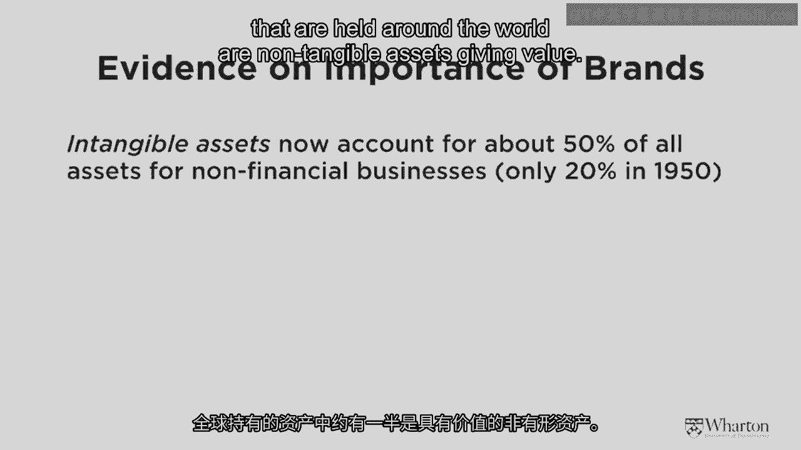
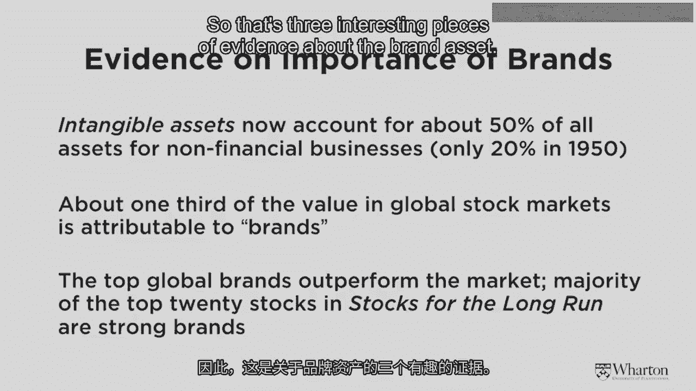
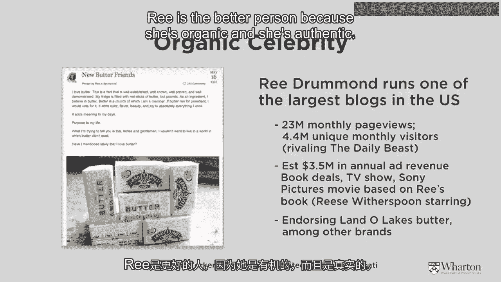

# 沃顿商学院《商务基础》课程笔记 P149：品牌与数字营销执行 🚀

在本节课中，我们将要学习如何将品牌策略与数字营销环境相结合，以更有效地执行营销计划。我们将探讨数字营销的核心特点，并深入分析在数字时代打造和运用品牌资产时需要考虑的新因素。

上一节我们介绍了营销数学的基础框架，本节中我们来看看数字营销如何影响营销执行。

## 数字营销概述 💻

数字营销是利用互联网及移动设备等技术手段，使营销活动更有效率和效果的过程。其核心定义是：**使用联网设备与客户互动**。

但关键在于，数字营销的本质仍然是营销。我们依然需要正确的品牌、促销信息与客户策略。事实上，由于数字营销的传播速度，一旦出错，负面影响会更快扩散，因此营销基本功比以往任何时候都更为重要。

数字营销之所以对执行至关重要，主要基于以下三个重要趋势：

以下是数字营销的三个核心趋势：
1.  **社交商务**：如今的消费决策前所未有地受到他人影响。例如，在尝试新餐厅前查看Yelp评论，或在亚马逊购书前阅读用户评价。商务活动变得高度社交化，人们从朋友乃至陌生人那里获取线索。
2.  **精准的数字广告与行为定向**：基于用户的网络浏览行为、社交媒体使用数据，运用大数据技术，营销者能够以前所未有的微观精度定位目标人群，发送更精准、更具吸引力的信息。
3.  **便捷的实验能力**：数字环境使得测试变得异常简单。例如，可以轻松测试网站背景色（红色或绿色）如何影响用户对汽车安全性或性价比的关注度。数据显示，仅2012年一年进行的营销实验就超过了之前所有年份的总和。

## 品牌资产的重要性 🏷️

现在，让我们过渡到营销者用于执行的第一项资产：品牌资产。我们将回顾Barbara教授提到的一些观点，并补充在数字环境中执行时变得重要的新思路。

首先，重申品牌为何重要。全球约一半的资产价值来自于品牌、知识产权等无形资产。以谷歌为例，其巨大价值并非源于实体工厂，而是源于智力资本。

其次，研究表明，全球股票市场约三分之一的市值源于品牌及其带来的溢价。

最后，沃顿商学院金融学教授Jeremy Siegel在《长期股票》一书中发现，在1953年至2003年间，那些被客户广泛认为具有高价值的强势品牌，其股票表现也优于市场平均水平。

当然，品牌既是感知，也是现实。一项1964年的经典啤酒盲测实验表明，当消费者不知道品牌时，多种啤酒被感知为几乎相同；但当看到品牌标识后，感知差异便显著扩大。这凸显了品牌形象对消费者认知的巨大影响。

以下是2013年全球最具价值品牌（Interbrand）前十名示例：
*   苹果
*   谷歌
*   可口可乐
*   国际商业机器公司
*   微软
*   通用电气
*   麦当劳
*   三星
*   英特尔
*   丰田

除了这些知名品牌，本课程也会关注一些新兴数字原生品牌，如Warby Parker（眼镜）、Harry‘s（剃须）、Bonobos（男装）以及Diapers.com。

## 数字环境下的品牌执行策略 🎯

在数字环境中发展品牌并执行Barbara教授提到的各项策略时，需要考虑哪些额外因素？

回归基础，品牌的目标是影响人们的**情感**、**思维**，有时促进行动。例如：
*   **影响情感**：谷歌的“Dear Sophie”广告活动，通过一个温情故事建立情感连接，让用户感觉谷歌产品深度融入生活，而不仅仅是搜索工具。
*   **影响思维**：美国猪肉协会提出“**Pork. The other white meat**”（猪肉，另一种白肉）的口号，巧妙地将猪肉与更健康的“白肉”（如鸡肉、鱼肉）类别关联，改变了消费者的认知。
*   **促进行动**：“Got Milk？”（喝牛奶了吗？）活动通过营造“牛奶喝完的恐慌感”，鼓励消费者购买更多牛奶。

在数字营销执行中，不同之处在于，有时需要通过可被虚拟世界（如社交媒体）利用的真实世界事件来建立互动。

以下是数字环境下执行品牌策略时需额外考虑的三大要点：
1.  **真实与透明**。
2.  **塑造人格化形象，保持人性化与可接近性**。
3.  **考虑信息的无限生命周期，并设计能利用偶然性或机遇的内容**。

例如，美国捷蓝航空曾推出“AYCJ”（随心飞）促销活动。一位名为Drew Lawrence的男士利用该优惠开展了“29天29城”的癌症募捐之旅。这一善举被传统媒体报道，为捷蓝航空的活动带来了巨大的额外曝光和积极联想，这正是“利用偶然性”的体现。

在数字环境中也需格外谨慎。麦当劳曾发起 **#McDStories** 话题，希望用户分享美好回忆，但该话题被批评者“劫持”，用于发布负面评论。这说明在数字环境中，营销活动可能被放大或扭曲。

最后，关于品牌代言。传统上常使用名人，但可能存在形象与品牌不匹配的风险（例如，沙奎尔·奥尼尔代言别克汽车可能让部分消费者感到不真实）。在数字时代，出现了“有机名人”或“网红”，如“The Pioneer Woman”（拓荒女）Redrummond，她凭借在南方烹饪、生活方式领域的专业知识积累了大量忠实粉丝。对于Land O‘Lakes黄油这类品牌而言，由她来推广可能比传统明星更具真实性和说服力。

本节课中我们一起学习了数字营销的三大趋势，回顾了品牌资产的核心价值，并重点探讨了在数字环境下执行品牌策略时需要秉持真实、塑造人格、利用机遇并保持谨慎的新原则。这些是连接品牌战略与有效市场执行的关键桥梁。