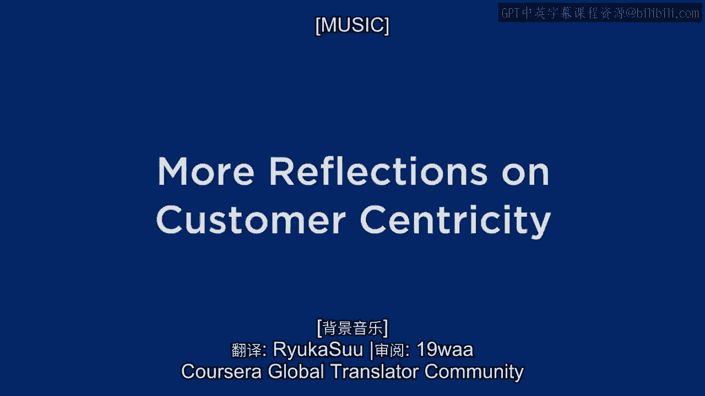
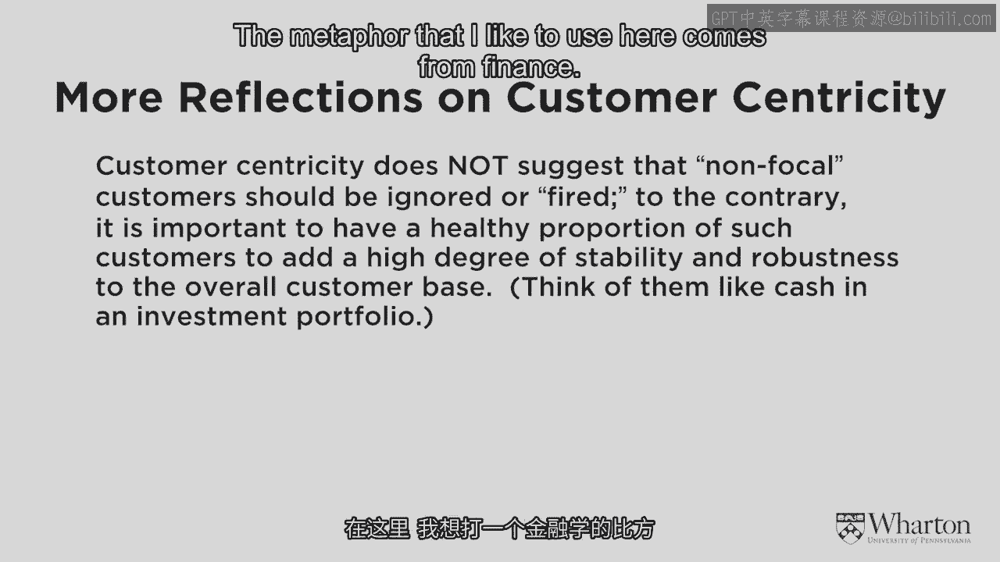

# 沃顿商学院《商务基础》课程笔记 P15：更多关于客户本位的思考 🎯

在本节课中，我们将深入探讨客户本位策略中的一个核心平衡问题：如何在聚焦高价值客户的同时，维持业务的整体稳定性。我们将引入“客户本位悖论”这一概念，并学习如何像管理投资组合一样管理客户组合。

---

上一节我们强调了聚焦高价值客户的重要性。本节中，我们来看看如何在实际操作中取得平衡。

如果过于字面地理解“聚焦高价值客户”，将全部业务都围绕他们展开，企业会变得非常脆弱。这相当于把所有鸡蛋放在一个篮子里。如果我们对这部分客户的判断失误，或者市场环境发生变化导致他们流失，企业将面临巨大风险。因此，找到正确的平衡点至关重要。

这里我想提出一个重要但微妙的观点：**我们越是聚焦于那些核心的高价值客户，就越需要那些价值较低的客户来维持一个稳定的客户组合。**

我喜欢用一个来自金融领域的比喻来说明这一点。在投资组合中，我们希望拥有一些高增长、高风险的股票，它们是真正增长的来源。但日常的稳定性则来自于更可预测的资产，如现金和债券。

我们的客户组合也应采取同样的“投资组合”方法。我们需要大量稳定、可预测但可能价值不高的客户，来与那些高价值的“明星”客户形成平衡。

由此，我提出了 **“客户本位悖论”**。其核心思想是：
**企业越是聚焦于高价值客户，就越需要其他类型的客户来维持公司整体的稳定平衡。**

除了极少数例外，没有公司能做到纯粹、绝对的客户本位。如果你的客户基础是四位亿万富翁（如私人财富管理），你可以做到完全客户本位。但如果你拥有数百万乃至数亿客户，关键在于找到那个“恰到好处”的平衡点。

这个平衡点在于：对我们认为真正有价值的客户群体采取真正的客户本位策略；而对其他价值不高的客户，则采取产品本位策略，追求运营效率。

这里与纯粹产品本位公司的区别在于：**我们不会让那些价值一般的客户来驱动业务方向。** 我们会继续将不成比例的研发资源聚焦于高价值客户，为他们开发产品，并设法让这些产品也能被产品本位的客户所接受和喜爱。

---

**本节课总结**

本节课我们一起学习了客户本位策略中的平衡艺术。我们认识到，过度聚焦高价值客户存在风险，因此需要引入“客户组合”思维，用稳定但价值一般的客户来平衡高风险、高回报的核心客户。这即是“客户本位悖论”的核心：深度聚焦与广泛稳定是相辅相成的。企业面临的挑战，正是如何在实际运营中巧妙地找到并维持这一平衡。